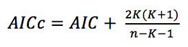
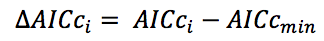
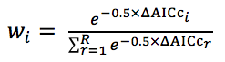
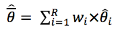
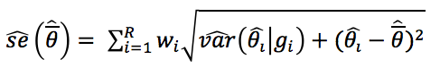
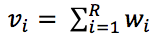

[Return to main website](http://coleoguy.github.io/)

## Table of Contents

[1. Introduction](#introduction)

[2. Mathematical Approach](#mathematical-approach)

[3. Installation](#installation)

[4. Fitting LCA models](#fitting-lca-models)

[5. Analyzing Results](#analzying-results)

[6. Citations](#citations)

_______
## 1. Introduction

Line cross analysis (LCA) or partitioning the contribution of composite genetic effects (CGEs) to the mean phenotype of cohorts is widely used to investigate the genetic architecture of traits.  This approach uses two parental strains which have diverged in a phenotype of interest.   These parents are crossed, producing an F1, and subsequent crosses (e.g. F2, backcross, reciprocals) are made to generate groups that have different combinations of parental genes.  We refer to each of these groups as cohorts.  Using a weighted least squares regression with weights inversely proportional to the variance of the cohort means, the degree to which a phenotype is determined by different CGEs (e.g. additive, dominance, and epistatic gene action) may be estimated [1, 2]. Traditionally LCA has been accomplished by a process refereed to as the joint-scaling test, essentially forward variable selection weighted least squares regression.  However this approach has a number of documented problems [^3]. A full information-theoretic (I-T) approach to model selection and parameter estimation alleviates difficulties associated with previous approaches and provides additional understanding that is not possible under older approaches such as the joint-scaling test [4].  SAGA provides a full I-T approach to LCA that leverages the finite sample size corrected version of the Akaike information criterion (AICc) to explore all possible models and make unbiased and, when appropriate, model averaged estimates of the contribution of CGEs to cohort means.  SAGA includes four functions and seven empirical datasets.

Functions:

- __AnalyzeCrossesMM__: Primary function that generates and tests all models of genetic architecture possible for a given set of cohorts.
- __EvaluateModel__: Returns parameter estimates conditional on a single model.
- __VisModelSpace__: Plots the distribution of Akaike weights across model space.
- __DisplayCmatrix__: Loads the default C-matrix as a dataframe

Data:

- __ban.osa__: Number of offspring from crosses involving _Tribolium castaneum_ from Ecuador and Japan [5]
- __dar.bho__: Number of offspring from crosses involving _Tribolium castaneum_ from Tanzania and India [5]
- __per.inf__: Number of offspring from crosses involving _Tribolium castaneum_ from Peru and Portugal [5]
- __sin.cro__: Number of offspring from crosses involving _Tribolium castaneum_ from Malaysia and Croatia [5]
- __PH__: Height data for crosses involving strains of _Nicotiana rustica_ [2].
- __SL__: Sperm length data for crosses between disjunct populations of _Drosophila mojavensis_ [6].
- __SR__: Sperm receptacle length data for crosses between disjunct populations of _Drosophila mojavensis_ [6].

_______

## 2. Mathematical Approach

We use the function GLM from the base R package to perform weighted least square regression [7].  GLM returns the parameter and standard error estimates conditional on the model as well as the AIC value for the model. We convert AIC to AICc using equation 1.  Where n is the number of cohorts and K is the number of parameters being estimated.



We then calculate AICc differences (delta AICc) using equation 2.



Where delta AICc min is the minimum AICc score calculated across all possible models and AICci is the AICc calculated for a specific model.  Delta AICc is used in generating Akaike weights (_wi_) using equation 3.  The denominator in this equation is the summation of the numerator across all possible models being evaluated (R).



Under the default settings, if _wi_ of the best model is 0.9 or greater then SAGA will perform parameter estimation under a single model. If no model reaches this threshold then we construct a 95% confidence set of models that contains the minimum number of models whose _wi_ sum to 0.95. To calculate model averaged parameter estimates and unconditional standard errors we recalculate _wi_ for each model performing the summation in the denominator of equation 3 across all models in the confidence set. The model weighted parameter estimates  are then calculated using equation 4 where _wi_ is the recalculated model weight and _omega hat i_ is the parameter estimate from the model; the product of these values is summed across all models R in the confidence set.



Standard error estimates that are unconditional on any one model are calculated using equation 5. 



Finally variable importance _vi_ is calculated by summing _wi_ of all models R in which a CGE occurs (Eq. 6).  



_______

## 3. Installation

A stable tested version of SAGA is available from the CRAN repository or the most recent version may be installed from github using the devtools package: 

Installing from CRAN

    install.packages("SAGA")

Installing from github

    library(devtools)
    install_github("coleoguy/SAGA", build_vignettes = TRUE)

_______

## 4. Fitting LCA models

__C-matrix of composite genetic effects__  
The first step in analysis of line cross data is choice of a C-matrix that describes the expected contribution of different types of gene action to cohort phenotypes.  By default SAGA will use a C-matrix that is scaled to the midparent mean (equivalent to F<sub>inf</sub>), and includes 23 potential CGEs. For each CGE we have calculated coefficients for 23 potential crosses; each of which is divided into male, female, or mixed sex cohorts. This C-matrix has 69 rows and the row numbers are used to identify the cohorts being used in an experiment. The function DisplayCmatrix is available so that we can determine what IDs should be used to identify the cohorts included in an analysis.

    # print the C-matrix to the terminal
    DisplayCmatrix(table = "MP")


__Table 1.__ The first 15 rows of the C-matrix supplied with SAGA.
```{r, echo=FALSE, results='asis'}
foo <- read.csv(system.file("Cmatrix.mp.csv", package ="SAGA"))[1:15,1:16]
knitr::kable(foo, row.names=T, output=T)
```

__Input Data Format__

Data that will be analyzed with SAGA should be in a dataframe with three columns: 

- id of the cohort which should match the appropriate row of the C-matrix above  

- mean phenotype measure of the cohort  

- standard error of the cohort's mean phenotype.  

SAGA comes with several empirical datasets allready appropriately formatted.  Here we will load data on the number offspring produced by crosses involving _Tribolium castaneum_ from Tanzania and India [6].

    data(per.inf, package="SAGA")

__Table 2.__ per.inf data illustrating the format required for analysis with SAGA.
```{r, echo=FALSE, results='asis'}
data(per.inf, package="SAGA")
colnames(per.inf) <- c("Cohort ID", "Mean", "SE") 
knitr::kable(per.inf, row.names=T, output=T)
```

__Analyze Models__

Once data is prepared as above we can analyze it with the function `AnalyzeCrossesMM`. This will return a list of the class "genarch".  The list has four elements:

- __models:__ a list containing the weighted least squares solution for all models tested.

- __estimates:__ a data frame containing Model Weighted Average for each parameter and its unconditional standard error.

- __daicc:__ a vector of the delta AICc scores for all models tested.

- __varimp:__ a data frame containing the _vi_ scores for composite effects

As SAGA is analyzing the data it will print the composite effects being tested
as well as progress in analyzing models to the terminal, and by default a plot of the primary results of the analysis.  In this case none of the models tested has a _wi_ greater than 95%. So the plot is of the model averaged parameter estimation from equation 4, and unconditional standard errors calculated in equation 5 are indicated with whiskers on each bar.  The colors of the bars reflects the _vi_ calculated in equation 6.:

```{r,fig.cap='__Figure 1.__ Model averaged estimate of genetic architecture.', echo=TRUE, warning=FALSE,results='markup', fig.width=6.5}
# we will need the plotrix package for plotting
library(plotrix)
results <- SAGA::AnalyzeCrossesMM(per.inf, graph=T, cex.names=.8)
```


Now we can load a different dataset to demonstrate what happens when there is less model selection uncertainty.  This dataset is from a study of sperm receptacle length measured in crosses between disjunct populations of _Drosophila mojavensis_ [6].

    #Sperm receptacle length in Drosophila mojavensis
    data(SR)
    #Because we are using cohorts where we know the distribution of sexes we set sexed=T.
    AnalyzeCrossesMM(SR, sexed=T, graph=T)

```{r, fig.cap='__Figure 3.__ Conditional estimate of genetic architecture.', echo=TRUE, warning=FALSE, results='markup', fig.width=6}
library(plotrix)
data(SR, package="SAGA")
results2 <- SAGA::AnalyzeCrossesMM(SR, even.sex=T, graph=T)
```

In this case a single model has a _wi_ of greater than 97%, and as figure 2 illustrates SAGA has returned estimates based on this single model.

_______

## 5. Analzying Results

If we want to plot something differently than the default for SAGA we can access the results of the analysis stored in the second element of the genarch object.

```{r,fig.cap='__Figure 2.__ Subset of model averaged estimate of genetic architecture.', echo=TRUE, warning=FALSE, results='hide', fig.width=6.5}
    # here we extract the 4 largest composite effects found in the first analysis
    estimates <- as.numeric(results[[2]][1, c(3, 7, 8, 9)])
    names(estimates) <- colnames(results[[2]])[c(3, 7, 8, 9)]
    barplot(estimates, main = "Estimate for composite effects",
            names.arg = names(estimates))
```


We can also explore the relative fit of models to our data using the function 'VisModelSpace'.  This function will plot a box for each model tested and will color it based on its _wi_.  To illustrate the differences in model space we can plot the results of the two analyses stored in `results` and `results2`.  First lets look at the _Tribolium_ analysis which indicated a nontrivial level of model selection uncertainty.  The results from this analysis are stored in `results`

    VisModelSpace(results, cex.u=1.6)

```{r, fig.cap='__Figure 4.__ Distribution of akaike weights across model space for Tribolium dataset.', echo=FALSE, warning=FALSE, results='hide', fig.width=5.5, fig.height=5}
SAGA::VisModelSpace(results, cex.u=1.6)
```

This plot shows us that their are a number of models of varying complexity that have very similar akaike weights, and this dataset highlights why our understanding of the genetic architecture should not be based on any single model.

Next lets create the same plot but this time for the _Drosophila_ dataset which indicated very little model selection uncertainty.  The results from our analysis of this dataset are stored in `results2`.

    VisModelSpace(results2, cex.u=.4)

```{r, fig.cap='__Figure 5.__ Distribution of akaike weights across model space for Drosophila dataset.', echo=FALSE, warning=FALSE, results='hide', fig.width=5.5, fig.height=5}
SAGA::VisModelSpace(results2, cex.u=.4)
```

SAGA also provides the ability to investigate the results of individual models.  For instance in the case of the first dataset we could use the daicc scores stored in the third element of the genarch object to find the best two models and then plot these using the function `EvaluateModel`.  To illustrate this lets find the best two models from the _Tribolium_ dataset and plot them side by side to see how they differ.

    # first lets find the best two models
    good.models <- order(results[[3]])[1:2]
    EvaluateModel(results, good.models[1], cex.names=.7, cex.main=.7)
    EvaluateModel(results, good.models[2], cex.names=.7, cex.main=.7)
    
```{r, echo=FALSE, warning=FALSE, results='hide'}
SAGA::EvaluateModel(results, 166, cex.names=.7, cex.main=.7)
SAGA::EvaluateModel(results, 110, cex.names=.7, cex.main=.7)
```

__Figure 6.__ Estimates conditional on individual models. 

Here we can see that the top two models both include 3 composite genetic effects, and in both cases the strongest effect is assigned to autosomal additive by autosomal dominance epistasis.  We can also see that the first model includes autosomal dominance by dominance epistasis while in the second this is replaced by simple autosomal dominance.


In reporting the results of line cross analysis experiments we recommend reporting estimates and standard errors from model averaged results unless a single model has greater than 95% _wi_.  It is also important to report _vi_ scores since these give an indication of our certainty that a particular composite genetic effect is important in the genetic architecture of the trait in question.

_______

## 6. Citations
[1] Mather, K., and J. L. Jinks, 1982 Biometrical genetics: The study of continuous variation. Chapman and Hall, London.

[2] Lynch, M., and B. Walsh, 1998 Lynch, M., & Walsh, B. (1998). Genetics and analysis of quantitative traits. Sinauer Associates, Inc., Sunderland, Massachusetts.

[3] Whittingham, M. J., P. A. Stephens, R. B. Bradbury and R. P. Freckleton, 2006 Why do we still use stepwise modelling in ecology and behaviour? J Anim Ecol 75: 1182-1189.

[4] Burnham, K. P., and D. R. Anderson, 2002 Model selection and multimodel inference: a practical information-theoretic approach. Springer, New York.

[5] Demuth, J. P., 2004 Evolution of Hybrid Incompatibility in the beetle Tribolium Castaneum, pp. 152 in Biology. Indiana University, Bloomington.

[6] Miller, G. T., Starmer, W. T., & S. Pitnick 2003. Quantitative genetic analysis of among-population variation in sperm and female sperm-storage organ length in Drosophila mojavensis. Genetical research, 81(03), 213-220.

[7] R Development Core Team, 2013 R: A Language and Environment for Statistical Computing, pp., Vienna, Austria.
