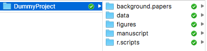

###1. Start your code with a header (who, what, when, & **why**):
```{r}
# Heath Blackmon
# coleoguy@gmail.com
# This script explores the frequency of eruptions at the Old Faithful geyser
# 28 Jan 2016
```

&nbsp;

###2. Run all of your import statments (`library`):
  
```{r, eval=FALSE}
library(ggplot2)
library(reshape)
library(vegan)
```

&nbsp;


###3. One should exercise caution when using `setwd()`. 

Changing directories in your script can limit reproducibility: `setwd()` will throw an error if the directory you're trying to change to doesn't exit, or the user doesn't have the correct permissions to access it. This becomes a problem when sharing scripts between users who have organized their directories differently.
* If/when your script terminates with an error, you might leave the user in a different directory to where they started, and if they call the script again this will cause further problems. If you must use `setwd()`, it is best to put it at the top of the script to avoid this problem.

The following error message indicates that R has failed to set the working directory you specified:

```
Error in setwd("~/path/to/working/directory") : cannot change working directory
```

Consider using the convention that the user running the script should begin in the relevant directory on their machine and then use relative file paths.

If you're collaborating consider having source files online. This way your collaborators can run your code without making changes.

```{r, eval=FALSE}
dat <- read.csv(url("http://coleoguy.github.io/SWC/geyser.csv"))

rather than:

dat <- read.csv(file = "/Users/heath/files/dataset-2013-01.csv")
```


&nbsp;

###4. Use `#` or `#-` to set off sections of your code 
[complex R function](https://github.com/coleoguy/evobir/blob/master/R/AncCond.R)


&nbsp;

###5. If you have functions segregate them
If you just have a few put them at the top of your code, so they are among the first things run. If you have written many functions, put them all in their own .R file, and `source` them. Source will run all of these functions so that you can use them as you need them.

```{r, eval=FALSE}
source("my_genius_fxns.R")
```

&nbsp;

###6. Use consistent style within your code.
I largely follow <https://google.github.io/styleguide/Rguide.xml> the most important thing is to be consistent.

&nbsp;

###7. Keep your code modular. 
If a single function or loop gets too long, consider breaking it into smaller pieces. If your script is over 100 lines long you might consider how writing functions might make it simpler. Don't repeat yourself. Automate! If you are repeating the same piece of code on multiple objects or files, use a loop or a function to do the same thing. The more you repeat yourself, the more likely you are to make a mistake.

&nbsp;

###8. Develop a simple directory structure for projects/manuscripts.  




&nbsp;

###9. peer review 
We do it for methods and papers, why not code? Our code is a major scientific product and the result of a lot of hard work!  Find a friend and review each others code look for mistakes and ways to be more efficient.

&nbsp;

###10. Develop your code using version control and frequent updates!

&nbsp;

&nbsp;

### Lets try it!

```
data("faithful")
head(faithful)
foo <- faithful[ ,2]
mode(foo)
help(mode)
Mode <- function(x) {
  ux <- unique(x)
  ux[which.max(tabulate(match(x, ux)))]
}
Mode(foo)
hist(foo)
```

a better version:

```
# Heath Blackmon
# 30 Jan 2016
# This is a script to .......
# coleoguy@gmail.com

# a function to return the numeric mode of a vector
Mode <- function(x) {
  ux <- unique(x)
  matches <- match(x, ux)
  counts <- tabulate(matches)
  ux[which.max(counts)]
}

# loading data from old faithful
data("faithful")

# peaking at the begining
head(faithful)

# pull out waiting time
waiting.time <- faithful$waiting

# calculate the mode
mode(waiting.time)

# get help on mode function
help(mode)

# calculate the numeric mode
Mode(waiting.time)

# checking graphically that Mode works
hist(waiting.time, breaks=40)

```

## Challenges

1. What other suggestions do you have?
2. Apply this advice to one of the scripts that you have already written.

&nbsp;


