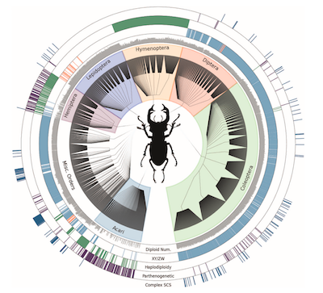

## Goals
>- Explore a cool dataset and discover something interesting.
>- Make an awesome graph that show the interesting characteristic
>- Make two awesome plots


## Visualization = Exploration

Plotting our data is one of the best ways to quickly explore it and the various relationships between variables, and is integral to telling a compelling story in your manuscripts.



## Graphing environments in R

1. `base` 
2. `lattice` 
3. `ggplot2`

## Types of plots

[Types of graphs](http://coleoguy.github.io/SWC/example.plots.pptx)


## Data for afternoon

This data is from a study of the impact of using computers to take notes in a classroom.  It includes the score students made on a test plus the method they used for taking notes and their sex.

[scores.csv](http://coleoguy.github.io/SWC/scores.csv)


## Challenge 1
Make a mosaic plot that shows the relationship between passing (at least 70%) and using a computer. You will have to munge your data to make a contingency table and then use `mosaicplot`

```{r, echo=FALSE}
data <- read.csv("scores.csv")
results <- matrix(,2,2)
colnames(results) <- c("passing", "failing")
rownames(results) <- c("computer", "paper")
results[1,1] <- sum(data$score >=.7 & data$method == "comp.")
results[1,2] <- sum(data$score <.7 & data$method == "comp.")
results[2,1] <- sum(data$score >=.7 & data$method == "paper")
results[2,2] <- sum(data$score <.7 & data$method == "paper")
mosaicplot(results,las=1, col=c("blue", "red"), main="Effect of note taking methods")
```

## Challenge 2
Load the old faithful dataset `data(faithful)` and use what you have learned to create a plot. Try using `plot`, `abline`, `lm`.  Make sure to make it more awesome than this:

```{r, echo=FALSE}
data(faithful)
pchs <- vector(mode="numeric", length=272)
pchs[1:272] <- 16
pchs[faithful$eruptions < 3] <- 17
plot(faithful$eruptions, faithful$waiting, xlab="Length of eruption (min)", ylab="Waiting time (min)", main="Geyser eruption patterns", pch=pchs)
abline(lm(faithful$waiting~faithful$eruptions), col="red", lwd=3)


