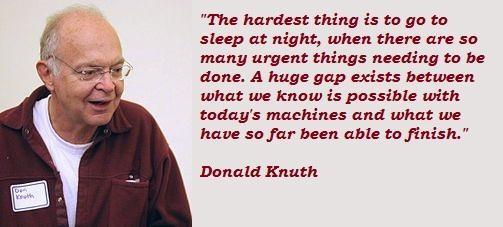

## Goals
>- literate programming
>- Rmarkdown - documents/figures
>- Rmarkdown - slideshows

## Literate programming




## Degrees of goodness

good code ex:better-script.R

literate code ex:code.good.Rmd

[literate code -> html ](http://coleoguy.github.io/comparative/comparative.html)

  >- *easy for others to understand (including you later)*  
  >- *easy to incorportate new data*  
  >- *easy to deal with reviewers comments*  

## Why Rmarkdown?
  >- *increasingly wide usage*
  >- *plain text*
  >- *using knitr gives simple and effective products: [pdf](http://coleoguy.github.io/saga.pdf), html, slideshows*

## Parts of a Rmarkdown document
 >- header
 >- text
 >- code blocks
 >- sections with #, ##, ###


## Activity 1

File -> New File -> R Markdown -> html -> OK 

Using the template you have opened make an R markdown file that explores the `chickwts` dataset.

Make an awesome histogram of chick weights

Make an awesome barplot of chick weights parsed by feed

    ```{}
    data()
    hist()
    boxplot()
    ```
 
## Activity 2

Generate a pdf file for submission to a journal

`pdf(file="fig1.pdf", width = 4, height = 4)`

`dev.off()`


## Activity 3
Save a second copy of your markdown file and change it into a slideshow

in the header:
`output: ioslides_presentation`

in code blocks
use the `echo = F` argument in your code blocks


## Conclusion
You have all the tools you need go do awesome things!