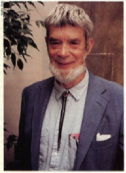
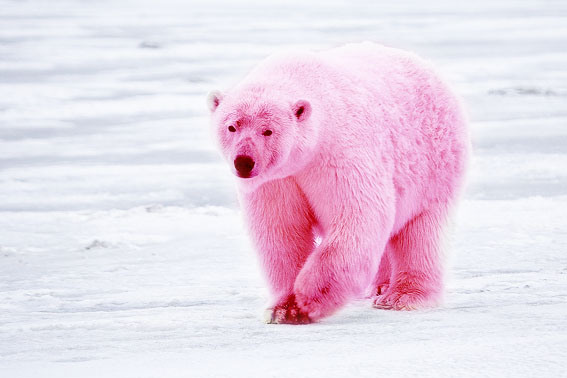
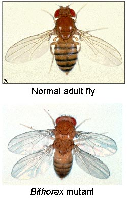
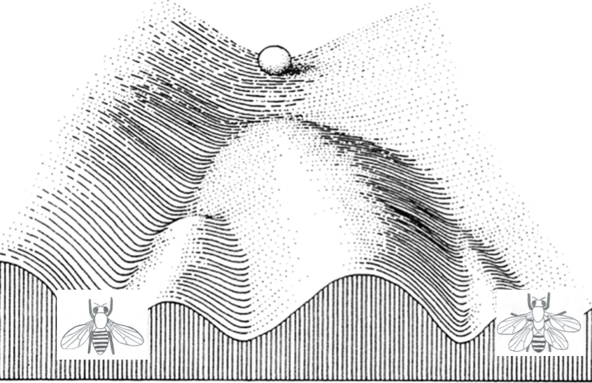

Notes from reading *Adaptation and Natural Selection* and *Levels of Selection*
    <!---“cerulean”, “journal”, “flatly”, “readable”, “spacelab”, “united”, “cosmo”--->

[back to main page](http://coleoguy.github.io/index.html)

____
## Background

George C. Williams - and that quintessential beard

*Adaptation and Natural Selection*[1] was published by Williams in 1966 while at Stony Brook though it was largely written during the summer of 1963 while he was at Berkeley.  It is essentially a reaction to adaptationist story telling and lack of rigor in contemporary explanations for the origins of traits. Williams felt that all too often people explained the origin of a trait as being through selection acting at the level of the species or community.  Williams will argue that this is largely unnecessary and should only be resorted to when individual selection can not explain the phenomenon.

____
## 1. Introduction

Williams is basically relating why he got frustrated enough to write the book.  The most important part of this chapter is Williams setting up the thesis of the book which is:

> Adaptation is a special and onerous concept that should be used only where it is really necessary. When it must be recognized, it should be attributed to no higher a level of organization than is demanded by the evidence. In explaining adaptation, one should assume the adequacy of the simplest form of natural selection, that of alternative alleles in Mendelian populations, unless the evidence clearly shows that this theory does not suffice.

Doesn't seem like this would have been necessary its basically Occam's razor for evolutionary biologists, and if my memory serves me right that is really the central theme of this book over and over again.  In this introductory chapter he does have one humorous example where he discusses the origin of the occasional exceptionally intelligent human.  He describes the argument that has been made that:  

1. Being particularly intelligent is not associated with higher fitness. 
2. Having a low percentage of geniuses would provide an advantage to a tribe or group of humans.  
3. These tribes or groups would do better and replace groups that lacked the occasional genius.  

He argues that we have no facts that demand this explanation.  He argues that instead it could be that selection for simple and early understanding of basic instructions has selected for a brain sufficient to produce the occasional genius.  The story that he tells to illustrate this is of two young prehistoric children they are warned and spanked for several transgressions.  Then one day they are told to stay in the cave because a *Smilodon* is outside.  One boy is intelligent enough to understand this the other is not and gets eaten.  Williams argues that selection like this is just as likely to be sufficient to produce the observed distribution of intelligence.  He would argue that to resort to the argument for groups needs some compelling evidence that simply can't be explained by selection on individuals.  To me it seems that he is imploring us to use our wit to search for the simplest explanation rather than the sexiest.

____
## 2. Natural Selection, Adaptation, and Progress

  
Adapted from [Alan D. Wilson](http://www.naturespicsonline.com/)

This was a chapter that broached a few topics that were interesting to our group.

1. Evolution doesn't happen because it is needed (to avoid extinction)
2. Evolution doesn't result in *progress*
3. The role of laws in biology
4. The target of selection

These first two I feel are primarily Williams response to adaptationist story telling.  We all agree that this is probably a reaction to specific scientists at the time but that also more broadly is still an issue in how science is often communicated to the public.  Part of the discussion of progress gets into information content.  For the untrained it might be tempting to think that we humans are as complex as it gets.  William does a nice job of painting a picture of how complex the life history of many organisms are.  In particular he focuses on organisms that have very different life stages - the liver fluke and tadpole humans make for a great read.  William ends this section by stressing that until we have further information we need to reserve judgment on how *complex* different organisms really are.

Our group disagreed on what we should take away from the discussion that William has concerning biological law. He starts this off with a slap at popgen saying "For all its formal elegance, however, this theory (popgen) has provided very limited guidance in the work of biologists."  After our discussion and going back and rereading it myself again.  I think that I have a better understanding of what he was getting at.  Specifically, I believe that his issue isn't with population genetics but rather at the time of writing the lack of rigorous applications of popgen to interesting problems.  He mentions two applications and says that with a hundred more we might have a unified science of adaptation.  He then seems to pin this lack of applications to the underlying cause of messy story telling.

The final topic that we discussed from this chapter was the gene as the target of selection.  William tries to discuss this with an awkward discussion of Socrates.  In this chapter William paints a very Fisherian view of the world.  Because of this our discussion careened off into a 10 minute discussion of the Wright-Fisher debate.  Perhaps the one important distinction that came up during this discussion.  Was the Wright vs Fisher view of epistasis. Some of our group members felt that part of the debate was caused because the kind of traits that the two were interested in were characterized by different importances for epistasis.  I disagreed with this.  I think that both viewpoints allow for various amounts of epistasis the difference is whether 1) the role of epistasis can be disregarded because of panmixis (Fisherian view) or 2) the role of epistasis must be considered because of population subdivision.

____
## 3. Natural Selection, Ecology, and Morphogenesis
  

I feel like Williams spends far too long trying to describe the way that we can have "environments" at multiple levels.  Perhaps at the time this was less intuitive than it is now. This discussion is also complicated a bit simply because of the lack of information that he was facing.  Specifically, mitochondrial DNA was only discovered in 1963-1964 so the implications for mitochondrial nuclear interactions was not appreciated nor the role of maternally encoded RNAs. This has the unfortunate effect of creating some odd sections where he is discussing the soma as an environment.  We have a much better way of understanding these interactions and experimental results now that we know what is going on.  This section does have an analogy that I had forgotten and enjoyed.

> If a message to someone who can understand only Chinese produced the same response as a message given to someone who can only understand Japanese then the messages must be different.

Williams uses this while relating the results of nuclear transplant experiments that showed that the same nuclear genome in different somas A and B produced different phenotypes, even-though the natural populations of A and B are indistinguishable.

I also really like the way that Williams discusses selection on traits presented at different stages in the life cycle.  Specifically, it is the frequency and duration of a life stage that determines the degree of selection on the traits presented at that time.  We should really extend this a bit and specify that at any given stage it is also multiplied by the proportion of life-time reproduction that will occur in the future.  This then allows for senescence.

Next Williams deals with Waddington. It becomes quite clear that Williams thinks that common interpretations of genetic assimilation are incorrect.  At there heart the question is whether or not the kind of variation that is revealed in the ether experiment is the type of variation that is important in adaptation.

First lets look at how Waddington interpreted his own experiment.  Briefly Waddington exposed developing flies to a sub-lethal dose of ether.  This would cause a proportion of the flies to develop a bithorax phenotype where instead of halters behind the front wings a second pair of wings would grow.  Waddington would then select flies that expressed this phenotype to breed the next generation and repeat the process.  After 30 generations Waddington has succeeded in producing a line of flies that would produce a high proportion of bithorax individuals without ether treatment.  Waddington believed that this demonstrated that there was inherent "adaptable" variation hidden from selection that only was revealed when an organism was under stress.  He used the figure below to describe what he believed was happening (I added the phenotypes at the bottom).  When everything is normal the development passes down the path of least resistance (the deepest canal).  But when stresses are present then other phenotypes are expressed and can be selected if they are more fit.
  

Williams attacks this interpretation in 3 different ways.

1. He argues that bithorax and other subsequent examples are failures of development and unlikely to be adaptive.

2. Changes from faculative to obligate expression are examples of loss of information. - I think that this is not necessarily true. At a minimum Williams fails to provide any evidence of this that I buy.

3. Faculative traits are more likely to be adaptive solutions than obligate mutations.

On page 83 Williams says "instinct costs less than learned behavior in the currency of genetic information" - - Not sure what he was thinking here.  No genetic cost to learned behavior once ability to learn evolved??

Finally, Williams spends a bit of time knocking down a few minor claims of characteristics that "can't be explained via natural selection".  One of these is the ability of organisms to deal with historically unique conditions in an adaptively successful way.  In a discussion of Trichoptera he cites [Russell 1945](https://archive.org/details/directivenessofo035049mbp).  This book then cites Dembowski 1933 <small>(I tried to track this article down but had little success.  I'm pretty sure it was published in a German journal but the citation is greatly abbreviated so I had no luck).</small>  But even judging from the sections of Russell's book that I read Dembowski spent hundreds of hours carefully recording the response of caddis fly larvae essentially being screwed with.  He would flip them over cut their shells and otherwise molest them and then record all of the actions that the individuals would take to restore their condition to a normal state.  The insects are successful in doing this regardless of how odd or unnatural the molestation is.  Although Williams doesn't discuss this in Russell's book we also see discussion of the more famous experiments that John-Henri Fabre performed using Nicrophorus burying beetles.  These beetle normally bury a small mammal to raise young in.  Fabre tried all manner of methods to stop the beetles (using twine, sticks and mats to block or stop the beetles) in all cases the beetles just bite through the offending materials and bury the carcass.  Russell and others said that something other than natural selection must have produced these adaptations since they have never experienced them before.  Williams argues that the organisms use adaptive behavior that has been selected for other purposes to deal with these challenges.

[1] Williams, George C. "Adaptation and natural selection: a critique of some current evolutionary thought" Princeton University Press. Princeton, NJ (1966).

[back to top](#TOC)

