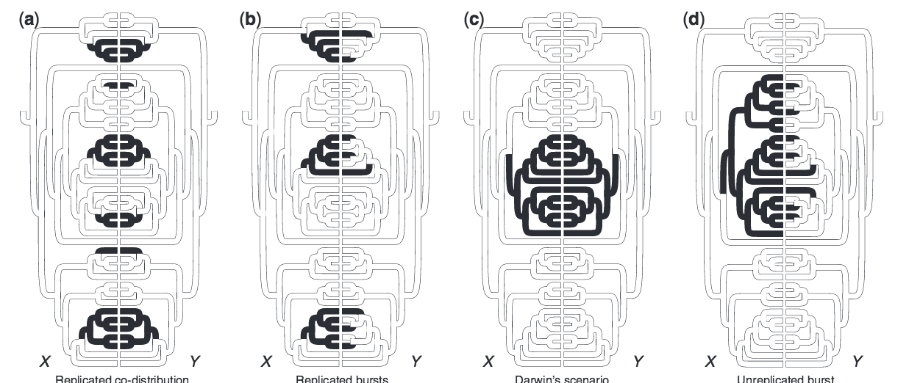

[Return to main website](http://coleoguy.github.io/resources.html)

Return to of comparative methods [outline](http://coleoguy.github.io/comparative/methods.html) page 

____
#Maddison and Fitzjohn 2015 [6]

In my opinion this is one of those kind of instantly important papers.  It doesn't present anything that I feel was terribly surprising but it is well written and for those that are just beginning to get into comparative methods I think it is a good paper to make you appropriately paranoid and suspect of significant results arising from a lot of the methods that we employ commonly.  I also like this paper because for me it does a great job of why you should visually explore your data.  They first show possible outcomes that we can all agree more less should and should not produce significant results for tests of correlation.  Below is a screen shot of their figure 1:

So A and B are examples that are clearly suggestive of an interesting pattern and the type of thing that we would want our methods to flag as possibly being significant.  However, we can see that C shouldn't be considered a correlation these two traits could have evolved with out any reciprocal effects and simply inherited by all of the descendants due to shared inheritance.  Finally, example D what they call an unreplicated burst is also not a situation where we should find significance. Any trait that evolved on the first black branch of the tree on the left would show a strong correlation with the trait on the right so in this case we likely have a very strong bias due to our choice of characters.

Next they present the results of simulation studies that show that Pagel 1994 [2] approach will return many significant results for both structures like C and D. In fact all simulations of Darwin's scenario (C) result in highly significant results using Pagel’s test.  The authors briefly mention Felsenstein's phylogenetic extension [3] of Sewell Wright's threshold model [4] for discrete traits.  I find it odd that they didn't test this method.  I haven't played with it much but it seems that it fits the bill in that it would correctly account for true sample size and should not be led astray the way that these other methods are. 

The problem here is pseudoreplication.  The amount of shared branch length largely determines the significance of the result based on Maddison's, Pagel's and Huelsenbeck's approaches rather than the number of independent occurences.  Also cant write about this article without mentioing the final section where Maddison and Fitzjohn launch into nearly a full page analogy between space time and phylogenies - - Its just awesome.

So where do we go from here... well a quick first thing to do would be to run felsensteins approach on this data and just see does it work better?  And this brings me to my one complaint about this article the simulated datasets nor the code that generated them seems to be available.... not sure why that is. So many easy ways to make data/code available these days.

___
citations

[1] FitzJohn, Richard G., Wayne P. Maddison, and Sarah P. Otto. "Estimating trait-dependent speciation and extinction rates from incompletely resolved phylogenies." Systematic biology 58, no. 6 (2009): 595-611.

[2] Pagel, Mark. "Detecting correlated evolution on phylogenies: a general method for the comparative analysis of discrete characters." Proceedings of the Royal Society of London B: Biological Sciences 255, no. 1342 (1994): 37-45.

[3] Felsenstein, Joseph. "A comparative method for both discrete and continuous characters using the threshold model." The American Naturalist 179, no. 2 (2012): 145-156.
Cheers

[4] Wright, Sewall. "An analysis of variability in number of digits in an inbred strain of guinea pigs." Genetics 19, no. 6 (1934): 506.

[5] Boettiger, Carl, Graham Coop, and Peter Ralph. "Is your phylogeny informative? Measuring the power of comparative methods." Evolution 66, no. 7 (2012): 2240-2251.

[6] Maddison, Wayne P., and Richard G. FitzJohn. "The unsolved challenge to phylogenetic correlation tests for categorical characters." Systematic biology 64, no. 1 (2015): 127-136.

