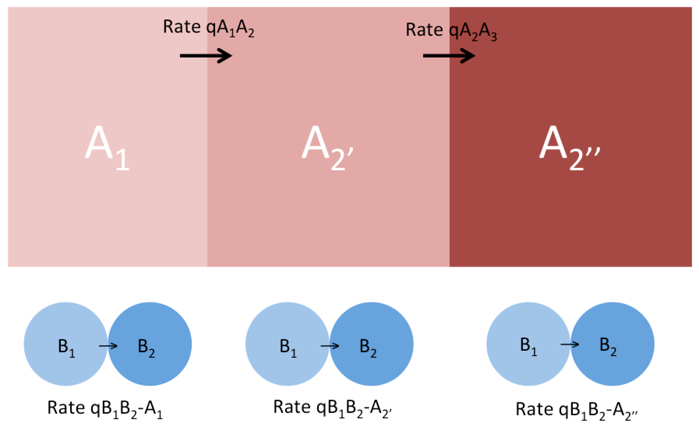

Emma described an intersting model that might be more appropriate than Pagel94 at times.  Briefly this model is designed to test whether a transition in character B depends on the **transition** in character A.  The distinction and inovation here is that it is the transition rather than the state itself that is realy important here:



Under this model we would code our data as either state A1 or equal probability of state A2' and A2''.  We could then fit this model with the mk model:

```{r, echo=F}
qmat <- matrix(0,6,6)
colnames(qmat) <- rownames(qmat) <- c("a.1_b1", 
                                      "a.1_b2", 
                                      "a.2_b1",
                                      "a.2_b2", 
                                      "a.3_b1",
                                      "a.3_b2")
qmat[1,2] <- 1
qmat[1,3] <- 2
qmat[2,1] <- 3
qmat[2,4] <- 4
qmat[3,4] <- 5
qmat[3,5] <- 6
qmat[4,3] <- 7
qmat[4,6] <- 8
qmat[5,6] <- 9
qmat[6,5] <- 10
qmat
```

Rate descriptions:


rates         |description 
--------------|---------
3,7,10        |These represent reversion in trait B and we could imagine that they might be set to zero in some situations
2,4,6,8       |These represent the advances in trait A we would expect that often some of these would be constrained to be equal.  For instance 2&4 and/or 6&8.
1,5,9         |These are the rates that give us the answers we are after.  Is 5 bigger than 1 and 9? can we set 9 (or 9 and 1) to zero without dropping likelihood significantly?

