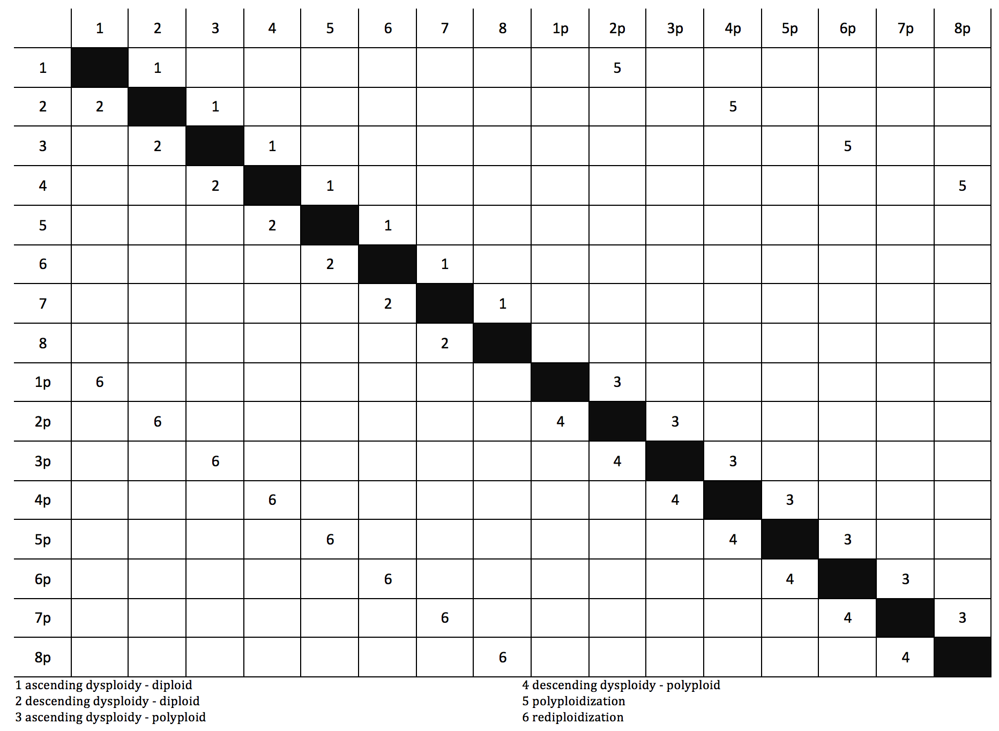

___
## chromevol model in diversitree
Implementing chromevol in the diversitree environment has a number of valuable benefits.  Perhaps one of the biggest is the classfication of any point on the tree as either diploid or polyploid.  This will allow the inference of how long it takes for rediploidization or how long a whole genome duplication actually impacts the evolution of a lineage.

we can represent the chromevol model as transition matrix:


___
##Loading Data
Using diversitree (either mkn or musse) will require that we have a matrix with rownames equal to species and then each state represented by a column.  The cells in the matrix represent the prior probability of a species having that state.  We will also need the matching tree in phylo format. Data will likely come in as a  csv file. for instance:

```{r}
data <- read.csv("./example-data/data2.csv")
tree <- ape::read.tree("./example-data/dend.tre")
data
source("hb.fx.R")
```

So lets build a function to convert the two column data from the csv file into a data matrix sufficient for an oldstyle chromevol analysis:

```{r}
datatoMatrix <- function(x, excess = .1, polyploids = T){
  matsize <- round(max(as.numeric(x[, 2])) * (1 + excess))
  if(polyploids == T){
    dmat <- matrix(0, nrow(x), matsize * 2)
    states <- c(as.character(1:matsize),
                paste(as.character(1:matsize), "p", sep = ""))
    colnames(dmat) <- states
    row.names(dmat) <- x[, 1]
    for(i in 1:nrow(x)){
      dmat[i, which(colnames(dmat) == x[i, 2])] <- .5
      dmat[i, which(colnames(dmat) == x[i, 2]) + matsize] <- .5
    }
  }
  if(polyploids == F){
    dmat <- matrix(0, nrow(x), matsize)
    states <- as.character(1:matsize)
    colnames(dmat) <- states
    row.names(dmat) <- x[, 1]
    for(i in 1:nrow(x)){
      dmat[i, which(colnames(dmat) == x[i, 2])] <- 1
    }
  }
  return(dmat)
}
```

argument    |description
------------|------------
x           |this is the dataframe read in by read.csv
excess      |how far over the highest observed number to include in the model. unlike chromevol right now the minimum is hard coded to be 1
polyploids  |T or F to use the hidden approach.  If T then all species have equal probability of being either diploid or polyploid.

```{r}
dataMP <- datatoMatrix(data, excess = .01, polyploids = T)
dataMP
```

or if we don't want to go the hidden state route:
```{r}
dataMD <- datatoMatrix(data, excess = .01, polyploids = F)
dataMD
```

___
# making a likelihood function

Now lets try to create likelihood function for standard chromevol model
```{r}
lik.dip <- diversitree::make.mkn(tree, dataMD, strict=F, k=10)
diversitree::argnames(lik.dip)
```

Obviously we don't want to try and fit all of these rates. Many of them are not allowed by the model and then others we want to constrain to be equal.  To fix this we want to build up constraints to feed into diversitree's constrain function:

```{r}
constrainChrom <- function(data, lik, hidden=T, testing=F){
  # create and store variable for padding rate names
  if(ncol(data) < 100) pad <- 2
  if(ncol(data) >= 100) pad <- 3
  # make the matrix of rates
  parMat <- matrix(0,ncol(data),ncol(data))
  # make the components of the rate names the column and row
  # names this will allow for easy creation of constraints later
  colnames(parMat) <- sprintf(paste('%0', pad, 'd', sep=""), 1:ncol(parMat))
  rownames(parMat) <- colnames(parMat)
  # now we have a matrix with all zeros but the right state names
  # in the column and row names
  # this will allow us to fit the old fashioned chromevol 
  # model just as easily with very little overhead
  if(hidden==F){
    # currently this has the issue of missing polyploidy for q12
    # this transition should be = ascending + polyploidy
    for(i in 1:(nrow(parMat) - 1)){
      if((i * 2) <= ncol(parMat)) parMat[i, i*2] <- 5 #polyploidy
      parMat[i, (i + 1)] <- 1 #ascending aneuploidy
      parMat[(i + 1), i] <- 2 #descending aneuploidy
    }
  }
  # this is the new model with hidden states
  if(hidden==T){
    split <- ncol(parMat)/2
    for(i in 1:(split - 1)){
      if((i * 2) <= split) parMat[i, (i * 2 + split)] <- 5 #polyploidy
      parMat[i, (i + 1)] <- 1 #ascending aneuploidy - diploids
      parMat[(i + 1), i] <- 2 #descending aneuploidy - diploids
    }
    for(i in (split + 1):(nrow(parMat) - 1)){
      parMat[i, (i + 1)] <- 3 #ascending aneuploidy - polyploids
      parMat[(i + 1), i] <- 4 #descending aneuploidy - polyploids
      parMat[i, (i - split)] <- 6 #rediploidization
      if(i == (nrow(parMat) - 1)) parMat[(i + 1), (i + 1 - split)] <- 6 #rediploidization
    }
  }
  # we now have a matrix with a number 1-6 that matches the rates present
  # under either of our models hidden or not we will use this to build our 
  # arguments for the standard diversitree constrain function
  #
  # each of these vectors will hold the formulae for that class of
  # parameters (described up at the top)
  restricted <- ascdip <- descdip <- ascpol <- descpol <- polypl <- redip <- vector()
  for(i in 1:nrow(parMat)){ # by rows then
    for(j in 1:ncol(parMat)){ # by cols
      if(parMat[i, j] == 0 & i != j){
        restricted <- c(restricted, paste("q", row.names(parMat)[i], colnames(parMat)[j], " ~ 0", sep="" ))
      }
      if(parMat[i, j] == 1){
        ascdip <- c(ascdip, paste("q", row.names(parMat)[i], colnames(parMat)[j], " ~ ascdip", sep="" ))
      }
      if(parMat[i, j] == 2){
        descdip <- c(descdip, paste("q", row.names(parMat)[i], colnames(parMat)[j], " ~ descdip", sep="" ))
      }
      if(parMat[i, j] == 3){
        ascpol <- c(ascpol, paste("q", row.names(parMat)[i], colnames(parMat)[j], " ~ ascpol", sep="" ))
      }
      if(parMat[i, j] == 4){
        descpol <- c(descpol, paste("q", row.names(parMat)[i], colnames(parMat)[j], " ~ descpol", sep="" ))
      }
      if(parMat[i, j] == 5){
        polypl <- c(polypl, paste("q", row.names(parMat)[i], colnames(parMat)[j], " ~ polypl", sep="" ))
      }
      if(parMat[i, j] == 6){
        redip <- c(redip, paste("q", row.names(parMat)[i], colnames(parMat)[j], " ~ redip", sep="" ))
      }
    }
  }
  # lets store these in realy obvious names
  if(testing == F){
    formulae <- c(restricted, ascdip, descdip, ascpol, descpol, polypl, redip)
    extras <- c("restricted", "ascdip", "descdip", "ascpol", "descpol", "polypl", "redip")
    lik.con <- diversitree::constrain(lik, formulae=formulae, extra=extras)
    return(lik.con)
  }
  if(testing == T){
    formulae <- c(restricted, ascdip, descdip, ascpol, descpol, polypl, redip)
    extras <- c("restricted", "ascdip", "descdip", "ascpol", "descpol", "polypl", "redip")
    results <- list(formulae, extras)
    return(results)
  }
}
```

argument    |description
------------|------------
data        |character matrix ready for diversitree
lik         |likelihood function from make.mkn or make.musse
hidden      |T or F to indicate whether hidden polyploid model
testing     |temp still having some issues with hidden polyploid model

The function (if testing=F) returns a constrained likelihood function.

```{r}
lik.dip.con <- constrainChrom(dataMD, lik.dip, hidden=F)
diversitree::argnames(lik.dip.con)
```

We can find the MLE of this data under this model

```{r}
set.seed(5)
fit.old <- diversitree::find.mle(lik.dip.con, x.init=startVals(3,0,.1))
coef(fit.old)
```

Now lets see what happens when we use these on the hidden state version of this model.  We already have the data ready from above:

```{r}
dataMP
```

When we try to run this into mkn in though:

```{r}
try(lik.pol <- diversitree::make.mkn(tree, dataMP, strict=F, k=20))
```

```
Error in map[cache$states, ] : invalid subscript type 'list'
```

this is the problem with the check states function if we make one species known for its state then we see this problem disappear:

```{r}
# we will make the first species known as polyploid 6
dataMP[1, 6] <- 0
dataMP[1, 16] <- 1
lik.pol <- diversitree::make.mkn(tree, dataMP, strict=F, k=20)
```

we still need to do the constraining step right now we have an excess of parameters:
```{r}
diversitree::argnames(lik.pol)
```

```{r}
lik.pol.con <- constrainChrom(dataMP, lik.pol, hidden=T)
diversitree::argnames(lik.pol.con)
```

We can find the MLE of this data under this model

```{r}
set.seed(5)
#fit.old <- diversitree::find.mle(lik.pol.con, x.init=startVals(6,0,.1))
#coef(fit.old)
```

We have a problem here though because we get this when we run it:

```
Error in do.mle.search(func, x.init, method, fail.value, ...) : 
  Starting point must have finite probability
```

To debug this first lets get a very simple dataset that will have few states and be relitively easy to analyze:
```{r}
## Load misc functions i need
## Now we want to create a simple tree and dataset
tree <- ape::read.tree(text = "((Gibbon:0.4,(Orang:0.26,(Gorilla:0.2,(Chimp:0.12, Human:0.12):0.08):0.06):0.14):.1,(Bovine:0.3,Mouse:.3):.2);")

# So this is what I would think would be a typical way 
# to get data coming in.
b <- c(2,1,2,4,5,2,1)
a <- c("Gibbon", "Orang", "Gorilla", "Chimp", "Human", "Bovine", "Mouse")
tip.data <- cbind(a,b)
rm(a,b)
```

lets plot that to see what it looks like:

```{r}
plot(tree, cex=.5)
ape::tiplabels(text=tip.data[,2], adj=2)
data <- datatoMatrix(x=tip.data, excess = .01, polyploids = F)

```

ok lets try that in mkn

```{r}
lik <- diversitree::make.mkn(tree, data, strict=F, k=5)
## now lets try our constrain function old model
lik.con <- constrainChrom(data, lik, hidden=F)
lik.con
fitlik <- diversitree::find.mle(lik.con, x.init=startVals(3,0,.1))
fitlik
```

Now we try duplicating this data for unobserved state of poplyploidy just by setting polyploidy to True we will also expand the trait space by using the excess argument this allows us to consider that chromosome number may be higher at some point in tree than what we observe on tips

```{r}
dataP <- datatoMatrix(x=tip.data, excess = .01, polyploids = T)
#lik <- make.mkn(tree, dataP, strict=F, k=10)

## we find that we can't create the likelihood function
## a little experimenting shows that this is due to 
## every species having two states.  If we set just one
## species to a specific state the error disappears:

dataP[5,5] <- 1
dataP[5,10] <- 0

lik <- diversitree::make.mkn(tree, dataP, strict=F, k=10)
lik.con <- constrainChrom(dataP, lik, hidden=T)


```


Discussed with Emma, likely my problem is fixed in her version of diversitree so first thing try and see if using it makes my check states and initial likelihood equals infinity problems disappear.

After this need to run chromEvol (actually probably have the results already for my test dataset)


