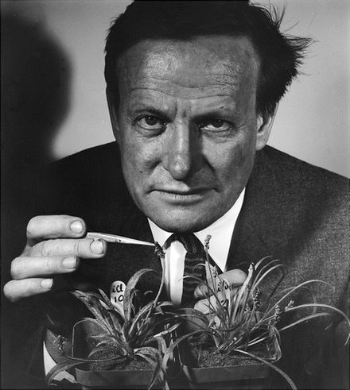

____
## Background

A photo of Stebbins by Ansel Adams

*Flowering Plants: Evolution above the Species Level*[1] was published by Stebbins in 1974 while at UC Davis.  It is essentially a follow up to arguably his most important contribution to the modern synthesis *Variation and Evolution in Plants*[2].  Stebbins describes his purpose for writing the book as 5 fold:

1. Test the hypothesis of gradualism - higher taxa are generated by the same forces acting on species and populations today.

2. Determine the changes in emphasis when transitioning from a micro to macro evolutionary time scales. For instance does the relative importance of selection, drift, mutation change when looking at different timescales.

3. To describe and analyze the types of adaptive radiations that could have given rise to the traits that taxonomists use to distinguish major lineages.

4. To describe the types of ecological or environmental factors that could have given rise to the traits that taxonomists use to distinguish major lineages.

5. Examine existing theories of the origin of angiosperms.

_______
## Basic Processes of Evolution

We spent the majority of our time discussing just a few points from this chapter.  The first topic that we discussed was the degree to which hybridization events are important as sources of genetic variation.  I think the general consensus that we reached was that yes hybridization can certainly be an important force for novel genetic variation but that the jury is still out on whether or not it is frequently an important source of variation.  Speaking only for myself I feel like Stebbins and many contemporary authors over sell the importance of hybridization.

We all like Stebbins swipe at the "mathematicians who have no experience with actual populations of actual organisms in nature" on page 9.

Next we spent quite a bit of time going over the five corollaries that Stebbins ascribes to genetical uniformitarianism (Stebbins term for gradualism).

1. "Adaptive radiation is the primary basis for diversification both for current groups and those that gave rise to higher orders in the past" I took issue with this when I first read this because I don't feel like there is any inherent reason that adaptive radiation is necessarily required.

2. 

3. 

4. 

5. 

_______
## Evolutionary processes and the origin of higher categories

_______
## Adaptations for survival

_______
## Adaptations for cross-pollination

_______
## Adaptations for seed development and dispersal and for seedling establishment

_______
## Gene action, development, and evolution

_______
## Methods for recognizing evolutionary trends

_______
## The ecological basis for diversity

_______
## Adaptive radiations and ecological differentiation

_______
## The nature and origin of primitive angiosperms

_______
## Trends of specialization within the angiosperms

_______
## Trends of evolution in the flower

_______
## Evolution of the monocotyledons

_______
## A glimpse into the future

_______
## Citations

[1] Stebbins, George Ledyard. "Flowering plants: evolution above the species level." London: Arnold xviii, 399p.. Illustrations. General (KR, 197500089) (1974).

[2] Stebbins Jr, C. L. "Variation and evolution in plants." Variation and evolution in plants. (1950).
