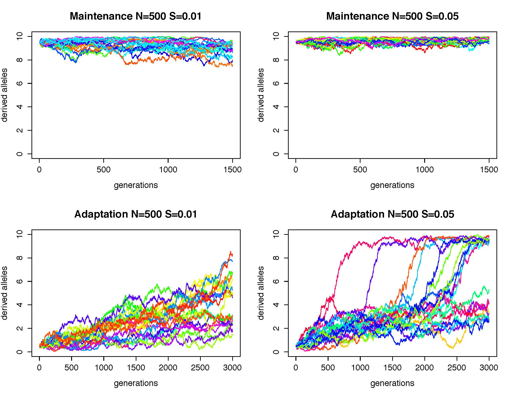
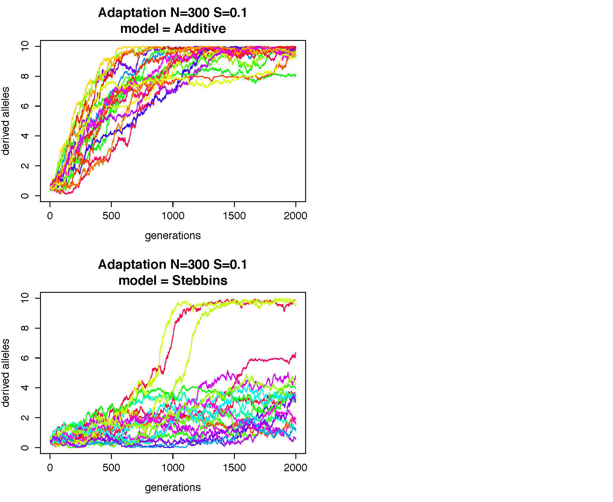
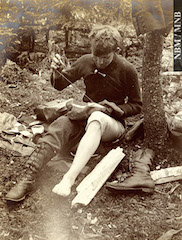
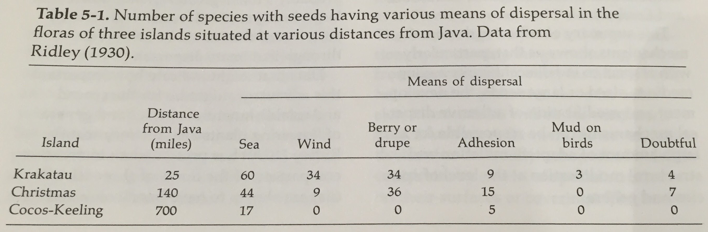
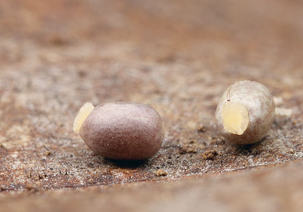
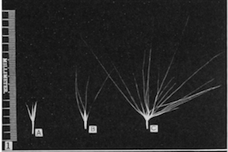
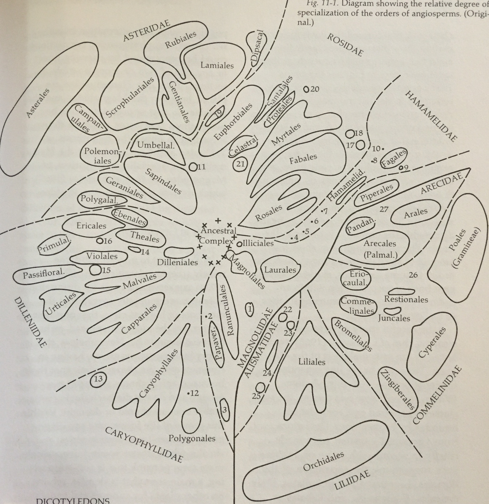

Notes from reading *Flowering Plants: Evolution above the Species Level*
    <!---“cerulean”, “journal”, “flatly”, “readable”, “spacelab”, “united”, “cosmo”--->

[back to main page](http://coleoguy.github.io/index.html)

____
## Background

A photo of Stebbins by Ansel Adams

*Flowering Plants: Evolution above the Species Level*[1] was published by Stebbins in 1974 while at UC Davis.  It is essentially a follow up to arguably his most important contribution to the modern synthesis *Variation and Evolution in Plants*[2].  Stebbins describes his purpose for writing the book as 5 fold:

1. Test the hypothesis of gradualism - higher taxa are generated by the same forces acting on species and populations today.

2. Determine the changes in emphasis when transitioning from a micro to macro evolutionary time scales. For instance does the relative importance of selection, drift, mutation change when looking at different timescales.

3. To describe and analyze the types of adaptive radiations that could have given rise to the traits that taxonomists use to distinguish major lineages.

4. To describe the types of ecological or environmental factors that could have given rise to the traits that taxonomists use to distinguish major lineages.

5. Examine existing theories of the origin of angiosperms.

[back to top](#TOC)

_______
## Basic Processes of Evolution

We spent the majority of our time discussing just a few points from this chapter.  The first topic that we discussed was the degree to which hybridization events are important as sources of genetic variation.  I think the general consensus that we reached was that yes hybridization can certainly be an important force for novel genetic variation but that the jury is still out on whether or not it is frequently an important source of variation.  Speaking only for myself I feel like Stebbins and many contemporary authors over sell the importance of hybridization.

We all like Stebbins swipe at the "mathematicians who have no experience with actual populations of actual organisms in nature" on page 9.

Next we spent quite a bit of time going over the five corollaries that Stebbins ascribes to genetical uniformitarianism (Stebbins term for gradualism).

1. "Adaptive radiation is the primary basis for diversification both for current groups and those that gave rise to higher orders in the past" I took issue with this when I first read this because I don't feel like there is any inherent reason that adaptive radiation is necessarily required.  If the word primary above was removed I would agree with this statement completely.  Personally I think the jury is out on whether or not MOST extant diversity was generated as part of adaptive radiations.  And perhaps this is a bias due to my background with beetles, but it seems that it is possible that a great deal of the observed diversity that we observe is generated through rare long distance dispersal events that create isolated populations.  These isolated populations could then evolve by drift to have small differences in phenotype.  Taxonomists now come in and recognize these as unique species - which depending on the length of time that they have been separated they may be.  But the question remains are they "good species" because they have adapted to their new locality or because they have been isolated long enough to develop DMIs through drift mediated processes (e.g. differential resolution of duplicated genes). 

2. "The origin of major categories, such as genera and families, does not require the evolution of distinctive characters that are qualitatively different from those that separate at least some populations and species."  To me this seems  like a very reasonable assertion and I think that most people with a organismic background can think of good examples of this in just about any group of interest.

3. "The initial divergence that led to major categories took place under conditions similar to those that promote maximal diversity in the modern world." Again this seems like a fairly straight forward assertion.  The one thing that bothers me a bit about this is that you could imagine that its not the condition that drives diversification but instead maybe its a change in condition that is most important. Additionally I think we still have a great deal of difficulty identifying what is linked to diversification.  So it is a high bar to try and say that the forces important recently are the same as those that were important long ago.

4. "Archaic forms...are most likely to exist in 'museums' that are least favorable for the origin of new species that could compete and cause their extinction"  This is an interesting idea; Stebbins goes on to discuss that no area is likely a cradle, museum, or lab for all species it contains.  It seems like the most important thing in determining if an area is a museum for a species is instead its taxonomic/morphological isolation.  To me this means that the fact that these species that are on an isolated lonely branch of the phylogeny may be the determining factor and not the environment that they are in.  One would expect these species to be phenotypically/physiologically very different from any other species.  If we think of the possible species that can exist being distributed across some multipeak landscape of genotypes we would expect these species to be a peak that is very distant from any other peaks.  This would mean that it would take a great many mutations for any species to be an effective competitor.

5. "Transspecific (macro) evolution is not best studied by focusing on relictual modern phenotypes, instead focus on the differences between modern forms regardless of their phylogenetic position,"  This is really just the forgone conclusion of accepting gradualism.  If the macro and micro are the same then study the micro because this is easier and should reveal what is going on over long time scales as well.

[back to top](#TOC)

_______
## Evolutionary processes and the origin of higher categories

Stebbins have several arguments in this chapter

1. The categories that differentiate higher categories are not special.  They vary at least in some cases at the level of species or populations.  Stebbins spends quite a bit of time here and does a good job of illustrating that almost anything that can separate families varies at least in some species somewhere.  He also gives some experimental evidence that in traits that don't vary much in nature can vary under selection.  Specifically he shows a picture from the 1968 thesis of Carl Huether [3] that shows that even though corolla lobe number is largely invariant 98% are pentamorous either environmental stress or selection can lead to great variation:

This provides a convenient transition into Stebbins discussion of canalization.  Stebbins wants to link this study in *Linanthus* which is canalization in the sense of Waddington 1962[4]: A trait that is extremely important to fitness develops a variety of buffering characteristics that insure its proper development despite underlying genetic variability. To what he calls evolutionary canalization.

2. The basis of evolutionary canalization: First, full disclosure,  I found his discussion of evolutionary canalization as more difficult to follow than anything else in chapters 1 & 2.  He describes the hypothesis of evolutionary canalization as "at every level...natural selection has included both an internal and external phase...for the kinds of adaptive shifts that give rise to higher categories the internal has been more important than the external"  This "internal selection" is his way of describing that a mutation must work with the rest of the genome to produce a coherent functional organism.  He posits that many of the traits that we use to define higher categories are part of complex structures (genetic pathways) and likely require many concerted changes.  Therefor these are unlikely to all occur often hence they are useful to separate very large clades of species from one another.  Stebbins also explains his choice of the word canalization as being purposeful because like developmental canalization he is suggesting that previous steps matter.. previous steps (adaptations) depend on previous steps (adaptations).  He next goes on to describe 3 principles that evolutionary canalization depends on:

a. Selective inertia - asserts that selection to establish an adaptive gene combination is times greater than that required to maintain it. I decided to write code to simulate this and in the process of writing the code I understand now why he says what he does.  The key fact is that his model assumes that there is no fitness benefit unless you have at least one copy of the adaptive allele at all 5 loci.  If we take "A" to be the more fit version and "a" to be the less fit then e.g. genotype AABBCCDDee would be no better than the genotype aabbccddee.  The two graphs below show the result of 20 iterations simulated under this model.  In both cases the adaptation (1+ derived allele at all loci) provides a 1% increase in fitness.  Although Stebbins doesn't mention a mutation rate context would make us assume a "low" mutation rate so I set it so that on average we get one new origin of both the adaptive and maladaptive allele in each generation.  In the maintenance setting I use the 95% allele frequency that Stebbbins describes and in the adaptation simulation I use a frequency of 10%. So with these initial setting we can see in the left column below that indeed we are able to maintain the coadapted gene complex but not build it up.  As Stebbins suggests a higher selection force is required to initially build the coadapted gene complex this is shown in the left column where the selection benefit is adjusted to 5% (5 times higher).  Note in both cases the adaptation simulation was given 3000 generations to insure that I wasn't missing something the happens at longer scales. 

  What seems odd to me considering the way that Stebbins has discussed adaptations building upon each other is that his model requires all mutations before any selective benefit arises.  In fact if we decide instead that the genes act additively we get a very different picture.  Below I compare the "Stebbins model" to an additive model where each copy of the derived allele moves us one step closer to the fitness of the homozygous derived genotype.  The results of the simulation illustrate that if our adaptation evolves under the additive model we can build the coadapted gene complex with a lower selective force than under the Stebbins model.  Specifically 100% of iterations fix the adaptation under an additive model while only 15% of iterations fix the adaptation under the Stebbins model.
     

  Code for these simulations is available in this [repository](https://github.com/coleoguy/stebbins).  Two files are included first a function "selective.inertia.R", and then an R script "stebbins.ex.R" to actually manage the simulations and produce the plots shown above.

b. Conservation of organization - Stebbins argues this is a necessary result of selective inertia however it seems to hinge on the idea of pleiotropic gene action and that you cant easily lose a complex structure he mentions a number of examples of apparently frivolous structures that have been maintained for long periods.  I wonder though if this isn't simply a failure of imagination and that these structures have some unappreciated importance that we are missing.

c. Adaptive modification (evolution) along the lines of least resistance - This is a topic that should be familiar to most modern readers as it has received lots of attention over the last decade in evolutionary biology.  For that reason I'm going to digress and discuss a citation that Stebbins gives: [Ganong 1901](../pdfs/ganong-1901.pdf) [5] This caught my eye and I was curious who [Ganong](https://en.wikipedia.org/wiki/William_Francis_Ganong) was and what he had to say about this 100+ years ago. 
    
    
    
    Reading the article it ends up that Ganong was attempting to correct what he thought was a lagging American botanical outlook on the morphology of plants.  At the very bottom of page 428 Ganong discusses "metamorphosis along lines of least resistance".

3. Evolutionary canalization and alternative pathways of adaptation: Next Stebbin posits that because of evolutionary canalization differences in categories are related to categories but that this relation is indirect.

4. Evolutionary success and evolutionary opportunity: Stebbin rightly points out that we should be cognizant of two types of evolutionary success 1) diversification into many species and 2) spread across very wide geographic and ecological range.

5. The significance of extinctions and alterations of distribution patterns: Here Stebbins discusses the way that forerunner species that are likely less specialized are likely pushed into extinction by related forms creating the relative isolation of distinct forms.  This also has the effect of making it unlikely for the direct ancestral form of species to survive to the present.  He finishes the chapter with a short mention of the hazards of using current distributions to attempt to draw conclusions about the origins of species or clades.

[back to top](#TOC)

_______
## Adaptations for survival

Stebbins' thesis for this section is that in plants adaptation for survival, cross-pollination, and seed (dispersal and establishment) are separate problems that involve different gene networks.  He argues that this is an important difference in comparison to animals where growth, survival, and reproduction are highly integrated and are not divisible - he loosely attributes this to integration among body parts and says that motility, sensory awareness, digestion, excretion require greater integration among body parts than do the activities of plants.  I will be interested at our meeting to get the take of people with a plant background.  Is he underselling plant here?  I mean for instance there was [this study](http://link.springer.com/article/10.1007/S00442-014-2995-6) [6] that showed that plants responded to vibrations from insect chewing by increasing the levels of chemical defenses in their tissues.  So plants are obviously engaging in sensory awareness to some extent... 

In this chapter he attempts to convince us of independence of adaptation for survival by illustrating that adaptation to different environments is common, often convergent, and often involves alteration of the leaves which are the most plastic of structures.  Perhaps he will develop his thesis more fully in the following chapters but having only read this chapter I feel convinced that yes adaptations to survival occur far below the level of higher categories and I'm not sure how this tells us that is more divisible from reproduction or seed establishment than it would be in animals (not all of which are mobile does he make predictions that we should see in animals like sessile corals, barnacles, etc.)

_______
## Adaptations for cross-pollination

This chapter of Stebbins is a largely a reprint an annual reviews [article](http://www.annualreviews.org.ezp2.lib.umn.edu/doi/pdf/10.1146/annurev.es.01.110170.001515).  Despite this chapter being 30+ years old we all agreed that you could pick any number of sentences out of this paper and build a dissertation around them.  I don't have a lot of time this week so I am going to limit myself to a few reactions to some of Stebbin's assertions.

Says that transition from outcrossing to self-fertilization must be gradual with an intermediate stage; however, to me at least it is unclear what his reasoning behind this statement is.  I think the options are basically either that it is simply the pattern observed i.e. selfing at low rates is not too costly under normal conditions and then provides a great advantage when a plant is suddenly isolated in a new locality and allows for founding of a new population. Alternatively perhaps low levels of selfing allow you to purge deleterious recessives so the fitness of selfed individuals is higher.

Stebbin's talks a bit about the dual role "rule".  This is the idea that a structure that gains a new function must go through a stage where it has dual roles and that during this stage the old role can be taken over by some other structure prior to fine tuning for the new role can occur.  I don't buy that this is a "rule"; maybe common maybe not though.  Seems to me that big changes in habitat/niche might include complete loss of the need for a previous function so that you have all kinds of structures, proteins, characters that are not under purifying selection and can be selected for new roles.

Pathways to adaptation takes up quite a bit of this chapter this deserves a mention but I don't have time right now.  Perhaps when I read this book with a group of my own grad students one day I'll expand this.

Stebbin's discusses the belief at the time that beetles were the earliest pollinators of angiosperms. When he wrote this section this belief was based largely on the fact that plants with "primitive" morphology were largely pollinated by beetles.  Rather than go down the rabbit hole of what does it mean for something extant to be primitive.  I'll just agree that this alone would be somewhat dubious evidence.  Pinning down the first pollinators of angiosperms has been an area of intense interest and in my opinion often sensationalized results.  Here are a couple examples of what has been said recently:

Angiosperms... it started before the angiosperms with Mecoptera, Coleotpera, and Diptera feeding on the pollen and other reproductive tissue of gymnosperms and seed ferns [7, 8]

Thrips - again prior to angiosperms based on some pollen grains stuck to hairs on the abdomen of a specimen in amber[9]

Perhaps a more parsimonious take might be that many different generalist insects (likely already evolved for taking advantage of pollen available from existing plants) took advantage of the new food source that angiosperms provided and this likely included diptera, coleoptera, thysanoptera and other orders. This is the interpretation that we see in Grimaldi and Engel[10]

Stebbin's also mentions that it seems that self-fertilizing species are usually the ends of evolutionary lines.  I would be remiss if I didn't point to Emma's paper on this [Goldberg 2010](http://www.uic.edu/labs/igic/papers/science/Goldberg_et_al_2010b.pdf)[11] where we see that at least in the nightshades outcrossing species diversify more quickly than self-fertilizing species.

Finally, there is a sentence in this chapter, that among people who study this field is quite famous and often repeated.  Stebbin states that no evolutionary path has been followed by as many lineages as that of obligate outcrossing to predominant self-fertilization.  It is interesting to note that the only evidence provided for this is just a few empirical examples... 

[back to top](#TOC)

_______
## Adaptations for seed development and dispersal and for seedling establishment

If your interested in this chapter you can get the majority of it as this paper [14]

First I just want to note a couple of natural history things that I hadn't thought about previously:

Certain ecological niches seem to select for certain seed size i.e. epiphytes all have very small seeds; canopy trees in tropical forests have very large seeds.  Other niches seem to not select for specific seed sizes for instance semiarid open regions contain species with a wide range of seed size.

Interesting to consider where we see phenotypic plasticity in seed production.  For instance in oaks we can see great variation in the number of seeds made from year to year but the size of the seeds is relatively constant.

Stebbin starts this chapter asserting that again we are dealing with a structure (the seed) that is under a variety of very different selective pressures: growth, dispersal, establishment.

Part of this chapter focuses on the different modes of dispersal:
Stebbin says that wind dispersal is less effective over long distances than are dispersal by animals.  Unfortunately no citation - I would not have thought this, it seems that on average most animals (squirrels, deer, raccoon, rodents) don't travel terribly far.  While strong winds it seems could lead to long distance dispersal - some times exceptionally long dispersal events.  Flying insects are often subject to extreme dispersal events (many hundreds of miles outside of normal range) the traditional explanation for these is that they get high in the air column and are carried extreme distances.  Might this not be a common occurrence in wind dispersed seeds?  

It seems that Stebbin's stance on this topic are motivated by 2 papers.  The content of the first is a bit unclear from his description but for further reading it is here: [Janzen - Seed predation by animals](http://www.annualreviews.org.ezp3.lib.umn.edu/doi/abs/10.1146/annurev.es.02.110171.002341)[12].  The second is an interesting study of 3 islands of varying distance from Java:

This table shows a fascinating pattern - not unexpectedly the species that can disperse via water are quite successful but it is argued that these can only really colonize the near shore habitat on the island.  Next we see that wind is quite effective for the closest island but that animal dispersal begins to win as we move to more distant islands.  This table and the data that underlie it are discussed by Ridley at greater length [13]. The argument is then 

**Next Stebbin discusses the elaiosome.**  

image courtesy of [Alex Wild](http://www.myrmecos.net/)

This is such a cool example of adaptation!  The elaiosome is a nutrient rich structure that is attached to a seed.  Ants will collect these seeds and remove the elaiosome to feed to larvae.  The remaining portion of the seed is considered waste and is removed to the colonies refuse pile where the seed germinates.  This is usually an excellent site for germination since it will be enriched with frass, dead ants, and other plant debris.  Alex Wild has some great pictures and discussion of this on his blog check it out post [1](http://www.myrmecos.net/2009/06/09/ants-as-seed-dispersers-part-i/) and [2](http://www.myrmecos.net/2009/06/13/ants-as-seed-dispersers-part-2/)

The next section of this chapter focuses on "cycles of transference".  This can be described as the process of a structure such as the ovary wall changing from having simply a protective role to a role in dispersal after this the role of protection might be taken on by another structure such as the calyx.  We have seen stebbins discuss parts of this previously where he discusses the necessity of a period of dual function.

The last large section in this chapter focuses on factors affecting establishment of seedlings.  Stebbin spends some time here discussing drill mechanisms.  This is a common adaptation particularly in the grasses and if you have not ever seen a time lapse of this its definitely worth a watch:

<iframe width="640" height="360" src="https://www.youtube.com/embed/TOJG5mF6OLs" 
frameborder="0" allowfullscreen></iframe>

Seed establishment naturally flows into a discussion of trade-offs beginning with seed size and seed number and the obvious trade-offs involved with these traits.  So do we see adaptive radiations as a result in shifts in these traits?  Apparently at the time of writing there wasn't a lot of robust data on this.  Stebbin recounts a number of interesting examples based on monographic works that could be examples of radiation.  The most interesting of these to me was his account of observation in the tribe Hordeae my impression here is that the tribe is normally adapted for animal dispersal with stiff rachis and is depicted below as **A** while one genus in this group has experienced a transition into wind dispersal **C** and has multiple awns that allow wind dispersal long distance by tumbleweed like behavior.

So what is **B**? Well that is the hybrid between these two genera.  It ends up that there has been a lot of work on this group (much by Stebbin)[15]  It seems to me, the fact that you can make a successful cross between these species that differ in adaptation for dispersal would argue against Stebbin's often underlying assumption of the integrated nature of these traits.   If changes to different types of dispersal adaptations required complex changes in development etc. then you would expect failure in the cross or at least failure to develop seeds.

Although I learned a lot in reading this chapter he ends it with what I feel is an unfortunate sentence: 

*The consrvatism of complex adaptive patterns is such that many of their features will persist after the selective pressures that brought them into being no longer exist.*

This goes back a couple of chapters but I still am not convinced of this idea at all.  Stebbins had a great appreciation for the importance of gene networks and pleiotropy but I think he is incorrect in interpreting these as maintaining complex traits that lack selective benefit.

[back to top](#TOC)

_______
## Gene action, development, and evolution

[back to top](#TOC)

_______
## Methods for recognizing evolutionary trends

In some parts this is a bit of a difficult chapter to read since many of the issues that Stebbin struggles with have been changed significantly by the advent of modern comparative methods and statistical phylogenetics - especially the implementation of Bayesian approaches to capturing uncertainty in topology and branch lengths.  Despite this there were several items that Stebbins raises that I found particularly interesting.

First I think that Stebbin does a great job on page 126 of describing the short comings of frequent is primitive/general and rare is specialized/novel.  Although he doesn't articulate state dependent speciation and extinction he does come close as he discusses the shortcomings of this approach:

__*the fallacy of this deduction lies in the hidden assumption that the present members of a group are representative of the group as it ... formed ... early stages of the evolution of group ... many characters undergo changes ... many species go extinct ... what we observe today are the characters present as the group first achieved success.*__

If we think of first achieving success as an increase in net diversification he has explained how we might see biased distributions of character states regardless of which is old or new but rather simply because they were at least statistically associated with a character contributing to differences in diversification.

Because of my own interests the most fascinating part of this chapter was page 134 where he makes an interesting series of statements but falls just short of making the strong prediction that is inevitable if we accept his other statements:

1) fusion or translocations create increased linkage allowing for the possibility of adaptive gene combinations.

2) colonization of new pioneer habitats depends on new linked combinations

3) genera that exhibit aneuploid series are adapted to pioneer habitats in arid or semiarid regions

If we accept this we should be able to show decreased chromosome number when plants move to new pioneer habitats (islands?)

Actually more broadly my prediction would be that we would could fit the hidden state version of chromevol - specifically here the hidden state could be - pioneer(island) or not (continental). I would predict all rates higher for island species than continental but reductions be particularly higher.

[back to top](#TOC)

_______
## The ecological basis for diversity

Too busy with higher priority items this week.

[back to top](#TOC)

_______
## Adaptive radiations and ecological differentiation

Too busy with higher priority items this week.

[back to top](#TOC)

_______
## The nature and origin of primitive angiosperms

Too busy with higher priority items this week.

[back to top](#TOC)

_______
## Trends of specialization within the angiosperms

Stebbin starts this chapter with an interesting figure his 11-1:

He describes it as an alternative to traditional tree depictions and posits that it allows a better view of the nature and degree of specialization  among groups while still showing some higher level relationships as well.  It does take a bit of decoding though.  First the radial distance from the center is representative of the degree of specialization.  The radial length of a groups shape gives a general impression of the variation in degree of specialization.  For instance a group like Ranunculales has a wide range in degree of specialization.  In contrast Nympheales (1) has a relatively narrow range of specialization that falls well within that of Ranunculales.  Some shapes such as that for Rosales have multiple lobes on the external side.  This is indicative of distinctly different types of specialization.

While I think that this figure is interesting and conveys a great deal of information my biggest issue with it is that I feel that a great deal of it is subjective.  You could imagine a modern quantitative version of this.  The shape volumes could be exact the radial axis could represent PCAs, and the ancestral states could be maximum likelihood estimates.

The first topic that Stebbin attacks is that of growth habit evolution. He discusses his belief that original angiosperm was a shrub but that evolution towards tree or herb are quite possible.  He says that the accepted view is that evolution from shrub to herb is more probable than from herb to tree or shrub.  However, he goes on to give excellent examples and adaptive explanations for this less probably pathway found on islands.  He also goes on to discuss how _Mimulus_ might inform this discussion.  He includes a great sentence that you could never get away with today: "In a plastic and genetically rich genus like _Mimulus_  the evolution ... in a direction counter to the usual trend would be a not unexpected occurrence."  While first put forward as a continental example of evolution in this less likely direction the argument is weakened since these _Mimulus_ might well have evolved on islands that later became accreted to the mainland.

Next Stebbin moves to the evolution of the deciduous condition.  I have to devote a bit more time to this.  I could swear that I have read/watched something on this recently.  However quite a bit of googling keeps bringing back to Axelrod 1966 which is what Stebbin discusses.  I've already looked through all 162 citations to Axelrod's paper and what I'm looking for isn't there so likely a talk...

Stebbin then transitions into a discussion of geophytes.  This is a growth form characterized by the movement of buds or rhizomes closer to the ground and eventually underground giving us cryptophytes.  The actual structures that are formed to allow growth when conditions improve is highly variable.  Stebbin returns to his earlier argument about the evolution along lines of least resistance and discusses how this diversity supports his earlier argument.

Finally Stebbin discusses the nature of inflorescence... and I have too many other things to get done to do it justice.  The most interesting point that I feel like he makes though is that the structure of the inflorescence may be largely driven by the environment i.e. how quickly conditions become suitable/unsuitable for reproduction.

[back to top](#TOC)

_______
## Trends of evolution in the flower

[back to top](#TOC)

_______
## Evolution of the monocotyledons

[back to top](#TOC)

_______
## A glimpse into the future

[back to top](#TOC)

_______
## Citations

[1] Stebbins, George Ledyard. "Flowering plants: evolution above the species level." London: Arnold xviii, 399p.. Illustrations. General (KR, 197500089) (1974).

[2] Stebbins Jr, C. L. "Variation and evolution in plants." Variation and evolution in plants. (1950).

[3] Huether, C. A. "The extent of variability for a canalized character (corolla lobe number) in natural populations Linanthus (Benth.)." PhD diss., Ph. D. Thesis, Univ. of California, Davis, 1966.

[4] Waddington, Conrad Hal. "New patterns in genetics and development." New patterns in genetics and development. (1962).

[5] Ganong, W. F. "The cardinal principles of morphology." Botanical Gazette (1901): 426-434.

[6] Appel, H. M., and R. B. Cocroft. "Plants respond to leaf vibrations caused by insect herbivore chewing." Oecologia 175, no. 4 (2014): 1257-1266.

[7] Ren, Dong, et al. "A probable pollination mode before angiosperms: Eurasian, long-proboscid scorpionflies." Science 326.5954 (2009): 840-847.

[8] Labandeira, Conrad C., Jiri Kvacek, and Mikhail B. Mostovski. "Pollination drops, pollen, and insect pollination of Mesozoic gymnosperms." Taxon 56.3 (2007): 663-695.

[9] Penalver, Enrique, et al. "Thrips pollination of Mesozoic gymnosperms." Proceedings of the National Academy of Sciences 109.22 (2012): 8623-8628.

[10] Grimaldi, David, and Michael S. Engel. Evolution of the Insects. Cambridge University Press, 2005.

[11] Goldberg, Emma E., Joshua R. Kohn, Russell Lande, Kelly A. Robertson, Stephen A. Smith, and Boris Igic. "Species selection maintains self-incompatibility." Science 330, no. 6003 (2010): 493-495.

[12] Janzen, Daniel H. "Seed predation by animals." Annual review of ecology and systematics (1971): 465-492.

[13] Ridley, Henry Nicholas. "Dispersal of plants throughout the world." (1930).

[14] Stebbins, G. L. "Transference of function as a factor in the evolution of seeds and their accessory structures." Israel J Bot (1970).

[15] Stebbins Jr, G. Lenyard, J. I. Valencia, and R. Marie Valencia. "Artificial and natural hybrids in the Gramineae, tribe Hordeae I. Elymus, Sitanion, and Agropyron." American Journal of Botany (1946): 338-351.

[back to top](#TOC)

