## The route through every example {#course-route}

- Describe the data and identify the independent biological unit.

- State the scientific question and the test’s null.

- Choose the options, check the important assumptions, then interpret the effect and uncertainty.

::: notes

The deck is a comprehensive course reference. Use its module links to move quickly. Each method has the same eight parts: data, simulation, plot, plot code, question/null/options, assumptions/responses, analysis/results, interpretation/practice. Biological examples are simulated and each has a separate runnable script.

:::

## Start with the question {#scientific-target}

- A mean difference, a rank shift, a probability, and an association are different targets.

- Say what result would answer the biological question before choosing a test.

- Ask: “If this null were rejected, would that answer my question?”

::: notes

Use a concrete example: greater average parasite burden is a mean-count question; a higher chance of any infection is binary; a tendency for one group to rank higher is a rank question. The same dataset may support several questions, but their tests are not interchangeable.

:::

## What is one independent unit? {#experimental-unit}

- The unit is the independently sampled or assigned animal, plant, culture, or population.

- Repeated measurements and technical replicates do not create new independent units.

- Keep IDs for pairs, individuals, cages, families, and populations.

::: notes

A dish receiving a treatment is the experimental unit when all seedlings in the dish receive that shared treatment. More measurements can improve measurement precision without increasing treatment replication. Mixed models account for appropriate dependence but cannot manufacture missing independent treatment replicates.

:::

## Design creates the comparison {#good-design}

- Replicate independent units; randomize treatment assignment when possible.

- Block or match known sources of variation and preserve that structure in analysis.

- Use appropriate controls, consistent measurement, and blinding where practical.

::: notes

Separate random sampling, which helps population representation, from random treatment assignment, which supports a causal comparison under the design. Blocking is most helpful when a nuisance variable affects the response. Randomization does not guarantee that one realized sample is perfectly balanced.

:::

## Name the response and predictors {#data-roles}

- Response: continuous, binary, count, unordered category, ordered category, or time to event.

- Predictors: group, quantitative measurement, or several variables and interactions.

- Then identify pairing, repeated measurements, clustering, exposure, and censoring.

::: notes

Numeric coding alone does not establish scale: labels 1, 2 and 3 can be unordered or ordered categories. A regression model assigns a response role; correlation treats the two measured variables symmetrically. Preserve units in the data dictionary.

:::

## Denominators change the data {#denominators-exposure}

- 8 successes out of 10 trials differs from 80 out of 100: retain both counts.

- 20 events in 10 minutes differs from 20 in 60 minutes: retain exposure.

- A continuous fraction, such as time spent feeding, is not automatically binomial data.

::: notes

Binomial data are successes from known trials. Count-rate models can use an offset when mean count is proportional to measured exposure. Continuous fractions require a sampling model that matches how they were measured; an arcsine transformation is not a universal default.

:::


## Scientific Paper Graph Quality {#xkcd-1945}

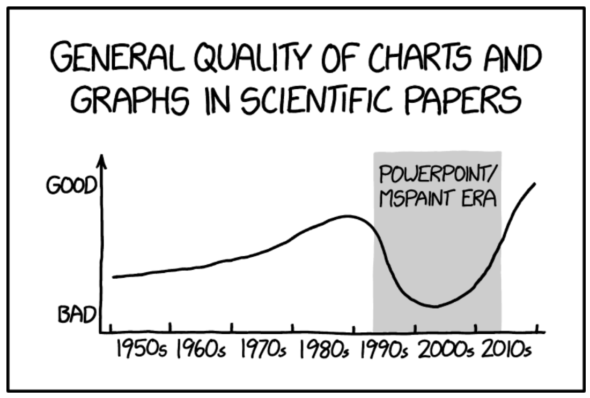{height=6in}

[Randall Munroe / xkcd · https://xkcd.com/1945](https://xkcd.com/1945/) · [CC BY-NC 2.5](https://creativecommons.org/licenses/by-nc/2.5/)

::: notes

A useful figure shows the observations and labels the scale before we ask the test for a result.

Comic: Scientific Paper Graph Quality. https://xkcd.com/1945/

Original course source: lectures__exp-2.pptx, slide 1. Artwork reproduced unchanged. Randall Munroe / xkcd; Creative Commons Attribution-NonCommercial 2.5.

Accessible description: A deliberately qualitative graph jokes about graph quality in scientific papers over time.

:::

## See the observations before the test {#describe-first}

- Plot individuals, groups, pairs, or trajectories in a way that shows the design.

- Label biological units and distinguish spread from uncertainty.

- Look for missing groups, recording errors, outliers, and patterns the model might miss.

::: notes

Do not remove genuine observations simply because they weaken a result. Investigate unusual observations, correct verified recording errors, and use a justified sensitivity analysis. A figure is a way to understand the data and model, not a decoration after testing.

:::

## SD, SE, and confidence intervals {#spread-uncertainty}

- SD describes variation among observations.

- SE describes sampling uncertainty in an estimate.

- A confidence interval shows a range from an interval-producing procedure; state what quantity it covers.

::: notes

For an independent mean, SE = SD/sqrt(n). Correlated repeated rows do not justify plugging their row count into that expression. Repeated use of a valid 95% confidence-interval procedure covers the fixed population parameter in 95% of repetitions. A prediction interval describes a new observation and is different from a mean interval.

:::

## The null and the p-value {#null-p}

- Write the null in biological language: equal means, zero slope, equal probabilities, or another stated target.

- The p-value measures how unusual the result is under the null and the analysis assumptions.

- A large p-value does not prove equality; a small p-value does not measure biological importance.

::: notes

A p-value is not the probability that the null is true. Specify a one-sided alternative only when that directional test was justified before inspecting the outcome. A two-sided test allows departures in either direction. Report the effect estimate and uncertainty alongside the test.

:::

## Test the contrast you care about {#matched-contrast}

- Compare the actual group difference or slope and its confidence interval.

- Overlapping group intervals are not a formal test of their difference.

- An omnibus result says some groups differ; a contrast says which comparison is supported.

::: notes

Choose planned contrasts based on the scientific question. Do not teach every contrast as requiring a significant omnibus gate. If many comparisons are explored, define the family and use a suitable adjustment. The Fisher LSD chapter distinguishes its gate from stronger all-pairs protection.

:::

## Assumptions point to the next move {#assumptions-first}

- Start with independence, matching, and how the observations were generated.

- Then check the model feature that matters: shape, spread, linearity, count variation, or dependence.

- First consider a suitable parametric model; then ask whether a nonparametric alternative answers the intended question.

::: notes

Normality tests are evidence, not an automatic switch. For a paired t test, inspect differences; for regression, inspect residuals rather than requiring normal predictors. Welch allows unequal variances while preserving a mean question. A rank alternative often changes the target. A transformation changes the scale on which a mean or model is interpreted.

:::

## Nonparametric does not mean no assumptions {#nonparametric-route}

- Ranks can answer questions about ordering or location when mean-model assumptions are unsuitable.

- Permutation schemes must preserve the randomization, pairing, or blocks.

- State the new null explicitly before replacing the original method.

::: notes

Signed-rank requires meaningful difference magnitudes and a symmetric difference distribution for its usual location interpretation; a sign test uses direction. Mann–Whitney and Kruskal–Wallis are not unrestricted tests of medians. Permutation inference needs exchangeability or the actual assignment mechanism. The course gives these alternatives the same full example sequence as parametric methods.

:::

## Association, prediction, and causation {#association-causation}

- Correlation describes association; regression estimates a specified response relationship.

- Including a covariate changes the adjusted question.

- A model alone does not turn observational data into a randomized experiment.

::: notes

Ask which predictors are plausible causes, consequences, or confounders before interpreting adjustment. Avoid extrapolating well beyond the observed predictor range. An interaction means an effect depends on another predictor. R² describes fitted variation, not causal validity or necessarily useful future prediction.

:::

## Power and multiple questions {#power-multiplicity}

- Power depends on effect size, independent replication, variability, design, and the chosen test.

- More tests create more opportunities for false positives; define the comparison family.

- Compare procedures by simulation across repeated datasets, not by two p-values from one dataset.

::: notes

Type I error is rejection of a true null; Type II error is failure to reject a specified false null. Power is one minus the latter probability for a specified alternative. Bonferroni controls the chance of any false rejection in a family; BH targets the expected false-discovery proportion under its conditions. Simulation repetitions are not biological replicates.

:::

## Make the analysis reproducible {#reproducible-analysis}

- Record set.seed(), the data-generating model, units, and package versions.

- Save the data before analysis and report results computed from that saved file.

- Check that the code, null, figure, and written interpretation describe the same analysis.

::: notes

Every module script in this course simulates its own dataset, saves data.csv, reads it back, and creates its plot and results. The course R Markdown reruns those scripts on each knit. An LLM can help explain code or output, but students still need to check the scientific target, data structure, options, and conclusions. The instructor guide distinguishes the known simulated population truth from realized estimates.

:::

## Pick a test: continuous measurement {#picker-independent-continuous}

| Predictor / design | Scientific target | Methods to consider |
|---|---|---|
| Reference or description | Is the population mean 12 units? | [One-sample t](#one_sample_t); [Signed-rank](#signed_rank); [Sign](#sign_test) |
| 2 groups | Do the environments differ in mean wing length? | [Welch t](#welch_t); [Pooled t](#pooled_t); [Rank-sum](#rank_sum); [Permutation](#permutation_independent) |
| 3+ groups | Are all four population means equal? | [ANOVA](#one_way_anova); [Welch ANOVA](#welch_anova); [Kruskal–Wallis](#kruskal_wallis) |
| 1 predictor | Predict horn length, or describe association between traits? | [Simple regression](#simple_lm); [Pearson](#pearson); [Spearman](#spearman) |
| Multiple predictors | Which effects or interactions explain mean growth? | [Multiple LM](#multiple_lm); [Factorial ANOVA](#factorial_anova); [ANCOVA](#ancova); [LMM](#linear_mixed) |

::: notes

Keep independent units and pairing/cluster IDs explicit; click a method to open its section.

**independent-continuous-reference.** Enzyme activity in 30 independent cultures; reference = 12 units. Is the population mean 12 units? 

**independent-continuous-two_groups.** Wing length in independent beetles from two rearing environments. Do the environments differ in mean wing length? 

**independent-continuous-many_groups.** Plant biomass in independent pots assigned to four nutrient levels. Are all four population means equal? 

**independent-continuous-one_predictor.** Body mass and horn length measured once in each independent beetle. Predict horn length, or describe association between traits? Regression assigns a response and a predictor. Correlation asks a symmetric association question.

**independent-continuous-many_predictors.** Growth measured with genotype, temperature, and initial size recorded. Which effects or interactions explain mean growth? Use the repeated/clustered route when multiple rows share an individual, cage, or population.

These are routes, not automatic substitutes. Check the method null and assumptions. A repeated-survival row needs an event-process definition; repeated follow-up checks are not independent event times.

:::

## Pick a test: binary / successes out of trials {#picker-independent-binary}

| Predictor / design | Scientific target | Methods to consider |
|---|---|---|
| Reference or description | Does transmission probability differ from 0.5? | [Exact binomial](#binomial); [1 proportion](#one_proportion) |
| 2 groups | Are infection probabilities equal? | [2 proportions](#two_proportions); [χ² independence](#chi_independence); [Fisher exact](#fisher_exact) |
| 3+ groups | Is germination probability the same in all treatments? | [χ² independence](#chi_independence); [Logistic](#logistic) |
| 1 predictor | Does survival probability change with divergence? | [Logistic](#logistic) |
| Multiple predictors | Does a predictor affect survival after accounting for the others? | [Logistic](#logistic); [Binary GLMM](#binary_glmm) |

::: notes

Keep independent units and pairing/cluster IDs explicit; click a method to open its section.

**independent-binary-reference.** A marker is transmitted to 38 of 60 independent offspring. Does transmission probability differ from 0.5? 

**independent-binary-two_groups.** Infection status is recorded for independent hosts in two habitats. Are infection probabilities equal? 

**independent-binary-many_groups.** Germination success or failure is recorded for seeds in four treatments. Is germination probability the same in all treatments? If seeds share a dish, the dish can create dependence; keep its ID.

**independent-binary-one_predictor.** Each hybrid survives or dies; parental genetic divergence is recorded. Does survival probability change with divergence? 

**independent-binary-many_predictors.** Survival status with divergence, cross direction, and rearing temperature. Does a predictor affect survival after accounting for the others? Known trial denominators matter. A percent without a trial count may be continuous-fraction data, which need a different model.

These are routes, not automatic substitutes. Check the method null and assumptions. A repeated-survival row needs an event-process definition; repeated follow-up checks are not independent event times.

:::

## Pick a test: count / events per exposure {#picker-independent-count}

| Predictor / design | Scientific target | Methods to consider |
|---|---|---|
| Reference or description | Does the mutation rate differ from a reference rate? | [Exact Poisson](#poisson_exact) |
| 2 groups | Are mean colonies per mL equal? | [Poisson GLM](#poisson_glm); [Negative binomial](#negbin_glm); [Exact Poisson](#poisson_exact) |
| 3+ groups | Do conditional mean parasite counts differ among treatments? | [Poisson GLM](#poisson_glm); [Negative binomial](#negbin_glm); [Quasi-Poisson](#quasipoisson) |
| 1 predictor | Does the expected visit rate change with flower number? | [Poisson GLM](#poisson_glm); [Negative binomial](#negbin_glm) |
| Multiple predictors | Which predictors alter the conditional mean mutation rate? | [Poisson GLM](#poisson_glm); [Negative binomial](#negbin_glm); [Count GLMM](#count_glmm) |

::: notes

Keep independent units and pairing/cluster IDs explicit; click a method to open its section.

**independent-count-reference.** Mutations counted across a known number of sequenced base-generations. Does the mutation rate differ from a reference rate? 

**independent-count-two_groups.** Colony counts in two media; plated volume recorded for each replicate. Are mean colonies per mL equal? 

**independent-count-many_groups.** Parasite counts per host in four independent treatment groups. Do conditional mean parasite counts differ among treatments? 

**independent-count-one_predictor.** Pollinator visits per plant versus flower number; observation minutes vary. Does the expected visit rate change with flower number? Include observation time as exposure when the mean count is proportional to time.

**independent-count-many_predictors.** Mutation counts with genotype, stress, and sequenced exposure recorded. Which predictors alter the conditional mean mutation rate? If libraries, individuals, or populations contribute repeated rows, retain that cluster structure.

These are routes, not automatic substitutes. Check the method null and assumptions. A repeated-survival row needs an event-process definition; repeated follow-up checks are not independent event times.

:::

## Pick a test: unordered categories (3+) {#picker-independent-nominal}

| Predictor / design | Scientific target | Methods to consider |
|---|---|---|
| Reference or description | Do phenotype probabilities match the expected ratio? | [χ² goodness-of-fit](#chi_gof) |
| 2 groups | Does nest-material distribution differ by habitat? | [χ² independence](#chi_independence); [Fisher exact](#fisher_exact) |
| 3+ groups | Are site and feeding strategy independent? | [χ² independence](#chi_independence); [Fisher exact](#fisher_exact) |
| 1 predictor | Does salinity change the probabilities of the morphs? | [Multinomial](#multinomial) |
| Multiple predictors | Which predictors change guild probabilities? | [Multinomial](#multinomial) |

::: notes

Keep independent units and pairing/cluster IDs explicit; click a method to open its section.

**independent-nominal-reference.** Offspring fall into three phenotypes predicted in a 1:2:1 ratio. Do phenotype probabilities match the expected ratio? 

**independent-nominal-two_groups.** Independent birds in two habitats choose among three nest materials. Does nest-material distribution differ by habitat? 

**independent-nominal-many_groups.** Independent fish from four sites use three feeding strategies. Are site and feeding strategy independent? 

**independent-nominal-one_predictor.** Three unordered bacterial colony morphs observed along a salinity gradient. Does salinity change the probabilities of the morphs? 

**independent-nominal-many_predictors.** Pollinator guild with habitat, flower color, and floral size recorded. Which predictors change guild probabilities? Guild is unordered; assigning codes 1, 2, 3 does not make it a continuous response.

These are routes, not automatic substitutes. Check the method null and assumptions. A repeated-survival row needs an event-process definition; repeated follow-up checks are not independent event times.

:::

## Pick a test: ordered categories {#picker-independent-ordinal}

| Predictor / design | Scientific target | Methods to consider |
|---|---|---|
| Reference or description | Among scores not at the threshold, are higher and lower equally likely? | [Sign](#sign_test); [Signed-rank](#signed_rank) |
| 2 groups | Does one group tend to have higher damage scores? | [Rank-sum](#rank_sum); [Ordinal model](#ordinal_logistic) |
| 3+ groups | Do treatment groups differ in their rank/category distributions? | [Kruskal–Wallis](#kruskal_wallis); [Ordinal model](#ordinal_logistic) |
| 1 predictor | Model category probabilities, or ask about monotone association? | [Ordinal model](#ordinal_logistic); [Spearman](#spearman) |
| Multiple predictors | Which predictors shift scores after adjustment? | [Ordinal model](#ordinal_logistic); [CLMM](#ordinal_mixed) |

::: notes

Keep independent units and pairing/cluster IDs explicit; click a method to open its section.

**independent-ordinal-reference.** Lesion severity: none, mild, moderate, severe; compare with “moderate.” Among scores not at the threshold, are higher and lower equally likely? A sign test asks this specific threshold question. Use signed-rank only if numerical spacings are defensible, not merely category labels.

**independent-ordinal-two_groups.** Independent leaves receive ordered damage scores in two treatments. Does one group tend to have higher damage scores? 

**independent-ordinal-many_groups.** Ordered disease scores recorded in independent plants under four treatments. Do treatment groups differ in their rank/category distributions? 

**independent-ordinal-one_predictor.** Ordered courtship intensity recorded along a hormone gradient. Model category probabilities, or ask about monotone association? 

**independent-ordinal-many_predictors.** Ordered disease scores with genotype, temperature, and age recorded. Which predictors shift scores after adjustment? Use a cumulative-link mixed model when observations share an individual or cluster.

These are routes, not automatic substitutes. Check the method null and assumptions. A repeated-survival row needs an event-process definition; repeated follow-up checks are not independent event times.

:::

## Pick a test: time to event + censoring {#picker-independent-survival}

| Predictor / design | Scientific target | Methods to consider |
|---|---|---|
| Reference or description | What fraction remain alive over time? | [Kaplan–Meier](#kaplan_meier) |
| 2 groups | Do the event-time distributions differ between cohorts? | [Log-rank](#log_rank) |
| 3+ groups | Do any treatment survival curves differ? | [Log-rank](#log_rank) |
| 1 predictor | Does seed mass alter event hazard? | [Cox PH](#cox_ph); [AFT](#parametric_survival) |
| Multiple predictors | What are the adjusted hazard or time effects? | [Cox PH](#cox_ph); [AFT](#parametric_survival); [Frailty](#shared_frailty) |

::: notes

Keep independent units and pairing/cluster IDs explicit; click a method to open its section.

**independent-survival-reference.** Days to seedling death; some plants are still alive when follow-up ends. What fraction remain alive over time? Estimation is useful here; there is no required hypothesis test.

**independent-survival-two_groups.** Time to pupation in two independent cohorts; some have not pupated yet. Do the event-time distributions differ between cohorts? 

**independent-survival-many_groups.** Time to infection under four treatments with right-censored individuals. Do any treatment survival curves differ? 

**independent-survival-one_predictor.** Time to germination versus seed mass, with ungerminated seeds censored. Does seed mass alter event hazard? Cox targets a hazard ratio; an AFT model targets a time ratio.

**independent-survival-many_predictors.** Time to death with dose, sex, and population recorded. What are the adjusted hazard or time effects? Use a dependence-aware model when individuals share clusters; do not treat censored times as observed deaths.

These are routes, not automatic substitutes. Check the method null and assumptions. A repeated-survival row needs an event-process definition; repeated follow-up checks are not independent event times.

:::

## Paired/repeated: continuous measurement {#picker-repeated-continuous}

| Predictor / design | Scientific target | Methods to consider |
|---|---|---|
| Pairs / 2 measurements | Is the mean within-plant change zero? | [Paired t](#paired_t); [Signed-rank](#signed_rank); [Sign](#sign_test); [Paired permutation](#permutation_paired) |
| 3+ repeated conditions | Do within-animal means differ across temperatures? | [Repeated ANOVA](#repeated_anova); [LMM](#linear_mixed); [Friedman](#friedman) |
| Within + between predictors | Do growth trajectories differ while accounting for repeated larvae and families? | [LMM](#linear_mixed) |

::: notes

Keep independent units and pairing/cluster IDs explicit; click a method to open its section.

**repeated-continuous-pairs.** Photosynthesis measured before and after stress in the same plants. Is the mean within-plant change zero? 

**repeated-continuous-repeated.** Oxygen consumption measured in every animal at four temperatures. Do within-animal means differ across temperatures? Nonparametric rank coverage follows the repeated-model assumptions; a change of method can change the null.

**repeated-continuous-mixed.** Growth tracked through time in treated and control larvae from several families. Do growth trajectories differ while accounting for repeated larvae and families? 

These are routes, not automatic substitutes. Check the method null and assumptions. A repeated-survival row needs an event-process definition; repeated follow-up checks are not independent event times.

:::

## Paired/repeated: binary outcome {#picker-repeated-binary}

| Predictor / design | Scientific target | Methods to consider |
|---|---|---|
| Pairs / 2 measurements | Are positive-to-negative and negative-to-positive changes equally likely? | [McNemar](#mcnemar) |
| 3+ repeated conditions | Is response probability equal across conditions? | [Cochran Q](#cochran_q); [Binary GLMM](#binary_glmm); [Binary GEE](#binary_gee) |
| Within + between predictors | How does disease probability change with time and treatment? | [Binary GLMM](#binary_glmm); [Binary GEE](#binary_gee) |

::: notes

Keep independent units and pairing/cluster IDs explicit; click a method to open its section.

**repeated-binary-pairs.** The same hosts tested for infection before and after treatment. Are positive-to-negative and negative-to-positive changes equally likely? 

**repeated-binary-repeated.** The same flies scored as courting or not under three cue conditions. Is response probability equal across conditions? 

**repeated-binary-mixed.** Weekly disease status in individuals assigned to treatment groups. How does disease probability change with time and treatment? GLMM gives effects conditional on random effects; GEE describes population-average effects.

These are routes, not automatic substitutes. Check the method null and assumptions. A repeated-survival row needs an event-process definition; repeated follow-up checks are not independent event times.

:::

## Paired/repeated: ordered categories {#picker-repeated-ordinal}

| Predictor / design | Scientific target | Methods to consider |
|---|---|---|
| Pairs / 2 measurements | Are upward and downward changes equally likely? | [Sign](#sign_test); [Signed-rank](#signed_rank) |
| 3+ repeated conditions | Do conditions consistently rank differently within plants? | [Friedman](#friedman); [CLMM](#ordinal_mixed) |
| Within + between predictors | Do predictors shift category probabilities within the repeated design? | [CLMM](#ordinal_mixed) |

::: notes

Keep independent units and pairing/cluster IDs explicit; click a method to open its section.

**repeated-ordinal-pairs.** The same fish receive ordered stress scores before and after an intervention. Are upward and downward changes equally likely? Signed-rank additionally needs meaningful difference sizes and a symmetric difference distribution.

**repeated-ordinal-repeated.** The same plants receive ordered damage scores under four assay conditions. Do conditions consistently rank differently within plants? 

**repeated-ordinal-mixed.** Weekly disease severity categories in treated and control plants from several lines. Do predictors shift category probabilities within the repeated design? 

These are routes, not automatic substitutes. Check the method null and assumptions. A repeated-survival row needs an event-process definition; repeated follow-up checks are not independent event times.

:::

## Paired/repeated: count / rate {#picker-repeated-count}

| Predictor / design | Scientific target | Methods to consider |
|---|---|---|
| Pairs / 2 measurements | Does the within-host expected count or rate change? | [Count GLMM](#count_glmm); [Count GEE](#count_gee); [Paired permutation](#permutation_paired) |
| 3+ repeated conditions | Do expected visit rates change across days? | [Count GLMM](#count_glmm); [Count GEE](#count_gee) |
| Within + between predictors | How do treatment and time affect mutation rates across lines? | [Count GLMM](#count_glmm); [Count GEE](#count_gee) |

::: notes

Keep independent units and pairing/cluster IDs explicit; click a method to open its section.

**repeated-count-pairs.** Parasite counts in the same hosts before and after treatment. Does the within-host expected count or rate change? Record exposure if observation effort varies; arbitrary count ranks answer a different question.

**repeated-count-repeated.** Visit counts from the same plants on four days; observation minutes recorded. Do expected visit rates change across days? 

**repeated-count-mixed.** Repeated mutation counts from lines assigned to stress treatments. How do treatment and time affect mutation rates across lines? Retain line IDs and exposure; repeated sequencing samples are not new independent lines.

These are routes, not automatic substitutes. Check the method null and assumptions. A repeated-survival row needs an event-process definition; repeated follow-up checks are not independent event times.

:::

## Paired/repeated: time to event + censoring {#picker-repeated-survival}

| Predictor / design | Scientific target | Methods to consider |
|---|---|---|
| Pairs / 2 measurements | Do survival functions differ within the matched strata? | [Stratified log-rank](#stratified_logrank); [Cox PH](#cox_ph) |
| 3+ repeated conditions | Is the scientific target first-event survival or recurrent events? | Define the event process; then [Cox framework](#cox_ph) / [frailty](#shared_frailty) |
| Within + between predictors | How do predictors alter risk while accounting for enclosure dependence? | [Frailty](#shared_frailty); [Cox PH](#cox_ph) |

::: notes

Keep independent units and pairing/cluster IDs explicit; click a method to open its section.

**repeated-survival-pairs.** Related genotypes matched in blocks, then followed to death under two treatments. Do survival functions differ within the matched strata? Matching defines strata. Two follow-up visits do not create two independent event times.

**repeated-survival-repeated.** Animals checked repeatedly; some have one event, others can relapse. Is the scientific target first-event survival or recurrent events? Define the event process before choosing a test. There is no generic “repeated survival” test.

**repeated-survival-mixed.** Time to infection in animals sharing enclosures and treatment predictors. How do predictors alter risk while accounting for enclosure dependence? Frailty models cluster heterogeneity; cluster-robust uncertainty and stratification make different assumptions.

These are routes, not automatic substitutes. Check the method null and assumptions. A repeated-survival row needs an event-process definition; repeated follow-up checks are not independent event times.

:::


## Boyfriend {#xkcd-539}

{height=6in}

[Randall Munroe / xkcd · https://xkcd.com/539](https://xkcd.com/539/) · [CC BY-NC 2.5](https://creativecommons.org/licenses/by-nc/2.5/)

::: notes

An unusual-looking observation and a statistically significant test result are different claims; state the comparison first.

Comic: Boyfriend. https://xkcd.com/539/

Original course source: lectures__exp-1.pptx, slide 39. Artwork reproduced unchanged. Randall Munroe / xkcd; Creative Commons Attribution-NonCommercial 2.5.

Accessible description: A box plot appears in a humorous argument over the phrase statistically significant other.

:::


## One-sample t: the data {#one_sample_t}

::: columns

::: {.column width="62%"}

Cell biologists measure oxygen consumption in independently cultured cell lines.

- One continuous response

- One independent sample

- A fixed reference mean

:::

::: {.column width="38%"}

**Other data like these**

- Enzyme activity versus a reference

- Leaf nitrogen versus a target

- Offspring size versus a historical mean

:::

:::

::: notes

One-sample t test

One measurement from each of 24 independent cultures; compare with a prespecified reference of 10 nmol/min.

culture: Independent culture identifier (none)

oxygen: Oxygen consumption (nmol/min)

:::


## One-sample t: simulate and save {#one_sample_t-simulate}

::: columns

::: {.column width="62%"}

```r
set.seed(1101)
d <- data.frame(culture = 1:24,
                oxygen = rnorm(24, mean = 10.8, sd = 1.5))
write.csv(d, file.path(output_dir, "data.csv"), row.names = FALSE)
```


:::

::: {.column width="38%"}

**First saved row**

```
culture: 1
oxygen: 9.364
```


:::

:::

::: notes

Seed: 1101

Generating model: 24 independent oxygen-consumption values are drawn from Normal(mean 10.8, SD 1.5). Each row is one culture.

Population truth: The population mean is 10.8 nmol/min, so the reference-mean null of 10 is false; the true mean difference is +0.8.

The script writes data.csv before reading it for analysis. output_dir or out_dir is the folder supplied to the standalone script.

Original saved-data preview:

```
 culture    oxygen
       1  9.363654
       2 10.462996
       3  9.493642
       4  6.730010
```


:::


## One-sample t: see the data {#one_sample_t-plot}

::: columns

::: {.column width="62%"}

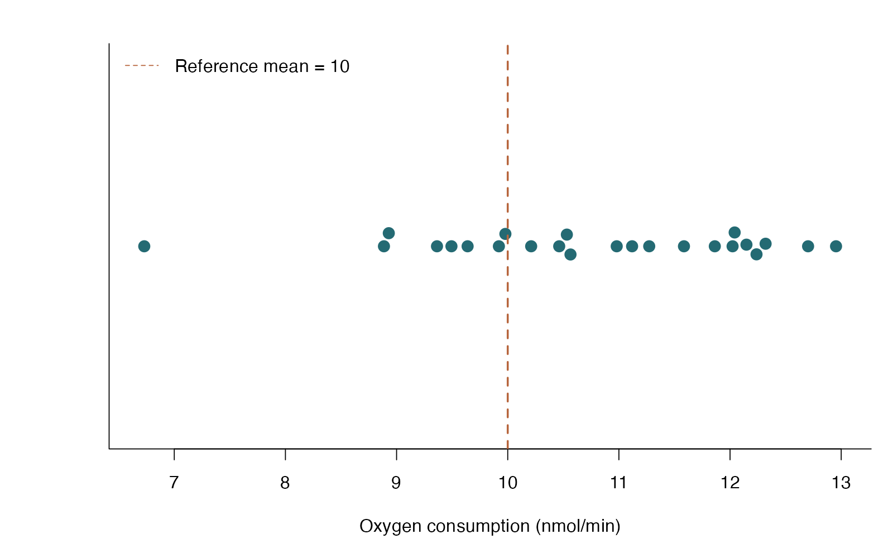

:::

::: {.column width="38%"}

**beeswarm arguments**

**method** — How observations are spread sideways

**pch / cex** — Point symbol and size

**horizontal** — Put the measured response on the x-axis

**abline(v=...)** — Draw the reference value

:::

:::

::: notes

This figure is generated from the saved CSV by modules/one_sample_t/analysis.R. The reference must express the biological question; the test is about a population mean.

:::


## One-sample t: plot code {#one_sample_t-plot-code}

::: columns

::: {.column width="62%"}

```r
beeswarm(d$oxygen, horizontal = TRUE, method = "swarm",
         pch = 21, bg = "#246A73", col = "white", cex = 1.6,
         xlab = "Oxygen consumption (nmol/min)", ylab = "", yaxt = "n")
abline(v = 10, lty = 2, col = "#B7663E", lwd = 2)
legend("topleft", "Reference mean = 10", lty = 2,
       col = "#B7663E", bty = "n")
```


:::

::: {.column width="38%"}

**Arguments to change**

**method** — How observations are spread sideways

**pch / cex** — Point symbol and size

**horizontal** — Put the measured response on the x-axis

**abline(v=...)** — Draw the reference value

:::

:::

::: notes

This is an exact excerpt from analysis.R. Any preparation referenced by the excerpt appears in the complete companion script. The script opens a ragg PNG device before these lines and closes it afterward.

:::


## One-sample t: question and null {#one_sample_t-question}

::: columns

::: {.column width="62%"}

**Scientific question**

Is mean oxygen consumption different from 10 nmol/min?

**Null / estimation target**

The population mean is 10 nmol/min.

:::

::: {.column width="38%"}

**Relevant options**

- mu = 10 sets the scientific reference

- alternative = "two.sided" allows either direction

- conf.level = .95 sets interval coverage

:::

:::

::: notes

Ask whether rejecting this null, or estimating this target, answers the biological question. The reference must express the biological question; the test is about a population mean.

:::


## One-sample t: assumptions {#one_sample_t-assumptions}

::: columns

::: {.column width="62%"}

**What matters here**

- Independent cultures

- No extreme outliers; normality matters more at small n

- Reference value treated as known

:::

::: {.column width="38%"}

**Parametric responses**

- Investigate unusual values; retain genuine biology

- Model log values only if a ratio/geometric mean answers the question

**Nonparametric responses**

- Sign test targets the median, not the mean

- A bootstrap mean interval retains the mean target

:::

:::

::: notes

Begin with the design. A model change should address a specific issue and preserve the scientific target where possible. A rank or permutation alternative has its own assumptions and may change the null; do not choose it solely from a normality-test p-value.

:::


## One-sample t: run and read {#one_sample_t-analysis}

::: columns

::: {.column width="62%"}

```r
fit <- t.test(d$oxygen, mu = 10,
              alternative = "two.sided", conf.level = .95)
```


:::

::: {.column width="38%"}

**Generated results**

- Mean = 10.75 nmol/min; n = 24

- 95% CI for mean: 10.12 to 11.37

- t = 2.48; df = 23; p = 0.02107

:::

:::

::: notes

Full executed model/test output:

```

	One Sample t-test

data:  d$oxygen
t = 2.4762, df = 23, p-value = 0.02107
alternative hypothesis: true mean is not equal to 10
95 percent confidence interval:
 10.12316 11.37336
sample estimates:
mean of x 
 10.74826 

```


:::


## One-sample t: interpret {#one_sample_t-interpret}

Mean oxygen consumption was 10.75 nmol/min (95% CI 10.12 to 11.37); against the reference mean of 10, t(23) = 2.48, p = 0.02107. This tests a population mean, not whether every culture exceeds 10.

**Discuss:** If the reference were 11 rather than 10, what would change in the hypothesis and R call?

::: notes

Teaching point: The reference must express the biological question; the test is about a population mean.

Instructor comparison with the simulated population: The population mean is 10.8 nmol/min, so the reference-mean null of 10 is false; the true mean difference is +0.8.

The reported estimate and p-value are calculated from this realized dataset; they need not exactly match the known population effect.

:::


## Paired t: the data {#paired_t}

::: columns

::: {.column width="62%"}

Plant physiologists measure photosynthesis in the same leaves before and after heat stress.

- Continuous response measured twice

- Independent pairs; dependent observations within pairs

- Analyze one difference per plant

:::

::: {.column width="38%"}

**Other data like these**

- Blood pressure before/after treatment

- Bilateral organ measurements

- Matched-site productivity

:::

:::

::: notes

Paired t test

Twenty independent plants contribute one before/after pair each.

plant: Independent plant and pair identifier (none)

before: Photosynthesis before heat (micromol CO2 / m2 / s)

after: Photosynthesis after heat (micromol CO2 / m2 / s)

:::


## Paired t: simulate and save {#paired_t-simulate}

::: columns

::: {.column width="62%"}

```r
set.seed(1103)
before <- rnorm(20, 18, 2.2)
after <- before + rnorm(20, -1.3, 1.7)
d <- data.frame(plant = 1:20, before = before, after = after)
write.csv(d, file.path(output_dir, "data.csv"), row.names = FALSE)
```


:::

::: {.column width="38%"}

**First saved row**

```
plant: 1
before: 18.13
after: 16.59
```


:::

:::

::: notes

Seed: 1103

Generating model: 20 independent baseline values come from Normal(18, 2.2 SD). Each after value is its own baseline plus an independent Normal(-1.3, 1.7 SD) change.

Population truth: The mean after-minus-before difference is -1.3 photosynthesis units, even if this sample provides limited evidence against zero.

The script writes data.csv before reading it for analysis. output_dir or out_dir is the folder supplied to the standalone script.

Original saved-data preview:

```
 plant   before    after
     1 18.12874 16.59089
     2 19.70048 17.18796
     3 17.09360 15.92467
     4 19.16011 18.17996
```


:::


## Paired t: see the data {#paired_t-plot}

::: columns

::: {.column width="62%"}

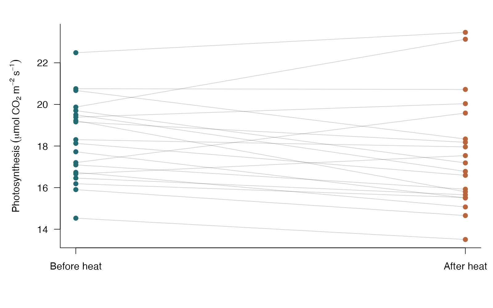

:::

::: {.column width="38%"}

**base R arguments**

**matplot / type="l"** — Connect each plant’s paired measurements

**lty / col** — Keep paired lines quiet

**points** — Add raw observations

**axis** — Label the two measurement occasions

:::

:::

::: notes

This figure is generated from the saved CSV by modules/paired_t/analysis.R. A large p-value does not make the simulated nonzero effect disappear; paired differences define the target.

:::


## Paired t: plot code {#paired_t-plot-code}

::: columns

::: {.column width="62%"}

```r
matplot(1:2, t(as.matrix(d[c("before", "after")])), type = "l",
        lty = 1, col = "#00000033", xaxt = "n", xlab = "",
        ylab = expression(Photosynthesis~(mu*mol~CO[2]~m^{-2}~s^{-1})))
axis(1, 1:2, c("Before heat", "After heat"))
points(rep(1, nrow(d)), d$before, pch = 19, col = "#246A73")
points(rep(2, nrow(d)), d$after, pch = 19, col = "#B7663E")
```


:::

::: {.column width="38%"}

**Arguments to change**

**matplot / type="l"** — Connect each plant’s paired measurements

**lty / col** — Keep paired lines quiet

**points** — Add raw observations

**axis** — Label the two measurement occasions

:::

:::

::: notes

This is an exact excerpt from analysis.R. Any preparation referenced by the excerpt appears in the complete companion script. The script opens a ragg PNG device before these lines and closes it afterward.

:::


## Paired t: question and null {#paired_t-question}

::: columns

::: {.column width="62%"}

**Scientific question**

Is the mean within-plant change in photosynthesis zero?

**Null / estimation target**

The population mean of after minus before differences is zero.

:::

::: {.column width="38%"}

**Relevant options**

- paired = TRUE preserves matching

- Keep the same pair order in both vectors

- First minus second determines the change sign

:::

:::

::: notes

Ask whether rejecting this null, or estimating this target, answers the biological question. A large p-value does not make the simulated nonzero effect disappear; paired differences define the target.

:::


## Paired t: assumptions {#paired_t-assumptions}

::: columns

::: {.column width="62%"}

**What matters here**

- Pairs are independent

- Differences are roughly normal at small n

- Outlying differences warrant examination

:::

::: {.column width="38%"}

**Parametric responses**

- Model paired differences directly

- For multiple times use repeated-measures or mixed models

**Nonparametric responses**

- Signed-rank requires symmetric differences

- Sign test needs no symmetry but targets direction/median

:::

:::

::: notes

Begin with the design. A model change should address a specific issue and preserve the scientific target where possible. A rank or permutation alternative has its own assumptions and may change the null; do not choose it solely from a normality-test p-value.

:::


## Paired t: run and read {#paired_t-analysis}

::: columns

::: {.column width="62%"}

```r
change <- d$after - d$before
fit <- t.test(d$after, d$before, paired = TRUE,
              alternative = "two.sided")
```


:::

::: {.column width="38%"}

**Generated results**

- Mean change (after - before) = -0.73

- 95% CI for mean change: -1.52 to 0.07

- Paired t = -1.91; df = 19; p = 0.07128

:::

:::

::: notes

Full executed model/test output:

```

	Paired t-test

data:  d$after and d$before
t = -1.9105, df = 19, p-value = 0.07128
alternative hypothesis: true mean difference is not equal to 0
95 percent confidence interval:
 -1.52238792  0.06942308
sample estimates:
mean difference 
     -0.7264824 

```


:::


## Paired t: interpret {#paired_t-interpret}

Photosynthesis changed by a mean of -0.73 units after heat stress (95% CI -1.52 to 0.07); paired t(19) = -1.91, p = 0.07128. Pairing makes the biological unit the plant and the analyzed response its change.

**Discuss:** Would treating the before and after vectors as independent answer the design correctly?

::: notes

Teaching point: A large p-value does not make the simulated nonzero effect disappear; paired differences define the target.

Instructor comparison with the simulated population: The mean after-minus-before difference is -1.3 photosynthesis units, even if this sample provides limited evidence against zero.

The reported estimate and p-value are calculated from this realized dataset; they need not exactly match the known population effect.

:::


## Sign test: the data {#sign_test}

::: columns

::: {.column width="62%"}

Behavioral biologists record the change in refuge-use time after a predator cue.

- One continuous response or paired differences

- A reference location, often zero

- Uses signs and discards magnitudes

:::

::: {.column width="38%"}

**Other data like these**

- Median lifespan versus a reference

- Direction of paired expression changes

- Before/after foraging time

:::

:::

::: notes

Sign test

Each independent fish is measured twice; the changes are skewed.

fish: Independent fish and pair identifier (none)

change_seconds: After-minus-before refuge-use time (seconds)

:::


## Sign test: simulate and save {#sign_test-simulate}

::: columns

::: {.column width="62%"}

```r
set.seed(1104)
change <- rgamma(30, shape = 1.4, scale = 5) - 3
d <- data.frame(fish = 1:30, change_seconds = round(change, 1))
write.csv(d, file.path(output_dir, "data.csv"), row.names = FALSE)
```


:::

::: {.column width="38%"}

**First saved row**

```
fish: 1
change_seconds: 1.3
```


:::

:::

::: notes

Seed: 1104

Generating model: 30 independent changes are Gamma(shape 1.4, scale 5) minus 3 seconds, rounded to 0.1 seconds. Exact zeros, if present, are excluded from the sign comparison.

Population truth: Positive changes are more likely than negative changes. The unrounded mean is 4 seconds, but the sign test is about direction rather than that mean.

The script writes data.csv before reading it for analysis. output_dir or out_dir is the folder supplied to the standalone script.

Original saved-data preview:

```
 fish change_seconds
    1            1.3
    2           -0.6
    3           10.0
    4            8.4
```


:::


## Sign test: see the data {#sign_test-plot}

::: columns

::: {.column width="62%"}

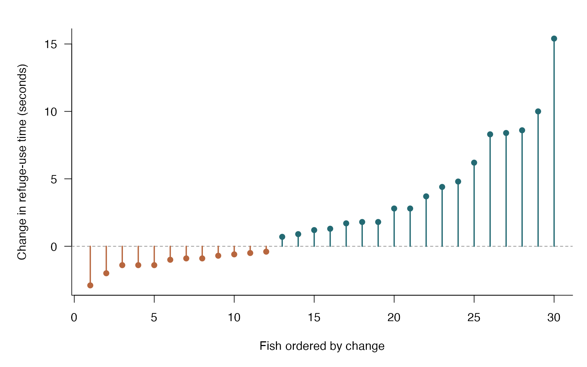

:::

::: {.column width="38%"}

**base R arguments**

**reorder** — Order fish by their change

**segments** — Draw each change from zero

**abline(h=0)** — Mark the null reference

**col** — Encode decrease versus increase

:::

:::

::: notes

This figure is generated from the saved CSV by modules/sign_test/analysis.R. A sign test handles asymmetric differences by asking about the probability of a positive change.

:::


## Sign test: plot code {#sign_test-plot-code}

::: columns

::: {.column width="62%"}

```r
values <- sort(d$change_seconds)
cols <- ifelse(values > 0, "#246A73", "#B7663E")
plot(seq_along(values), values, type = "n", xlab = "Fish ordered by change",
     ylab = "Change in refuge-use time (seconds)")
abline(h = 0, col = "gray55", lty = 2)
segments(seq_along(values), 0, seq_along(values), values, col = cols, lwd = 2)
points(seq_along(values), values, pch = 19, col = cols)
```


:::

::: {.column width="38%"}

**Arguments to change**

**reorder** — Order fish by their change

**segments** — Draw each change from zero

**abline(h=0)** — Mark the null reference

**col** — Encode decrease versus increase

:::

:::

::: notes

This is an exact excerpt from analysis.R. Any preparation referenced by the excerpt appears in the complete companion script. The script opens a ragg PNG device before these lines and closes it afterward.

:::


## Sign test: question and null {#sign_test-question}

::: columns

::: {.column width="62%"}

**Scientific question**

Is an increase just as likely as a decrease in refuge-use time?

**Null / estimation target**

Among nonzero changes, positive and negative changes are equally likely; for continuous differences, the median is zero.

:::

::: {.column width="38%"}

**Relevant options**

- Subtract the reference first

- Drop and report exact zero differences

- binom.test tests the number of positive changes

:::

:::

::: notes

Ask whether rejecting this null, or estimating this target, answers the biological question. A sign test handles asymmetric differences by asking about the probability of a positive change.

:::


## Sign test: assumptions {#sign_test-assumptions}

::: columns

::: {.column width="62%"}

**What matters here**

- Independent fish

- Pairing is retained in differences

- Median interpretation assumes a continuous distribution

:::

::: {.column width="38%"}

**Parametric responses**

- A paired t test answers a mean-change question

- Model skew explicitly if the mean is the target

**Nonparametric responses**

- Sign test allows asymmetric differences

- Signed-rank adds magnitude information but needs symmetry

:::

:::

::: notes

Begin with the design. A model change should address a specific issue and preserve the scientific target where possible. A rank or permutation alternative has its own assumptions and may change the null; do not choose it solely from a normality-test p-value.

:::


## Sign test: run and read {#sign_test-analysis}

::: columns

::: {.column width="62%"}

```r
nonzero <- d$change_seconds[d$change_seconds != 0]
positive <- sum(nonzero > 0)
fit <- binom.test(positive, length(nonzero), p = .5,
                 alternative = "two.sided")
```


:::

::: {.column width="38%"}

**Generated results**

- Positive changes: 18 of 30 nonzero differences

- Zero changes excluded: 0

- Median observed change = 1.25 seconds

- 95% CI for positive-change probability: 0.41 to 0.77

- Exact two-sided p = 0.3616

:::

:::

::: notes

Full executed model/test output:

```

	Exact binomial test

data:  positive and length(nonzero)
number of successes = 18, number of trials = 30, p-value = 0.3616
alternative hypothesis: true probability of success is not equal to 0.5
95 percent confidence interval:
 0.4060349 0.7734424
sample estimates:
probability of success 
                   0.6 

```


:::


## Sign test: interpret {#sign_test-interpret}

18 of 30 nonzero changes were positive (exact sign-test p = 0.3616; 95% CI for the positive-change probability 0.41 to 0.77). The test asks about direction, not mean change; 0 exact zero differences were excluded.

**Discuss:** If a few fish change by a very large amount, does that affect the sign test statistic?

::: notes

Teaching point: A sign test handles asymmetric differences by asking about the probability of a positive change.

Instructor comparison with the simulated population: Positive changes are more likely than negative changes. The unrounded mean is 4 seconds, but the sign test is about direction rather than that mean.

The reported estimate and p-value are calculated from this realized dataset; they need not exactly match the known population effect.

:::


## Signed-rank: the data {#signed_rank}

::: columns

::: {.column width="62%"}

Microbiologists compare log bacterial density before and after a treatment in matched cultures.

- One sample versus a location or paired differences

- Continuous differences with meaningful magnitudes

- Symmetric differences for a location interpretation

:::

::: {.column width="38%"}

**Other data like these**

- Paired log gene expression

- Matched-site changes in biomass

- Before/after physiological scores

:::

:::

::: notes

Wilcoxon signed-rank test

Each independent culture contributes one difference; occasional large differences make ranks useful.

culture: Independent culture and pair identifier (none)

before: Log10 bacterial density before treatment (log10 CFU/mL)

after: Log10 bacterial density after treatment (log10 CFU/mL)

:::


## Signed-rank: simulate and save {#signed_rank-simulate}

::: columns

::: {.column width="62%"}

```r
set.seed(1105)
before <- rnorm(28, 6, .4)
after <- before + .28 + .28 * rt(28, df = 4)
d <- data.frame(culture = 1:28, before = before, after = after)
write.csv(d, file.path(output_dir, "data.csv"), row.names = FALSE)
```


:::

::: {.column width="38%"}

**First saved row**

```
culture: 1
before: 6.786
after: 7.185
```


:::

:::

::: notes

Seed: 1105

Generating model: 28 baselines come from Normal(6, 0.4 SD). Paired changes equal 0.28 + 0.28 times a Student t variable with 4 degrees of freedom; after equals before plus change.

Population truth: The symmetric difference distribution is centered at +0.28 log10 units; its zero-center null is false.

The script writes data.csv before reading it for analysis. output_dir or out_dir is the folder supplied to the standalone script.

Original saved-data preview:

```
 culture   before    after
       1 6.785938 7.184926
       2 6.078931 5.861092
       3 5.478518 5.659185
       4 6.187042 6.519684
```


:::


## Signed-rank: see the data {#signed_rank-plot}

::: columns

::: {.column width="62%"}

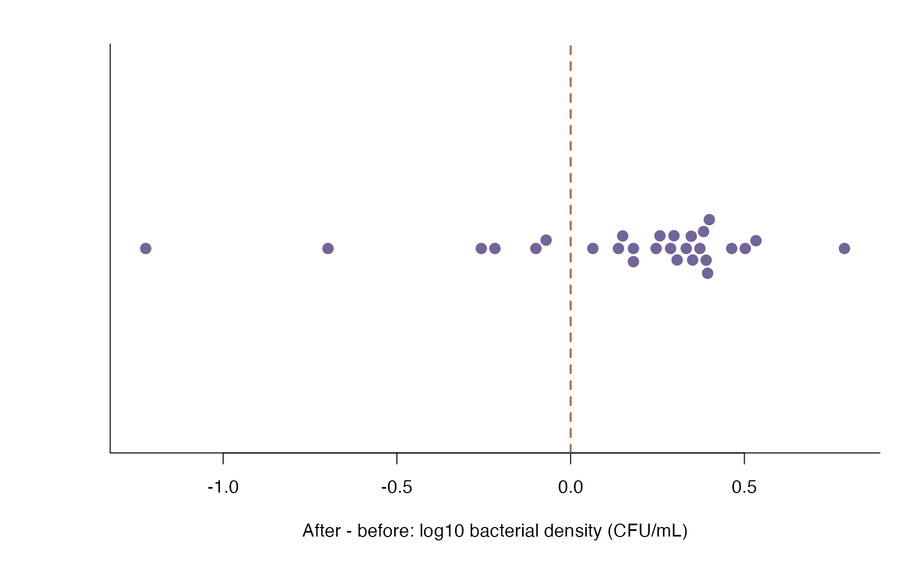

:::

::: {.column width="38%"}

**beeswarm arguments**

**horizontal** — Display changes on one horizontal scale

**pch** — Choose a filled point symbol

**xlab** — State both transformation and units

**abline(v=0)** — Mark no within-culture change

:::

:::

::: notes

This figure is generated from the saved CSV by modules/signed_rank/analysis.R. Signed-rank is useful for symmetric heavy-tailed differences; sign is the simpler alternative when symmetry is doubtful.

:::


## Signed-rank: plot code {#signed_rank-plot-code}

::: columns

::: {.column width="62%"}

```r
beeswarm(change, horizontal = TRUE, pch = 21, bg = "#73649A",
         col = "white", cex = 1.5, yaxt = "n", ylab = "",
         xlab = "After - before: log10 bacterial density (CFU/mL)")
abline(v = 0, lty = 2, col = "#B7663E", lwd = 2)
```


:::

::: {.column width="38%"}

**Arguments to change**

**horizontal** — Display changes on one horizontal scale

**pch** — Choose a filled point symbol

**xlab** — State both transformation and units

**abline(v=0)** — Mark no within-culture change

:::

:::

::: notes

This is an exact excerpt from analysis.R. Any preparation referenced by the excerpt appears in the complete companion script. The script opens a ragg PNG device before these lines and closes it afterward.

:::


## Signed-rank: question and null {#signed_rank-question}

::: columns

::: {.column width="62%"}

**Scientific question**

Is the distribution of within-culture changes centered at zero?

**Null / estimation target**

The difference distribution is symmetric about zero.

:::

::: {.column width="38%"}

**Relevant options**

- paired = TRUE for matched measurements

- exact = FALSE uses the large-sample approximation

- conf.int = TRUE estimates a pseudomedian under the shift model

:::

:::

::: notes

Ask whether rejecting this null, or estimating this target, answers the biological question. Signed-rank is useful for symmetric heavy-tailed differences; sign is the simpler alternative when symmetry is doubtful.

:::


## Signed-rank: assumptions {#signed_rank-assumptions}

::: columns

::: {.column width="62%"}

**What matters here**

- Independent cultures/pairs

- Approximately symmetric differences

- Do not use ranks to repair mismatched pairs

:::

::: {.column width="38%"}

**Parametric responses**

- Paired t test targets the mean difference

- A model for heavy-tailed errors can preserve a mean/location target

**Nonparametric responses**

- Signed-rank uses ranks of absolute differences

- If differences are asymmetric, use a sign test for direction/median

:::

:::

::: notes

Begin with the design. A model change should address a specific issue and preserve the scientific target where possible. A rank or permutation alternative has its own assumptions and may change the null; do not choose it solely from a normality-test p-value.

:::


## Signed-rank: run and read {#signed_rank-analysis}

::: columns

::: {.column width="62%"}

```r
change <- d$after - d$before
fit <- wilcox.test(d$after, d$before, paired = TRUE,
                   exact = FALSE, conf.int = TRUE)
```


:::

::: {.column width="38%"}

**Generated results**

- Pseudomedian change estimate = 0.249

- 95% CI: 0.094 to 0.341

- V = 328.0; p = 0.004582

:::

:::

::: notes

Full executed model/test output:

```

	Wilcoxon signed rank test with continuity correction

data:  d$after and d$before
V = 328, p-value = 0.004582
alternative hypothesis: true location shift is not equal to 0
95 percent confidence interval:
 0.09375924 0.34088634
sample estimates:
(pseudo)median 
     0.2486103 

```


:::


## Signed-rank: interpret {#signed_rank-interpret}

The estimated pseudomedian log10 density change was 0.249 (95% CI 0.094 to 0.341); signed-rank V = 328.0, p = 0.004582. Under a symmetric location-shift model this describes the common center of the differences; the procedure does not generally test a mean.

**Discuss:** Which alternative would you use if the distribution of paired differences were strongly asymmetric?

::: notes

Teaching point: Signed-rank is useful for symmetric heavy-tailed differences; sign is the simpler alternative when symmetry is doubtful.

Instructor comparison with the simulated population: The symmetric difference distribution is centered at +0.28 log10 units; its zero-center null is false.

The reported estimate and p-value are calculated from this realized dataset; they need not exactly match the known population effect.

:::


## Paired permutation: the data {#permutation_paired}

::: columns

::: {.column width="62%"}

Two comparable leaves per plant receive randomized control or shade treatment.

- Two matched observations per plant

- One row per pair

- Permutation preserves every pair

:::

::: {.column width="38%"}

**Other data like these**

- Matched tissue preparations

- Split-clutch treatments

- Left/right organ experiments

:::

:::

::: notes

Paired permutation test

Matched leaves within 28 independent plants; treatment labels are randomized within each plant.

plant: Independent matched unit (ID)

control: Control-leaf rate (photosynthesis units)

shaded: Shaded-leaf rate (photosynthesis units)

:::


## Paired permutation: simulate and save {#permutation_paired-simulate}

::: columns

::: {.column width="62%"}

```r
set.seed(240504)
baseline <- rnorm(28, 15, 2)
d <- data.frame(plant=1:28, control=baseline+rnorm(28,0,1),
                shaded=baseline-1.2+rnorm(28,0,1))
write.csv(d, file.path(out_dir, "data.csv"), row.names = FALSE)
```


:::

::: {.column width="38%"}

**First saved row**

```
plant: 1
control: 15.28
shaded: 12.68
```


:::

:::

::: notes

Seed: 240504

Generating model: Plant baselines are Normal(15, SD=2). Independent leaf errors are Normal(0, SD=1). Shading subtracts 1.2 photosynthesis units.

Population truth: The true mean shaded-minus-control difference is −1.2; plants also differ in their shared baseline.

The script writes data.csv before reading it for analysis. output_dir or out_dir is the folder supplied to the standalone script.

Original saved-data preview:

```
 plant  control   shaded
     1 15.28146 12.68400
     2 12.96687 11.61147
     3 19.05530 19.78525
     4 14.14044 12.48421
```


:::


## Paired permutation: see the data {#permutation_paired-plot}

::: columns

::: {.column width="62%"}

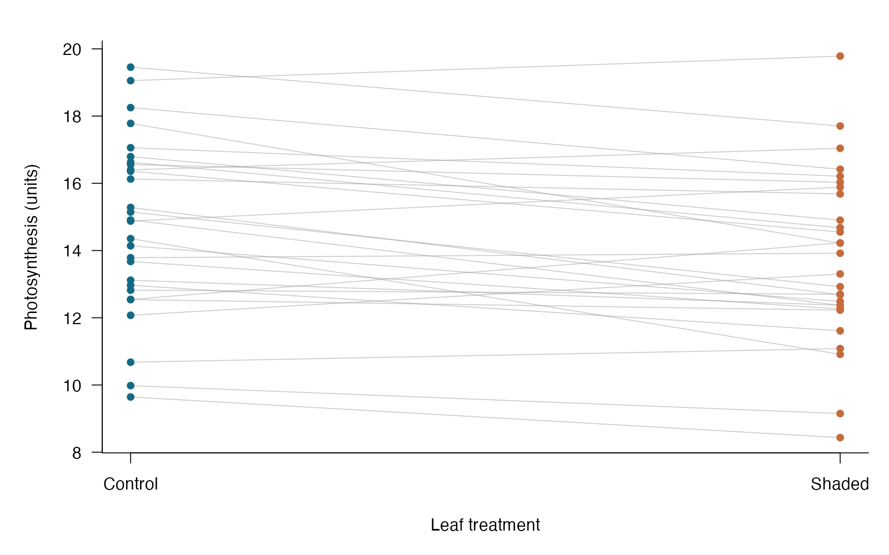

:::

::: {.column width="38%"}

**base R arguments**

**t(as.matrix(...))** — Connects two values from each plant

**col="#99999980"** — Light transparent paired lines

**axis(1,...)** — Replaces numeric positions with treatment labels

:::

:::

::: notes

This figure is generated from the saved CSV by modules/permutation_paired/analysis.R. Swapping labels within a pair is equivalent to reversing the sign of that pair’s difference.

:::


## Paired permutation: plot code {#permutation_paired-plot-code}

::: columns

::: {.column width="62%"}

```r
matplot(c(1,2), t(as.matrix(d[c("control","shaded")])), type="l", lty=1,
        col="#99999980", xaxt="n", xlab="Leaf treatment", ylab="Photosynthesis (units)")
axis(1, 1:2, c("Control", "Shaded"))
points(rep(1,28), d$control, pch=16, col="#146A85")
points(rep(2,28), d$shaded, pch=16, col="#C56B3B")
```


:::

::: {.column width="38%"}

**Arguments to change**

**t(as.matrix(...))** — Connects two values from each plant

**col="#99999980"** — Light transparent paired lines

**axis(1,...)** — Replaces numeric positions with treatment labels

:::

:::

::: notes

This is an exact excerpt from analysis.R. Any preparation referenced by the excerpt appears in the complete companion script. The script opens a ragg PNG device before these lines and closes it afterward.

:::


## Paired permutation: question and null {#permutation_paired-question}

::: columns

::: {.column width="62%"}

**Scientific question**

Is the within-pair or within-block contrast unusual under the actual randomization?

**Null / estimation target**

Under a paired randomized design, treatment assignment has no effect on any unit; permitted within-pair swaps are equally plausible.

:::

::: {.column width="38%"}

**Relevant options**

- Swap labels within randomized pairs/blocks; never shuffle all rows together.

- Use set.seed(), a stated statistic, and a finite-simulation p-value.

:::

:::

::: notes

Ask whether rejecting this null, or estimating this target, answers the biological question. Swapping labels within a pair is equivalent to reversing the sign of that pair’s difference.

:::


## Paired permutation: assumptions {#permutation_paired-assumptions}

::: columns

::: {.column width="62%"}

**What matters here**

- The assignment scheme permits the swaps.

- For observational sign flips, a symmetric difference distribution is a separate justification.

:::

::: {.column width="38%"}

**Parametric responses**

- Paired t targets the mean change; mixed models add covariates and complex dependence.

**Nonparametric responses**

- A sign test needs only change direction; signed-rank also uses meaningful symmetric differences.

:::

:::

::: notes

Begin with the design. A model change should address a specific issue and preserve the scientific target where possible. A rank or permutation alternative has its own assumptions and may change the null; do not choose it solely from a normality-test p-value.

:::


## Paired permutation: run and read {#permutation_paired-analysis}

::: columns

::: {.column width="62%"}

```r
difference <- d$shaded-d$control
observed <- mean(difference)
B <- 4999
null <- numeric(B)
for (i in 1:B) null[i] <- mean(difference * sample(c(-1,1), nrow(d), replace=TRUE))
p_value <- (1+sum(abs(null)>=abs(observed)))/(B+1)
result <- data.frame(mean_difference=observed, permutations=B, p=p_value)
```


:::

::: {.column width="38%"}

**Generated results**

- Shaded − control = -0.97 units

- Two-sided permutation p = 0.0006

- 28 pairs; labels swap only within plants

:::

:::

::: notes

Full executed model/test output:

```
  mean_difference permutations     p
1      -0.9724543         4999 6e-04
```


:::


## Paired permutation: interpret {#permutation_paired-interpret}

Within plants, shading changed mean photosynthesis by -0.97 units (paired permutation p = 0.0006). Swaps preserve plant pairing.

**Discuss:** Why would shuffling all 56 leaf measurements destroy useful information?

::: notes

Teaching point: Swapping labels within a pair is equivalent to reversing the sign of that pair’s difference.

Instructor comparison with the simulated population: The true mean shaded-minus-control difference is −1.2; plants also differ in their shared baseline.

The reported estimate and p-value are calculated from this realized dataset; they need not exactly match the known population effect.

:::


## Welch t: the data {#welch_t}

::: columns

::: {.column width="62%"}

Evolutionary biologists compare adult beetle body length from two rearing environments.

- Continuous response

- Two independent groups

- Unequal variances allowed

:::

::: {.column width="38%"}

**Other data like these**

- Control versus treated enzyme activity

- Biomass in two habitats

- Hormone concentration in two populations

:::

:::

::: notes

Welch two-sample t test

Independent beetles assigned to cool or warm rearing; each beetle measured once.

environment: Independent rearing group (category)

length_mm: Adult beetle body length (mm)

:::


## Welch t: simulate and save {#welch_t-simulate}

::: columns

::: {.column width="62%"}

```r
set.seed(1102)
d <- data.frame(environment = rep(c("Cool", "Warm"), c(26, 30)),
                length_mm = c(rnorm(26, 10, .65), rnorm(30, 10.7, 1.15)))
write.csv(d, file.path(output_dir, "data.csv"), row.names = FALSE)
```


:::

::: {.column width="38%"}

**First saved row**

```
environment: Cool
length_mm: 9.711
```


:::

:::

::: notes

Seed: 1102

Generating model: 26 independent Cool lengths come from Normal(10, 0.65 SD), and 30 independent Warm lengths from Normal(10.7, 1.15 SD).

Population truth: The true Cool minus Warm mean difference is -0.7 mm. Variances differ (0.4225 versus 1.3225 mm squared).

The script writes data.csv before reading it for analysis. output_dir or out_dir is the folder supplied to the standalone script.

Original saved-data preview:

```
 environment length_mm
        Cool  9.711176
        Cool 10.244752
        Cool 10.735937
        Cool  9.850995
```


:::


## Welch t: see the data {#welch_t-plot}

::: columns

::: {.column width="62%"}

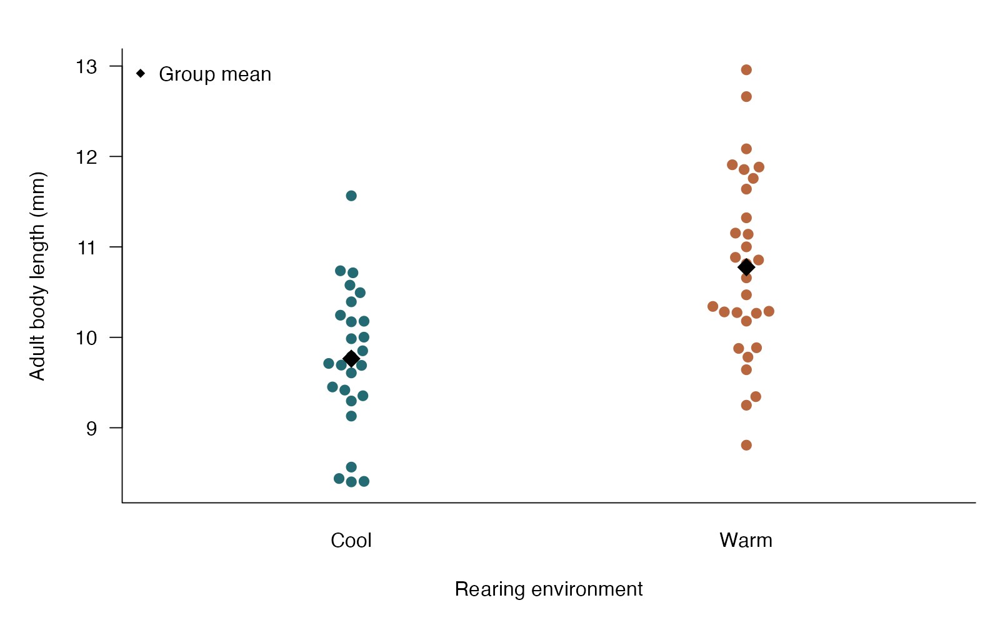

:::

::: {.column width="38%"}

**beeswarm arguments**

**response ~ group** — Map measurements to groups

**bg** — Use a color for each group

**corral** — Control overly wide swarms

**points** — Add group means with a distinct symbol

:::

:::

::: notes

This figure is generated from the saved CSV by modules/welch_t/analysis.R. Welch answers the equal-means question while allowing unequal group variances.

:::


## Welch t: plot code {#welch_t-plot-code}

::: columns

::: {.column width="62%"}

```r
beeswarm(length_mm ~ environment, data = d, pch = 21,
         bg = c("#246A73", "#B7663E"), col = "white", cex = 1.3,
         xlab = "Rearing environment", ylab = "Adult body length (mm)")
points(1:2, tapply(d$length_mm, d$environment, mean), pch = 18, cex = 2)
legend("topleft", "Group mean", pch = 18, bty = "n")
```


:::

::: {.column width="38%"}

**Arguments to change**

**response ~ group** — Map measurements to groups

**bg** — Use a color for each group

**corral** — Control overly wide swarms

**points** — Add group means with a distinct symbol

:::

:::

::: notes

This is an exact excerpt from analysis.R. Any preparation referenced by the excerpt appears in the complete companion script. The script opens a ragg PNG device before these lines and closes it afterward.

:::


## Welch t: question and null {#welch_t-question}

::: columns

::: {.column width="62%"}

**Scientific question**

Do mean body lengths differ between cool and warm environments?

**Null / estimation target**

The two population means are equal.

:::

::: {.column width="38%"}

**Relevant options**

- var.equal = FALSE uses Welch (default)

- Factor order defines the reported difference

- Use a paired test only for genuine pairs

:::

:::

::: notes

Ask whether rejecting this null, or estimating this target, answers the biological question. Welch answers the equal-means question while allowing unequal group variances.

:::


## Welch t: assumptions {#welch_t-assumptions}

::: columns

::: {.column width="62%"}

**What matters here**

- Independent beetles

- No severe outliers; check small samples closely

- Groups need not share a variance

:::

::: {.column width="38%"}

**Parametric responses**

- Welch handles unequal variances

- A scientifically sensible transformation may reduce strong skew

**Nonparametric responses**

- Rank-sum tests distributions; it is not a general test of means

- A bootstrap interval can retain the mean-difference target

:::

:::

::: notes

Begin with the design. A model change should address a specific issue and preserve the scientific target where possible. A rank or permutation alternative has its own assumptions and may change the null; do not choose it solely from a normality-test p-value.

:::


## Welch t: run and read {#welch_t-analysis}

::: columns

::: {.column width="62%"}

```r
d$environment <- factor(d$environment, levels = c("Cool", "Warm"))
fit <- t.test(length_mm ~ environment, data = d,
              var.equal = FALSE, conf.level = .95)
difference <- mean(d$length_mm[d$environment == "Cool"]) -
              mean(d$length_mm[d$environment == "Warm"])
```


:::

::: {.column width="38%"}

**Generated results**

- Cool - Warm mean difference = -1.01 mm

- 95% CI: -1.49 to -0.53 mm

- Welch t = -4.21; df = 53.33; p = 9.973e-05

:::

:::

::: notes

Full executed model/test output:

```

	Welch Two Sample t-test

data:  length_mm by environment
t = -4.2066, df = 53.33, p-value = 9.973e-05
alternative hypothesis: true difference in means between group Cool and group Warm is not equal to 0
95 percent confidence interval:
 -1.4937879 -0.5292964
sample estimates:
mean in group Cool mean in group Warm 
          9.763781          10.775323 

```


:::


## Welch t: interpret {#welch_t-interpret}

Mean body length differed by -1.01 mm (Cool minus Warm; 95% CI -1.49 to -0.53). Welch's t = -4.21, df = 53.33, p = 9.973e-05. Group ordering determines the sign; unequal group variances do not require switching to ranks.

**Discuss:** If the Warm group is more variable, do you need ranks to test a mean difference?

::: notes

Teaching point: Welch answers the equal-means question while allowing unequal group variances.

Instructor comparison with the simulated population: The true Cool minus Warm mean difference is -0.7 mm. Variances differ (0.4225 versus 1.3225 mm squared).

The reported estimate and p-value are calculated from this realized dataset; they need not exactly match the known population effect.

:::


## Pooled t: the data {#pooled_t}

::: columns

::: {.column width="62%"}

Evolutionary biologists compare adult beetle body length from two rearing environments.

- Continuous response

- Two independent groups

- A shared population variance is assumed

:::

::: {.column width="38%"}

**Other data like these**

- Control versus treated enzyme activity

- Biomass in two habitats

- Hormone concentration in two populations

:::

:::

::: notes

Pooled two-sample t test

Independent beetles in two rearing environments; a common population variance is a substantive model assumption.

environment: Independent rearing group (category)

length_mm: Adult beetle body length (mm)

:::


## Pooled t: simulate and save {#pooled_t-simulate}

::: columns

::: {.column width="62%"}

```r
set.seed(1118)
d <- data.frame(environment = rep(c("Cool", "Warm"), c(26, 30)),
                length_mm = c(rnorm(26, 10, .65), rnorm(30, 10.7, .65)))
write.csv(d, file.path(output_dir, "data.csv"), row.names = FALSE)
```


:::

::: {.column width="38%"}

**First saved row**

```
environment: Cool
length_mm: 9.949
```


:::

:::

::: notes

Seed: 1118

Generating model: 26 independent Cool beetles are Normal(10, 0.65 SD), and 30 independent Warm beetles are Normal(10.7, 0.65 SD).

Population truth: The true Cool minus Warm mean difference is -0.7 mm, and the two population variances are both 0.4225 mm squared.

The script writes data.csv before reading it for analysis. output_dir or out_dir is the folder supplied to the standalone script.

Original saved-data preview:

```
 environment length_mm
        Cool  9.949494
        Cool 10.115089
        Cool 10.006459
        Cool 11.635352
```


:::


## Pooled t: see the data {#pooled_t-plot}

::: columns

::: {.column width="62%"}

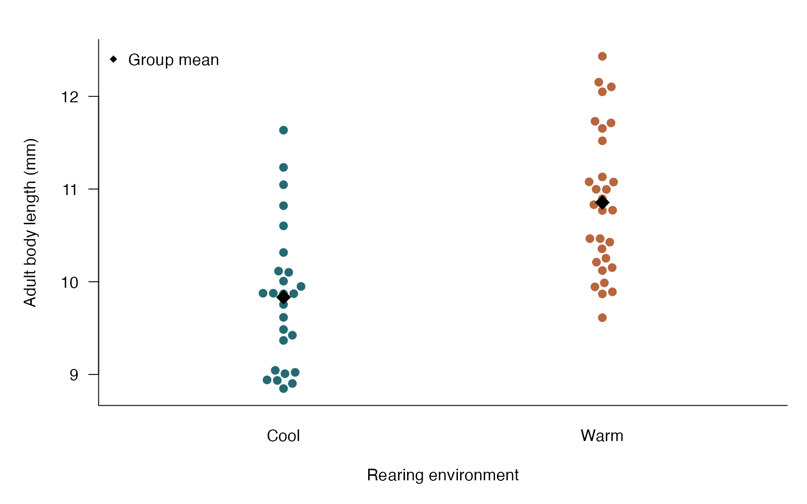

:::

::: {.column width="38%"}

**beeswarm arguments**

**response ~ group** — Map measurements to groups

**pwcol** — Use a color for each observation

**corral** — Control overly wide swarms

**points** — Add group means with a distinct symbol

:::

:::

::: notes

This figure is generated from the saved CSV by modules/pooled_t/analysis.R. Pooled and Welch t tests share the mean-difference null; their variance assumptions differ.

:::


## Pooled t: plot code {#pooled_t-plot-code}

::: columns

::: {.column width="62%"}

```r
beeswarm(length_mm ~ environment, data = d, pch = 21,
         bg = c("#246A73", "#B7663E"), col = "white", cex = 1.3,
         xlab = "Rearing environment", ylab = "Adult body length (mm)")
points(1:2, tapply(d$length_mm, d$environment, mean), pch = 18, cex = 2)
legend("topleft", "Group mean", pch = 18, bty = "n")
```


:::

::: {.column width="38%"}

**Arguments to change**

**response ~ group** — Map measurements to groups

**pwcol** — Use a color for each observation

**corral** — Control overly wide swarms

**points** — Add group means with a distinct symbol

:::

:::

::: notes

This is an exact excerpt from analysis.R. Any preparation referenced by the excerpt appears in the complete companion script. The script opens a ragg PNG device before these lines and closes it afterward.

:::


## Pooled t: question and null {#pooled_t-question}

::: columns

::: {.column width="62%"}

**Scientific question**

Do mean body lengths differ between cool and warm environments?

**Null / estimation target**

The two population means are equal.

:::

::: {.column width="38%"}

**Relevant options**

- var.equal = TRUE requests the pooled t test

- Factor order determines the difference sign

- Choose the variance model deliberately; avoid a preliminary variance-test gate

:::

:::

::: notes

Ask whether rejecting this null, or estimating this target, answers the biological question. Pooled and Welch t tests share the mean-difference null; their variance assumptions differ.

:::


## Pooled t: assumptions {#pooled_t-assumptions}

::: columns

::: {.column width="62%"}

**What matters here**

- Independent beetles

- Similar approximately normal population shapes at small n

- Equal population variances

:::

::: {.column width="38%"}

**Parametric responses**

- Welch tests the same mean-difference null without equal variances

- Use a scientifically meaningful transformation for severe skew

**Nonparametric responses**

- Rank-sum changes the target to response distributions

- A bootstrap interval can retain the mean-difference target

:::

:::

::: notes

Begin with the design. A model change should address a specific issue and preserve the scientific target where possible. A rank or permutation alternative has its own assumptions and may change the null; do not choose it solely from a normality-test p-value.

:::


## Pooled t: run and read {#pooled_t-analysis}

::: columns

::: {.column width="62%"}

```r
d$environment <- factor(d$environment, levels = c("Cool", "Warm"))
fit <- t.test(length_mm ~ environment, data = d,
              var.equal = TRUE, conf.level = .95)
difference <- mean(d$length_mm[d$environment == "Cool"]) -
              mean(d$length_mm[d$environment == "Warm"])
```


:::

::: {.column width="38%"}

**Generated results**

- Cool - Warm mean difference = -1.02 mm

- 95% CI: -1.44 to -0.61 mm

- Pooled t = -4.94; df = 54.00; p = 7.927e-06

:::

:::

::: notes

Full executed model/test output:

```

	Two Sample t-test

data:  length_mm by environment
t = -4.9399, df = 54, p-value = 7.927e-06
alternative hypothesis: true difference in means between group Cool and group Warm is not equal to 0
95 percent confidence interval:
 -1.4367878 -0.6072203
sample estimates:
mean in group Cool mean in group Warm 
          9.833382          10.855386 

```


:::


## Pooled t: interpret {#pooled_t-interpret}

Mean body length differed by -1.02 mm (Cool minus Warm; 95% CI -1.44 to -0.61). Pooled t = -4.94, df = 54.00, p = 7.927e-06. This analysis assumes equal population variances. Welch tests the same null without that assumption.

**Discuss:** Which argument changes a Welch test into the pooled test, and what assumption have you added?

::: notes

Teaching point: Pooled and Welch t tests share the mean-difference null; their variance assumptions differ.

Instructor comparison with the simulated population: The true Cool minus Warm mean difference is -0.7 mm, and the two population variances are both 0.4225 mm squared.

The reported estimate and p-value are calculated from this realized dataset; they need not exactly match the known population effect.

:::


## Rank-sum: the data {#rank_sum}

::: columns

::: {.column width="62%"}

Ecologists compare parasite burdens among fish from two independent lakes.

- Ordinal or continuous response, including ranked counts

- Two independent groups

- Uses relative ordering rather than raw distances

:::

::: {.column width="38%"}

**Other data like these**

- Skewed enzyme concentrations

- Ordinal disease scores in two treatments

- Time-to-task completion without censoring

:::

:::

::: notes

Wilcoxon rank-sum test

Each fish is sampled once; counts are strongly skewed and tied.

lake: Lake of independently sampled fish (category)

parasites: Parasite burden of one fish (count)

:::


## Rank-sum: simulate and save {#rank_sum-simulate}

::: columns

::: {.column width="62%"}

```r
set.seed(1106)
d <- data.frame(lake = rep(c("Clear", "Reedy"), each = 32),
                parasites = c(rnbinom(32, mu = 5, size = 1.5),
                              rnbinom(32, mu = 10, size = 1.5)))
write.csv(d, file.path(output_dir, "data.csv"), row.names = FALSE)
```


:::

::: {.column width="38%"}

**First saved row**

```
lake: Clear
parasites: 7
```


:::

:::

::: notes

Seed: 1106

Generating model: 32 independent fish per lake have negative-binomial parasite counts. Clear has mean 5 and Reedy mean 10, both with size parameter 1.5; variances are mean + mean squared / 1.5.

Population truth: The lake distributions differ, including their mean and spread. The same-distribution null is false; there is not a simple equal-shape location shift.

The script writes data.csv before reading it for analysis. output_dir or out_dir is the folder supplied to the standalone script.

Original saved-data preview:

```
  lake parasites
 Clear         7
 Clear         4
 Clear         0
 Clear         6
```


:::


## Rank-sum: see the data {#rank_sum-plot}

::: columns

::: {.column width="62%"}

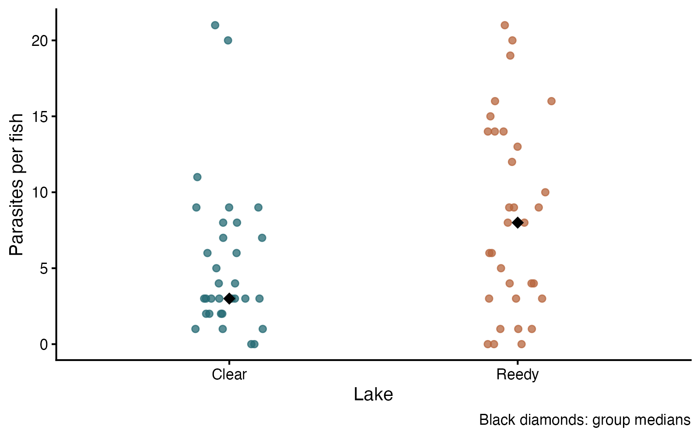

:::

::: {.column width="38%"}

**ggplot2 arguments**

**aes** — Map lake and burden to axes

**geom_jitter / width** — Separate overlapping observations horizontally

**shape / alpha** — Set point appearance and transparency

**stat_summary** — Add a labeled descriptive median

:::

:::

::: notes

This figure is generated from the saved CSV by modules/rank_sum/analysis.R. A rank-sum result can reflect distributional differences; the mean-count question also has a direct count-model route.

:::


## Rank-sum: plot code {#rank_sum-plot-code}

::: columns

::: {.column width="62%"}

```r
p <- ggplot(d, aes(lake, parasites, color = lake)) +
  geom_jitter(width = .12, height = 0, size = 2.7, alpha = .75) +
  stat_summary(fun = median, geom = "point", shape = 18, size = 5, color = "black") +
  scale_color_manual(values = c("#246A73", "#B7663E")) +
  labs(x = "Lake", y = "Parasites per fish", caption = "Black diamonds: group medians") +
  theme_classic(base_size = 18) + theme(legend.position = "none")
print(p)
```


:::

::: {.column width="38%"}

**Arguments to change**

**aes** — Map lake and burden to axes

**geom_jitter / width** — Separate overlapping observations horizontally

**shape / alpha** — Set point appearance and transparency

**stat_summary** — Add a labeled descriptive median

:::

:::

::: notes

This is an exact excerpt from analysis.R. Any preparation referenced by the excerpt appears in the complete companion script. The script opens a ragg PNG device before these lines and closes it afterward.

:::


## Rank-sum: question and null {#rank_sum-question}

::: columns

::: {.column width="62%"}

**Scientific question**

Do parasite-burden distributions differ between the two lakes?

**Null / estimation target**

The two groups have the same response distribution.

:::

::: {.column width="38%"}

**Relevant options**

- exact = FALSE handles these tied counts

- correct = TRUE applies continuity correction

- Location-shift interpretation needs similarly shaped distributions

:::

:::

::: notes

Ask whether rejecting this null, or estimating this target, answers the biological question. A rank-sum result can reflect distributional differences; the mean-count question also has a direct count-model route.

:::


## Rank-sum: assumptions {#rank_sum-assumptions}

::: columns

::: {.column width="62%"}

**What matters here**

- Independent fish and groups

- Measurements can be meaningfully ranked

- Different shapes/spreads can affect the result

:::

::: {.column width="38%"}

**Parametric responses**

- Negative-binomial regression models the count response directly

- Welch t tests a mean difference when that is the target

**Nonparametric responses**

- Rank-sum compares independent groups

- Use signed-rank or sign for paired observations

:::

:::

::: notes

Begin with the design. A model change should address a specific issue and preserve the scientific target where possible. A rank or permutation alternative has its own assumptions and may change the null; do not choose it solely from a normality-test p-value.

:::


## Rank-sum: run and read {#rank_sum-analysis}

::: columns

::: {.column width="62%"}

```r
fit <- wilcox.test(parasites ~ lake, data = d,
                   exact = FALSE, correct = TRUE)
```


:::

::: {.column width="38%"}

**Generated results**

- Observed medians: Clear 3.0; Reedy 8.0 parasites

- W = 362.5; asymptotic p = 0.04452

- Medians describe these data; the general null concerns distributions.

:::

:::

::: notes

Full executed model/test output:

```

	Wilcoxon rank sum test with continuity correction

data:  parasites by lake
W = 362.5, p-value = 0.04452
alternative hypothesis: true location shift is not equal to 0

```


:::


## Rank-sum: interpret {#rank_sum-interpret}

Parasite burdens had observed medians 3.0 (Clear) and 8.0 (Reedy). The rank-sum comparison gave W = 362.5, p = 0.04452. This is evidence about the distributions; calling it a median test requires additional shape assumptions.

**Discuss:** If your target is the ratio of mean parasite counts, would a rank-sum result answer that directly?

::: notes

Teaching point: A rank-sum result can reflect distributional differences; the mean-count question also has a direct count-model route.

Instructor comparison with the simulated population: The lake distributions differ, including their mean and spread. The same-distribution null is false; there is not a simple equal-shape location shift.

The reported estimate and p-value are calculated from this realized dataset; they need not exactly match the known population effect.

:::


## Independent permutation: the data {#permutation_independent}

::: columns

::: {.column width="62%"}

Independent insect larvae are randomly assigned to ambient or warm rearing.

- Continuous growth measurement

- One row per larva

- Group labels can be reassigned under the null

:::

::: {.column width="38%"}

**Other data like these**

- Fertilizer and biomass

- Drug and enzyme activity

- Resource treatment and fecundity

:::

:::

::: notes

Independent-sample permutation test

Two independent randomized groups; statistic is the mean difference.

group: Randomized treatment (category)

growth_mm: Larval growth (mm)

:::


## Independent permutation: simulate and save {#permutation_independent-simulate}

::: columns

::: {.column width="62%"}

```r
set.seed(240503)
group <- rep(c("Control", "Warm"), each=25)
d <- data.frame(group, growth_mm=rnorm(50, 8+1.1*(group=="Warm"), 1.8))
write.csv(d, file.path(out_dir, "data.csv"), row.names = FALSE)
```


:::

::: {.column width="38%"}

**First saved row**

```
group: Control
growth_mm: 7.975
```


:::

:::

::: notes

Seed: 240503

Generating model: 25 independent values per group. Control growth is Normal(8, SD=1.8) mm; warm growth is Normal(9.1, SD=1.8) mm. No rounding or clipping.

Population truth: The simulated warm-minus-control mean difference is 1.1 mm; the same-distribution null is false.

The script writes data.csv before reading it for analysis. output_dir or out_dir is the folder supplied to the standalone script.

Original saved-data preview:

```
   group growth_mm
 Control  7.975045
 Control  4.894258
 Control  9.026126
 Control  8.055585
```


:::


## Independent permutation: see the data {#permutation_independent-plot}

::: columns

::: {.column width="62%"}

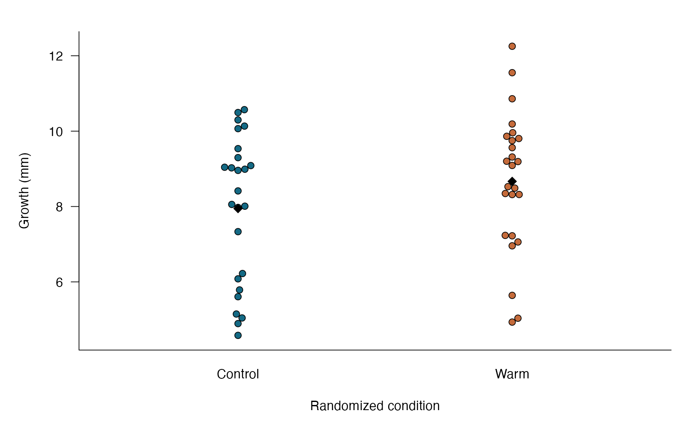

:::

::: {.column width="38%"}

**beeswarm arguments**

**growth_mm ~ group** — Separates independent groups

**pch=21 / bg** — Outlined points with treatment fills

**points(...,pch=18)** — Adds a diamond at each mean

:::

:::

::: notes

This figure is generated from the saved CSV by modules/permutation_independent/analysis.R. Choose the statistic for the scientific question, then shuffle in a way the design permits.

:::


## Independent permutation: plot code {#permutation_independent-plot-code}

::: columns

::: {.column width="62%"}

```r
beeswarm::beeswarm(growth_mm ~ group, data=d, pch=21,
  bg=c("#146A85", "#C56B3B"), cex=1.1,
  xlab="Randomized condition", ylab="Growth (mm)")
points(1:2, tapply(d$growth_mm, d$group, mean), pch=18, cex=1.6)
```


:::

::: {.column width="38%"}

**Arguments to change**

**growth_mm ~ group** — Separates independent groups

**pch=21 / bg** — Outlined points with treatment fills

**points(...,pch=18)** — Adds a diamond at each mean

:::

:::

::: notes

This is an exact excerpt from analysis.R. Any preparation referenced by the excerpt appears in the complete companion script. The script opens a ragg PNG device before these lines and closes it afterward.

:::


## Independent permutation: question and null {#permutation_independent-question}

::: columns

::: {.column width="62%"}

**Scientific question**

Would the observed group statistic be unusual under assignments permitted by the design?

**Null / estimation target**

For ordinary group-label permutation, group labels are exchangeable under the null; in a randomized experiment, the sharp null is no treatment effect on any unit.

:::

::: {.column width="38%"}

**Relevant options**

- Choose the statistic and permitted shuffles first; set.seed() records reproducibility.

- With B random permutations, use (1 + number_at_least_as_extreme)/(B + 1).

:::

:::

::: notes

Ask whether rejecting this null, or estimating this target, answers the biological question. Choose the statistic for the scientific question, then shuffle in a way the design permits.

:::


## Independent permutation: assumptions {#permutation_independent-assumptions}

::: columns

::: {.column width="62%"}

**What matters here**

- Exchangeability or a known randomization scheme; preserve any blocks and unequal assignment probabilities.

:::

::: {.column width="38%"}

**Parametric responses**

- Welch targets a mean difference while allowing unequal variances; ordinary label shuffling is not automatically valid for that null.

**Nonparametric responses**

- Already a randomization/resampling method. Pair or block restrictions are essential when the design requires them.

:::

:::

::: notes

Begin with the design. A model change should address a specific issue and preserve the scientific target where possible. A rank or permutation alternative has its own assumptions and may change the null; do not choose it solely from a normality-test p-value.

:::


## Independent permutation: run and read {#permutation_independent-analysis}

::: columns

::: {.column width="62%"}

```r
observed <- mean(d$growth_mm[d$group=="Warm"])-mean(d$growth_mm[d$group=="Control"])
B <- 4999
null <- numeric(B)
for (i in 1:B) {
  shuffled <- sample(d$group)
  null[i] <- mean(d$growth_mm[shuffled=="Warm"])-mean(d$growth_mm[shuffled=="Control"])
}
p_value <- (1+sum(abs(null)>=abs(observed)))/(B+1)
result <- data.frame(mean_difference=observed, permutations=B, p=p_value)
```


:::

::: {.column width="38%"}

**Generated results**

- Warm − control = 0.72 mm

- Two-sided Monte Carlo p = 0.187

- 4999 permitted label shuffles

:::

:::

::: notes

Full executed model/test output:

```
  mean_difference permutations     p
1       0.7207885         4999 0.187
```


:::


## Independent permutation: interpret {#permutation_independent-interpret}

Mean growth was 0.72 mm higher under warming; the two-sided permutation p-value is 0.187 from 4999 random assignments. The shuffle must match the design.

**Discuss:** Would shuffling individual leaves be valid if treatment was assigned to pots?

::: notes

Teaching point: Choose the statistic for the scientific question, then shuffle in a way the design permits.

Instructor comparison with the simulated population: The simulated warm-minus-control mean difference is 1.1 mm; the same-distribution null is false.

The reported estimate and p-value are calculated from this realized dataset; they need not exactly match the known population effect.

:::


## Normality checks: the data {#shapiro}

::: columns

::: {.column width="62%"}

Cell biologists examine the distribution of time to lysis among independent cultured cells.

- One continuous variable

- A distributional diagnostic, not the biological comparison

- For models, examine residuals rather than pooled responses

:::

::: {.column width="38%"}

**Other data like these**

- Approximate normality of paired differences

- Shape of independent measurement errors

- Distribution of a continuous trait within a group

:::

:::

::: notes

Shapiro–Wilk and graphical checks

One lysis time for each independently treated culture; use a diagnostic to investigate shape.

culture: Independent culture identifier (none)

lysis_minutes: Time until lysis (minutes)

:::


## Normality checks: simulate and save {#shapiro-simulate}

::: columns

::: {.column width="62%"}

```r
set.seed(1111)
d <- data.frame(culture = 1:36,
                lysis_minutes = rlnorm(36, log(45), .5))
write.csv(d, file.path(output_dir, "data.csv"), row.names = FALSE)
```


:::

::: {.column width="38%"}

**First saved row**

```
culture: 1
lysis_minutes: 43.09
```


:::

:::

::: notes

Seed: 1111

Generating model: 36 independent lysis times follow a log-normal distribution with meanlog log(45) and log-scale SD 0.5.

Population truth: The population is log-normal and positively skewed, not normal. The population geometric mean is 45 minutes.

The script writes data.csv before reading it for analysis. output_dir or out_dir is the folder supplied to the standalone script.

Original saved-data preview:

```
 culture lysis_minutes
       1      43.09351
       2      87.17562
       3      61.96152
       4      80.96814
```


:::


## Normality checks: see the data {#shapiro-plot}

::: columns

::: {.column width="62%"}

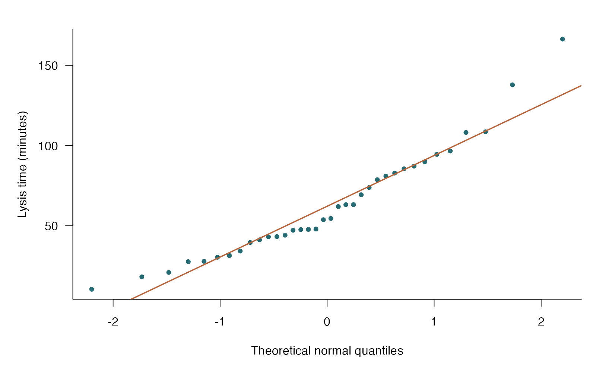

:::

::: {.column width="38%"}

**base R arguments**

**qqnorm** — Compare observed to normal quantiles

**qqline** — Add a quartile-based reference line

**pch / col** — Keep observations visually distinct

**ylab** — Keep the response and units explicit

:::

:::

::: notes

This figure is generated from the saved CSV by modules/shapiro/analysis.R. A diagnostic explains how a working model misses the data; its p-value should not automatically select the scientific analysis.

:::


## Normality checks: plot code {#shapiro-plot-code}

::: columns

::: {.column width="62%"}

```r
qqnorm(d$lysis_minutes, pch = 21, bg = "#246A73", col = "white",
       main = "", xlab = "Theoretical normal quantiles", ylab = "Lysis time (minutes)")
qqline(d$lysis_minutes, col = "#B7663E", lwd = 2)
```


:::

::: {.column width="38%"}

**Arguments to change**

**qqnorm** — Compare observed to normal quantiles

**qqline** — Add a quartile-based reference line

**pch / col** — Keep observations visually distinct

**ylab** — Keep the response and units explicit

:::

:::

::: notes

This is an exact excerpt from analysis.R. Any preparation referenced by the excerpt appears in the complete companion script. The script opens a ragg PNG device before these lines and closes it afterward.

:::


## Normality checks: question and null {#shapiro-question}

::: columns

::: {.column width="62%"}

**Scientific question**

Is a normal model a reasonable working description of these lysis times?

**Null / estimation target**

The independent observations come from a normal distribution.

:::

::: {.column width="38%"}

**Relevant options**

- shapiro.test accepts 3–5000 observations

- Use a Q–Q plot alongside the test

- Choose an analysis for the scientific target, not a p-value gate

:::

:::

::: notes

Ask whether rejecting this null, or estimating this target, answers the biological question. A diagnostic explains how a working model misses the data; its p-value should not automatically select the scientific analysis.

:::


## Normality checks: assumptions {#shapiro-assumptions}

::: columns

::: {.column width="62%"}

**What matters here**

- Observations are independent

- A normal population is the reference

- Diagnostic sensitivity changes with sample size

:::

::: {.column width="38%"}

**Parametric responses**

- Model positive skew with log-normal or gamma errors

- Consider a meaningful transformation and check its new interpretation

**Nonparametric responses**

- Ranks can address a different distributional question

- Bootstrap uncertainty can retain the mean target

:::

:::

::: notes

Begin with the design. A model change should address a specific issue and preserve the scientific target where possible. A rank or permutation alternative has its own assumptions and may change the null; do not choose it solely from a normality-test p-value.

:::


## Normality checks: run and read {#shapiro-analysis}

::: columns

::: {.column width="62%"}

```r
fit <- shapiro.test(d$lysis_minutes)
```


:::

::: {.column width="38%"}

**Generated results**

- Shapiro–Wilk W = 0.937; p = 0.04064; n = 36

- Curvature in the Q–Q plot indicates a shape mismatch.

- A nonsignificant result would not establish normality.

:::

:::

::: notes

Full executed model/test output:

```

	Shapiro-Wilk normality test

data:  d$lysis_minutes
W = 0.93687, p-value = 0.04064

```


:::


## Normality checks: interpret {#shapiro-interpret}

For the 36 lysis times, Shapiro–Wilk W = 0.937, p = 0.04064. Use the Q–Q plot to understand the mismatch; this diagnostic alone does not choose the scientific test or show that a mean comparison is invalid.

**Discuss:** Would a nonsignificant Shapiro–Wilk result prove that these known log-normal data are normal?

::: notes

Teaching point: A diagnostic explains how a working model misses the data; its p-value should not automatically select the scientific analysis.

Instructor comparison with the simulated population: The population is log-normal and positively skewed, not normal. The population geometric mean is 45 minutes.

The reported estimate and p-value are calculated from this realized dataset; they need not exactly match the known population effect.

:::


## F test of variances: the data {#f_variance}

::: columns

::: {.column width="62%"}

Evolutionary developmental biologists compare variation in wing length between two inbred fly lines.

- Continuous response

- Two independent groups

- Variability is the scientific target

:::

::: {.column width="38%"}

**Other data like these**

- Developmental variability in two genotypes

- Variation in enzyme activity across two treatments

- Body-size variability in two populations

:::

:::

::: notes

F test of two variances

Thirty independent flies per line are reared under a common environment.

line: Fly line (category)

wing_mm: Wing length of one independent fly (mm)

:::


## F test of variances: simulate and save {#f_variance-simulate}

::: columns

::: {.column width="62%"}

```r
set.seed(1109)
d <- data.frame(line = rep(c("Line A", "Line B"), each = 30),
                wing_mm = c(rnorm(30, 2.6, .11), rnorm(30, 2.6, .21)))
write.csv(d, file.path(output_dir, "data.csv"), row.names = FALSE)
```


:::

::: {.column width="38%"}

**First saved row**

```
line: Line A
wing_mm: 2.466
```


:::

:::

::: notes

Seed: 1109

Generating model: 30 wing lengths per independent fly line come from normal distributions with shared mean 2.6 mm, SD 0.11 for Line A and SD 0.21 for Line B.

Population truth: Population means are equal, but the true variance ratio A/B is 0.11 squared / 0.21 squared, approximately 0.274.

The script writes data.csv before reading it for analysis. output_dir or out_dir is the folder supplied to the standalone script.

Original saved-data preview:

```
   line  wing_mm
 Line A 2.465816
 Line A 2.528231
 Line A 2.703526
 Line A 2.709543
```


:::


## F test of variances: see the data {#f_variance-plot}

::: columns

::: {.column width="62%"}

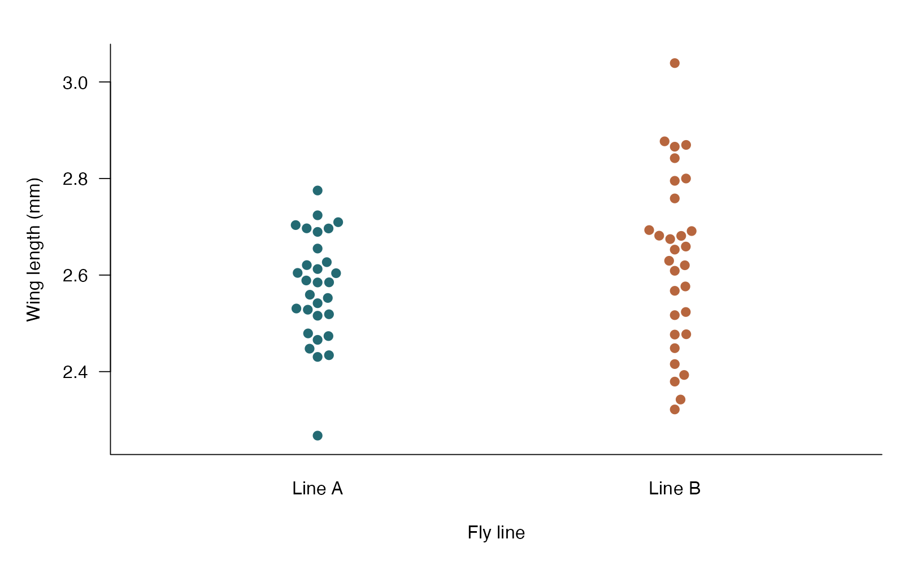

:::

::: {.column width="38%"}

**beeswarm arguments**

**response ~ line** — Display the two distributions side by side

**bg** — Give each group its own color

**pch / cex** — Use visible, unobscured raw points

**ylab** — Give the actual measurement units

:::

:::

::: notes

This figure is generated from the saved CSV by modules/f_variance/analysis.R. A variance question can have a different answer from a mean question; the exact F test depends strongly on normality.

:::


## F test of variances: plot code {#f_variance-plot-code}

::: columns

::: {.column width="62%"}

```r
beeswarm(wing_mm ~ line, data = d, pch = 21,
         bg = c("#246A73", "#B7663E"), col = "white", cex = 1.3,
         xlab = "Fly line", ylab = "Wing length (mm)")
```


:::

::: {.column width="38%"}

**Arguments to change**

**response ~ line** — Display the two distributions side by side

**bg** — Give each group its own color

**pch / cex** — Use visible, unobscured raw points

**ylab** — Give the actual measurement units

:::

:::

::: notes

This is an exact excerpt from analysis.R. Any preparation referenced by the excerpt appears in the complete companion script. The script opens a ragg PNG device before these lines and closes it afterward.

:::


## F test of variances: question and null {#f_variance-question}

::: columns

::: {.column width="62%"}

**Scientific question**

Is wing-length variance the same in the two fly lines?

**Null / estimation target**

The population variance ratio (Line A / Line B) is 1.

:::

::: {.column width="38%"}

**Relevant options**

- ratio = 1 specifies equal variances

- Factor order defines the numerator

- alternative = "two.sided" detects either variance direction

:::

:::

::: notes

Ask whether rejecting this null, or estimating this target, answers the biological question. A variance question can have a different answer from a mean question; the exact F test depends strongly on normality.

:::


## F test of variances: assumptions {#f_variance-assumptions}

::: columns

::: {.column width="62%"}

**What matters here**

- Independent observations

- Both populations approximately normal

- Highly sensitive to outliers and non-normality

:::

::: {.column width="38%"}

**Parametric responses**

- If comparing means, use Welch without a variance pretest

- Model group-specific variances when variability is the target

**Nonparametric responses**

- Brown–Forsythe is less sensitive to non-normality

- Resample within groups for a variance-ratio interval

:::

:::

::: notes

Begin with the design. A model change should address a specific issue and preserve the scientific target where possible. A rank or permutation alternative has its own assumptions and may change the null; do not choose it solely from a normality-test p-value.

:::


## F test of variances: run and read {#f_variance-analysis}

::: columns

::: {.column width="62%"}

```r
d$line <- factor(d$line, levels = c("Line A", "Line B"))
fit <- var.test(wing_mm ~ line, data = d, ratio = 1,
                alternative = "two.sided", conf.level = .95)
```


:::

::: {.column width="38%"}

**Generated results**

- Variance ratio (A / B) = 0.376

- 95% CI for variance ratio: 0.179 to 0.791

- F = 0.376; df = 29, 29; p = 0.01048

:::

:::

::: notes

Full executed model/test output:

```

	F test to compare two variances

data:  wing_mm by line
F = 0.37637, num df = 29, denom df = 29, p-value = 0.01048
alternative hypothesis: true ratio of variances is not equal to 1
95 percent confidence interval:
 0.1791387 0.7907512
sample estimates:
ratio of variances 
         0.3763697 

```


:::


## F test of variances: interpret {#f_variance-interpret}

Wing-length variance in Line A was 0.376 times that in Line B (95% CI 0.179 to 0.791); F(29, 29) = 0.376, p = 0.01048. The target is variability, and this exact F reference relies strongly on normal populations.

**Discuss:** Could the variance test detect a difference even when the two population means are identical?

::: notes

Teaching point: A variance question can have a different answer from a mean question; the exact F test depends strongly on normality.

Instructor comparison with the simulated population: Population means are equal, but the true variance ratio A/B is 0.11 squared / 0.21 squared, approximately 0.274.

The reported estimate and p-value are calculated from this realized dataset; they need not exactly match the known population effect.

:::


## Levene / Brown–Forsythe: the data {#levene}

::: columns

::: {.column width="62%"}

Microbiologists compare the variability of colony diameters across three nutrient media.

- Continuous response

- Two or more independent groups

- The spread, rather than the mean, is the target

:::

::: {.column width="38%"}

**Other data like these**

- Developmental stability across genotypes

- Assay reproducibility across treatments

- Variation in growth among environments

:::

:::

::: notes

Levene and Brown–Forsythe tests

Independent colonies are grown in separately inoculated culture wells; one colony measured per well.

medium: Nutrient medium (category)

diameter_mm: Diameter of a colony from one independent well (mm)

:::


## Levene / Brown–Forsythe: simulate and save {#levene-simulate}

::: columns

::: {.column width="62%"}

```r
set.seed(1110)
d <- data.frame(medium = rep(c("Low", "Medium", "High"), each = 28),
                diameter_mm = c(rlnorm(28, log(4), .12),
                rlnorm(28, log(4), .20), rlnorm(28, log(4), .35)))
write.csv(d, file.path(output_dir, "data.csv"), row.names = FALSE)
```


:::

::: {.column width="38%"}

**First saved row**

```
medium: Low
diameter_mm: 3.98
```


:::

:::

::: notes

Seed: 1110

Generating model: 28 independently cultured colonies per medium have log-normal diameters. All have meanlog log(4); log-scale SD is 0.12, 0.20, or 0.35 for Low, Medium, and High medium.

Population truth: Group geometric means are 4 mm, but variances differ. Arithmetic means also vary slightly because log-normal means depend on log-scale spread.

The script writes data.csv before reading it for analysis. output_dir or out_dir is the folder supplied to the standalone script.

Original saved-data preview:

```
 medium diameter_mm
    Low    3.980470
    Low    4.612878
    Low    3.647417
    Low    3.983068
```


:::


## Levene / Brown–Forsythe: see the data {#levene-plot}

::: columns

::: {.column width="62%"}

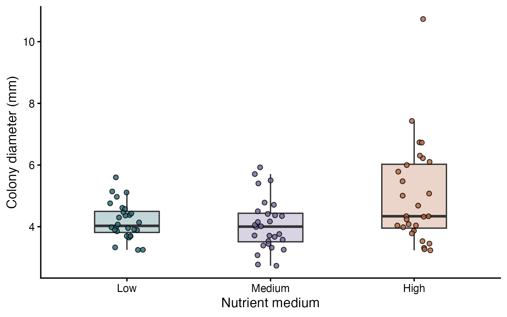

:::

::: {.column width="38%"}

**ggplot2 arguments**

**geom_boxplot / outlier.shape** — Show spread without duplicating outlier points

**geom_jitter / width** — Retain individual observations

**scale_fill_manual** — Keep treatment colors consistent

**theme_classic** — Use clean axes and a white background

:::

:::

::: notes

This figure is generated from the saved CSV by modules/levene/analysis.R. Median-centered Brown–Forsythe reduces sensitivity to long tails; it is not a required gate before Welch mean comparisons.

:::


## Levene / Brown–Forsythe: plot code {#levene-plot-code}

::: columns

::: {.column width="62%"}

```r
p <- ggplot(d, aes(medium, diameter_mm, fill = medium)) +
  geom_boxplot(width = .45, alpha = .28, outlier.shape = NA) +
  geom_jitter(width = .12, height = 0, shape = 21, size = 2.5, alpha = .8) +
  scale_fill_manual(values = c("#246A73", "#73649A", "#B7663E")) +
  labs(x = "Nutrient medium", y = "Colony diameter (mm)") +
  theme_classic(base_size = 18) + theme(legend.position = "none")
print(p)
```


:::

::: {.column width="38%"}

**Arguments to change**

**geom_boxplot / outlier.shape** — Show spread without duplicating outlier points

**geom_jitter / width** — Retain individual observations

**scale_fill_manual** — Keep treatment colors consistent

**theme_classic** — Use clean axes and a white background

:::

:::

::: notes

This is an exact excerpt from analysis.R. Any preparation referenced by the excerpt appears in the complete companion script. The script opens a ragg PNG device before these lines and closes it afterward.

:::


## Levene / Brown–Forsythe: question and null {#levene-question}

::: columns

::: {.column width="62%"}

**Scientific question**

Do population variances differ among nutrient media?

**Null / estimation target**

The groups have equal variances; the test compares absolute deviations from their group centers.

:::

::: {.column width="38%"}

**Relevant options**

- center = median gives Brown–Forsythe

- center = mean gives original Levene

- Treat the grouping variable as a factor

:::

:::

::: notes

Ask whether rejecting this null, or estimating this target, answers the biological question. Median-centered Brown–Forsythe reduces sensitivity to long tails; it is not a required gate before Welch mean comparisons.

:::


## Levene / Brown–Forsythe: assumptions {#levene-assumptions}

::: columns

::: {.column width="62%"}

**What matters here**

- Independent culture wells

- Similar distribution shapes help a variance interpretation

- Large differences in shape can also change absolute deviations

:::

::: {.column width="38%"}

**Parametric responses**

- For mean comparisons, Welch already allows unequal variance

- Model unequal residual variances directly when needed

**Nonparametric responses**

- Brown–Forsythe reduces sensitivity to tails

- Bootstrap group SDs if uncertainty in spread is the objective

:::

:::

::: notes

Begin with the design. A model change should address a specific issue and preserve the scientific target where possible. A rank or permutation alternative has its own assumptions and may change the null; do not choose it solely from a normality-test p-value.

:::


## Levene / Brown–Forsythe: run and read {#levene-analysis}

::: columns

::: {.column width="62%"}

```r
d$medium <- factor(d$medium, levels = c("Low", "Medium", "High"))
brown_forsythe <- leveneTest(diameter_mm ~ medium, data = d,
                            center = median)
original_levene <- leveneTest(diameter_mm ~ medium, data = d,
                              center = mean)
```


:::

::: {.column width="38%"}

**Generated results**

- Brown–Forsythe F = 5.55; df = 2, 81; p = 0.005524

- Original Levene F = 9.72; p = 0.0001645

- Observed group SDs: Low 0.59; Medium 0.84; High 1.64

:::

:::

::: notes

Full executed model/test output:

```
Levene's Test for Homogeneity of Variance (center = median)
      Df F value   Pr(>F)   
group  2  5.5471 0.005524 **
      81                    
---
Signif. codes:  0 ‘***’ 0.001 ‘**’ 0.01 ‘*’ 0.05 ‘.’ 0.1 ‘ ’ 1
Levene's Test for Homogeneity of Variance (center = mean)
      Df F value    Pr(>F)    
group  2  9.7209 0.0001645 ***
      81                      
---
Signif. codes:  0 ‘***’ 0.001 ‘**’ 0.01 ‘*’ 0.05 ‘.’ 0.1 ‘ ’ 1
```


:::


## Levene / Brown–Forsythe: interpret {#levene-interpret}

The median-centered Brown–Forsythe comparison gave F(2, 81) = 5.55, p = 0.005524. Inspect the distributions as well as the p-value: the procedure compares absolute deviations, which can reflect both spread and shape.

**Discuss:** If the research question concerns mean diameter, should a significant spread test force a rank test?

::: notes

Teaching point: Median-centered Brown–Forsythe reduces sensitivity to long tails; it is not a required gate before Welch mean comparisons.

Instructor comparison with the simulated population: Group geometric means are 4 mm, but variances differ. Arithmetic means also vary slightly because log-normal means depend on log-scale spread.

The reported estimate and p-value are calculated from this realized dataset; they need not exactly match the known population effect.

:::


## One-way ANOVA: the data {#one_way_anova}

::: columns

::: {.column width="62%"}

Ecologists compare seedling biomass under three independent soil treatments.

- One continuous response

- Three or more independent groups

- Compare population means

:::

::: {.column width="38%"}

**Other data like these**

- Mean development time across diets

- Mean enzyme activity across treatments

- Mean trait values across populations

:::

:::

::: notes

One-way ANOVA

Twenty-five independently assigned pots per soil treatment; one biomass value per pot.

soil: Assigned soil treatment (category)

biomass_g: Seedling biomass from one independent pot (g)

:::


## One-way ANOVA: simulate and save {#one_way_anova-simulate}

::: columns

::: {.column width="62%"}

```r
set.seed(1117)
d <- data.frame(soil = rep(c("Sand", "Loam", "Clay"), each = 25),
                biomass_g = c(rnorm(25, 4.5, .85), rnorm(25, 5.4, .85),
                              rnorm(25, 5.1, .85)))
write.csv(d, file.path(output_dir, "data.csv"), row.names = FALSE)
```


:::

::: {.column width="38%"}

**First saved row**

```
soil: Sand
biomass_g: 1.987
```


:::

:::

::: notes

Seed: 1117

Generating model: 25 independent biomass values per soil come from normal distributions: Sand mean 4.5, Loam mean 5.4, Clay mean 5.1 g; every group has SD 0.85 g.

Population truth: The equal-means null is false. All three populations share variance 0.85 squared; Loam minus Sand is truly 0.9 g.

The script writes data.csv before reading it for analysis. output_dir or out_dir is the folder supplied to the standalone script.

Original saved-data preview:

```
 soil biomass_g
 Sand  1.986656
 Sand  3.194575
 Sand  3.816050
 Sand  5.405235
```


:::


## One-way ANOVA: see the data {#one_way_anova-plot}

::: columns

::: {.column width="62%"}

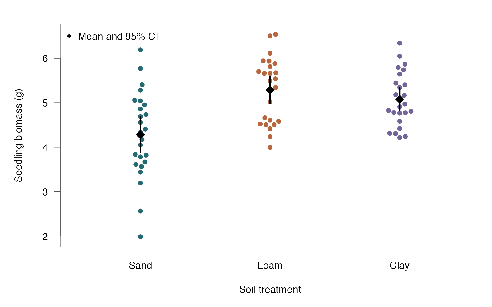

:::

::: {.column width="38%"}

**beeswarm arguments**

**response ~ group** — Arrange observations by treatment

**bg** — Use one persistent color per treatment

**points** — Mark group means

**segments** — Show clearly labeled confidence intervals for means

:::

:::

::: notes

This figure is generated from the saved CSV by modules/one_way_anova/analysis.R. The omnibus equal-means question differs from a scientific question about one particular contrast.

:::


## One-way ANOVA: plot code {#one_way_anova-plot-code}

::: columns

::: {.column width="62%"}

```r
beeswarm(biomass_g ~ soil, data = d, pch = 21,
         bg = c("#246A73", "#B7663E", "#73649A"), col = "white", cex = 1.2,
         xlab = "Soil treatment", ylab = "Seedling biomass (g)")
means <- tapply(d$biomass_g, d$soil, mean)
se <- tapply(d$biomass_g, d$soil, sd) / sqrt(table(d$soil))
half <- qt(.975, df = table(d$soil) - 1) * se
segments(1:3, means - half, 1:3, means + half, lwd = 3)
points(1:3, means, pch = 18, cex = 2)
legend("topleft", "Mean and 95% CI", pch = 18, bty = "n")
```


:::

::: {.column width="38%"}

**Arguments to change**

**response ~ group** — Arrange observations by treatment

**bg** — Use one persistent color per treatment

**points** — Mark group means

**segments** — Show clearly labeled confidence intervals for means

:::

:::

::: notes

This is an exact excerpt from analysis.R. Any preparation referenced by the excerpt appears in the complete companion script. The script opens a ragg PNG device before these lines and closes it afterward.

:::


## One-way ANOVA: question and null {#one_way_anova-question}

::: columns

::: {.column width="62%"}

**Scientific question**

Are mean seedling biomasses equal across the three soils?

**Null / estimation target**

All soil-treatment population means are equal.

:::

::: {.column width="38%"}

**Relevant options**

- aov uses a shared within-group variance

- oneway.test(var.equal = FALSE) uses Welch ANOVA

- An omnibus result does not identify a particular pair

:::

:::

::: notes

Ask whether rejecting this null, or estimating this target, answers the biological question. The omnibus equal-means question differs from a scientific question about one particular contrast.

:::


## One-way ANOVA: assumptions {#one_way_anova-assumptions}

::: columns

::: {.column width="62%"}

**What matters here**

- Independent pots

- Approximately normal errors, especially at small n

- Ordinary ANOVA assumes equal group variances

:::

::: {.column width="38%"}

**Parametric responses**

- Welch ANOVA allows unequal group variances

- Transform only if the new scale answers the scientific question

**Nonparametric responses**

- Kruskal–Wallis compares group distributions using ranks

- Use adjusted follow-up comparisons that match the chosen method

:::

:::

::: notes

Begin with the design. A model change should address a specific issue and preserve the scientific target where possible. A rank or permutation alternative has its own assumptions and may change the null; do not choose it solely from a normality-test p-value.

:::


## One-way ANOVA: run and read {#one_way_anova-analysis}

::: columns

::: {.column width="62%"}

```r
d$soil <- factor(d$soil, levels = c("Sand", "Loam", "Clay"))
fit <- aov(biomass_g ~ soil, data = d)
anova_table <- summary(fit)[[1]]
welch <- oneway.test(biomass_g ~ soil, data = d,
                    var.equal = FALSE)
```


:::

::: {.column width="38%"}

**Generated results**

- Ordinary ANOVA F(2, 72) = 11.59; p = 4.335e-05

- Welch ANOVA F = 8.89; denominator df = 46.37; p = 0.0005408

- Observed means (g): Sand 4.28; Loam 5.28; Clay 5.08

- Neither omnibus test identifies a specific differing pair.

:::

:::

::: notes

Full executed model/test output:

```
            Df Sum Sq Mean Sq F value   Pr(>F)    
soil         2  14.14   7.068   11.59 4.34e-05 ***
Residuals   72  43.92   0.610                     
---
Signif. codes:  0 ‘***’ 0.001 ‘**’ 0.01 ‘*’ 0.05 ‘.’ 0.1 ‘ ’ 1

	One-way analysis of means (not assuming equal variances)

data:  biomass_g and soil
F = 8.8862, num df = 2.000, denom df = 46.371, p-value = 0.0005408

```


:::


## One-way ANOVA: interpret {#one_way_anova-interpret}

Mean seedling biomass was compared across soils with ordinary ANOVA: F(2, 72) = 11.59, p = 4.335e-05. Welch ANOVA, which relaxes equal variances, gave p = 0.0005408. Use a planned contrast or adjusted pairwise comparisons to answer which means differ.

**Discuss:** If you care only about Loam versus Sand, what follow-up quantity should you estimate?

::: notes

Teaching point: The omnibus equal-means question differs from a scientific question about one particular contrast.

Instructor comparison with the simulated population: The equal-means null is false. All three populations share variance 0.85 squared; Loam minus Sand is truly 0.9 g.

The reported estimate and p-value are calculated from this realized dataset; they need not exactly match the known population effect.

:::


## Welch ANOVA: the data {#welch_anova}

::: columns

::: {.column width="62%"}

Ecologists compare seedling biomass under three independent soil treatments.

- Continuous response

- Three or more independent groups

- Unequal group variances and sizes allowed

:::

::: {.column width="38%"}

**Other data like these**

- Mean development time across diets

- Mean enzyme activity across treatments

- Mean trait values across populations

:::

:::

::: notes

Welch one-way ANOVA

Independent pots in three soil treatments; sample sizes and group variances differ.

soil: Assigned soil treatment (category)

biomass_g: Seedling biomass from one independent pot (g)

:::


## Welch ANOVA: simulate and save {#welch_anova-simulate}

::: columns

::: {.column width="62%"}

```r
set.seed(1119)
d <- data.frame(soil = rep(c("Sand", "Loam", "Clay"), c(20, 26, 32)),
                biomass_g = c(rnorm(20, 4.5, .6), rnorm(26, 5.4, 1.1),
                              rnorm(32, 5.1, 1.5)))
write.csv(d, file.path(output_dir, "data.csv"), row.names = FALSE)
```


:::

::: {.column width="38%"}

**First saved row**

```
soil: Sand
biomass_g: 4.656
```


:::

:::

::: notes

Seed: 1119

Generating model: Independent soil groups have different sample sizes and normal biomass distributions: Sand n=20, mean 4.5, SD 0.6; Loam n=26, mean 5.4, SD 1.1; Clay n=32, mean 5.1, SD 1.5.

Population truth: The true means differ, and variances differ (0.36, 1.21, and 2.25 g squared). Welch addresses the equal-means null without a shared variance.

The script writes data.csv before reading it for analysis. output_dir or out_dir is the folder supplied to the standalone script.

Original saved-data preview:

```
 soil biomass_g
 Sand  4.656127
 Sand  4.690143
 Sand  4.865685
 Sand  4.259580
```


:::


## Welch ANOVA: see the data {#welch_anova-plot}

::: columns

::: {.column width="62%"}

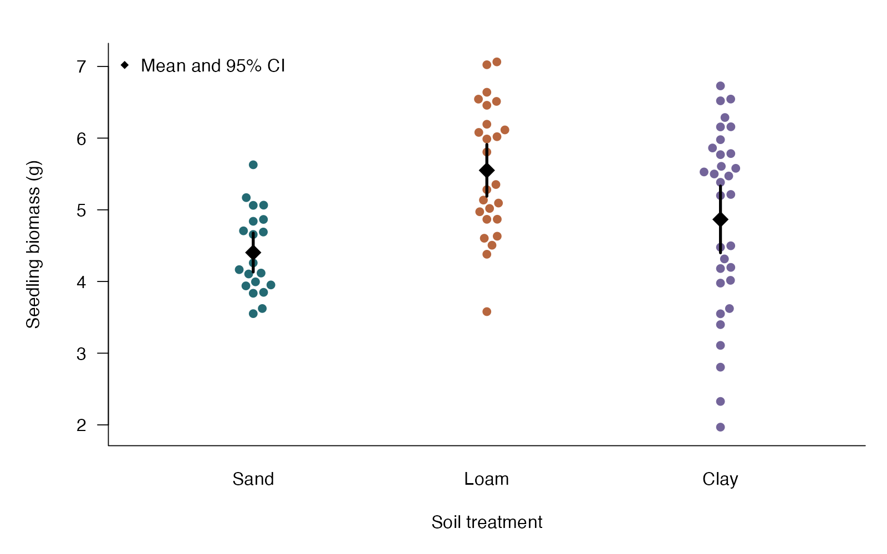

:::

::: {.column width="38%"}

**beeswarm arguments**

**response ~ group** — Arrange observations by treatment

**bg** — Use one persistent color per treatment

**points** — Mark group means

**segments** — Show clearly labeled confidence intervals for means

:::

:::

::: notes

This figure is generated from the saved CSV by modules/welch_anova/analysis.R. Unequal variances have a parametric solution that preserves the scientific question about means.

:::


## Welch ANOVA: plot code {#welch_anova-plot-code}

::: columns

::: {.column width="62%"}

```r
beeswarm(biomass_g ~ soil, data = d, pch = 21,
         bg = c("#246A73", "#B7663E", "#73649A"), col = "white", cex = 1.2,
         xlab = "Soil treatment", ylab = "Seedling biomass (g)")
means <- tapply(d$biomass_g, d$soil, mean)
se <- tapply(d$biomass_g, d$soil, sd) / sqrt(table(d$soil))
half <- qt(.975, df = table(d$soil) - 1) * se
segments(1:3, means - half, 1:3, means + half, lwd = 3)
points(1:3, means, pch = 18, cex = 2)
legend("topleft", "Mean and 95% CI", pch = 18, bty = "n")
```


:::

::: {.column width="38%"}

**Arguments to change**

**response ~ group** — Arrange observations by treatment

**bg** — Use one persistent color per treatment

**points** — Mark group means

**segments** — Show clearly labeled confidence intervals for means

:::

:::

::: notes

This is an exact excerpt from analysis.R. Any preparation referenced by the excerpt appears in the complete companion script. The script opens a ragg PNG device before these lines and closes it afterward.

:::


## Welch ANOVA: question and null {#welch_anova-question}

::: columns

::: {.column width="62%"}

**Scientific question**

Are mean seedling biomasses equal across the three soils?

**Null / estimation target**

All soil-treatment population means are equal.

:::

::: {.column width="38%"}

**Relevant options**

- oneway.test(..., var.equal = FALSE) uses Welch ANOVA

- Factor levels define the groups

- Use variance-robust follow-up comparisons for particular pairs

:::

:::

::: notes

Ask whether rejecting this null, or estimating this target, answers the biological question. Unequal variances have a parametric solution that preserves the scientific question about means.

:::


## Welch ANOVA: assumptions {#welch_anova-assumptions}

::: columns

::: {.column width="62%"}

**What matters here**

- Independent pots

- No severe outliers; approximately normal errors at small n

- Group variances may differ

:::

::: {.column width="38%"}

**Parametric responses**

- Welch directly handles unequal variances

- For adjusted pairwise means consider Games–Howell or planned robust contrasts

**Nonparametric responses**

- Kruskal–Wallis tests group distributions, not the same mean null

- A bootstrap approach can retain the mean target

:::

:::

::: notes

Begin with the design. A model change should address a specific issue and preserve the scientific target where possible. A rank or permutation alternative has its own assumptions and may change the null; do not choose it solely from a normality-test p-value.

:::


## Welch ANOVA: run and read {#welch_anova-analysis}

::: columns

::: {.column width="62%"}

```r
d$soil <- factor(d$soil, levels = c("Sand", "Loam", "Clay"))
fit <- oneway.test(biomass_g ~ soil, data = d,
                  var.equal = FALSE)
```


:::

::: {.column width="38%"}

**Generated results**

- Welch ANOVA F = 13.65; df = 2, 49.85; p = 1.873e-05

- Group sample sizes: Sand 20; Loam 26; Clay 32

- Observed means (g): Sand 4.4; Loam 5.55; Clay 4.87

- Unequal variance is modeled; the omnibus test does not select a pair.

:::

:::

::: notes

Full executed model/test output:

```

	One-way analysis of means (not assuming equal variances)

data:  biomass_g and soil
F = 13.65, num df = 2.000, denom df = 49.854, p-value = 1.873e-05

```


:::


## Welch ANOVA: interpret {#welch_anova-interpret}

Welch ANOVA compared mean biomass across soils while allowing unequal variances: F(2, 49.85) = 13.65, p = 1.873e-05. This answers the same equal-means question as ordinary ANOVA; a specific pair requires an appropriate adjusted follow-up.

**Discuss:** Does unequal variance by itself require changing the scientific target from means to ranks?

::: notes

Teaching point: Unequal variances have a parametric solution that preserves the scientific question about means.

Instructor comparison with the simulated population: The true means differ, and variances differ (0.36, 1.21, and 2.25 g squared). Welch addresses the equal-means null without a shared variance.

The reported estimate and p-value are calculated from this realized dataset; they need not exactly match the known population effect.

:::


## Kruskal–Wallis: the data {#kruskal_wallis}

::: columns

::: {.column width="62%"}

Plant pathologists score leaf damage in three independently assigned pathogen treatments.

- Ordered response or a continuous response

- Three or more independent groups

- An omnibus rank comparison

:::

::: {.column width="38%"}

**Other data like these**

- Skewed abundance across habitats

- Disease-severity categories across treatments

- Development time across diets

:::

:::

::: notes

Kruskal–Wallis test

Twenty-four independent plants per treatment; ordinal damage scores run from 0 to 8.

treatment: Assigned pathogen treatment (category)

damage: Ordered leaf-damage score (score 0 to 8)

:::


## Kruskal–Wallis: simulate and save {#kruskal_wallis-simulate}

::: columns

::: {.column width="62%"}

```r
set.seed(1107)
d <- data.frame(treatment = rep(c("Control", "Strain A", "Strain B"), each = 24),
                damage = c(rbinom(24, 8, .25), rbinom(24, 8, .40),
                           rbinom(24, 8, .58)))
write.csv(d, file.path(output_dir, "data.csv"), row.names = FALSE)
```


:::

::: {.column width="38%"}

**First saved row**

```
treatment: Control
damage: 2
```


:::

:::

::: notes

Seed: 1107

Generating model: 24 independent plants per group receive binomial damage scores with 8 trials and probabilities 0.25 (Control), 0.40 (Strain A), and 0.58 (Strain B). The score is used as an ordered severity scale.

Population truth: The score distributions differ across all three generating probabilities; expected scores are 2.0, 3.2, and 4.64. The equal-distributions null is false.

The script writes data.csv before reading it for analysis. output_dir or out_dir is the folder supplied to the standalone script.

Original saved-data preview:

```
 treatment damage
   Control      2
   Control      2
   Control      4
   Control      0
```


:::


## Kruskal–Wallis: see the data {#kruskal_wallis-plot}

::: columns

::: {.column width="62%"}

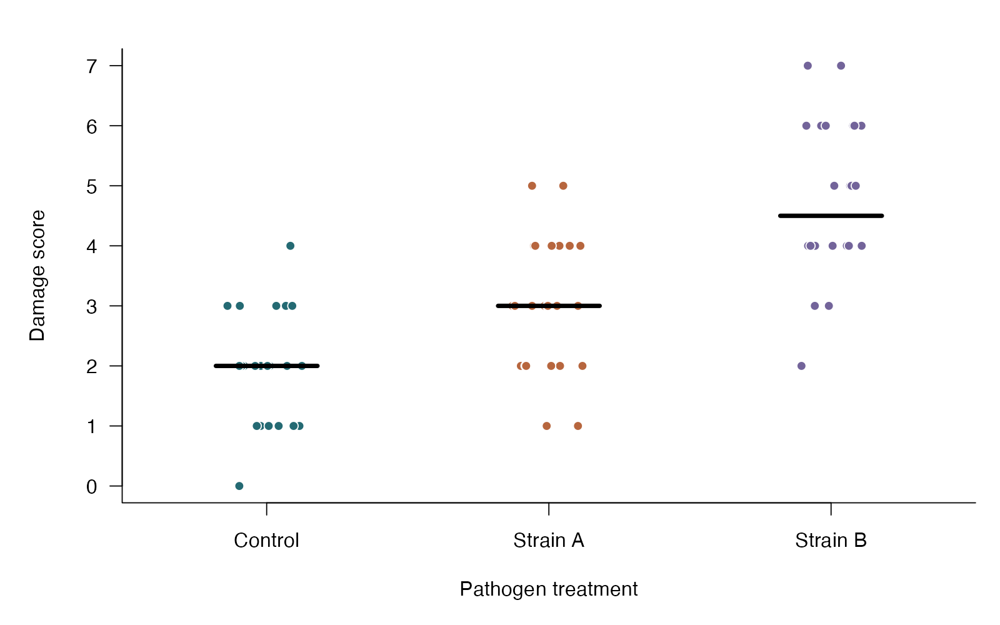

:::

::: {.column width="38%"}

**base R arguments**

**jitter / amount** — Separate tied points without changing scores

**pch / col** — Use group-specific point styling

**axis** — Display the actual ordered score values

**segments** — Add descriptive median marks

:::

:::

::: notes

This figure is generated from the saved CSV by modules/kruskal_wallis/analysis.R. An omnibus rank result identifies a group-level difference without choosing a pair.

:::


## Kruskal–Wallis: plot code {#kruskal_wallis-plot-code}

::: columns

::: {.column width="62%"}

```r
x <- as.integer(d$treatment)
plot(jitter(x, amount = .14), d$damage, pch = 21,
     bg = c("#246A73", "#B7663E", "#73649A")[x], col = "white",
     xaxt = "n", yaxt = "n", xlim = c(.6, 3.4), xlab = "Pathogen treatment", ylab = "Damage score")
axis(1, 1:3, levels(d$treatment)); axis(2, 0:8)
med <- tapply(d$damage, d$treatment, median)
segments(1:3 - .18, med, 1:3 + .18, med, lwd = 4)
```


:::

::: {.column width="38%"}

**Arguments to change**

**jitter / amount** — Separate tied points without changing scores

**pch / col** — Use group-specific point styling

**axis** — Display the actual ordered score values

**segments** — Add descriptive median marks

:::

:::

::: notes

This is an exact excerpt from analysis.R. Any preparation referenced by the excerpt appears in the complete companion script. The script opens a ragg PNG device before these lines and closes it afterward.

:::


## Kruskal–Wallis: question and null {#kruskal_wallis-question}

::: columns

::: {.column width="62%"}

**Scientific question**

Do damage-score distributions differ among pathogen treatments?

**Null / estimation target**

All groups share the same response distribution.

:::

::: {.column width="38%"}

**Relevant options**

- Response must have a meaningful order

- kruskal.test applies a tie correction

- Follow a relevant omnibus result with adjusted planned/Dunn comparisons

:::

:::

::: notes

Ask whether rejecting this null, or estimating this target, answers the biological question. An omnibus rank result identifies a group-level difference without choosing a pair.

:::


## Kruskal–Wallis: assumptions {#kruskal_wallis-assumptions}

::: columns

::: {.column width="62%"}

**What matters here**

- Independent plants

- Groups defined before analysis

- A common-shape shift model is needed for a median comparison

:::

::: {.column width="38%"}

**Parametric responses**

- Ordinal regression uses the score categories explicitly

- Welch ANOVA handles unequal variances for a mean question

**Nonparametric responses**

- Kruskal–Wallis extends rank-sum to several groups

- Friedman handles complete matched blocks

:::

:::

::: notes

Begin with the design. A model change should address a specific issue and preserve the scientific target where possible. A rank or permutation alternative has its own assumptions and may change the null; do not choose it solely from a normality-test p-value.

:::


## Kruskal–Wallis: run and read {#kruskal_wallis-analysis}

::: columns

::: {.column width="62%"}

```r
d$treatment <- factor(d$treatment, levels = c("Control", "Strain A", "Strain B"))
fit <- kruskal.test(damage ~ treatment, data = d)
```


:::

::: {.column width="38%"}

**Generated results**

- Kruskal–Wallis chi-square = 35.75; df = 2; p = 1.73e-08

- Observed medians: Control 2; Strain A 3; Strain B 4.5

- The omnibus result does not identify which pairs differ.

:::

:::

::: notes

Full executed model/test output:

```

	Kruskal-Wallis rank sum test

data:  damage by treatment
Kruskal-Wallis chi-squared = 35.745, df = 2, p-value = 1.73e-08

```


:::


## Kruskal–Wallis: interpret {#kruskal_wallis-interpret}

Damage-score distributions were compared using Kruskal–Wallis: chi-square(2) = 35.75, p = 1.73e-08. An omnibus result concerns at least one group difference; it does not identify a particular pair or generally establish different medians.

**Discuss:** A small omnibus p-value appears. Can you conclude that Strain A differs from Strain B?

::: notes

Teaching point: An omnibus rank result identifies a group-level difference without choosing a pair.

Instructor comparison with the simulated population: The score distributions differ across all three generating probabilities; expected scores are 2.0, 3.2, and 4.64. The equal-distributions null is false.

The reported estimate and p-value are calculated from this realized dataset; they need not exactly match the known population effect.

:::


## Dunn comparisons: the data {#dunn}

::: columns

::: {.column width="62%"}

Ecologists compare skewed leaf-damage measurements among four treatments.

- Continuous or ordered response

- Independent groups

- Pairwise pooled-rank comparisons

:::

::: {.column width="38%"}

**Other data like these**

- Parasite burden across habitats

- Ordered injury scores across treatments

- Skewed behavioral responses across environments

:::

:::

::: notes

Dunn rank comparisons

21 independent leaves from different plants per treatment.

leaf: Independent leaf from a distinct plant (ID)

treatment: Treatment A–D (category)

damage: Area removed from a leaf (mm²)

:::


## Dunn comparisons: simulate and save {#dunn-simulate}

::: columns

::: {.column width="62%"}

```r
set.seed(2105)
d <- data.frame(leaf = 1:84,
                treatment = rep(c("A", "B", "C", "D"), each = 21))
d$damage <- rlnorm(84, rep(c(1.2, 1.3, 1.7, 1.9), each = 21), .48)
write.csv(d, file.path(output_dir, "data.csv"), row.names = FALSE)
```


:::

::: {.column width="38%"}

**First saved row**

```
leaf: 1
treatment: A
damage: 2.386
```


:::

:::

::: notes

Seed: 2105

Generating model: 21 independent leaves in each of four groups have log-normal damage. Log damage is Normal(mean, 0.48²), with means 1.2, 1.3, 1.7 and 1.9 for A–D. Damage remains positive and unrounded. All leaves come from different plants.

Population truth: Group distributions differ; their population medians are exp(1.2), exp(1.3), exp(1.7) and exp(1.9) mm². Dunn tests pooled-rank tendencies, not arithmetic mean equality. The distributions also differ in original-scale spread.

The script writes data.csv before reading it for analysis. output_dir or out_dir is the folder supplied to the standalone script.

Original saved-data preview:

```
 leaf treatment   damage
    1         A 2.385584
    2         A 5.565609
    3         A 2.182752
    4         A 6.045659
```


:::


## Dunn comparisons: see the data {#dunn-plot}

::: columns

::: {.column width="62%"}

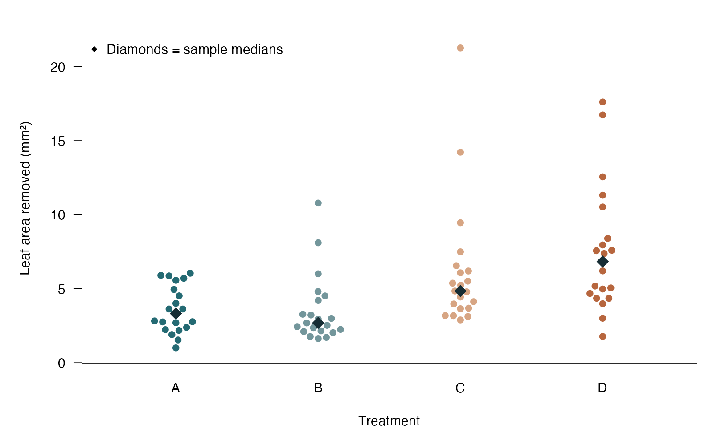

:::

::: {.column width="38%"}

**beeswarm arguments**

**beeswarm** — Show individual observations

**bg** — Color treatment groups

**points** — Add summary diamonds

**ylab** — Keep original measurement units

:::

:::

::: notes

This figure is generated from the saved CSV by modules/dunn/analysis.R. After choosing a rank question, retain multiplicity protection for pairwise follow-ups.

:::


## Dunn comparisons: plot code {#dunn-plot-code}

::: columns

::: {.column width="62%"}

```r
par(mar = c(5, 5, 2, 1), las = 1, bty = "l", cex = 1.15)
beeswarm::beeswarm(damage ~ treatment, data = d,
  pch = 21, bg = c("#246A73", "#73969B", "#D7A583", "#B7663E"),
  col = "white", cex = 1.25, xlab = "Treatment",
  ylab = "Leaf area removed (mm²)")
points(1:4, tapply(d$damage, d$treatment, median),
       pch = 18, cex = 2, col = "#172D34")
legend("topleft", "Diamonds = sample medians", pch = 18, bty = "n")
```


:::

::: {.column width="38%"}

**Arguments to change**

**beeswarm** — Show individual observations

**bg** — Color treatment groups

**points** — Add summary diamonds

**ylab** — Keep original measurement units

:::

:::

::: notes

This is an exact excerpt from analysis.R. Any preparation referenced by the excerpt appears in the complete companion script. The script opens a ragg PNG device before these lines and closes it afterward.

:::


## Dunn comparisons: question and null {#dunn-question}

::: columns

::: {.column width="62%"}

**Scientific question**

Which pairs differ in their rank tendencies?

**Null / estimation target**

For a chosen pair, pooled-rank tendencies are equal under the common-distribution null.

:::

::: {.column width="38%"}

**Relevant options**

- method = "holm" adjusts the six comparisons

- altp = TRUE prints ordinary two-sided p-values

- kw = FALSE avoids repeating the omnibus calculation

:::

:::

::: notes

Ask whether rejecting this null, or estimating this target, answers the biological question. After choosing a rank question, retain multiplicity protection for pairwise follow-ups.

:::


## Dunn comparisons: assumptions {#dunn-assumptions}

::: columns

::: {.column width="62%"}

**What matters here**

- Independent leaves/plants

- Rankable observations

- Comparable shapes are needed for a simple location interpretation

:::

::: {.column width="38%"}

**Parametric responses**

- If mean damage is the target, use an appropriate response model

- Model scale changes rather than relabeling ranks as mean effects

**Nonparametric responses**

- This is already a rank procedure

- A design-valid permutation can use a different prespecified statistic

:::

:::

::: notes

Begin with the design. A model change should address a specific issue and preserve the scientific target where possible. A rank or permutation alternative has its own assumptions and may change the null; do not choose it solely from a normality-test p-value.

:::


## Dunn comparisons: run and read {#dunn-analysis}

::: columns

::: {.column width="62%"}

```r
overall <- kruskal.test(damage ~ treatment, data = d)
comparisons <- dunn.test::dunn.test(d$damage, d$treatment,
  method = "holm", altp = TRUE, kw = FALSE, list = FALSE)
```


:::

::: {.column width="38%"}

**Generated results**

- Kruskal–Wallis p = 1.352e-05

- Highlighted pair: B - D

- Dunn z = -4.30

- Two-sided Holm-adjusted p = 0.0001018

:::

:::

::: notes

Full executed model/test output:

```

	Kruskal-Wallis rank sum test

data:  damage by treatment
Kruskal-Wallis chi-squared = 25.276, df = 3, p-value = 1.352e-05

$chi2
[1] 25.27627

$Z
[1]  0.5693239 -2.5682832 -3.1376070 -3.7322342 -4.3015580 -1.1639510

$altP
[1] 5.691364e-01 1.022036e-02 1.703331e-03 1.897889e-04 1.696014e-05
[6] 2.444439e-01

$altP.adjusted
[1] 0.5691363809 0.0306610890 0.0068133231 0.0009489447 0.0001017608
[6] 0.4888877458

$comparisons
[1] "A - B" "A - C" "B - C" "A - D" "B - D" "C - D"

```


:::


## Dunn comparisons: interpret {#dunn-interpret}

Across the six rank comparisons, the highlighted B - D comparison had Dunn z = -4.30 and two-sided Holm-adjusted p = 0.0001018. This compares pooled rank tendencies; with unequal distribution shapes, it is not simply a test of equal medians. The smallest adjusted p-value is highlighted after protecting the full six-pair family.

**Discuss:** Can this result be reported as a difference in mean damage?

::: notes

Teaching point: After choosing a rank question, retain multiplicity protection for pairwise follow-ups.

Instructor comparison with the simulated population: Group distributions differ; their population medians are exp(1.2), exp(1.3), exp(1.7) and exp(1.9) mm². Dunn tests pooled-rank tendencies, not arithmetic mean equality. The distributions also differ in original-scale spread.

The reported estimate and p-value are calculated from this realized dataset; they need not exactly match the known population effect.

:::


## Tukey comparisons: the data {#tukey}

::: columns

::: {.column width="62%"}

Plant growth is compared across four nutrient regimes.

- Continuous response

- Four independent groups

- Define the comparison family

:::

::: {.column width="38%"}

**Other data like these**

- Growth among microbial media

- Expression among genotypes

- Fitness among environments

:::

:::

::: notes

Tukey / Tukey–Kramer comparisons

20 independent plants per regime; all procedures use the same simulated dataset.

plant: Independent plant identifier (ID)

nutrient: Nutrient regime A–D (category)

biomass: Dry biomass (g)

:::


## Tukey comparisons: simulate and save {#tukey-simulate}

::: columns

::: {.column width="62%"}

```r
set.seed(2104)
d <- data.frame(plant = 1:80,
                nutrient = rep(c("A", "B", "C", "D"), each = 20))
d$biomass <- rnorm(80, rep(c(8, 9, 11.3, 12.1), each = 20), 1.7)
write.csv(d, file.path(output_dir, "data.csv"), row.names = FALSE)
```


:::

::: {.column width="38%"}

**First saved row**

```
plant: 1
nutrient: A
biomass: 6.671
```


:::

:::

::: notes

Seed: 2104

Generating model: 20 independent plants per nutrient regime have normal biomass with means 8, 9, 11.3 and 12.1 g for A–D and a common SD of 1.7 g. Values are not rounded. The identical dataset is regenerated separately for each comparison procedure.

Population truth: Population means for A–D are 8, 9, 11.3 and 12.1 g; all distinct pairwise mean-equality nulls are false.

The script writes data.csv before reading it for analysis. output_dir or out_dir is the folder supplied to the standalone script.

Original saved-data preview:

```
 plant nutrient  biomass
     1        A 6.670805
     2        A 9.421266
     3        A 6.285608
     4        A 7.799042
```


:::


## Tukey comparisons: see the data {#tukey-plot}

::: columns

::: {.column width="62%"}

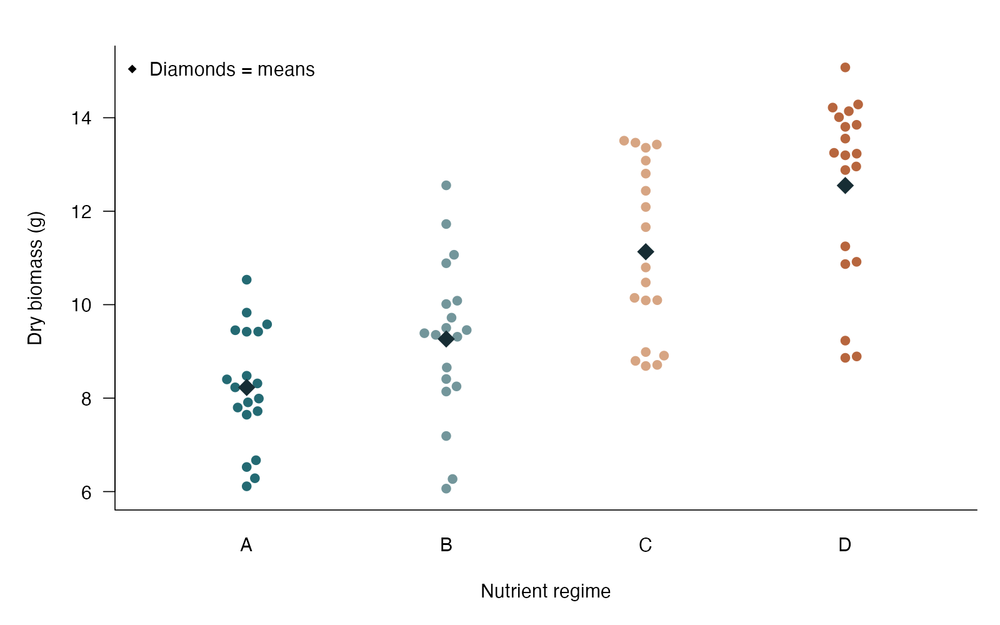

:::

::: {.column width="38%"}

**beeswarm arguments**

**bg** — Group fill colors

**pch / cex** — Point symbol and size

**points** — Add mean diamonds

**xlab / ylab** — Name groups and units

:::

:::

::: notes

This figure is generated from the saved CSV by modules/tukey/analysis.R. Protect the family of all six pairwise mean comparisons.

:::


## Tukey comparisons: plot code {#tukey-plot-code}

::: columns

::: {.column width="62%"}

```r
par(mar = c(5, 5, 2, 1), las = 1, bty = "l", cex = 1.15)
beeswarm::beeswarm(biomass ~ nutrient, data = d,
  pch = 21, bg = c("#246A73", "#73969B", "#D7A583", "#B7663E"),
  col = "white", cex = 1.25, xlab = "Nutrient regime",
  ylab = "Dry biomass (g)")
points(1:4, tapply(d$biomass, d$nutrient, mean),
       pch = 18, cex = 2, col = "#172D34")
legend("topleft", "Diamonds = means", pch = 18, bty = "n")
```


:::

::: {.column width="38%"}

**Arguments to change**

**bg** — Group fill colors

**pch / cex** — Point symbol and size

**points** — Add mean diamonds

**xlab / ylab** — Name groups and units

:::

:::

::: notes

This is an exact excerpt from analysis.R. Any preparation referenced by the excerpt appears in the complete companion script. The script opens a ragg PNG device before these lines and closes it afterward.

:::


## Tukey comparisons: question and null {#tukey-question}

::: columns

::: {.column width="62%"}

**Scientific question**

Which pairs of nutrient means differ?

**Null / estimation target**

For each pair, the two population means are equal.

:::

::: {.column width="38%"}

**Relevant options**

- TukeyHSD requests all pairwise mean contrasts

- conf.level sets simultaneous interval coverage

- Unequal group sizes use the Tukey–Kramer adjustment

:::

:::

::: notes

Ask whether rejecting this null, or estimating this target, answers the biological question. Protect the family of all six pairwise mean comparisons.

:::


## Tukey comparisons: assumptions {#tukey-assumptions}

::: columns

::: {.column width="62%"}

**What matters here**

- Independent plants

- ANOVA residual assumptions and common variance

- Specify the family of comparisons

:::

::: {.column width="38%"}

**Parametric responses**

- Use appropriate unequal-variance comparisons when needed

- Fit a justified response model before forming contrasts

**Nonparametric responses**

- Dunn compares pooled ranks with an explicit adjustment

- Rank comparisons change the target from means

:::

:::

::: notes

Begin with the design. A model change should address a specific issue and preserve the scientific target where possible. A rank or permutation alternative has its own assumptions and may change the null; do not choose it solely from a normality-test p-value.

:::


## Tukey comparisons: run and read {#tukey-analysis}

::: columns

::: {.column width="62%"}

```r
fit <- aov(biomass ~ nutrient, data = d)
comparisons <- TukeyHSD(fit, "nutrient", conf.level = .95)
comparisons
```


:::

::: {.column width="38%"}

**Generated results**

- Family: all six pairwise nutrient comparisons

- D minus C = 1.42 g

- Simultaneous 95% CI 0.04 to 2.80

- Tukey-adjusted p = 0.0415

:::

:::

::: notes

Full executed model/test output:

```
            Df Sum Sq Mean Sq F value   Pr(>F)    
nutrient     3  222.4   74.14   26.94 5.68e-12 ***
Residuals   76  209.2    2.75                     
---
Signif. codes:  0 ‘***’ 0.001 ‘**’ 0.01 ‘*’ 0.05 ‘.’ 0.1 ‘ ’ 1
  Tukey multiple comparisons of means
    95% family-wise confidence level

Fit: aov(formula = biomass ~ nutrient, data = d)

$nutrient
        diff         lwr      upr     p adj
B-A 1.037343 -0.34073261 2.415418 0.2056314
C-A 2.905036  1.52696022 4.283111 0.0000025
D-A 4.322102  2.94402599 5.700177 0.0000000
C-B 1.867693  0.48961729 3.245768 0.0035291
D-B 3.284759  1.90668306 4.662834 0.0000001
D-C 1.417066  0.03899023 2.795141 0.0415003

```


:::


## Tukey comparisons: interpret {#tukey-interpret}

Regime D exceeded C by 1.42 g (simultaneous 95% CI 0.04 to 2.80; Tukey-adjusted p = 0.0415). The interval and p-value account for all six pairwise comparisons; they do not protect every possible weighted contrast.

**Discuss:** Why is the adjusted p-value different from a single unadjusted t test?

::: notes

Teaching point: Protect the family of all six pairwise mean comparisons.

Instructor comparison with the simulated population: Population means for A–D are 8, 9, 11.3 and 12.1 g; all distinct pairwise mean-equality nulls are false.

The reported estimate and p-value are calculated from this realized dataset; they need not exactly match the known population effect.

:::


## Fisher LSD: the data {#fisher_lsd}

::: columns

::: {.column width="62%"}

Plant growth is compared across four nutrient regimes.

- Continuous response

- Four independent groups

- Define the comparison family

:::

::: {.column width="38%"}

**Other data like these**

- Growth among microbial media

- Expression among genotypes

- Fitness among environments

:::

:::

::: notes

Fisher least significant difference

20 independent plants per regime; all procedures use the same simulated dataset.

plant: Independent plant identifier (ID)

nutrient: Nutrient regime A–D (category)

biomass: Dry biomass (g)

:::


## Fisher LSD: simulate and save {#fisher_lsd-simulate}

::: columns

::: {.column width="62%"}

```r
set.seed(2104)
d <- data.frame(plant = 1:80,
                nutrient = rep(c("A", "B", "C", "D"), each = 20))
d$biomass <- rnorm(80, rep(c(8, 9, 11.3, 12.1), each = 20), 1.7)
write.csv(d, file.path(output_dir, "data.csv"), row.names = FALSE)
```


:::

::: {.column width="38%"}

**First saved row**

```
plant: 1
nutrient: A
biomass: 6.671
```


:::

:::

::: notes

Seed: 2104

Generating model: 20 independent plants per nutrient regime have normal biomass with means 8, 9, 11.3 and 12.1 g for A–D and a common SD of 1.7 g. Values are not rounded. The identical dataset is regenerated separately for each comparison procedure.

Population truth: Population means for A–D are 8, 9, 11.3 and 12.1 g; all distinct pairwise mean-equality nulls are false.

The script writes data.csv before reading it for analysis. output_dir or out_dir is the folder supplied to the standalone script.

Original saved-data preview:

```
 plant nutrient  biomass
     1        A 6.670805
     2        A 9.421266
     3        A 6.285608
     4        A 7.799042
```


:::


## Fisher LSD: see the data {#fisher_lsd-plot}

::: columns

::: {.column width="62%"}


:::

::: {.column width="38%"}

**beeswarm arguments**

**bg** — Group fill colors

**pch / cex** — Point symbol and size

**points** — Add mean diamonds

**xlab / ylab** — Name groups and units

:::

:::

::: notes

This figure is generated from the saved CSV by modules/fisher_lsd/analysis.R. An omnibus gate plus unadjusted comparisons is not general all-pairs protection.

:::


## Fisher LSD: plot code {#fisher_lsd-plot-code}

::: columns

::: {.column width="62%"}

```r
par(mar = c(5, 5, 2, 1), las = 1, bty = "l", cex = 1.15)
beeswarm::beeswarm(biomass ~ nutrient, data = d,
  pch = 21, bg = c("#246A73", "#73969B", "#D7A583", "#B7663E"),
  col = "white", cex = 1.25, xlab = "Nutrient regime",
  ylab = "Dry biomass (g)")
points(1:4, tapply(d$biomass, d$nutrient, mean),
       pch = 18, cex = 2, col = "#172D34")
legend("topleft", "Diamonds = means", pch = 18, bty = "n")
```


:::

::: {.column width="38%"}

**Arguments to change**

**bg** — Group fill colors

**pch / cex** — Point symbol and size

**points** — Add mean diamonds

**xlab / ylab** — Name groups and units

:::

:::

::: notes

This is an exact excerpt from analysis.R. Any preparation referenced by the excerpt appears in the complete companion script. The script opens a ragg PNG device before these lines and closes it afterward.

:::


## Fisher LSD: question and null {#fisher_lsd-question}

::: columns

::: {.column width="62%"}

**Scientific question**

What does an unadjusted pairwise comparison after the ANOVA gate test?

**Null / estimation target**

For a chosen pair, the two population means are equal.

:::

::: {.column width="38%"}

**Relevant options**

- The omnibus ANOVA is the protected-LSD gate

- adjust = "none" gives individual pairwise inference

- Use the shared ANOVA residual variance

:::

:::

::: notes

Ask whether rejecting this null, or estimating this target, answers the biological question. An omnibus gate plus unadjusted comparisons is not general all-pairs protection.

:::


## Fisher LSD: assumptions {#fisher_lsd-assumptions}

::: columns

::: {.column width="62%"}

**What matters here**

- Independent plants and common residual variance

- Appropriate normal-error model

- The gate does not guarantee broad familywise protection

:::

::: {.column width="38%"}

**Parametric responses**

- Tukey protects the all-pairs comparison family

- Use planned contrasts with a justified adjustment

**Nonparametric responses**

- Dunn plus adjustment addresses rank comparisons

- Switching to ranks does not remove multiplicity

:::

:::

::: notes

Begin with the design. A model change should address a specific issue and preserve the scientific target where possible. A rank or permutation alternative has its own assumptions and may change the null; do not choose it solely from a normality-test p-value.

:::


## Fisher LSD: run and read {#fisher_lsd-analysis}

::: columns

::: {.column width="62%"}

```r
fit <- lm(biomass ~ nutrient, data = d)
omnibus_p <- anova(fit)$`Pr(>F)`[1]
means <- emmeans::emmeans(fit, ~ nutrient)
comparisons <- NULL
if (omnibus_p < .05) {
  comparisons <- summary(emmeans::contrast(means, "pairwise"),
                         infer = c(TRUE, TRUE), adjust = "none")
}
```


:::

::: {.column width="38%"}

**Generated results**

- Omnibus p = 5.683e-12

- A - B = -1.04 g

- Individual 95% CI -2.08 to 0.01

- Unadjusted p = 0.05163

- Protected LSD first requires a significant omnibus test.

:::

:::

::: notes

Full executed model/test output:

```

Call:
lm(formula = biomass ~ nutrient, data = d)

Residuals:
    Min      1Q  Median      3Q     Max 
-3.6874 -1.0377  0.1064  1.2669  3.2888 

Coefficients:
            Estimate Std. Error t value Pr(>|t|)    
(Intercept)   8.2277     0.3710  22.179  < 2e-16 ***
nutrientB     1.0373     0.5246   1.977   0.0516 .  
nutrientC     2.9050     0.5246   5.537 4.21e-07 ***
nutrientD     4.3221     0.5246   8.239 3.85e-12 ***
---
Signif. codes:  0 ‘***’ 0.001 ‘**’ 0.01 ‘*’ 0.05 ‘.’ 0.1 ‘ ’ 1

Residual standard error: 1.659 on 76 degrees of freedom
Multiple R-squared:  0.5153,	Adjusted R-squared:  0.4962 
F-statistic: 26.94 on 3 and 76 DF,  p-value: 5.683e-12

 contrast estimate    SE df lower.CL upper.CL t.ratio p.value
 A - B       -1.04 0.525 76    -2.08  0.00753  -1.977  0.0516
 A - C       -2.91 0.525 76    -3.95 -1.86016  -5.537 <0.0001
 A - D       -4.32 0.525 76    -5.37 -3.27723  -8.239 <0.0001
 B - C       -1.87 0.525 76    -2.91 -0.82282  -3.560  0.0006
 B - D       -3.28 0.525 76    -4.33 -2.23988  -6.261 <0.0001
 C - D       -1.42 0.525 76    -2.46 -0.37219  -2.701  0.0085

Confidence level used: 0.95 
```


:::


## Fisher LSD: interpret {#fisher_lsd-interpret}

The omnibus test had p = 5.683e-12, so the protected LSD gate is passed in this example. The A - B difference was -1.04 g (individual 95% CI -2.08 to 0.01; unadjusted p = 0.05163). This gate does not generally protect all pairwise decisions when some of four or more means differ; use Tukey for the all-pairs family.

**Discuss:** What protection does the word “protected” fail to guarantee?

::: notes

Teaching point: An omnibus gate plus unadjusted comparisons is not general all-pairs protection.

Instructor comparison with the simulated population: Population means for A–D are 8, 9, 11.3 and 12.1 g; all distinct pairwise mean-equality nulls are false.

The reported estimate and p-value are calculated from this realized dataset; they need not exactly match the known population effect.

:::


## Scheffé contrasts: the data {#scheffe}

::: columns

::: {.column width="62%"}

Plant growth is compared across four nutrient regimes.

- Continuous response

- Four independent groups

- Define the comparison family

:::

::: {.column width="38%"}

**Other data like these**

- Growth among microbial media

- Expression among genotypes

- Fitness among environments

:::

:::

::: notes

Scheffé contrasts

20 independent plants per regime; all procedures use the same simulated dataset.

plant: Independent plant identifier (ID)

nutrient: Nutrient regime A–D (category)

biomass: Dry biomass (g)

:::


## Scheffé contrasts: simulate and save {#scheffe-simulate}

::: columns

::: {.column width="62%"}

```r
set.seed(2104)
d <- data.frame(plant = 1:80,
                nutrient = rep(c("A", "B", "C", "D"), each = 20))
d$biomass <- rnorm(80, rep(c(8, 9, 11.3, 12.1), each = 20), 1.7)
write.csv(d, file.path(output_dir, "data.csv"), row.names = FALSE)
```


:::

::: {.column width="38%"}

**First saved row**

```
plant: 1
nutrient: A
biomass: 6.671
```


:::

:::

::: notes

Seed: 2104

Generating model: 20 independent plants per nutrient regime have normal biomass with means 8, 9, 11.3 and 12.1 g for A–D and a common SD of 1.7 g. Values are not rounded. The identical dataset is regenerated separately for each comparison procedure.

Population truth: Population means for A–D are 8, 9, 11.3 and 12.1 g; all distinct pairwise mean-equality nulls are false. The specified (C+D)/2 − (A+B)/2 contrast equals 3.2 g.

The script writes data.csv before reading it for analysis. output_dir or out_dir is the folder supplied to the standalone script.

Original saved-data preview:

```
 plant nutrient  biomass
     1        A 6.670805
     2        A 9.421266
     3        A 6.285608
     4        A 7.799042
```


:::


## Scheffé contrasts: see the data {#scheffe-plot}

::: columns

::: {.column width="62%"}


:::

::: {.column width="38%"}

**beeswarm arguments**

**bg** — Group fill colors

**pch / cex** — Point symbol and size

**points** — Add mean diamonds

**xlab / ylab** — Name groups and units

:::

:::

::: notes

This figure is generated from the saved CSV by modules/scheffe/analysis.R. A weighted contrast asks a specific biological question; Scheffé protects the larger all-contrast family.

:::


## Scheffé contrasts: plot code {#scheffe-plot-code}

::: columns

::: {.column width="62%"}

```r
par(mar = c(5, 5, 2, 1), las = 1, bty = "l", cex = 1.15)
beeswarm::beeswarm(biomass ~ nutrient, data = d,
  pch = 21, bg = c("#246A73", "#73969B", "#D7A583", "#B7663E"),
  col = "white", cex = 1.25, xlab = "Nutrient regime",
  ylab = "Dry biomass (g)")
points(1:4, tapply(d$biomass, d$nutrient, mean),
       pch = 18, cex = 2, col = "#172D34")
legend("topleft", "Diamonds = means", pch = 18, bty = "n")
```


:::

::: {.column width="38%"}

**Arguments to change**

**bg** — Group fill colors

**pch / cex** — Point symbol and size

**points** — Add mean diamonds

**xlab / ylab** — Name groups and units

:::

:::

::: notes

This is an exact excerpt from analysis.R. Any preparation referenced by the excerpt appears in the complete companion script. The script opens a ragg PNG device before these lines and closes it afterward.

:::


## Scheffé contrasts: question and null {#scheffe-question}

::: columns

::: {.column width="62%"}

**Scientific question**

Does the average of regimes C and D differ from the average of A and B?

**Null / estimation target**

The contrast (μC + μD)/2 − (μA + μB)/2 is zero.

:::

::: {.column width="38%"}

**Relevant options**

- Contrast weights sum to zero

- adjust = "scheffe" protects a contrast family

- scheffe.rank = 3 covers all contrasts of four means

:::

:::

::: notes

Ask whether rejecting this null, or estimating this target, answers the biological question. A weighted contrast asks a specific biological question; Scheffé protects the larger all-contrast family.

:::


## Scheffé contrasts: assumptions {#scheffe-assumptions}

::: columns

::: {.column width="62%"}

**What matters here**

- Independent plants

- Normal-error ANOVA model with common variance

- Specify the means and contrast family

:::

::: {.column width="38%"}

**Parametric responses**

- Tukey is focused on pairwise comparisons

- A smaller prespecified contrast family can use a targeted adjustment

**Nonparametric responses**

- A contrast-specific permutation must preserve the design

- Dunn comparisons do not test this weighted mean contrast

:::

:::

::: notes

Begin with the design. A model change should address a specific issue and preserve the scientific target where possible. A rank or permutation alternative has its own assumptions and may change the null; do not choose it solely from a normality-test p-value.

:::


## Scheffé contrasts: run and read {#scheffe-analysis}

::: columns

::: {.column width="62%"}

```r
fit <- lm(biomass ~ nutrient, data = d)
means <- emmeans::emmeans(fit, ~ nutrient)
contrast <- emmeans::contrast(means,
  list("CD average minus AB average" = c(-.5, -.5, .5, .5)))
comparison <- summary(contrast, infer = c(TRUE, TRUE),
                      adjust = "scheffe", scheffe.rank = 3)
```


:::

::: {.column width="38%"}

**Generated results**

- Contrast: (C + D)/2 − (A + B)/2

- Estimated difference = 3.09 g

- Scheffé 95% CI 2.03 to 4.16

- Scheffé-adjusted p = 9.177e-11

:::

:::

::: notes

Full executed model/test output:

```

Call:
lm(formula = biomass ~ nutrient, data = d)

Residuals:
    Min      1Q  Median      3Q     Max 
-3.6874 -1.0377  0.1064  1.2669  3.2888 

Coefficients:
            Estimate Std. Error t value Pr(>|t|)    
(Intercept)   8.2277     0.3710  22.179  < 2e-16 ***
nutrientB     1.0373     0.5246   1.977   0.0516 .  
nutrientC     2.9050     0.5246   5.537 4.21e-07 ***
nutrientD     4.3221     0.5246   8.239 3.85e-12 ***
---
Signif. codes:  0 ‘***’ 0.001 ‘**’ 0.01 ‘*’ 0.05 ‘.’ 0.1 ‘ ’ 1

Residual standard error: 1.659 on 76 degrees of freedom
Multiple R-squared:  0.5153,	Adjusted R-squared:  0.4962 
F-statistic: 26.94 on 3 and 76 DF,  p-value: 5.683e-12

 contrast                    estimate    SE df lower.CL upper.CL t.ratio
 CD average minus AB average     3.09 0.371 76     2.03     4.16   8.343
 p.value
 <0.0001

Confidence level used: 0.95 
Conf-level adjustment: scheffe method with rank 3 
P value adjustment: scheffe method with rank 3 
```


:::


## Scheffé contrasts: interpret {#scheffe-interpret}

The average of regimes C and D exceeded the average of A and B by 3.09 g (Scheffé simultaneous 95% CI 2.03 to 4.16; adjusted p = 9.177e-11). Using rank 3 protects all mean contrasts among these four groups, a larger family than the pairwise comparisons protected by Tukey.

**Discuss:** Why can broader protection make an interval wider?

::: notes

Teaching point: A weighted contrast asks a specific biological question; Scheffé protects the larger all-contrast family.

Instructor comparison with the simulated population: Population means for A–D are 8, 9, 11.3 and 12.1 g; all distinct pairwise mean-equality nulls are false. The specified (C+D)/2 − (A+B)/2 contrast equals 3.2 g.

The reported estimate and p-value are calculated from this realized dataset; they need not exactly match the known population effect.

:::


## Factorial ANOVA: the data {#factorial_anova}

::: columns

::: {.column width="62%"}

Beetle larvae from two genotypes are independently reared at two temperatures.

- Continuous response: growth

- Two categorical predictors

- Independent treatment combinations

:::

::: {.column width="38%"}

**Other data like these**

- Genotype × nutrient effects on biomass

- Drug × pathogen strain effects

- Light × water effects on photosynthesis

:::

:::

::: notes

Factorial ANOVA: interactions

22 independent larvae per genotype × temperature combination.

replicate: Larva number within a genotype/temperature combination (ID)

genotype: Genotype A or B (category)

heat: Cool or warm rearing condition (category)

growth: Larval growth rate (mg/week)

:::


## Factorial ANOVA: simulate and save {#factorial_anova-simulate}

::: columns

::: {.column width="62%"}

```r
set.seed(2101)
d <- expand.grid(replicate = 1:22, genotype = c("A", "B"),
                 heat = c("Cool", "Warm"))
d$growth <- with(d, 14 + 1.4 * (genotype == "B") +
  2 * (heat == "Warm") + 2.3 * (genotype == "B" & heat == "Warm") +
  rnorm(nrow(d), 0, 2.1))
write.csv(d, file.path(output_dir, "data.csv"), row.names = FALSE)
```


:::

::: {.column width="38%"}

**First saved row**

```
replicate: 1
genotype: A
heat: Cool
growth: 16.71
```


:::

:::

::: notes

Seed: 2101

Generating model: There are 22 larvae in each of four genotype-by-temperature combinations. Growth = 14 + 1.4 if genotype B + 2 if warm + 2.3 if both genotype B and warm + independent Normal(0, 2.1²) error, in mg/week. Values are not rounded.

Population truth: The temperature effect is 2 mg/week in genotype A and 4.3 mg/week in B, so the interaction is 2.3 mg/week. The interaction null is false.

The script writes data.csv before reading it for analysis. output_dir or out_dir is the folder supplied to the standalone script.

Original saved-data preview:

```
 replicate genotype heat   growth
         1        A Cool 16.70898
         2        A Cool 13.52018
         3        A Cool 15.58859
         4        A Cool 14.19103
```


:::


## Factorial ANOVA: see the data {#factorial_anova-plot}

::: columns

::: {.column width="62%"}

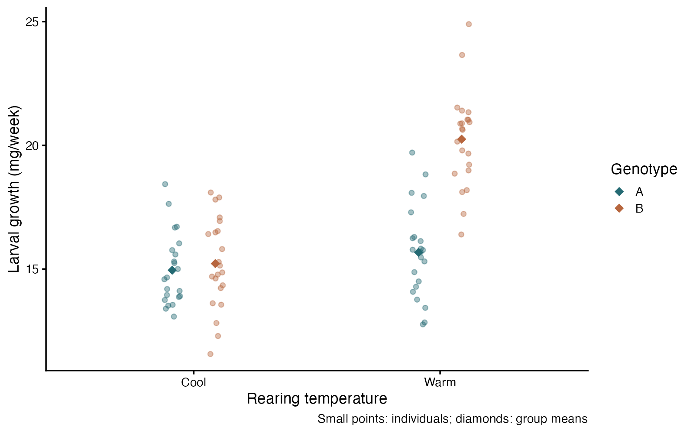

:::

::: {.column width="38%"}

**ggplot2 arguments**

**position_jitterdodge** — Separate raw points within groups

**alpha** — Reduce point overlap

**stat_summary(fun = mean)** — Mark each mean

**shape** — Use diamonds for summaries

:::

:::

::: notes

This figure is generated from the saved CSV by modules/factorial_anova/analysis.R. An interaction is a difference of differences: a main-effect summary can conceal it.

:::


## Factorial ANOVA: plot code {#factorial_anova-plot-code}

::: columns

::: {.column width="62%"}

```r
p <- ggplot(d, aes(heat, growth, color = genotype)) +
  geom_point(position = position_jitterdodge(jitter.width = .13,
    dodge.width = .35, seed = 21), alpha = .42, size = 2) +
  stat_summary(fun = mean, geom = "point",
    position = position_dodge(.35), size = 4, shape = 18) +
  scale_color_manual(values = c("#246A73", "#B7663E")) +
  labs(x = "Rearing temperature", y = "Larval growth (mg/week)",
       color = "Genotype", caption = "Small points: individuals; diamonds: group means") +
  theme_classic(base_size = 16)
print(p)
```


:::

::: {.column width="38%"}

**Arguments to change**

**position_jitterdodge** — Separate raw points within groups

**alpha** — Reduce point overlap

**stat_summary(fun = mean)** — Mark each mean

**shape** — Use diamonds for summaries

:::

:::

::: notes

This is an exact excerpt from analysis.R. Any preparation referenced by the excerpt appears in the complete companion script. The script opens a ragg PNG device before these lines and closes it afterward.

:::


## Factorial ANOVA: question and null {#factorial_anova-question}

::: columns

::: {.column width="62%"}

**Scientific question**

Does the temperature effect on mean growth depend on genotype?

**Null / estimation target**

The warm-minus-cool mean growth difference is the same for genotypes A and B.

:::

::: {.column width="38%"}

**Relevant options**

- genotype * heat includes both main effects and their interaction

- The interaction coefficient is a difference of differences

- Factor levels define the reference comparison

:::

:::

::: notes

Ask whether rejecting this null, or estimating this target, answers the biological question. An interaction is a difference of differences: a main-effect summary can conceal it.

:::


## Factorial ANOVA: assumptions {#factorial_anova-assumptions}

::: columns

::: {.column width="62%"}

**What matters here**

- Independent larvae

- Appropriate residual distribution and comparable residual spread

- Replicate each treatment combination

:::

::: {.column width="38%"}

**Parametric responses**

- Model unequal residual spread if needed

- Transform only when the transformed mean answers the question

**Nonparametric responses**

- A factorial permutation must preserve the design and tested term

- Separate rank tests do not test the interaction

:::

:::

::: notes

Begin with the design. A model change should address a specific issue and preserve the scientific target where possible. A rank or permutation alternative has its own assumptions and may change the null; do not choose it solely from a normality-test p-value.

:::


## Factorial ANOVA: run and read {#factorial_anova-analysis}

::: columns

::: {.column width="62%"}

```r
fit <- lm(growth ~ genotype * heat, data = d)
summary(fit)
interaction_ci <- confint(fit)["genotypeB:heatWarm", ]
```


:::

::: {.column width="38%"}

**Generated results**

- Interaction = 4.30 mg/week

- 95% CI 2.80 to 5.81

- t(84) = 5.69; p = 1.78e-07

:::

:::

::: notes

Full executed model/test output:

```

Call:
lm(formula = growth ~ genotype * heat, data = d)

Residuals:
    Min      1Q  Median      3Q     Max 
-3.8521 -1.1843 -0.0363  1.0850  4.6476 

Coefficients:
                   Estimate Std. Error t value Pr(>|t|)    
(Intercept)         14.9526     0.3779  39.567  < 2e-16 ***
genotypeB            0.2676     0.5344   0.501    0.618    
heatWarm             0.7240     0.5344   1.355    0.179    
genotypeB:heatWarm   4.3035     0.7558   5.694 1.78e-07 ***
---
Signif. codes:  0 ‘***’ 0.001 ‘**’ 0.01 ‘*’ 0.05 ‘.’ 0.1 ‘ ’ 1

Residual standard error: 1.773 on 84 degrees of freedom
Multiple R-squared:  0.6099,	Adjusted R-squared:  0.5959 
F-statistic: 43.77 on 3 and 84 DF,  p-value: < 2.2e-16

```


:::


## Factorial ANOVA: interpret {#factorial_anova-interpret}

The warm-minus-cool growth effect was 4.30 mg/week greater in genotype B than A (95% CI 2.80 to 5.81; p = 1.78e-07). The interaction asks whether the temperature effect depends on genotype; a single average temperature effect would hide this difference.

**Discuss:** Explain the interaction in words before reading its p-value.

::: notes

Teaching point: An interaction is a difference of differences: a main-effect summary can conceal it.

Instructor comparison with the simulated population: The temperature effect is 2 mg/week in genotype A and 4.3 mg/week in B, so the interaction is 2.3 mg/week. The interaction null is false.

The reported estimate and p-value are calculated from this realized dataset; they need not exactly match the known population effect.

:::


## ANCOVA: the data {#ancova}

::: columns

::: {.column width="62%"}

Plant ecologists compare nutrient treatment while accounting for initial plant height.

- Continuous response

- One factor plus a quantitative covariate

- An adjusted mean comparison

:::

::: {.column width="38%"}

**Other data like these**

- Group morphology adjusted for body size

- Enzyme activity adjusted for temperature

- Fitness adjusted for initial mass

:::

:::

::: notes

ANCOVA: an adjusted group comparison

90 independent plants; treatment groups overlap in initial height.

plant: Independent plant identifier (ID)

treatment: Control or nutrient addition (category)

initial: Height before treatment (cm)

biomass: Final dry biomass (g)

:::


## ANCOVA: simulate and save {#ancova-simulate}

::: columns

::: {.column width="62%"}

```r
set.seed(2102)
d <- data.frame(plant = 1:90, treatment = rep(c("Control", "Nutrient"), each = 45),
                initial = runif(90, 3, 9))
d$biomass <- with(d, 2 + 1.5 * initial +
  2.4 * (treatment == "Nutrient") + rnorm(90, 0, 1.8))
write.csv(d, file.path(output_dir, "data.csv"), row.names = FALSE)
```


:::

::: {.column width="38%"}

**First saved row**

```
plant: 1
treatment: Control
initial: 5.71
biomass: 11.32
```


:::

:::

::: notes

Seed: 2102

Generating model: 45 independent plants are assigned to each treatment. Initial height is Uniform(3, 9) cm. Biomass = 2 + 1.5 × initial height + 2.4 if nutrient-treated + independent Normal(0, 1.8²) error, in g. No rounding is applied.

Population truth: The nutrient treatment increases the population mean biomass by 2.4 g at any shared initial height. Both groups have slope 1.5 g/cm. The adjusted treatment null is false.

The script writes data.csv before reading it for analysis. output_dir or out_dir is the folder supplied to the standalone script.

Original saved-data preview:

```
 plant treatment  initial  biomass
     1   Control 5.709542 11.31708
     2   Control 7.877332 12.85633
     3   Control 4.503380 11.12236
     4   Control 5.569663 12.57494
```


:::


## ANCOVA: see the data {#ancova-plot}

::: columns

::: {.column width="62%"}

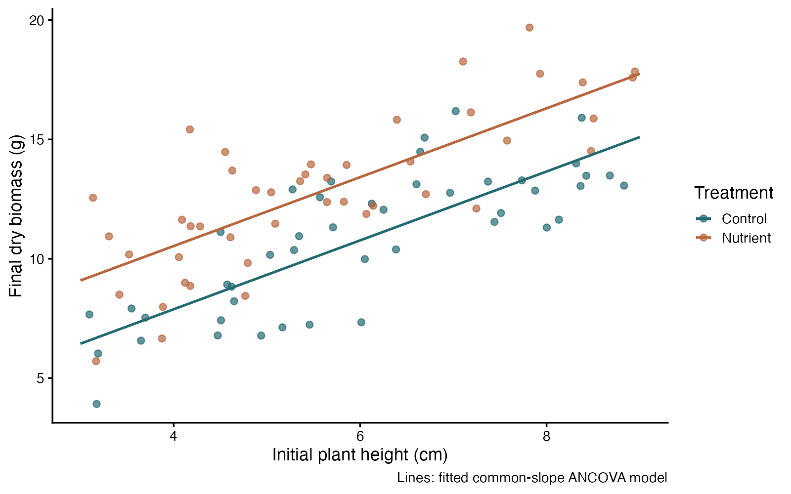

:::

::: {.column width="38%"}

**ggplot2 arguments**

**aes(color = treatment)** — Distinguish groups

**alpha** — Make overlap visible

**geom_line(data=...)** — Draw the fitted model

**labs** — State biological units

:::

:::

::: notes

This figure is generated from the saved CSV by modules/ancova/analysis.R. The scientific comparison holds the covariate fixed; the raw mean comparison is different.

:::


## ANCOVA: plot code {#ancova-plot-code}

::: columns

::: {.column width="62%"}

```r
p <- ggplot(d, aes(initial, biomass, color = treatment)) +
  geom_point(size = 2.5, alpha = .7) +
  geom_line(data = predictions, aes(y = fit), linewidth = 1.1) +
  scale_color_manual(values = c("#246A73", "#B7663E")) +
  labs(x = "Initial plant height (cm)", y = "Final dry biomass (g)",
       color = "Treatment", caption = "Lines: fitted common-slope ANCOVA model") +
  theme_classic(base_size = 16)
print(p)
```


:::

::: {.column width="38%"}

**Arguments to change**

**aes(color = treatment)** — Distinguish groups

**alpha** — Make overlap visible

**geom_line(data=...)** — Draw the fitted model

**labs** — State biological units

:::

:::

::: notes

This is an exact excerpt from analysis.R. Any preparation referenced by the excerpt appears in the complete companion script. The script opens a ragg PNG device before these lines and closes it afterward.

:::


## ANCOVA: question and null {#ancova-question}

::: columns

::: {.column width="62%"}

**Scientific question**

Do treatments differ in mean biomass at the same initial height?

**Null / estimation target**

The treatment mean difference is zero at a common initial height in the stated model.

:::

::: {.column width="38%"}

**Relevant options**

- treatment + initial fits parallel slopes

- treatment * initial allows different slopes

- Factor reference sets the direction of the contrast

:::

:::

::: notes

Ask whether rejecting this null, or estimating this target, answers the biological question. The scientific comparison holds the covariate fixed; the raw mean comparison is different.

:::


## ANCOVA: assumptions {#ancova-assumptions}

::: columns

::: {.column width="62%"}

**What matters here**

- Independent plants; appropriate residual spread

- A suitable linear height relationship

- Overlapping covariate ranges across treatments

:::

::: {.column width="38%"}

**Parametric responses**

- Allow an interaction if slopes differ

- Model unequal variance or a justified transformation

**Nonparametric responses**

- A covariate-aware permutation can test an adjusted effect

- A rank-sum test would discard the height adjustment

:::

:::

::: notes

Begin with the design. A model change should address a specific issue and preserve the scientific target where possible. A rank or permutation alternative has its own assumptions and may change the null; do not choose it solely from a normality-test p-value.

:::


## ANCOVA: run and read {#ancova-analysis}

::: columns

::: {.column width="62%"}

```r
fit <- lm(biomass ~ treatment + initial, data = d)
summary(fit)
adjusted_ci <- confint(fit)["treatmentNutrient", ]
```


:::

::: {.column width="38%"}

**Generated results**

- Adjusted nutrient minus control = 2.65 g

- 95% CI 1.84 to 3.45

- t(87) = 6.55; p = 3.797e-09

:::

:::

::: notes

Full executed model/test output:

```

Call:
lm(formula = biomass ~ treatment + initial, data = d)

Residuals:
   Min     1Q Median     3Q    Max 
-3.692 -1.195  0.030  1.050  4.634 

Coefficients:
                  Estimate Std. Error t value Pr(>|t|)    
(Intercept)         2.1147     0.7830   2.701  0.00831 ** 
treatmentNutrient   2.6479     0.4040   6.555  3.8e-09 ***
initial             1.4427     0.1212  11.900  < 2e-16 ***
---
Signif. codes:  0 ‘***’ 0.001 ‘**’ 0.01 ‘*’ 0.05 ‘.’ 0.1 ‘ ’ 1

Residual standard error: 1.899 on 87 degrees of freedom
Multiple R-squared:  0.6571,	Adjusted R-squared:  0.6492 
F-statistic: 83.35 on 2 and 87 DF,  p-value: < 2.2e-16

```


:::


## ANCOVA: interpret {#ancova-interpret}

At the same initial height, nutrient-treated plants had 2.65 g greater mean biomass (95% CI 1.84 to 3.45; p = 3.797e-09). This fitted model assumes a common height slope; the adjusted treatment comparison is supported by overlapping height ranges.

**Discuss:** Why is comparing raw group means a different question?

::: notes

Teaching point: The scientific comparison holds the covariate fixed; the raw mean comparison is different.

Instructor comparison with the simulated population: The nutrient treatment increases the population mean biomass by 2.4 g at any shared initial height. Both groups have slope 1.5 g/cm. The adjusted treatment null is false.

The reported estimate and p-value are calculated from this realized dataset; they need not exactly match the known population effect.

:::


## Repeated ANOVA: the data {#repeated_anova}

::: columns

::: {.column width="62%"}

Physiologists measure the same animals at four assay temperatures.

- Continuous response

- Four observations per animal

- Subject ID defines pairing

:::

::: {.column width="38%"}

**Other data like these**

- Photosynthesis across light levels

- Hormones across sampling times

- Enzyme activity across assay conditions

:::

:::

::: notes

Repeated-measures ANOVA

Each of 24 animals provides all four measurements.

temperature: Assay temperature (°C)

subject: Animal measured at all four temperatures (ID)

oxygen: Measured oxygen consumption (µmol/hour)

:::


## Repeated ANOVA: simulate and save {#repeated_anova-simulate}

::: columns

::: {.column width="62%"}

```r
set.seed(2103)
d <- expand.grid(temperature = c(15, 20, 25, 30), subject = 1:24)
individual <- rnorm(24, 0, 2)
d$oxygen <- 8 + .35 * (d$temperature - 15) +
  individual[d$subject] + rnorm(nrow(d), 0, 1.3)
write.csv(d, file.path(output_dir, "data.csv"), row.names = FALSE)
```


:::

::: {.column width="38%"}

**First saved row**

```
temperature: 15
subject: 1
oxygen: 8.108
```


:::

:::

::: notes

Seed: 2103

Generating model: 24 animals are measured at 15, 20, 25 and 30°C. Oxygen use = 8 + 0.35 × (temperature − 15) + an animal-specific Normal(0, 2²) intercept + independent Normal(0, 1.3²) observation error. Intercepts are shared within animals, producing repeated-measure dependence and a spherical covariance structure. No rounding is applied.

Population truth: Population means are 8, 9.75, 11.5 and 13.25 µmol/hour. The endpoint difference is 5.25 µmol/hour and the equal-means null is false.

The script writes data.csv before reading it for analysis. output_dir or out_dir is the folder supplied to the standalone script.

Original saved-data preview:

```
 temperature subject    oxygen condition
          15       1  8.108364        15
          20       1  7.987102        20
          25       1 13.787232        25
          30       1 14.056866        30
```


:::


## Repeated ANOVA: see the data {#repeated_anova-plot}

::: columns

::: {.column width="62%"}

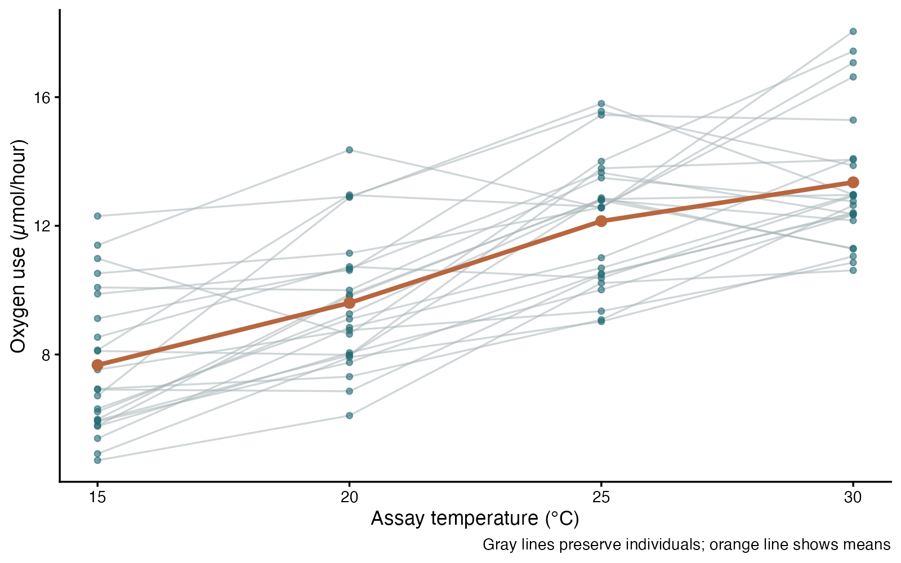

:::

::: {.column width="38%"}

**ggplot2 arguments**

**group = subject** — Connect measurements from the same animal

**alpha** — Reduce line clutter

**stat_summary** — Show the mean trajectory

**breaks** — Label actual assay temperatures

:::

:::

::: notes

This figure is generated from the saved CSV by modules/repeated_anova/analysis.R. The subject ID, not the row, defines independent replication.

:::


## Repeated ANOVA: plot code {#repeated_anova-plot-code}

::: columns

::: {.column width="62%"}

```r
p <- ggplot(d, aes(temperature, oxygen)) +
  geom_line(aes(group = subject), color = "#A9B5B8", alpha = .55) +
  geom_point(color = "#246A73", alpha = .6, size = 1.8) +
  stat_summary(fun = mean, geom = "line", color = "#B7663E", linewidth = 1.7) +
  stat_summary(fun = mean, geom = "point", color = "#B7663E", size = 3.5) +
  scale_x_continuous(breaks = c(15, 20, 25, 30)) +
  labs(x = "Assay temperature (°C)", y = "Oxygen use (µmol/hour)",
       caption = "Gray lines preserve individuals; orange line shows means") +
  theme_classic(base_size = 16)
print(p)
```


:::

::: {.column width="38%"}

**Arguments to change**

**group = subject** — Connect measurements from the same animal

**alpha** — Reduce line clutter

**stat_summary** — Show the mean trajectory

**breaks** — Label actual assay temperatures

:::

:::

::: notes

This is an exact excerpt from analysis.R. Any preparation referenced by the excerpt appears in the complete companion script. The script opens a ragg PNG device before these lines and closes it afterward.

:::


## Repeated ANOVA: question and null {#repeated_anova-question}

::: columns

::: {.column width="62%"}

**Scientific question**

Are mean oxygen-use rates equal across temperatures within animals?

**Null / estimation target**

All four population temperature means are equal.

:::

::: {.column width="38%"}

**Relevant options**

- Error(subject/condition) preserves the within-animal design

- Treat condition as a factor for a general timepoint comparison

- The endpoint contrast is prespecified separately

:::

:::

::: notes

Ask whether rejecting this null, or estimating this target, answers the biological question. The subject ID, not the row, defines independent replication.

:::


## Repeated ANOVA: assumptions {#repeated_anova-assumptions}

::: columns

::: {.column width="62%"}

**What matters here**

- Independent animals

- Sphericity for the usual repeated-measures F test

- Appropriate residual behavior and complete measurements

:::

::: {.column width="38%"}

**Parametric responses**

- Use a sphericity correction when needed

- An LMM supports a more flexible covariance structure

**Nonparametric responses**

- Friedman compares within-subject ranks in complete blocks

- A within-block permutation must preserve the assignment design

:::

:::

::: notes

Begin with the design. A model change should address a specific issue and preserve the scientific target where possible. A rank or permutation alternative has its own assumptions and may change the null; do not choose it solely from a normality-test p-value.

:::


## Repeated ANOVA: run and read {#repeated_anova-analysis}

::: columns

::: {.column width="62%"}

```r
fit <- aov(oxygen ~ condition + Error(subject/condition), data = d)
summary(fit)
endpoints <- t.test(d$oxygen[d$temperature == 30],
                   d$oxygen[d$temperature == 15], paired = TRUE)
```


:::

::: {.column width="38%"}

**Generated results**

- Condition F(3, 69) = 84.32

- Omnibus p = 4.966e-23

- Planned 30−15°C mean difference = 5.68 µmol/hour

- 95% CI 4.99 to 6.38

:::

:::

::: notes

Full executed model/test output:

```

Error: subject
          Df Sum Sq Mean Sq F value Pr(>F)
Residuals 23  285.9   12.43               

Error: subject:condition
          Df Sum Sq Mean Sq F value Pr(>F)    
condition  3  467.9  155.98   84.32 <2e-16 ***
Residuals 69  127.6    1.85                   
---
Signif. codes:  0 ‘***’ 0.001 ‘**’ 0.01 ‘*’ 0.05 ‘.’ 0.1 ‘ ’ 1
```


:::


## Repeated ANOVA: interpret {#repeated_anova-interpret}

Within the same 24 animals, temperature means differed (F(3, 69) = 84.32, p = 4.966e-23). The prespecified 30−15°C mean increase was 5.68 µmol/hour (95% CI 4.99 to 6.38). The repeated-measures F test assumes sphericity; the experiment has 24 independent animals, not 96 independent rows.

**Discuss:** Why does ignoring subject ID create the wrong analysis?

::: notes

Teaching point: The subject ID, not the row, defines independent replication.

Instructor comparison with the simulated population: Population means are 8, 9.75, 11.5 and 13.25 µmol/hour. The endpoint difference is 5.25 µmol/hour and the equal-means null is false.

The reported estimate and p-value are calculated from this realized dataset; they need not exactly match the known population effect.

:::


## Friedman: the data {#friedman}

::: columns

::: {.column width="62%"}

Sensory biologists record activity scores from each insect under three light conditions.

- Ordered or continuous response

- Three or more matched conditions

- Complete blocks: one value per insect per condition

:::

::: {.column width="38%"}

**Other data like these**

- Each donor tested with three reagents

- Matched sites under three protocols

- Repeated preference ratings

:::

:::

::: notes

Friedman test

Eighteen independent insects each complete all three conditions in randomized order.

insect: Independent insect/block identifier (none)

condition: Light condition (category)

activity_score: Rounded and bounded activity measure (score 0 to 10)

:::


## Friedman: simulate and save {#friedman-simulate}

::: columns

::: {.column width="62%"}

```r
set.seed(1108)
insect <- rep(1:18, each = 3)
condition <- rep(c("Dim", "Moderate", "Bright"), 18)
score <- pmax(0, pmin(10, round(rep(rnorm(18, 5, 1.3), each = 3) +
             rep(c(0, .8, 1.6), 18) + rnorm(54, 0, 1))))
d <- data.frame(insect, condition, activity_score = score)
write.csv(d, file.path(output_dir, "data.csv"), row.names = FALSE)
```


:::

::: {.column width="38%"}

**First saved row**

```
insect: 1
condition: Dim
activity_score: 6
```


:::

:::

::: notes

Seed: 1108

Generating model: 18 insects each receive all 3 conditions. Each insect has a Normal(5, 1.3 SD) baseline; Dim, Moderate, and Bright add 0, 0.8, and 1.6. Independent Normal(0, 1 SD) noise is added, then scores are rounded and restricted to 0–10.

Population truth: Condition effects exist before rounding (0, +0.8, +1.6), and condition score distributions differ after rounding. Repeated observations share an insect baseline.

The script writes data.csv before reading it for analysis. output_dir or out_dir is the folder supplied to the standalone script.

Original saved-data preview:

```
 insect condition activity_score
      1       Dim              6
      1  Moderate              7
      1    Bright              7
      2       Dim              7
```


:::


## Friedman: see the data {#friedman-plot}

::: columns

::: {.column width="62%"}

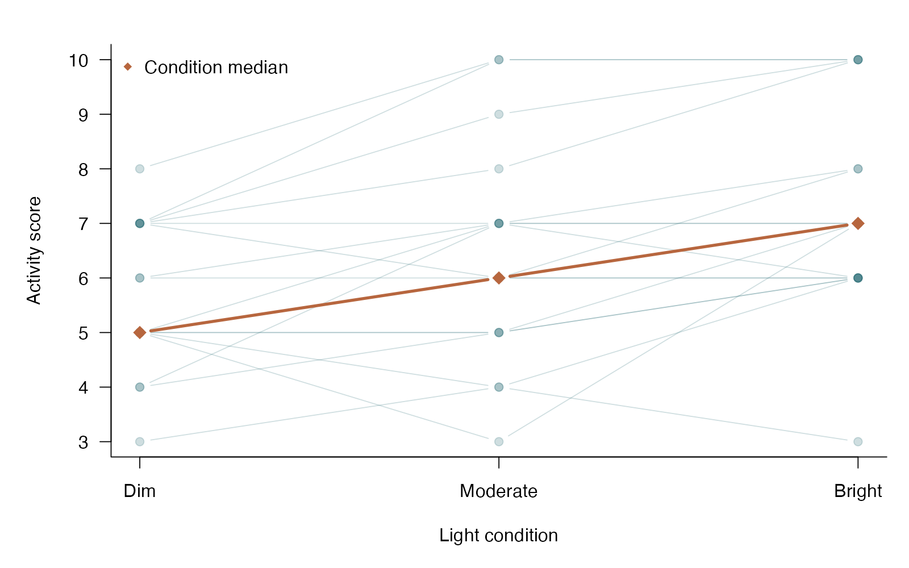

:::

::: {.column width="38%"}

**base R arguments**

**matplot** — Draw one profile for each independent insect

**type="b"** — Show both observations and their pairing

**col** — Use translucent lines for repeated observations

**points / type="b"** — Overlay condition medians

:::

:::

::: notes

This figure is generated from the saved CSV by modules/friedman/analysis.R. Rank within each insect so that between-insect differences do not masquerade as condition effects.

:::


## Friedman: plot code {#friedman-plot-code}

::: columns

::: {.column width="62%"}

```r
wide <- xtabs(activity_score ~ insect + condition, data = d)
matplot(1:3, t(wide), type = "b", pch = 19, lty = 1, col = "#246A7338",
        xaxt = "n", xlab = "Light condition", ylab = "Activity score")
axis(1, 1:3, levels(d$condition))
points(1:3, apply(wide, 2, median), type = "b", pch = 18,
       col = "#B7663E", lwd = 3, cex = 1.6)
legend("topleft", "Condition median", pch = 18, col = "#B7663E", bty = "n")
```


:::

::: {.column width="38%"}

**Arguments to change**

**matplot** — Draw one profile for each independent insect

**type="b"** — Show both observations and their pairing

**col** — Use translucent lines for repeated observations

**points / type="b"** — Overlay condition medians

:::

:::

::: notes

This is an exact excerpt from analysis.R. Any preparation referenced by the excerpt appears in the complete companion script. The script opens a ragg PNG device before these lines and closes it afterward.

:::


## Friedman: question and null {#friedman-question}

::: columns

::: {.column width="62%"}

**Scientific question**

Do light conditions differ after accounting for insect-to-insect variation?

**Null / estimation target**

Within blocks, condition labels are exchangeable: no systematic condition effect.

:::

::: {.column width="38%"}

**Relevant options**

- response ~ condition | insect declares the block

- Require a complete observation for each block-condition

- Post hoc paired comparisons need multiplicity control

:::

:::

::: notes

Ask whether rejecting this null, or estimating this target, answers the biological question. Rank within each insect so that between-insect differences do not masquerade as condition effects.

:::


## Friedman: assumptions {#friedman-assumptions}

::: columns

::: {.column width="62%"}

**What matters here**

- Independent insects/blocks

- Comparable measurement across conditions

- No unmodeled order/carryover explanation for the contrast

:::

::: {.column width="38%"}

**Parametric responses**

- Repeated-measures ANOVA for mean questions with suitable covariance

- Mixed models handle more complex dependence or incomplete data

**Nonparametric responses**

- Friedman ranks within each complete block

- It does not repair missing cells or arbitrary clustering

:::

:::

::: notes

Begin with the design. A model change should address a specific issue and preserve the scientific target where possible. A rank or permutation alternative has its own assumptions and may change the null; do not choose it solely from a normality-test p-value.

:::


## Friedman: run and read {#friedman-analysis}

::: columns

::: {.column width="62%"}

```r
d$condition <- factor(d$condition, levels = c("Dim", "Moderate", "Bright"))
d$insect <- factor(d$insect)
fit <- friedman.test(activity_score ~ condition | insect, data = d)
```


:::

::: {.column width="38%"}

**Generated results**

- Independent blocks = 18; conditions = 3

- Friedman chi-square = 17.63; df = 2; p = 0.0001482

- Condition medians: Dim 5; Moderate 6; Bright 7

:::

:::

::: notes

Full executed model/test output:

```

	Friedman rank sum test

data:  activity_score and condition and insect
Friedman chi-squared = 17.633, df = 2, p-value = 0.0001482

```


:::


## Friedman: interpret {#friedman-interpret}

For 18 insects measured under all three conditions, the Friedman comparison gave chi-square(2) = 17.63, p = 0.0001482. This tests a systematic condition effect within insects; it does not identify which conditions differ.

**Discuss:** Why is Kruskal–Wallis inappropriate if the same insects appear in every condition?

::: notes

Teaching point: Rank within each insect so that between-insect differences do not masquerade as condition effects.

Instructor comparison with the simulated population: Condition effects exist before rounding (0, +0.8, +1.6), and condition score distributions differ after rounding. Repeated observations share an insect baseline.

The reported estimate and p-value are calculated from this realized dataset; they need not exactly match the known population effect.

:::


## Correlation {#xkcd-552}

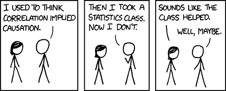{height=6in}

[Randall Munroe / xkcd · https://xkcd.com/552](https://xkcd.com/552/) · [CC BY-NC 2.5](https://creativecommons.org/licenses/by-nc/2.5/)

::: notes

An association can answer whether two measurements vary together; it does not establish a causal effect.

Comic: Correlation. https://xkcd.com/552/

Original course source: lectures__exp-1.pptx, slide 1. Artwork reproduced unchanged. Randall Munroe / xkcd; Creative Commons Attribution-NonCommercial 2.5.

Accessible description: A statistics student questions whether the class caused a change in their view of correlation and causation.

:::


## Pearson correlation: the data {#pearson}

::: columns

::: {.column width="62%"}

Evolutionary biologists measure wing and tail lengths in adult birds from a single population.

- Two continuous variables

- Independent pairs of measurements

- Strength of a linear association is the target

:::

::: {.column width="38%"}

**Other data like these**

- Protein and transcript abundance

- Leaf area and dry mass

- Metabolic rate and organ size

:::

:::

::: notes

Pearson correlation

Each independent bird contributes one pair of continuous traits.

bird: Independent bird identifier (none)

wing_mm: Wing length (mm)

tail_mm: Tail length (mm)

:::


## Pearson correlation: simulate and save {#pearson-simulate}

::: columns

::: {.column width="62%"}

```r
set.seed(1112)
wing <- rnorm(45, 75, 5)
tail <- 15 + .55 * wing + rnorm(45, 0, 3.5)
d <- data.frame(bird = 1:45, wing_mm = wing, tail_mm = tail)
write.csv(d, file.path(output_dir, "data.csv"), row.names = FALSE)
```


:::

::: {.column width="38%"}

**First saved row**

```
bird: 1
wing_mm: 78.94
tail_mm: 53.92
```


:::

:::

::: notes

Seed: 1112

Generating model: 45 independent wing lengths are Normal(75, 5 SD). Tail length is 15 + 0.55 times wing length + independent Normal(0, 3.5 SD) noise.

Population truth: The generating population Pearson correlation is 0.55*5 / sqrt((0.55*5)^2 + 3.5^2), approximately 0.618. It is not the observed sample correlation.

The script writes data.csv before reading it for analysis. output_dir or out_dir is the folder supplied to the standalone script.

Original saved-data preview:

```
 bird  wing_mm  tail_mm
    1 78.93843 53.92165
    2 72.88988 57.83499
    3 75.28451 58.11559
    4 78.55287 59.64707
```


:::


## Pearson correlation: see the data {#pearson-plot}

::: columns

::: {.column width="62%"}

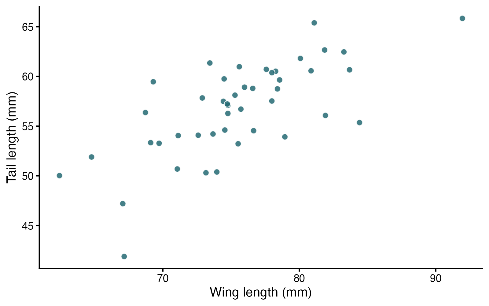

:::

::: {.column width="38%"}

**ggplot2 arguments**

**aes(x,y)** — Choose the two traits whose association is of interest

**geom_point / alpha** — Display every bird while limiting overlap

**shape / fill** — Use a filled symbol with a contrasting outline

**labs** — Use trait names and measurement units

:::

:::

::: notes

This figure is generated from the saved CSV by modules/pearson/analysis.R. Correlation describes linear association symmetrically; causal direction and a slope are separate questions.

:::


## Pearson correlation: plot code {#pearson-plot-code}

::: columns

::: {.column width="62%"}

```r
p <- ggplot(d, aes(wing_mm, tail_mm)) +
  geom_point(shape = 21, fill = "#246A73", color = "white", size = 3.5, alpha = .85) +
  labs(x = "Wing length (mm)", y = "Tail length (mm)") +
  theme_classic(base_size = 18)
print(p)
```


:::

::: {.column width="38%"}

**Arguments to change**

**aes(x,y)** — Choose the two traits whose association is of interest

**geom_point / alpha** — Display every bird while limiting overlap

**shape / fill** — Use a filled symbol with a contrasting outline

**labs** — Use trait names and measurement units

:::

:::

::: notes

This is an exact excerpt from analysis.R. Any preparation referenced by the excerpt appears in the complete companion script. The script opens a ragg PNG device before these lines and closes it afterward.

:::


## Pearson correlation: question and null {#pearson-question}

::: columns

::: {.column width="62%"}

**Scientific question**

Are wing and tail lengths linearly associated in this population?

**Null / estimation target**

The population Pearson correlation is zero.

:::

::: {.column width="38%"}

**Relevant options**

- method = "pearson" tests linear association

- alternative = "two.sided" allows positive or negative

- conf.level controls the correlation interval

:::

:::

::: notes

Ask whether rejecting this null, or estimating this target, answers the biological question. Correlation describes linear association symmetrically; causal direction and a slope are separate questions.

:::


## Pearson correlation: assumptions {#pearson-assumptions}

::: columns

::: {.column width="62%"}

**What matters here**

- Independent birds

- A linear pattern with no dominating outliers

- Classical inference assumes approximately bivariate-normal observations

:::

::: {.column width="38%"}

**Parametric responses**

- Regression models a directional mean response and covariates

- Transform traits when a log-scale association is the question

**Nonparametric responses**

- Spearman assesses monotonic rank association

- A bootstrap interval can retain Pearson correlation as the target

:::

:::

::: notes

Begin with the design. A model change should address a specific issue and preserve the scientific target where possible. A rank or permutation alternative has its own assumptions and may change the null; do not choose it solely from a normality-test p-value.

:::


## Pearson correlation: run and read {#pearson-analysis}

::: columns

::: {.column width="62%"}

```r
fit <- cor.test(d$wing_mm, d$tail_mm, method = "pearson",
                alternative = "two.sided", conf.level = .95)
```


:::

::: {.column width="38%"}

**Generated results**

- Pearson r = 0.700

- 95% CI for population correlation: 0.512 to 0.824

- t = 6.43; df = 43; p = 8.606e-08

:::

:::

::: notes

Full executed model/test output:

```

	Pearson's product-moment correlation

data:  d$wing_mm and d$tail_mm
t = 6.4317, df = 43, p-value = 8.606e-08
alternative hypothesis: true correlation is not equal to 0
95 percent confidence interval:
 0.5119136 0.8243291
sample estimates:
      cor 
0.7002284 

```


:::


## Pearson correlation: interpret {#pearson-interpret}

Wing and tail lengths had Pearson r = 0.700 (95% CI 0.512 to 0.824), p = 8.606e-08. This describes linear association within the sampled population; it does not establish that one trait causes the other.

**Discuss:** Would swapping wing and tail in cor.test change r? Would it leave a regression slope unchanged?

::: notes

Teaching point: Correlation describes linear association symmetrically; causal direction and a slope are separate questions.

Instructor comparison with the simulated population: The generating population Pearson correlation is 0.55*5 / sqrt((0.55*5)^2 + 3.5^2), approximately 0.618. It is not the observed sample correlation.

The reported estimate and p-value are calculated from this realized dataset; they need not exactly match the known population effect.

:::


## Spearman correlation: the data {#spearman}

::: columns

::: {.column width="62%"}

Microbial ecologists compare soil salinity with bacterial richness across independent soil cores.

- Two ordered or continuous variables

- Independent measurement pairs

- A monotonic association, possibly curved

:::

::: {.column width="38%"}

**Other data like these**

- Ordinal condition score and body size

- Dose and a saturating response

- Ranked expression across tissues

:::

:::

::: notes

Spearman rank correlation

Forty-five independent sites contribute one salinity and richness measurement each.

site: Independent site identifier (none)

salinity_ppt: Soil salinity (parts per thousand)

richness: Observed bacterial taxon richness (taxa)

:::


## Spearman correlation: simulate and save {#spearman-simulate}

::: columns

::: {.column width="62%"}

```r
set.seed(1113)
salinity <- runif(45, .5, 8)
richness <- round(90 - 25 * log(salinity + 1) + rnorm(45, 0, 7))
d <- data.frame(site = 1:45, salinity_ppt = salinity, richness = richness)
write.csv(d, file.path(output_dir, "data.csv"), row.names = FALSE)
```


:::

::: {.column width="38%"}

**First saved row**

```
site: 1
salinity_ppt: 2.095
richness: 60
```


:::

:::

::: notes

Seed: 1113

Generating model: 45 independent site salinities are Uniform(0.5, 8). Richness is 90 - 25*log(salinity + 1) + Normal(0, 7 SD) noise, rounded to the nearest taxon.

Population truth: The underlying mean response decreases nonlinearly with salinity, creating a negative monotonic association. No fixed numeric population Spearman coefficient was specified.

The script writes data.csv before reading it for analysis. output_dir or out_dir is the folder supplied to the standalone script.

Original saved-data preview:

```
 site salinity_ppt richness
    1     2.095406       60
    2     7.344500       42
    3     3.973588       46
    4     1.952997       62
```


:::


## Spearman correlation: see the data {#spearman-plot}

::: columns

::: {.column width="62%"}

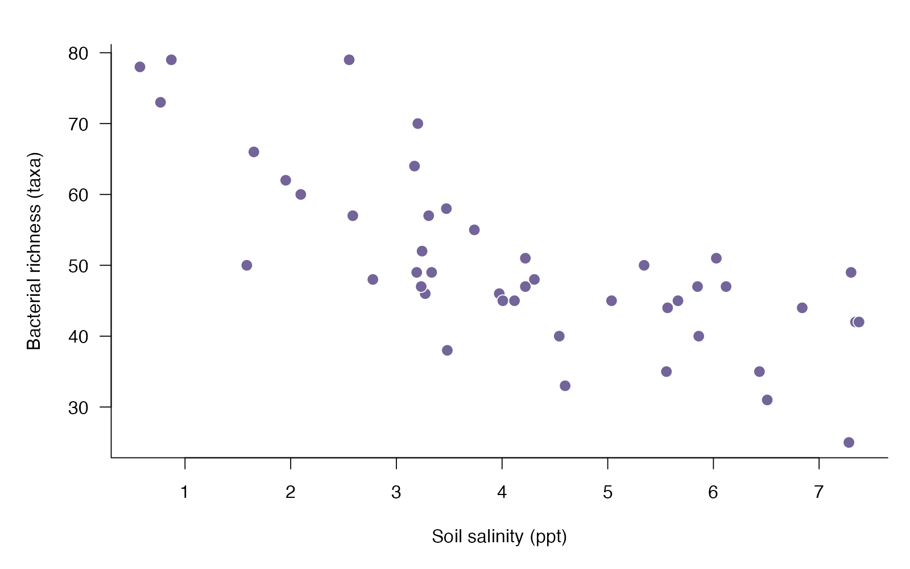

:::

::: {.column width="38%"}

**base R arguments**

**pch / bg** — Use readable filled symbols

**xlab / ylab** — Name the original variables, not their ranks

**col** — Separate point fill and outline

**cex** — Keep the point size readable in a lecture room

:::

:::

::: notes

This figure is generated from the saved CSV by modules/spearman/analysis.R. Ranks can summarize a monotonic curve without claiming a constant change in the original response units.

:::


## Spearman correlation: plot code {#spearman-plot-code}

::: columns

::: {.column width="62%"}

```r
plot(d$salinity_ppt, d$richness, pch = 21, bg = "#73649A", col = "white",
     cex = 1.4, xlab = "Soil salinity (ppt)", ylab = "Bacterial richness (taxa)")
```


:::

::: {.column width="38%"}

**Arguments to change**

**pch / bg** — Use readable filled symbols

**xlab / ylab** — Name the original variables, not their ranks

**col** — Separate point fill and outline

**cex** — Keep the point size readable in a lecture room

:::

:::

::: notes

This is an exact excerpt from analysis.R. Any preparation referenced by the excerpt appears in the complete companion script. The script opens a ragg PNG device before these lines and closes it afterward.

:::


## Spearman correlation: question and null {#spearman-question}

::: columns

::: {.column width="62%"}

**Scientific question**

Does bacterial richness tend to decline as salinity increases?

**Null / estimation target**

The population Spearman rank correlation is zero.

:::

::: {.column width="38%"}

**Relevant options**

- method = "spearman" uses ranks

- exact = FALSE handles tied richness values

- Choose a one-sided alternative only before seeing the data

:::

:::

::: notes

Ask whether rejecting this null, or estimating this target, answers the biological question. Ranks can summarize a monotonic curve without claiming a constant change in the original response units.

:::


## Spearman correlation: assumptions {#spearman-assumptions}

::: columns

::: {.column width="62%"}

**What matters here**

- Independent sites

- Meaningful rank order

- Monotonic association is the target; zero does not rule out every pattern

:::

::: {.column width="38%"}

**Parametric responses**

- Model the curved mean relationship directly if prediction is needed

- A suitable transformation may linearize the mean

**Nonparametric responses**

- Spearman reduces the influence of extreme magnitudes

- Nonmonotonic patterns require a different model or question

:::

:::

::: notes

Begin with the design. A model change should address a specific issue and preserve the scientific target where possible. A rank or permutation alternative has its own assumptions and may change the null; do not choose it solely from a normality-test p-value.

:::


## Spearman correlation: run and read {#spearman-analysis}

::: columns

::: {.column width="62%"}

```r
fit <- cor.test(d$salinity_ppt, d$richness,
                method = "spearman", exact = FALSE,
                alternative = "two.sided")
```


:::

::: {.column width="38%"}

**Generated results**

- Spearman rho = -0.752; n = 45

- S = 26599.8; asymptotic two-sided p = 2.549e-09

- The coefficient describes rank association, not a change in taxa per ppt.

:::

:::

::: notes

Full executed model/test output:

```

	Spearman's rank correlation rho

data:  d$salinity_ppt and d$richness
S = 26600, p-value = 2.549e-09
alternative hypothesis: true rho is not equal to 0
sample estimates:
       rho 
-0.7522922 

```


:::


## Spearman correlation: interpret {#spearman-interpret}

Salinity and bacterial richness had Spearman rho = -0.752 (two-sided p = 2.549e-09). This quantifies their monotonic rank association. It does not estimate a change in mean richness per unit salinity.

**Discuss:** Does rho tell you how many taxa are lost per additional ppt of salinity?

::: notes

Teaching point: Ranks can summarize a monotonic curve without claiming a constant change in the original response units.

Instructor comparison with the simulated population: The underlying mean response decreases nonlinearly with salinity, creating a negative monotonic association. No fixed numeric population Spearman coefficient was specified.

The reported estimate and p-value are calculated from this realized dataset; they need not exactly match the known population effect.

:::


## Curve-Fitting {#xkcd-2048}

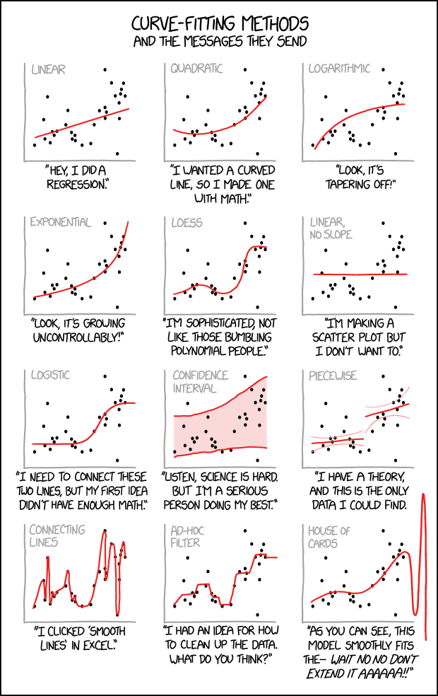{height=6in}

[Randall Munroe / xkcd · https://xkcd.com/2048](https://xkcd.com/2048/) · [CC BY-NC 2.5](https://creativecommons.org/licenses/by-nc/2.5/)

::: notes

Choose the model for the biological question, then check the fitted relationship rather than choosing a curve for its appearance.

Comic: Curve-Fitting. https://xkcd.com/2048/

Original course source: lectures__exp-6.pptx, slide 1. Artwork reproduced unchanged. Randall Munroe / xkcd; Creative Commons Attribution-NonCommercial 2.5.

Accessible description: A grid of fitted curves parodies the messages scientists send with different model choices.

:::


## Simple regression: the data {#simple_lm}

::: columns

::: {.column width="62%"}

Plant ecologists grow seedlings under a gradient of nitrogen supply.

- One continuous response

- One continuous predictor

- A linear mean response and its slope

:::

::: {.column width="38%"}

**Other data like these**

- Body size predicting horn size

- Temperature predicting enzyme activity

- Resource supply predicting growth

:::

:::

::: notes

Simple linear regression

Thirty-six independently assigned pots receive one nitrogen level and yield one biomass measurement.

pot: Independent pot identifier (none)

nitrogen_mg: Assigned nitrogen dose (mg)

biomass_g: Seedling biomass (g)

:::


## Simple regression: simulate and save {#simple_lm-simulate}

::: columns

::: {.column width="62%"}

```r
set.seed(1114)
nitrogen <- runif(36, 0, 12)
biomass <- 2.2 + .42 * nitrogen + rnorm(36, 0, .8)
d <- data.frame(pot = 1:36, nitrogen_mg = nitrogen, biomass_g = biomass)
write.csv(d, file.path(output_dir, "data.csv"), row.names = FALSE)
```


:::

::: {.column width="38%"}

**First saved row**

```
pot: 1
nitrogen_mg: 9.546
biomass_g: 5.992
```


:::

:::

::: notes

Seed: 1114

Generating model: 36 nitrogen doses are Uniform(0, 12) mg. Independent biomass values follow 2.2 + 0.42*nitrogen + Normal(0, 0.8 SD).

Population truth: The conditional mean intercept is 2.2 g and slope is +0.42 g per mg nitrogen. The zero-slope null is false.

The script writes data.csv before reading it for analysis. output_dir or out_dir is the folder supplied to the standalone script.

Original saved-data preview:

```
 pot nitrogen_mg biomass_g
   1    9.545618  5.992226
   2    2.359066  4.640125
   3    7.314201  6.118743
   4    2.363184  3.585433
```


:::


## Simple regression: see the data {#simple_lm-plot}

::: columns

::: {.column width="62%"}

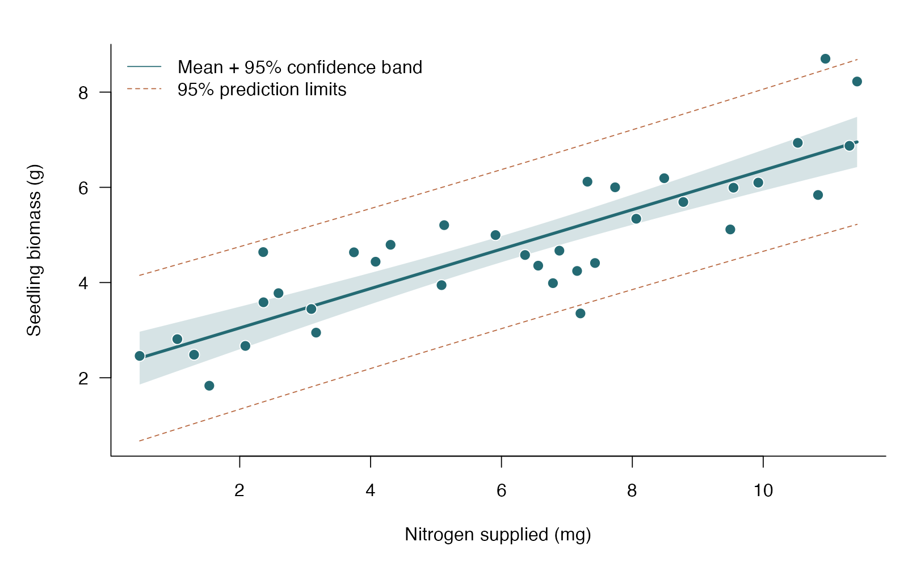

:::

::: {.column width="38%"}

**base R arguments**

**polygon** — Draw a confidence band behind the points

**lines / lty** — Distinguish fitted mean and prediction limits

**points** — Keep all observed pots visible

**legend** — Name each kind of uncertainty

:::

:::

::: notes

This figure is generated from the saved CSV by modules/simple_lm/analysis.R. Choose confidence intervals for a mean response and prediction intervals for a new individual pot.

:::


## Simple regression: plot code {#simple_lm-plot-code}

::: columns

::: {.column width="62%"}

```r
plot(d$nitrogen_mg, d$biomass_g, type = "n", ylim = range(new_pot),
     xlab = "Nitrogen supplied (mg)", ylab = "Seedling biomass (g)")
polygon(c(grid$nitrogen_mg, rev(grid$nitrogen_mg)),
        c(mean_ci[, "lwr"], rev(mean_ci[, "upr"])), col = "#246A7330", border = NA)
lines(grid$nitrogen_mg, mean_ci[, "fit"], col = "#246A73", lwd = 3)
matlines(grid$nitrogen_mg, new_pot[, c("lwr", "upr")], lty = 2, col = "#B7663E")
points(d$nitrogen_mg, d$biomass_g, pch = 21, bg = "#246A73", col = "white", cex = 1.3)
legend("topleft", c("Mean + 95% confidence band", "95% prediction limits"),
       lty = c(1, 2), col = c("#246A73", "#B7663E"), bty = "n")
```


:::

::: {.column width="38%"}

**Arguments to change**

**polygon** — Draw a confidence band behind the points

**lines / lty** — Distinguish fitted mean and prediction limits

**points** — Keep all observed pots visible

**legend** — Name each kind of uncertainty

:::

:::

::: notes

This is an exact excerpt from analysis.R. Any preparation referenced by the excerpt appears in the complete companion script. The script opens a ragg PNG device before these lines and closes it afterward.

:::


## Simple regression: question and null {#simple_lm-question}

::: columns

::: {.column width="62%"}

**Scientific question**

How much does mean seedling biomass change per additional mg of nitrogen?

**Null / estimation target**

The population slope of mean biomass on nitrogen is zero.

:::

::: {.column width="38%"}

**Relevant options**

- response ~ predictor defines the direction

- confint(fit) gives coefficient intervals

- confidence predicts a mean; prediction predicts a new pot

:::

:::

::: notes

Ask whether rejecting this null, or estimating this target, answers the biological question. Choose confidence intervals for a mean response and prediction intervals for a new individual pot.

:::


## Simple regression: assumptions {#simple_lm-assumptions}

::: columns

::: {.column width="62%"}

**What matters here**

- Independent pot errors

- Mean response roughly linear; inspect residuals

- Similar residual variance; normal errors for small-sample intervals/tests

:::

::: {.column width="38%"}

**Parametric responses**

- Transform or model curvature when scientifically useful

- Use variance models/robust SEs for unequal residual spread

**Nonparametric responses**

- Theil–Sen provides a robust linear slope

- Spearman answers a rank-association question instead of slope

:::

:::

::: notes

Begin with the design. A model change should address a specific issue and preserve the scientific target where possible. A rank or permutation alternative has its own assumptions and may change the null; do not choose it solely from a normality-test p-value.

:::


## Simple regression: run and read {#simple_lm-analysis}

::: columns

::: {.column width="62%"}

```r
fit <- lm(biomass_g ~ nitrogen_mg, data = d)
coefficients <- summary(fit)$coefficients
ci <- confint(fit)
grid <- data.frame(nitrogen_mg = seq(min(d$nitrogen_mg), max(d$nitrogen_mg), length.out = 100))
mean_ci <- predict(fit, grid, interval = "confidence")
new_pot <- predict(fit, grid, interval = "prediction")
```


:::

::: {.column width="38%"}

**Generated results**

- Slope = 0.414 g biomass per mg nitrogen

- 95% slope CI: 0.329 to 0.499

- Slope t = 9.90; df = 34; p = 1.525e-11

- R-squared = 0.742

:::

:::

::: notes

Full executed model/test output:

```

Call:
lm(formula = biomass_g ~ nitrogen_mg, data = d)

Residuals:
    Min      1Q  Median      3Q     Max 
-1.8507 -0.4546 -0.1079  0.4972  1.9486 

Coefficients:
            Estimate Std. Error t value Pr(>|t|)    
(Intercept)  2.21791    0.29034   7.639 7.05e-09 ***
nitrogen_mg  0.41409    0.04185   9.896 1.52e-11 ***
---
Signif. codes:  0 ‘***’ 0.001 ‘**’ 0.01 ‘*’ 0.05 ‘.’ 0.1 ‘ ’ 1

Residual standard error: 0.811 on 34 degrees of freedom
Multiple R-squared:  0.7423,	Adjusted R-squared:  0.7347 
F-statistic: 97.93 on 1 and 34 DF,  p-value: 1.525e-11

                2.5 %    97.5 %
(Intercept) 1.6278685 2.8079514
nitrogen_mg 0.3290528 0.4991331
```


:::


## Simple regression: interpret {#simple_lm-interpret}

Each additional mg of nitrogen was associated with 0.414 g higher mean biomass (95% CI 0.329 to 0.499); slope t(34) = 9.90, p = 1.525e-11. The narrow band concerns mean biomass; the wider prediction limits concern a new individual pot.

**Discuss:** Which interval answers what biomass a newly grown individual seedling may have?

::: notes

Teaching point: Choose confidence intervals for a mean response and prediction intervals for a new individual pot.

Instructor comparison with the simulated population: The conditional mean intercept is 2.2 g and slope is +0.42 g per mg nitrogen. The zero-slope null is false.

The reported estimate and p-value are calculated from this realized dataset; they need not exactly match the known population effect.

:::


## Theil–Sen slope: the data {#theil_sen}

::: columns

::: {.column width="62%"}

Physiologists measure enzyme activity along a temperature gradient with occasional unusually high assays.

- One continuous response and predictor

- A roughly linear trend

- A slope resistant to extreme response values

:::

::: {.column width="38%"}

**Other data like these**

- Phenological date versus year

- Growth versus resource supply

- Morphological allometry on log scales

:::

:::

::: notes

Theil–Sen robust slope

Forty independent assay preparations contribute one temperature/activity pair each.

assay: Independent assay identifier (none)

temp_c: Assay temperature (degrees C)

activity: Enzyme activity (U/mL)

:::


## Theil–Sen slope: simulate and save {#theil_sen-simulate}

::: columns

::: {.column width="62%"}

```r
set.seed(1116)
temperature <- runif(40, 16, 30)
activity <- 8 + 1.4 * temperature + rt(40, df = 4) * 2
activity[c(5, 18)] <- activity[c(5, 18)] + 25
d <- data.frame(assay = 1:40, temp_c = temperature, activity = activity)
write.csv(d, file.path(output_dir, "data.csv"), row.names = FALSE)
```


:::

::: {.column width="38%"}

**First saved row**

```
assay: 1
temp_c: 25.62
activity: 45.04
```


:::

:::

::: notes

Seed: 1116

Generating model: 40 temperatures are Uniform(16, 30) degrees C. Core activity = 8 + 1.4*temperature + 2 times a Student t variable with 4 degrees of freedom. Assays 5 and 18 then receive an extra +25 U/mL.

Population truth: The underlying uncontaminated linear trend has slope 1.4 U/mL per degree C. Two deliberately elevated assays illustrate robustness; the bootstrap interval comes from the saved contaminated sample.

The script writes data.csv before reading it for analysis. output_dir or out_dir is the folder supplied to the standalone script.

Original saved-data preview:

```
 assay   temp_c activity
     1 25.61605 45.04250
     2 19.70680 35.56085
     3 23.09819 38.79565
     4 18.94864 37.20150
```


:::


## Theil–Sen slope: see the data {#theil_sen-plot}

::: columns

::: {.column width="62%"}

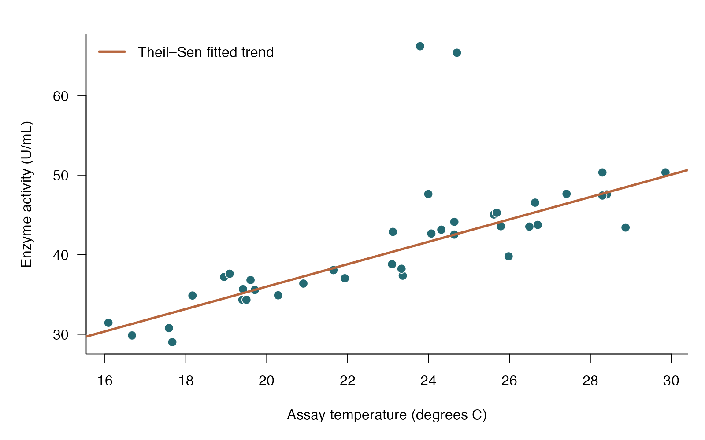

:::

::: {.column width="38%"}

**base R arguments**

**pch / bg** — Show every assay, including unusual ones

**abline** — Add the robust intercept and slope

**lwd** — Keep the fitted trend legible

**legend** — Label exactly which line is displayed

:::

:::

::: notes

This figure is generated from the saved CSV by modules/theil_sen/analysis.R. A robust slope retains interpretable units while limiting extreme-response influence; uncertainty here is an approximate pairs-bootstrap interval.

:::


## Theil–Sen slope: plot code {#theil_sen-plot-code}

::: columns

::: {.column width="62%"}

```r
plot(d$temp_c, d$activity, pch = 21, bg = "#246A73", col = "white", cex = 1.4,
     xlab = "Assay temperature (degrees C)", ylab = "Enzyme activity (U/mL)")
abline(intercept, slope, col = "#B7663E", lwd = 3)
legend("topleft", "Theil–Sen fitted trend", lty = 1, lwd = 3,
       col = "#B7663E", bty = "n")
```


:::

::: {.column width="38%"}

**Arguments to change**

**pch / bg** — Show every assay, including unusual ones

**abline** — Add the robust intercept and slope

**lwd** — Keep the fitted trend legible

**legend** — Label exactly which line is displayed

:::

:::

::: notes

This is an exact excerpt from analysis.R. Any preparation referenced by the excerpt appears in the complete companion script. The script opens a ragg PNG device before these lines and closes it afterward.

:::


## Theil–Sen slope: question and null {#theil_sen-question}

::: columns

::: {.column width="62%"}

**Scientific question**

What is the robust linear change in enzyme activity per degree?

**Null / estimation target**

The target is the robust linear activity–temperature slope; zero means no linear location trend.

:::

::: {.column width="38%"}

**Relevant options**

- Use the median of all finite pairwise slopes

- Resample complete pairs for a slope interval

- This example uses a percentile bootstrap, not an exact p-value

:::

:::

::: notes

Ask whether rejecting this null, or estimating this target, answers the biological question. A robust slope retains interpretable units while limiting extreme-response influence; uncertainty here is an approximate pairs-bootstrap interval.

:::


## Theil–Sen slope: assumptions {#theil_sen-assumptions}

::: columns

::: {.column width="62%"}

**What matters here**

- Independent assay preparations

- A linear trend remains scientifically sensible

- Bootstrap intervals are approximate; leverage can still matter

:::

::: {.column width="38%"}

**Parametric responses**

- Fit a suitable error model if the conditional mean is the target

- Check whether unusual assays are errors or genuine observations

**Nonparametric responses**

- Theil–Sen estimates a robust location trend

- Spearman addresses monotonic association without slope units

:::

:::

::: notes

Begin with the design. A model change should address a specific issue and preserve the scientific target where possible. A rank or permutation alternative has its own assumptions and may change the null; do not choose it solely from a normality-test p-value.

:::


## Theil–Sen slope: run and read {#theil_sen-analysis}

::: columns

::: {.column width="62%"}

```r
pairs <- combn(seq_len(nrow(d)), 2)
slopes <- (d$activity[pairs[2, ]] - d$activity[pairs[1, ]]) /
          (d$temp_c[pairs[2, ]] - d$temp_c[pairs[1, ]])
slope <- median(slopes)
intercept <- median(d$activity - slope * d$temp_c)
```


:::

::: {.column width="38%"}

**Generated results**

- Theil–Sen slope = 1.408 U/mL per degree C

- 95% pairs-bootstrap interval: 1.184 to 1.618

- Finite original pairwise slopes = 780; bootstrap replicates = 999

- The interval is approximate; no exact test p-value is reported.

:::

:::

::: notes

Full executed model/test output:

```
intercept     slope 
 7.832577  1.407600 
    2.5%    97.5% 
1.183998 1.618227 
[1] 999
```


:::


## Theil–Sen slope: interpret {#theil_sen-interpret}

The robust slope was 1.408 U/mL per degree C, with a 95% percentile pairs-bootstrap interval of 1.184 to 1.618 (999 replicates). This estimates a linear location trend resistant to extreme responses; its interval is approximate and is not an exact slope test.

**Discuss:** How does a slope answer a different question from Spearman correlation?

::: notes

Teaching point: A robust slope retains interpretable units while limiting extreme-response influence; uncertainty here is an approximate pairs-bootstrap interval.

Instructor comparison with the simulated population: The underlying uncontaminated linear trend has slope 1.4 U/mL per degree C. Two deliberately elevated assays illustrate robustness; the bootstrap interval comes from the saved contaminated sample.

The reported estimate and p-value are calculated from this realized dataset; they need not exactly match the known population effect.

:::


## Multiple regression: the data {#multiple_lm}

::: columns

::: {.column width="62%"}

Evolutionary biologists relate beetle horn length to body size and larval nutrition.

- One continuous response

- Two or more predictors

- A conditional slope holding other predictors fixed

:::

::: {.column width="38%"}

**Other data like these**

- Growth predicted by temperature and resources

- Physiology predicted by size and treatment

- Expression predicted by genotype and age

:::

:::

::: notes

Multiple linear regression

Sixty independent beetles are raised across a nutrient gradient and measured as adults.

beetle: Independent beetle identifier (none)

body_mm: Adult body length (mm)

nutrition_mg: Larval nutrition amount (mg)

horn_mm: Adult horn length (mm)

:::


## Multiple regression: simulate and save {#multiple_lm-simulate}

::: columns

::: {.column width="62%"}

```r
set.seed(1115)
body <- runif(60, 7, 12)
nutrition <- runif(60, 2, 10)
horn <- .4 + .35 * body + .16 * nutrition + rnorm(60, 0, .65)
d <- data.frame(beetle = 1:60, body_mm = body, nutrition_mg = nutrition, horn_mm = horn)
write.csv(d, file.path(output_dir, "data.csv"), row.names = FALSE)
```


:::

::: {.column width="38%"}

**First saved row**

```
beetle: 1
body_mm: 9.028
nutrition_mg: 3.092
horn_mm: 2.491
```


:::

:::

::: notes

Seed: 1115

Generating model: 60 independent body lengths are Uniform(7, 12) mm and nutrition values independently Uniform(2, 10) mg. Horn length = 0.4 + 0.35*body + 0.16*nutrition + Normal(0, 0.65 SD).

Population truth: The true conditional body slope is 0.35 mm/mm and nutrition slope 0.16 mm/mg, with no interaction. Both zero-coefficient nulls are false.

The script writes data.csv before reading it for analysis. output_dir or out_dir is the folder supplied to the standalone script.

Original saved-data preview:

```
 beetle  body_mm nutrition_mg  horn_mm
      1  9.02822     3.092071 2.490570
      2 11.00832     8.331630 6.743573
      3 10.59940     3.747668 4.572635
      4 10.50767     9.840460 5.364367
```


:::


## Multiple regression: see the data {#multiple_lm-plot}

::: columns

::: {.column width="62%"}

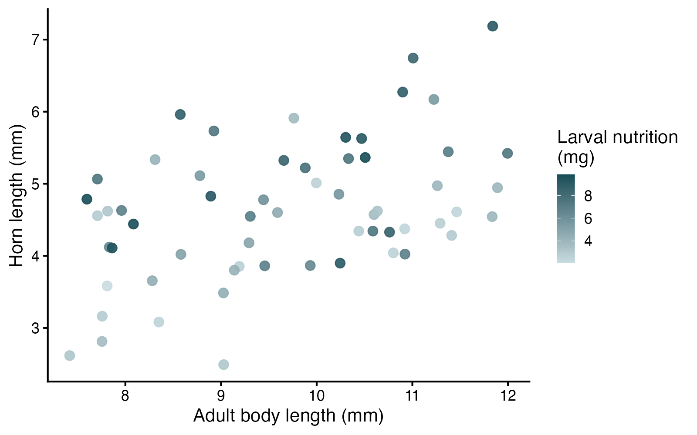

:::

::: {.column width="38%"}

**ggplot2 arguments**

**color** — Map nutrition to a continuous color scale

**scale_color_gradient** — Give low/high values clear colors

**geom_point** — Show each beetle once

**labs** — State response, predictor and color units

:::

:::

::: notes

This figure is generated from the saved CSV by modules/multiple_lm/analysis.R. Read each coefficient conditionally on the other variables in the stated model.

:::


## Multiple regression: plot code {#multiple_lm-plot-code}

::: columns

::: {.column width="62%"}

```r
p <- ggplot(d, aes(body_mm, horn_mm, color = nutrition_mg)) +
  geom_point(size = 3.8, alpha = .9) +
  scale_color_gradient(low = "#C8DCE0", high = "#174D58") +
  labs(x = "Adult body length (mm)", y = "Horn length (mm)", color = "Larval nutrition
(mg)") +
  theme_classic(base_size = 18)
print(p)
```


:::

::: {.column width="38%"}

**Arguments to change**

**color** — Map nutrition to a continuous color scale

**scale_color_gradient** — Give low/high values clear colors

**geom_point** — Show each beetle once

**labs** — State response, predictor and color units

:::

:::

::: notes

This is an exact excerpt from analysis.R. Any preparation referenced by the excerpt appears in the complete companion script. The script opens a ragg PNG device before these lines and closes it afterward.

:::


## Multiple regression: question and null {#multiple_lm-question}

::: columns

::: {.column width="62%"}

**Scientific question**

Does body size predict mean horn length after accounting for larval nutrition?

**Null / estimation target**

The body-size coefficient is zero conditional on nutrition in the specified model.

:::

::: {.column width="38%"}

**Relevant options**

- x1 + x2 gives additive effects

- x1 * x2 also includes an interaction

- anova(reduced, full) compares nested models fit to the same rows

:::

:::

::: notes

Ask whether rejecting this null, or estimating this target, answers the biological question. Read each coefficient conditionally on the other variables in the stated model.

:::


## Multiple regression: assumptions {#multiple_lm-assumptions}

::: columns

::: {.column width="62%"}

**What matters here**

- Independent beetles

- Correct mean pattern and residual spread

- Strong predictor collinearity limits separate interpretation

:::

::: {.column width="38%"}

**Parametric responses**

- Include a justified interaction or curved term

- Use robust SEs/variance models for unequal error variance

**Nonparametric responses**

- A design-respecting permutation can test a specified effect

- Separate rank correlations do not replace an adjusted regression

:::

:::

::: notes

Begin with the design. A model change should address a specific issue and preserve the scientific target where possible. A rank or permutation alternative has its own assumptions and may change the null; do not choose it solely from a normality-test p-value.

:::


## Multiple regression: run and read {#multiple_lm-analysis}

::: columns

::: {.column width="62%"}

```r
fit <- lm(horn_mm ~ body_mm + nutrition_mg, data = d)
reduced <- lm(horn_mm ~ nutrition_mg, data = d)
comparison <- anova(reduced, fit)
coefficients <- summary(fit)$coefficients
ci <- confint(fit)
```


:::

::: {.column width="38%"}

**Generated results**

- Body slope, adjusted for nutrition = 0.299 mm/mm

- 95% CI: 0.159 to 0.440

- Body coefficient p = 7.658e-05; nested-model F = 18.17

- Nutrition slope = 0.181 mm/mg; p = 1.112e-05

- Adjusted R-squared = 0.411

:::

:::

::: notes

Full executed model/test output:

```

Call:
lm(formula = horn_mm ~ body_mm + nutrition_mg, data = d)

Residuals:
     Min       1Q   Median       3Q      Max 
-1.51574 -0.38170 -0.00496  0.19296  1.60870 

Coefficients:
             Estimate Std. Error t value Pr(>|t|)    
(Intercept)   0.69688    0.70981   0.982     0.33    
body_mm       0.29930    0.07021   4.263 7.66e-05 ***
nutrition_mg  0.18104    0.03757   4.818 1.11e-05 ***
---
Signif. codes:  0 ‘***’ 0.001 ‘**’ 0.01 ‘*’ 0.05 ‘.’ 0.1 ‘ ’ 1

Residual standard error: 0.7242 on 57 degrees of freedom
Multiple R-squared:  0.4306,	Adjusted R-squared:  0.4106 
F-statistic: 21.55 on 2 and 57 DF,  p-value: 1.07e-07

                  2.5 %    97.5 %
(Intercept)  -0.7244990 2.1182587
body_mm       0.1587143 0.4398833
nutrition_mg  0.1057975 0.2562805
```


:::


## Multiple regression: interpret {#multiple_lm-interpret}

Holding larval nutrition fixed in the additive model, each additional mm of body length was associated with 0.299 mm higher mean horn length (95% CI 0.159 to 0.440; p = 7.658e-05). This conditional association is not the same as the unadjusted relationship or proof of causation.

**Discuss:** What does holding nutrition fixed mean when interpreting the body-size coefficient?

::: notes

Teaching point: Read each coefficient conditionally on the other variables in the stated model.

Instructor comparison with the simulated population: The true conditional body slope is 0.35 mm/mm and nutrition slope 0.16 mm/mg, with no interaction. Both zero-coefficient nulls are false.

The reported estimate and p-value are calculated from this realized dataset; they need not exactly match the known population effect.

:::


## Conditional Risk {#xkcd-795}

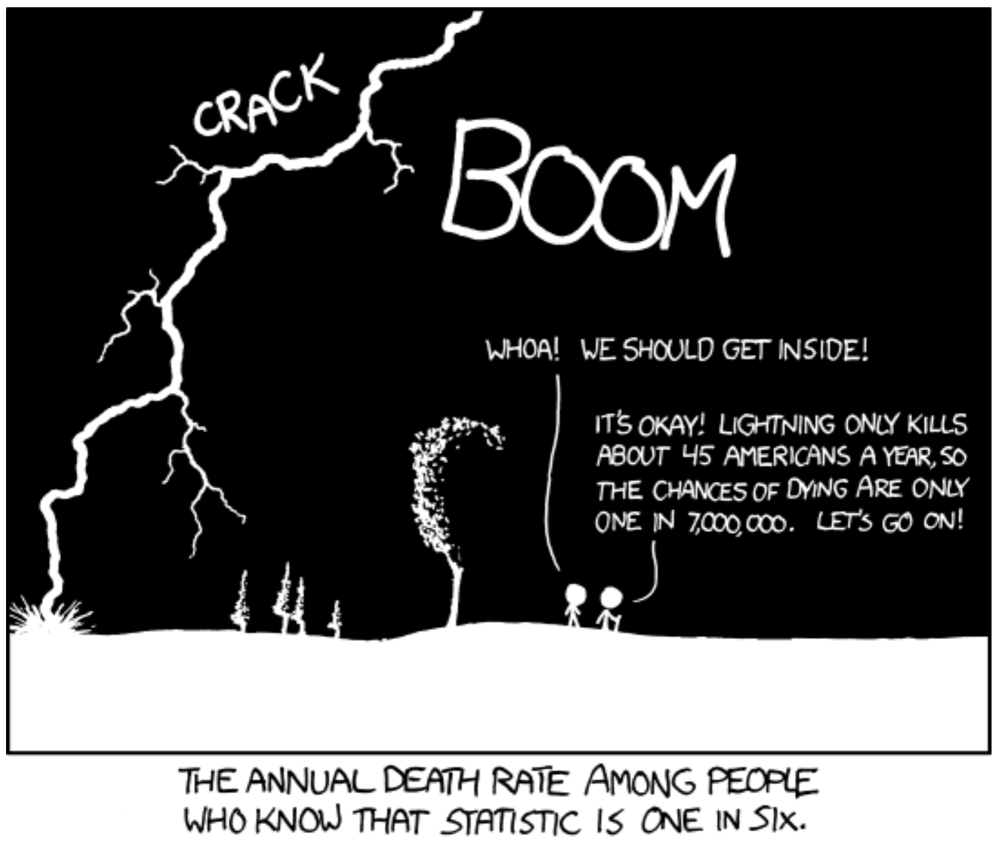{height=6in}

[Randall Munroe / xkcd · https://xkcd.com/795](https://xkcd.com/795/) · [CC BY-NC 2.5](https://creativecommons.org/licenses/by-nc/2.5/)

::: notes

Define the population and denominator: a probability for everyone need not describe a subgroup under different conditions.

Comic: Conditional Risk. https://xkcd.com/795/

Original course source: lectures__exp-5.pptx, slide 1. Artwork reproduced unchanged. Randall Munroe / xkcd; Creative Commons Attribution-NonCommercial 2.5.

Accessible description: People outside in a lightning storm confuse population risk with their own risk under current conditions.

:::


## Exact binomial: the data {#binomial}

::: columns

::: {.column width="62%"}

Host choice in a parasitoid wasp

- Binary outcome: native or introduced host

- 80 independent wasps; one trial each

- Known null probability: 0.50

:::

::: {.column width="38%"}

**Other data like these**

- Mendelian allele transmission

- Seed germination against a target

- Choice of one of two odors

:::

:::

::: notes

Exact binomial test

One independent choice per wasp; two equally available host species.

wasp: Unique independent wasp identifier (none)

native: 1 = native host chosen; 0 = introduced host (binary)

:::


## Exact binomial: simulate and save {#binomial-simulate}

::: columns

::: {.column width="62%"}

```r
set.seed(3101)
d <- data.frame(wasp = 1:80,
                native = rbinom(80, 1, 0.68))
write.csv(d, file.path(out_dir, "data.csv"), row.names = FALSE)
```


:::

::: {.column width="38%"}

**First saved row**

```
wasp: 1
native: 0
```


:::

:::

::: notes

Seed: 3101

Generating model: Generate 80 independent Bernoulli choices, each with probability 0.68 of a native-host choice. Each wasp appears once. No rounding or dependence is introduced.

Population truth: The true native-host probability is 0.68, so the null probability 0.50 is false. The population difference from the null is +0.18.

The script writes data.csv before reading it for analysis. output_dir or out_dir is the folder supplied to the standalone script.

Original saved-data preview:

```
1 | 0
2 | 0
3 | 1
4 | 1
5 | 0
```


:::


## Exact binomial: see the data {#binomial-plot}

::: columns

::: {.column width="62%"}

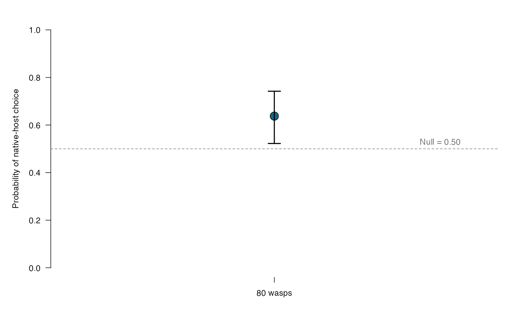

:::

::: {.column width="38%"}

**base R arguments**

**ylim** — Keep the full 0–1 probability scale.

**abline(h = .5)** — Mark the null probability.

**arrows(code = 3)** — Draw both confidence-interval caps.

**pch / cex** — Choose the point shape and size.

:::

:::

::: notes

This figure is generated from the saved CSV by modules/binomial/analysis.R. The null probability comes from the scientific prediction, not automatically from the fact that there are two outcomes.

:::


## Exact binomial: plot code {#binomial-plot-code}

::: columns

::: {.column width="62%"}

```r
par(mar = c(4, 5, 2, 1), las = 1)
plot(1, estimate, xlim = c(0.5, 1.5), ylim = c(0, 1),
     xaxt = "n", xlab = "", ylab = "Probability of native-host choice",
     pch = 21, bg = "#126887", cex = 2.2, bty = "n")
arrows(1, ci[1], 1, ci[2], angle = 90, code = 3, length = .12, lwd = 2)
abline(h = 0.5, lty = 2, col = "#777777")
axis(1, 1, paste(nrow(d), "wasps"))
text(1.45, .53, "Null = 0.50", adj = 1, col = "#666666")
```


:::

::: {.column width="38%"}

**Arguments to change**

**ylim** — Keep the full 0–1 probability scale.

**abline(h = .5)** — Mark the null probability.

**arrows(code = 3)** — Draw both confidence-interval caps.

**pch / cex** — Choose the point shape and size.

:::

:::

::: notes

This is an exact excerpt from analysis.R. Any preparation referenced by the excerpt appears in the complete companion script. The script opens a ragg PNG device before these lines and closes it afterward.

:::


## Exact binomial: question and null {#binomial-question}

::: columns

::: {.column width="62%"}

**Scientific question**

Do wasps choose the native host with probability 0.50?

**Null / estimation target**

The population probability of choosing the native host is 0.50.

:::

::: {.column width="38%"}

**Relevant options**

- x = number of native-host choices; n = all choices

- p = the probability specified by the null

- alternative = "two.sided"; choose direction in advance

:::

:::

::: notes

Ask whether rejecting this null, or estimating this target, answers the biological question. The null probability comes from the scientific prediction, not automatically from the fact that there are two outcomes.

:::


## Exact binomial: assumptions {#binomial-assumptions}

::: columns

::: {.column width="62%"}

**What matters here**

- Trials are independent.

- The response has two possible outcomes.

- The null uses the correct availability or expected probability.

:::

::: {.column width="38%"}

**Parametric responses**

- Use logistic regression if choice probability depends on predictors.

- Use a mixed logistic model for repeated choices by the same wasp.

**Nonparametric responses**

- The exact binomial test already handles small counts.

- A design-based randomization test requires the treatment-assignment scheme.

:::

:::

::: notes

Begin with the design. A model change should address a specific issue and preserve the scientific target where possible. A rank or permutation alternative has its own assumptions and may change the null; do not choose it solely from a normality-test p-value.

:::


## Exact binomial: run and read {#binomial-analysis}

::: columns

::: {.column width="62%"}

```r
x <- sum(d$native)
fit <- binom.test(x, nrow(d), p = 0.5,
                  alternative = "two.sided")
estimate <- x / nrow(d)
ci <- fit$conf.int
```


:::

::: {.column width="38%"}

**Generated results**

- Native-host choices: 51 / 80

- Estimated probability: 0.637

- 95% exact CI: 0.522 to 0.742

- Exact two-sided p = 0.01832

:::

:::

::: notes

Full executed model/test output:

```

	Exact binomial test

data:  x and nrow(d)
number of successes = 51, number of trials = 80, p-value = 0.01832
alternative hypothesis: true probability of success is not equal to 0.5
95 percent confidence interval:
 0.5223873 0.7421051
sample estimates:
probability of success 
                0.6375 

```


:::


## Exact binomial: interpret {#binomial-interpret}

Native-host choice was 63.7% (95% exact CI 52.2–74.2%; p = 0.0183 against 50%). This estimates preference under the simulated choice conditions.

**Discuss:** If native hosts were offered twice as often, would a null probability of 0.50 still answer the intended question?

::: notes

Teaching point: The null probability comes from the scientific prediction, not automatically from the fact that there are two outcomes.

Instructor comparison with the simulated population: The true native-host probability is 0.68, so the null probability 0.50 is false. The population difference from the null is +0.18.

The reported estimate and p-value are calculated from this realized dataset; they need not exactly match the known population effect.

:::


## One proportion: the data {#one_proportion}

::: columns

::: {.column width="62%"}

Germination of salt-tolerant seeds

- Binary success/failure for every seed

- 120 independent seeds

- Compare a population probability with a prespecified benchmark

:::

::: {.column width="38%"}

**Other data like these**

- Hatching success against a breeding target

- Infection prevalence against a reference

- Fraction of cells expressing a marker

:::

:::

::: notes

One-proportion test

One germination outcome per seed under a fixed salt treatment.

seed: Unique independent seed identifier (none)

germinated: 1 = germinated; 0 = did not germinate (binary)

:::


## One proportion: simulate and save {#one_proportion-simulate}

::: columns

::: {.column width="62%"}

```r
set.seed(3102)
d <- data.frame(seed = 1:120,
                germinated = rbinom(120, 1, 0.67))
write.csv(d, file.path(out_dir, "data.csv"), row.names = FALSE)
```


:::

::: {.column width="38%"}

**First saved row**

```
seed: 1
germinated: 1
```


:::

:::

::: notes

Seed: 3102

Generating model: Generate 120 independent seeds with Bernoulli germination probability 0.67. Every seed has the same probability. No rounding or tray dependence is simulated.

Population truth: The true germination probability is 0.67 rather than the null benchmark 0.50; the population difference is +0.17.

The script writes data.csv before reading it for analysis. output_dir or out_dir is the folder supplied to the standalone script.

Original saved-data preview:

```
1 | 1
2 | 1
3 | 0
4 | 0
5 | 1
```


:::


## One proportion: see the data {#one_proportion-plot}

::: columns

::: {.column width="62%"}

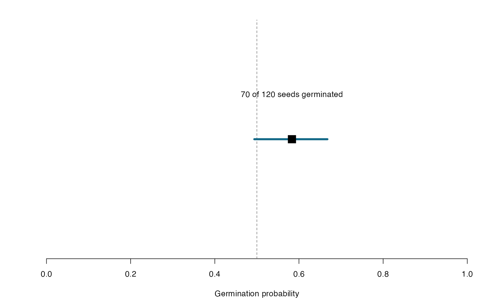

:::

::: {.column width="38%"}

**base R arguments**

**pch = 15** — A filled square marks the estimated probability.

**segments** — Draw the confidence interval.

**xlim** — Use the full probability scale.

**abline(v = .5)** — Show the null benchmark.

:::

:::

::: notes

This figure is generated from the saved CSV by modules/one_proportion/analysis.R. A binomial proportion is successes out of a known number of trials; arbitrary continuous percentages are different data.

:::


## One proportion: plot code {#one_proportion-plot-code}

::: columns

::: {.column width="62%"}

```r
par(mar = c(5, 3, 2, 1), las = 1)
plot(estimate, 1, xlim = c(0, 1), ylim = c(.7, 1.3), yaxt = "n",
     xlab = "Germination probability", ylab = "", bty = "n", type = "n")
abline(v = 0.5, lty = 2, col = "#777777")
segments(ci[1], 1, ci[2], 1, lwd = 4, col = "#126887")
points(estimate, 1, pch = 15, cex = 2.2)
text(estimate, 1.12, paste(x, "of", nrow(d), "seeds germinated"))
```


:::

::: {.column width="38%"}

**Arguments to change**

**pch = 15** — A filled square marks the estimated probability.

**segments** — Draw the confidence interval.

**xlim** — Use the full probability scale.

**abline(v = .5)** — Show the null benchmark.

:::

:::

::: notes

This is an exact excerpt from analysis.R. Any preparation referenced by the excerpt appears in the complete companion script. The script opens a ragg PNG device before these lines and closes it afterward.

:::


## One proportion: question and null {#one_proportion-question}

::: columns

::: {.column width="62%"}

**Scientific question**

Does the germination probability differ from the 50% benchmark?

**Null / estimation target**

The population germination probability is 0.50.

:::

::: {.column width="38%"}

**Relevant options**

- prop.test(x, n, p = .5)

- correct = FALSE omits continuity correction

- The reported interval is for one probability

:::

:::

::: notes

Ask whether rejecting this null, or estimating this target, answers the biological question. A binomial proportion is successes out of a known number of trials; arbitrary continuous percentages are different data.

:::


## One proportion: assumptions {#one_proportion-assumptions}

::: columns

::: {.column width="62%"}

**What matters here**

- Independent Bernoulli trials.

- Expected successes and failures are sufficiently large.

- Seeds sharing an unmodeled tray may be clustered.

:::

::: {.column width="38%"}

**Parametric responses**

- Use a binomial GLM to include dose or genotype.

- Use a binomial mixed model to account for trays.

**Nonparametric responses**

- Use binom.test for an exact small-sample test.

- A rank test is not a replacement for binary trial data.

:::

:::

::: notes

Begin with the design. A model change should address a specific issue and preserve the scientific target where possible. A rank or permutation alternative has its own assumptions and may change the null; do not choose it solely from a normality-test p-value.

:::


## One proportion: run and read {#one_proportion-analysis}

::: columns

::: {.column width="62%"}

```r
x <- sum(d$germinated)
fit <- prop.test(x, nrow(d), p = 0.5,
                 alternative = "two.sided", correct = FALSE)
estimate <- x / nrow(d)
ci <- fit$conf.int
```


:::

::: {.column width="38%"}

**Generated results**

- Germination: 70 / 120

- Estimated probability: 0.583

- 95% score CI: 0.494 to 0.668

- Two-sided p = 0.06789

:::

:::

::: notes

Full executed model/test output:

```

	1-sample proportions test without continuity correction

data:  x out of nrow(d), null probability 0.5
X-squared = 3.3333, df = 1, p-value = 0.06789
alternative hypothesis: true p is not equal to 0.5
95 percent confidence interval:
 0.4938803 0.6676165
sample estimates:
        p 
0.5833333 

```


:::


## One proportion: interpret {#one_proportion-interpret}

Germination was 58.3% (95% score CI 49.4–66.8%; p = 0.0679 against 50%). The test concerns this germination probability, not the mean of arbitrary continuous percentages.

**Discuss:** What information is lost if you record only a percentage without the number of seeds tested?

::: notes

Teaching point: A binomial proportion is successes out of a known number of trials; arbitrary continuous percentages are different data.

Instructor comparison with the simulated population: The true germination probability is 0.67 rather than the null benchmark 0.50; the population difference is +0.17.

The reported estimate and p-value are calculated from this realized dataset; they need not exactly match the known population effect.

:::


## Two proportions: the data {#two_proportions}

::: columns

::: {.column width="62%"}

Heat survival in evolved and ancestral yeast

- Binary survival in two independent groups

- Known number of trials in each group

- The target is a difference in survival probabilities

:::

::: {.column width="38%"}

**Other data like these**

- Vaccine uptake in two populations

- Hatching success in two crosses

- Rooting success under two treatments

:::

:::

::: notes

Two-proportion test

Independent cultures assigned to one genotype; survival is scored once.

group: Culture genotype: Evolved or Ancestral (none)

survived: 1 = survived heat; 0 = died (binary)

:::


## Two proportions: simulate and save {#two_proportions-simulate}

::: columns

::: {.column width="62%"}

```r
set.seed(3103)
d <- data.frame(group = rep(c("Evolved", "Ancestral"), each = 110))
d$survived <- rbinom(220, 1, rep(c(.72, .52), each = 110))
write.csv(d, file.path(out_dir, "data.csv"), row.names = FALSE)
```


:::

::: {.column width="38%"}

**First saved row**

```
group: Evolved
survived: 1
```


:::

:::

::: notes

Seed: 3103

Generating model: Generate 110 independent evolved cultures and 110 independent ancestral cultures. Survival is Bernoulli with probabilities 0.72 and 0.52, respectively. No batching or pairing is introduced.

Population truth: Evolved minus ancestral survival probability is 0.20, so the equal-probabilities null is false. The corresponding population odds ratio is approximately 2.37.

The script writes data.csv before reading it for analysis. output_dir or out_dir is the folder supplied to the standalone script.

Original saved-data preview:

```
Evolved | 1
Evolved | 0
Evolved | 1
Evolved | 1
Evolved | 0
```


:::


## Two proportions: see the data {#two_proportions-plot}

::: columns

::: {.column width="62%"}

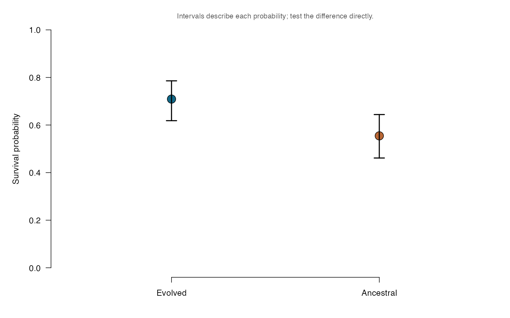

:::

::: {.column width="38%"}

**base R arguments**

**ylim** — Display probabilities on 0–1.

**axis** — Keep the explicit group order.

**arrows** — Show separate 95% probability intervals.

**pch / bg** — Use filled symbols and restrained group colors.

:::

:::

::: notes

This figure is generated from the saved CSV by modules/two_proportions/analysis.R. Keep group order explicit: the contrast is evolved minus ancestral, and its confidence interval addresses the actual comparison.

:::


## Two proportions: plot code {#two_proportions-plot-code}

::: columns

::: {.column width="62%"}

```r
par(mar = c(4, 5, 2, 1), las = 1)
plot(1:2, estimate, xlim = c(.5, 2.5), ylim = c(0, 1),
     xaxt = "n", xlab = "", ylab = "Survival probability", bty = "n",
     pch = 21, bg = c("#126887", "#b96735"), cex = 2.2)
arrows(1:2, group_ci[1, ], 1:2, group_ci[2, ],
       code = 3, angle = 90, length = .1, lwd = 2)
axis(1, 1:2, groups)
mtext("Intervals describe each probability; test the difference directly.", 3,
      cex = .85, col = "#555555")
```


:::

::: {.column width="38%"}

**Arguments to change**

**ylim** — Display probabilities on 0–1.

**axis** — Keep the explicit group order.

**arrows** — Show separate 95% probability intervals.

**pch / bg** — Use filled symbols and restrained group colors.

:::

:::

::: notes

This is an exact excerpt from analysis.R. Any preparation referenced by the excerpt appears in the complete companion script. The script opens a ragg PNG device before these lines and closes it afterward.

:::


## Two proportions: question and null {#two_proportions-question}

::: columns

::: {.column width="62%"}

**Scientific question**

Does survival probability differ between evolved and ancestral yeast?

**Null / estimation target**

Evolved and ancestral cultures have equal survival probabilities.

:::

::: {.column width="38%"}

**Relevant options**

- List successes and totals in the same group order.

- correct = FALSE uses the uncorrected large-sample test.

- The CI follows the first-minus-second group order.

:::

:::

::: notes

Ask whether rejecting this null, or estimating this target, answers the biological question. Keep group order explicit: the contrast is evolved minus ancestral, and its confidence interval addresses the actual comparison.

:::


## Two proportions: assumptions {#two_proportions-assumptions}

::: columns

::: {.column width="62%"}

**What matters here**

- Cultures are independent.

- Expected cell counts support the large-sample approximation.

- Use trials, not percentages without denominators.

:::

::: {.column width="38%"}

**Parametric responses**

- Use logistic regression to adjust for temperature or batch.

- Use a binomial mixed model when cultures share batches.

**Nonparametric responses**

- Use Fisher exact inference for sparse 2 × 2 tables.

- Permutation of group labels requires exchangeable independent cultures.

:::

:::

::: notes

Begin with the design. A model change should address a specific issue and preserve the scientific target where possible. A rank or permutation alternative has its own assumptions and may change the null; do not choose it solely from a normality-test p-value.

:::


## Two proportions: run and read {#two_proportions-analysis}

::: columns

::: {.column width="62%"}

```r
groups <- c("Evolved", "Ancestral")
x <- sapply(groups, function(g) sum(d$survived[d$group == g]))
n <- sapply(groups, function(g) sum(d$group == g))
fit <- prop.test(x, n, correct = FALSE)
estimate <- x / n
difference <- estimate[1] - estimate[2]
ci <- fit$conf.int
group_ci <- sapply(1:2, function(i) prop.test(x[i], n[i],
                                            correct = FALSE)$conf.int)
```


:::

::: {.column width="38%"}

**Generated results**

- Evolved: 78 / 110; ancestral: 61 / 110

- Difference (evolved − ancestral): 0.155

- 95% CI for difference: 0.029 to 0.280

- Two-sided p = 0.01748

:::

:::

::: notes

Full executed model/test output:

```

	2-sample test for equality of proportions without continuity correction

data:  x out of n
X-squared = 5.647, df = 1, p-value = 0.01748
alternative hypothesis: two.sided
95 percent confidence interval:
 0.02872612 0.28036479
sample estimates:
   prop 1    prop 2 
0.7090909 0.5545455 

```


:::


## Two proportions: interpret {#two_proportions-interpret}

Evolved minus ancestral survival was 15.5 percentage points (95% CI 2.9 to 28.0; p = 0.0175). The interval for this difference answers the comparison directly.

**Discuss:** If the groups contain 20 and 200 cultures, why are their denominators essential?

::: notes

Teaching point: Keep group order explicit: the contrast is evolved minus ancestral, and its confidence interval addresses the actual comparison.

Instructor comparison with the simulated population: Evolved minus ancestral survival probability is 0.20, so the equal-probabilities null is false. The corresponding population odds ratio is approximately 2.37.

The reported estimate and p-value are calculated from this realized dataset; they need not exactly match the known population effect.

:::


## Chi-square goodness-of-fit: the data {#chi_gof}

::: columns

::: {.column width="62%"}

Segregation in an F2 cross

- One categorical response with three mutually exclusive outcomes

- Observed counts, not percentages

- Prespecified Mendelian probabilities: 1/4, 1/2, 1/4

:::

::: {.column width="38%"}

**Other data like these**

- Flower morph ratios

- Habitat use versus availability

- Mutation classes versus a predicted spectrum

:::

:::

::: notes

Chi-square goodness-of-fit

Each offspring is assigned to one of three genotypes.

offspring: Unique independent offspring identifier (none)

genotype: AA, Aa, or aa genotype category (none)

:::


## Chi-square goodness-of-fit: simulate and save {#chi_gof-simulate}

::: columns

::: {.column width="62%"}

```r
set.seed(3104)
d <- data.frame(offspring = 1:240,
  genotype = sample(c("AA", "Aa", "aa"), 240, replace = TRUE,
                    prob = c(.18, .54, .28)))
write.csv(d, file.path(out_dir, "data.csv"), row.names = FALSE)
```


:::

::: {.column width="38%"}

**First saved row**

```
offspring: 1
genotype: aa
```


:::

:::

::: notes

Seed: 3104

Generating model: Independently sample 240 offspring genotypes with probabilities AA = 0.18, Aa = 0.54, aa = 0.28. Test against the fixed Mendelian probabilities 0.25, 0.50, 0.25; no probabilities are estimated for the null.

Population truth: The simulated probabilities differ from 1:2:1 by -0.07, +0.04, and +0.03. The goodness-of-fit null is false.

The script writes data.csv before reading it for analysis. output_dir or out_dir is the folder supplied to the standalone script.

Original saved-data preview:

```
  1 | aa
  2 | aa
  3 | Aa
  4 | AA
  5 | Aa
```


:::


## Chi-square goodness-of-fit: see the data {#chi_gof-plot}

::: columns

::: {.column width="62%"}

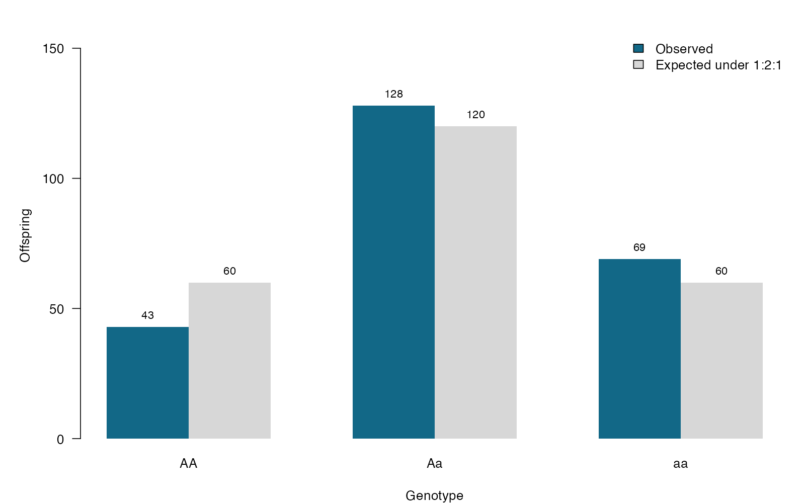

:::

::: {.column width="38%"}

**base R arguments**

**beside = TRUE** — Compare observed and expected counts side by side.

**names.arg** — Label the genotype categories.

**legend** — Identify observed versus expected bars.

**ylim** — Leave room for bar labels.

:::

:::

::: notes

This figure is generated from the saved CSV by modules/chi_gof/analysis.R. Expected counts encode the biological hypothesis. Equal expected counts would test a different hypothesis.

:::


## Chi-square goodness-of-fit: plot code {#chi_gof-plot-code}

::: columns

::: {.column width="62%"}

```r
par(mar = c(4, 5, 2, 1), las = 1)
bars <- barplot(rbind(Observed = observed, Expected = expected),
                beside = TRUE, col = c("#126887", "#d7d7d7"), border = NA,
                ylim = c(0, max(observed, expected) * 1.22),
                names.arg = names(observed), ylab = "Offspring", xlab = "Genotype")
text(bars, rbind(observed, expected), labels = c(rbind(observed, expected)),
     pos = 3, cex = .85)
legend("topright", c("Observed", "Expected under 1:2:1"),
       fill = c("#126887", "#d7d7d7"), bty = "n")
```


:::

::: {.column width="38%"}

**Arguments to change**

**beside = TRUE** — Compare observed and expected counts side by side.

**names.arg** — Label the genotype categories.

**legend** — Identify observed versus expected bars.

**ylim** — Leave room for bar labels.

:::

:::

::: notes

This is an exact excerpt from analysis.R. Any preparation referenced by the excerpt appears in the complete companion script. The script opens a ragg PNG device before these lines and closes it afterward.

:::


## Chi-square goodness-of-fit: question and null {#chi_gof-question}

::: columns

::: {.column width="62%"}

**Scientific question**

Do the genotype frequencies follow the expected 1:2:1 segregation ratio?

**Null / estimation target**

Genotype probabilities are AA = 0.25, Aa = 0.50, and aa = 0.25.

:::

::: {.column width="38%"}

**Relevant options**

- Supply p in exactly the table’s category order.

- Use counts as the first argument.

- simulate.p.value = TRUE can calibrate sparse multinomial counts.

:::

:::

::: notes

Ask whether rejecting this null, or estimating this target, answers the biological question. Expected counts encode the biological hypothesis. Equal expected counts would test a different hypothesis.

:::


## Chi-square goodness-of-fit: assumptions {#chi_gof-assumptions}

::: columns

::: {.column width="62%"}

**What matters here**

- Offspring are independent for the intended model.

- Categories are exhaustive and mutually exclusive.

- Expected counts support the chi-square approximation.

:::

::: {.column width="38%"}

**Parametric responses**

- Use a multinomial model when probabilities depend on predictors.

- If null probabilities were estimated, account for fitted parameters.

**Nonparametric responses**

- Use Monte Carlo multinomial null simulation for sparse counts.

- For only two outcomes, use an exact binomial test.

:::

:::

::: notes

Begin with the design. A model change should address a specific issue and preserve the scientific target where possible. A rank or permutation alternative has its own assumptions and may change the null; do not choose it solely from a normality-test p-value.

:::


## Chi-square goodness-of-fit: run and read {#chi_gof-analysis}

::: columns

::: {.column width="62%"}

```r
observed <- table(factor(d$genotype, levels = c("AA", "Aa", "aa")))
fit <- chisq.test(observed, p = c(.25, .50, .25))
expected <- as.numeric(fit$expected)
departures <- observed / sum(observed) - c(.25, .50, .25)
```


:::

::: {.column width="38%"}

**Generated results**

- Observed: 43, 128, 69

- Expected: 60, 120, 60

- Chi-square = 6.700; df = 2

- p = 0.03508

:::

:::

::: notes

Full executed model/test output:

```

	Chi-squared test for given probabilities

data:  observed
X-squared = 6.7, df = 2, p-value = 0.03508

```


:::


## Chi-square goodness-of-fit: interpret {#chi_gof-interpret}

Observed genotype proportions were 0.179, 0.533, 0.287. The goodness-of-fit test gives chi-square(2) = 6.70, p = 0.0351 against the prespecified 1:2:1 ratio; the test does not identify a biological mechanism for the departure.

**Discuss:** Would equal expected counts answer the same question as a 1:2:1 expected ratio?

::: notes

Teaching point: Expected counts encode the biological hypothesis. Equal expected counts would test a different hypothesis.

Instructor comparison with the simulated population: The simulated probabilities differ from 1:2:1 by -0.07, +0.04, and +0.03. The goodness-of-fit null is false.

The reported estimate and p-value are calculated from this realized dataset; they need not exactly match the known population effect.

:::


## Chi-square independence: the data {#chi_independence}

::: columns

::: {.column width="62%"}

Infection across three lizard habitats

- Two categorical variables: habitat and infection

- Counts in a 3 × 2 contingency table

- The target is an association between the variables

:::

::: {.column width="38%"}

**Other data like these**

- Phenotype versus treatment

- Flower color versus pollinator class

- Genotype category versus disease status

:::

:::

::: notes

Chi-square test of independence

Independent lizards sampled once in one of three habitats.

habitat: Sampling habitat: Forest, Grassland, or Urban (none)

infection: Infected or Uninfected status (none)

:::


## Chi-square independence: simulate and save {#chi_independence-simulate}

::: columns

::: {.column width="62%"}

```r
set.seed(3105)
d <- data.frame(habitat = rep(c("Forest", "Grassland", "Urban"), each = 90))
d$infection <- ifelse(rbinom(270, 1, rep(c(.25, .42, .55), each = 90)),
                       "Infected", "Uninfected")
write.csv(d, file.path(out_dir, "data.csv"), row.names = FALSE)
```


:::

::: {.column width="38%"}

**First saved row**

```
habitat: Forest
infection: Uninfected
```


:::

:::

::: notes

Seed: 3105

Generating model: Generate 90 independent lizards from each of Forest, Grassland, and Urban habitats. Infection is Bernoulli with probabilities 0.25, 0.42, and 0.55, respectively. No site-level clustering is simulated.

Population truth: Infection probability depends on habitat, so the independence null is false. Urban minus forest infection probability is 0.30; the simulation does not assign causality to habitat.

The script writes data.csv before reading it for analysis. output_dir or out_dir is the folder supplied to the standalone script.

Original saved-data preview:

```
Forest | Uninfected
Forest | Uninfected
Forest | Uninfected
Forest | Uninfected
Forest | Infected
```


:::


## Chi-square independence: see the data {#chi_independence-plot}

::: columns

::: {.column width="62%"}

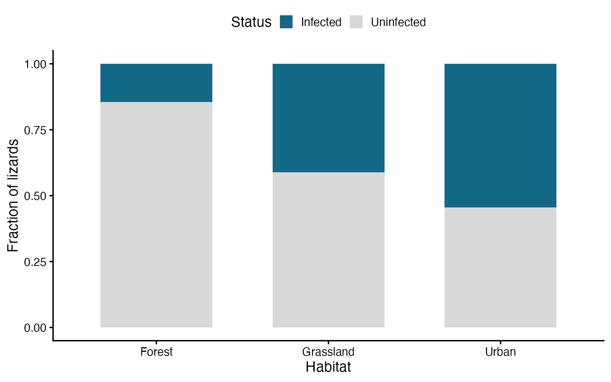

:::

::: {.column width="38%"}

**ggplot2 arguments**

**position = "fill"** — Each habitat bar sums to one.

**scale_fill_manual** — Use the same outcome colors throughout.

**scale_y_continuous** — Label the axis as a probability.

**theme_classic** — Keep a clean background.

:::

:::

::: notes

This figure is generated from the saved CSV by modules/chi_independence/analysis.R. A significant omnibus association does not establish a causal habitat effect or identify every differing pair.

:::


## Chi-square independence: plot code {#chi_independence-plot-code}

::: columns

::: {.column width="62%"}

```r
p <- ggplot2::ggplot(d, ggplot2::aes(habitat, fill = infection)) +
  ggplot2::geom_bar(position = "fill", width = .65) +
  ggplot2::scale_fill_manual(values = c(Infected = "#126887", Uninfected = "#d8d8d8")) +
  ggplot2::scale_y_continuous(limits = c(0, 1)) +
  ggplot2::labs(x = "Habitat", y = "Fraction of lizards", fill = "Status") +
  ggplot2::theme_classic(base_size = 17) +
  ggplot2::theme(legend.position = "top")
print(p)
```


:::

::: {.column width="38%"}

**Arguments to change**

**position = "fill"** — Each habitat bar sums to one.

**scale_fill_manual** — Use the same outcome colors throughout.

**scale_y_continuous** — Label the axis as a probability.

**theme_classic** — Keep a clean background.

:::

:::

::: notes

This is an exact excerpt from analysis.R. Any preparation referenced by the excerpt appears in the complete companion script. The script opens a ragg PNG device before these lines and closes it afterward.

:::


## Chi-square independence: question and null {#chi_independence-question}

::: columns

::: {.column width="62%"}

**Scientific question**

Is infection status associated with habitat?

**Null / estimation target**

Infection status and habitat are independent; infection probabilities are equal across habitats.

:::

::: {.column width="38%"}

**Relevant options**

- Construct a table from paired categories on each lizard.

- correct = FALSE is explicit; Yates correction only applies to 2 × 2.

- Inspect expected counts, not only observed counts.

:::

:::

::: notes

Ask whether rejecting this null, or estimating this target, answers the biological question. A significant omnibus association does not establish a causal habitat effect or identify every differing pair.

:::


## Chi-square independence: assumptions {#chi_independence-assumptions}

::: columns

::: {.column width="62%"}

**What matters here**

- Lizards are independent.

- Each lizard contributes to one table cell.

- Expected counts support the chi-square approximation.

:::

::: {.column width="38%"}

**Parametric responses**

- Use logistic regression for infection with covariates.

- Use a mixed logistic model if lizards share sampling sites.

**Nonparametric responses**

- Use a Monte Carlo conditional test for sparse larger tables.

- Fisher exact inference is an option for sparse tables.

:::

:::

::: notes

Begin with the design. A model change should address a specific issue and preserve the scientific target where possible. A rank or permutation alternative has its own assumptions and may change the null; do not choose it solely from a normality-test p-value.

:::


## Chi-square independence: run and read {#chi_independence-analysis}

::: columns

::: {.column width="62%"}

```r
tab <- table(d$habitat, d$infection)
fit <- chisq.test(tab, correct = FALSE)
cramers_v <- sqrt(as.numeric(fit$statistic) /
                  (sum(tab) * min(nrow(tab)-1, ncol(tab)-1)))
rates <- prop.table(tab, 1)[, "Infected"]
```


:::

::: {.column width="38%"}

**Generated results**

- Infection probabilities: Forest 0.14; Grassland 0.41; Urban 0.54

- Minimum expected count: 33.0

- Chi-square(2) = 32.153

- p = 1.042e-07; Cramer V = 0.345

:::

:::

::: notes

Full executed model/test output:

```

	Pearson's Chi-squared test

data:  tab
X-squared = 32.153, df = 2, p-value = 1.042e-07

```


:::


## Chi-square independence: interpret {#chi_independence-interpret}

Infection probabilities differed descriptively across habitats (Forest 14%, Grassland 41%, Urban 54%). The independence test gives chi-square(2) = 32.15, p = 1.04e-07; Cramer V = 0.35. This observational association does not establish a habitat effect.

**Discuss:** Why would treating several lizards from one cage as independent change the analysis?

::: notes

Teaching point: A significant omnibus association does not establish a causal habitat effect or identify every differing pair.

Instructor comparison with the simulated population: Infection probability depends on habitat, so the independence null is false. Urban minus forest infection probability is 0.30; the simulation does not assign causality to habitat.

The reported estimate and p-value are calculated from this realized dataset; they need not exactly match the known population effect.

:::


## Fisher exact: the data {#fisher_exact}

::: columns

::: {.column width="62%"}

Survival of rare resistant and susceptible clones

- Two categorical variables in a 2 × 2 table

- Small counts, including possibly empty cells

- The target is an association, expressed as an odds ratio

:::

::: {.column width="38%"}

**Other data like these**

- Rare infection in two hosts

- Mutation presence in two strains

- Hatching in small captive crosses

:::

:::

::: notes

Fisher exact test

Two small independent clone groups; binary survival after exposure.

clone: Unique independent clone identifier (none)

type: Susceptible or Resistant clone type (none)

survived: 1 = survived exposure; 0 = died (binary)

:::


## Fisher exact: simulate and save {#fisher_exact-simulate}

::: columns

::: {.column width="62%"}

```r
set.seed(3106)
d <- data.frame(clone = 1:24,
  type = rep(c("Susceptible", "Resistant"), each = 12))
d$survived <- rbinom(24, 1, rep(c(.20, .65), each = 12))
write.csv(d, file.path(out_dir, "data.csv"), row.names = FALSE)
```


:::

::: {.column width="38%"}

**First saved row**

```
clone: 1
type: Susceptible
survived: 0
```


:::

:::

::: notes

Seed: 3106

Generating model: Generate 12 independent susceptible clones with survival probability 0.20 and 12 independent resistant clones with probability 0.65. Each contributes one Bernoulli outcome; small table cells are intentional.

Population truth: The resistant-to-susceptible population survival odds ratio is (0.65/0.35)/(0.20/0.80), approximately 7.43. The odds-ratio-one null is false.

The script writes data.csv before reading it for analysis. output_dir or out_dir is the folder supplied to the standalone script.

Original saved-data preview:

```
 1 | Susceptible | 0
 2 | Susceptible | 0
 3 | Susceptible | 0
 4 | Susceptible | 1
 5 | Susceptible | 0
```


:::


## Fisher exact: see the data {#fisher_exact-plot}

::: columns

::: {.column width="62%"}

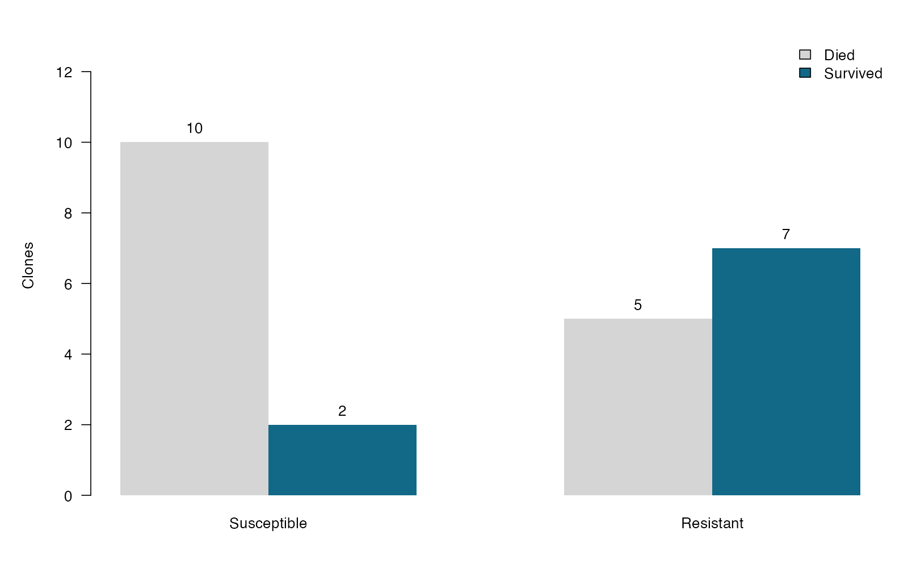

:::

::: {.column width="38%"}

**base R arguments**

**beside = TRUE** — Show each group’s two outcome counts.

**col** — Link outcome colors to the legend.

**text** — Put small counts directly on the bars.

**ylim** — Leave label space above the bars.

:::

:::

::: notes

This figure is generated from the saved CSV by modules/fisher_exact/analysis.R. Exact inference handles sparse counts, but it cannot create the precision missing from a small sample.

:::


## Fisher exact: plot code {#fisher_exact-plot-code}

::: columns

::: {.column width="62%"}

```r
par(mar = c(4, 5, 2, 1), las = 1)
bars <- barplot(t(tab), beside = TRUE, border = NA,
  col = c("#d5d5d5", "#126887"), ylim = c(0, max(tab) + 3),
  names.arg = rownames(tab), ylab = "Clones")
text(bars, t(tab), labels = c(t(tab)), pos = 3)
legend("topright", c("Died", "Survived"),
       fill = c("#d5d5d5", "#126887"), bty = "n")
```


:::

::: {.column width="38%"}

**Arguments to change**

**beside = TRUE** — Show each group’s two outcome counts.

**col** — Link outcome colors to the legend.

**text** — Put small counts directly on the bars.

**ylim** — Leave label space above the bars.

:::

:::

::: notes

This is an exact excerpt from analysis.R. Any preparation referenced by the excerpt appears in the complete companion script. The script opens a ragg PNG device before these lines and closes it afterward.

:::


## Fisher exact: question and null {#fisher_exact-question}

::: columns

::: {.column width="62%"}

**Scientific question**

Are survival odds associated with clone type?

**Null / estimation target**

The population odds ratio for clone type and survival is 1.

:::

::: {.column width="38%"}

**Relevant options**

- Check the row and column order before interpreting the odds ratio.

- alternative = "two.sided" tests association in either direction.

- The confidence interval is for the odds ratio.

:::

:::

::: notes

Ask whether rejecting this null, or estimating this target, answers the biological question. Exact inference handles sparse counts, but it cannot create the precision missing from a small sample.

:::


## Fisher exact: assumptions {#fisher_exact-assumptions}

::: columns

::: {.column width="62%"}

**What matters here**

- Each clone contributes one independent observation.

- Outcomes belong to exactly one table cell.

- Use an appropriate paired analysis for matched clones.

:::

::: {.column width="38%"}

**Parametric responses**

- Logistic regression can add predictors; sparse-data methods may be needed.

- More observations improve precision when the interval is wide.

**Nonparametric responses**

- Fisher’s test already provides exact conditional inference.

- Use an exact paired test for discordant matched pairs.

:::

:::

::: notes

Begin with the design. A model change should address a specific issue and preserve the scientific target where possible. A rank or permutation alternative has its own assumptions and may change the null; do not choose it solely from a normality-test p-value.

:::


## Fisher exact: run and read {#fisher_exact-analysis}

::: columns

::: {.column width="62%"}

```r
tab <- table(factor(d$type, levels = c("Susceptible", "Resistant")),
             factor(d$survived, levels = c(0, 1)))
fit <- fisher.test(tab, alternative = "two.sided")
odds_ratio <- unname(fit$estimate)
ci <- fit$conf.int
```


:::

::: {.column width="38%"}

**Generated results**

- Survivors: susceptible 2/12; resistant 7/12

- Survival odds ratio (resistant / susceptible): 6.395

- 95% exact CI: 0.810 to 85.671

- Two-sided exact p = 0.08938

:::

:::

::: notes

Full executed model/test output:

```

	Fisher's Exact Test for Count Data

data:  tab
p-value = 0.08938
alternative hypothesis: true odds ratio is not equal to 1
95 percent confidence interval:
  0.8098091 85.6709653
sample estimates:
odds ratio 
  6.394505 

```


:::


## Fisher exact: interpret {#fisher_exact-interpret}

The resistant-to-susceptible survival odds ratio was 6.39 (95% exact CI 0.81–85.67; p = 0.0894). A wide interval reflects limited information from these small groups; odds are not probabilities.

**Discuss:** Why is an odds ratio of 3 not the same as a threefold survival probability?

::: notes

Teaching point: Exact inference handles sparse counts, but it cannot create the precision missing from a small sample.

Instructor comparison with the simulated population: The resistant-to-susceptible population survival odds ratio is (0.65/0.35)/(0.20/0.80), approximately 7.43. The odds-ratio-one null is false.

The reported estimate and p-value are calculated from this realized dataset; they need not exactly match the known population effect.

:::


## McNemar: the data {#mcnemar}

::: columns

::: {.column width="62%"}

Antibody detection before and after an exposure season

- A binary response at two times

- Each mouse supplies a matched pair

- Discordant pairs determine evidence for a change

:::

::: {.column width="38%"}

**Other data like these**

- Diagnostic results from two assays

- Presence before and after treatment

- Two yes/no preferences from each animal

:::

:::

::: notes

McNemar test

The same 80 wild mice are sampled twice.

mouse: Matched mouse identifier (none)

before: Antibody detected at the first visit (1 = yes) (binary)

after: Antibody detected at the second visit (1 = yes) (binary)

:::


## McNemar: simulate and save {#mcnemar-simulate}

::: columns

::: {.column width="62%"}

```r
set.seed(3107)
d <- data.frame(mouse = 1:80, before = rbinom(80, 1, .45))
d$after <- rbinom(80, 1, ifelse(d$before == 1, .85, .35))
write.csv(d, file.path(out_dir, "data.csv"), row.names = FALSE)
```


:::

::: {.column width="38%"}

**First saved row**

```
mouse: 1
before: 1
after: 1
```


:::

:::

::: notes

Seed: 3107

Generating model: Generate 80 independent mice. Before status is Bernoulli(0.45). Conditional after positivity is 0.85 for a previously positive mouse and 0.35 for a previously negative mouse, producing correlated within-mouse measurements.

Population truth: Marginal after positivity is 0.45×0.85 + 0.55×0.35 = 0.575, a +0.125 change from before. Population gain and loss probabilities are 0.1925 and 0.0675, so the McNemar null is false.

The script writes data.csv before reading it for analysis. output_dir or out_dir is the folder supplied to the standalone script.

Original saved-data preview:

```
1 | 1 | 1
2 | 1 | 1
3 | 1 | 0
4 | 1 | 0
5 | 0 | 0
```


:::


## McNemar: see the data {#mcnemar-plot}

::: columns

::: {.column width="62%"}

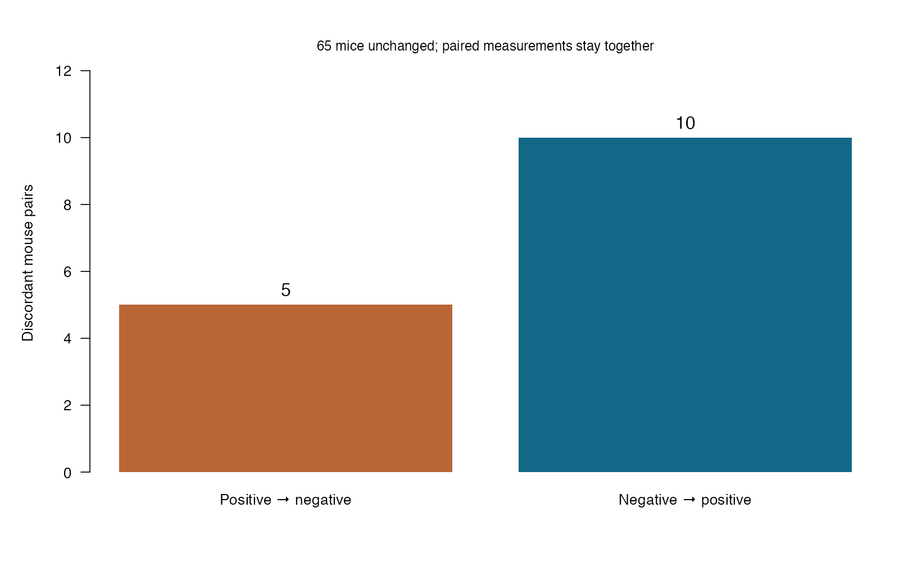

:::

::: {.column width="38%"}

**base R arguments**

**barplot** — Focus on the discordant pairs that drive the test.

**names.arg** — Describe the direction of change.

**text** — Label the observed transition counts.

**mtext** — Report the number of unchanged pairs.

:::

:::

::: notes

This figure is generated from the saved CSV by modules/mcnemar/analysis.R. The information about a change is in discordant pairs. Keeping the mouse identity changes the appropriate test.

:::


## McNemar: plot code {#mcnemar-plot-code}

::: columns

::: {.column width="62%"}

```r
par(mar = c(5, 5, 3, 1), las = 1)
counts <- c("Positive → negative" = lost, "Negative → positive" = gained)
bars <- barplot(counts, col = c("#b96735", "#126887"), border = NA,
                ylim = c(0, max(counts) * 1.25), ylab = "Discordant mouse pairs")
text(bars, counts, labels = counts, pos = 3, cex = 1.2)
mtext(paste(sum(diag(tab)), "mice unchanged; paired measurements stay together"),
      side = 3, cex = .9)
```


:::

::: {.column width="38%"}

**Arguments to change**

**barplot** — Focus on the discordant pairs that drive the test.

**names.arg** — Describe the direction of change.

**text** — Label the observed transition counts.

**mtext** — Report the number of unchanged pairs.

:::

:::

::: notes

This is an exact excerpt from analysis.R. Any preparation referenced by the excerpt appears in the complete companion script. The script opens a ragg PNG device before these lines and closes it afterward.

:::


## McNemar: question and null {#mcnemar-question}

::: columns

::: {.column width="62%"}

**Scientific question**

Does the marginal probability of antibody detection change between visits?

**Null / estimation target**

The probability of changing from negative to positive equals that of changing from positive to negative.

:::

::: {.column width="38%"}

**Relevant options**

- Build a paired 2 × 2 table: before by after.

- correct = FALSE uses the uncorrected approximation.

- Use binom.test on discordant pairs for an exact version.

:::

:::

::: notes

Ask whether rejecting this null, or estimating this target, answers the biological question. The information about a change is in discordant pairs. Keeping the mouse identity changes the appropriate test.

:::


## McNemar: assumptions {#mcnemar-assumptions}

::: columns

::: {.column width="62%"}

**What matters here**

- Pairs are independent across mice.

- Measurements are correctly matched within mice.

- The asymptotic test needs enough discordant pairs.

:::

::: {.column width="38%"}

**Parametric responses**

- Use a repeated-measures logistic model for predictors or more times.

- Use GEE when a population-average effect is the target.

**Nonparametric responses**

- Use the exact binomial test on discordant pairs when counts are small.

- A two-proportion test would discard the pairing.

:::

:::

::: notes

Begin with the design. A model change should address a specific issue and preserve the scientific target where possible. A rank or permutation alternative has its own assumptions and may change the null; do not choose it solely from a normality-test p-value.

:::


## McNemar: run and read {#mcnemar-analysis}

::: columns

::: {.column width="62%"}

```r
tab <- table(factor(d$before, levels = 0:1),
             factor(d$after, levels = 0:1))
fit <- mcnemar.test(tab, correct = FALSE)
gained <- tab[1, 2]
lost <- tab[2, 1]
exact <- binom.test(gained, gained + lost, p = .5)
change <- mean(d$after) - mean(d$before)
```


:::

::: {.column width="38%"}

**Generated results**

- Gained detection: 10; lost detection: 5

- Before: 0.438; after: 0.500

- Change: 0.062

- McNemar p = 0.1967; exact paired p = 0.3018

:::

:::

::: notes

Full executed model/test output:

```
$McNemar

	McNemar's Chi-squared test

data:  tab
McNemar's chi-squared = 1.6667, df = 1, p-value = 0.1967


$exact_discordant_pairs

	Exact binomial test

data:  gained and gained + lost
number of successes = 10, number of trials = 15, p-value = 0.3018
alternative hypothesis: true probability of success is not equal to 0.5
95 percent confidence interval:
 0.3838037 0.8817589
sample estimates:
probability of success 
             0.6666667 

```


:::


## McNemar: interpret {#mcnemar-interpret}

Detection changed from 43.8% to 50.0% (change 6.2 percentage points). There were 10 gains and 5 losses; McNemar p = 0.197 and exact paired p = 0.302. The comparison preserves mouse identity.

**Discuss:** Which two cells would be exchanged if the visits were reversed, and would a two-sided p-value change?

::: notes

Teaching point: The information about a change is in discordant pairs. Keeping the mouse identity changes the appropriate test.

Instructor comparison with the simulated population: Marginal after positivity is 0.45×0.85 + 0.55×0.35 = 0.575, a +0.125 change from before. Population gain and loss probabilities are 0.1925 and 0.0675, so the McNemar null is false.

The reported estimate and p-value are calculated from this realized dataset; they need not exactly match the known population effect.

:::


## Cochran Q: the data {#cochran_q}

::: columns

::: {.column width="62%"}

Bee visits to three floral odors

- Binary visit/no visit response

- Three matched conditions for every bee

- Independent bees; repeated responses within a bee

:::

::: {.column width="38%"}

**Other data like these**

- Three diagnostic assays per sample

- Detection under three protocols

- Presence across three paired surveys

:::

:::

::: notes

Cochran’s Q test

Each bee experiences all odors in randomized sessions with a washout.

bee: Independent bee and repeated-measures identifier (none)

odor: Repeated odor condition: A, B, or C (none)

visit: 1 = visit; 0 = no visit (binary)

:::


## Cochran Q: simulate and save {#cochran_q-simulate}

::: columns

::: {.column width="62%"}

```r
set.seed(3108)
bee_effect <- rnorm(60, 0, .8)
d <- data.frame(bee = rep(1:60, each = 3),
                odor = rep(c("A", "B", "C"), 60))
d$visit <- rbinom(180, 1,
  plogis(-.7 + rep(bee_effect, each = 3) + rep(c(0, .5, 1), 60)))
write.csv(d, file.path(out_dir, "data.csv"), row.names = FALSE)
```


:::

::: {.column width="38%"}

**First saved row**

```
bee: 1
odor: A
visit: 0
```


:::

:::

::: notes

Seed: 3108

Generating model: Generate 60 independent bees, each with a Normal(0, 0.8²) latent effect. Each bee encounters odors A, B, and C. Visit logits are -0.7 + bee effect + odor effect, with odor effects 0, 0.5, and 1. Outcomes are independent conditional on the bee effect but correlated within a bee marginally.

Population truth: Increasing odor effects produce strictly increasing marginal visit probabilities across A, B, and C. The equal-probabilities null is false; the latent log-odds differences are not themselves the marginal probability differences.

The script writes data.csv before reading it for analysis. output_dir or out_dir is the folder supplied to the standalone script.

Original saved-data preview:

```
 1 | A | 0
 1 | B | 1
 1 | C | 1
 2 | A | 0
 2 | B | 1
```


:::


## Cochran Q: see the data {#cochran_q-plot}

::: columns

::: {.column width="62%"}

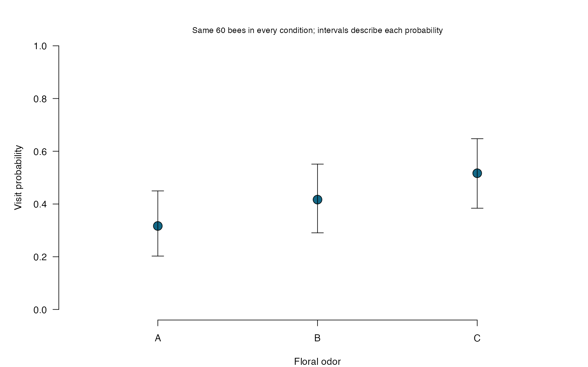

:::

::: {.column width="38%"}

**base R arguments**

**arrows** — Show separate probability intervals for each odor.

**ylim** — Use the full 0–1 scale.

**axis** — Name the repeated conditions.

**mtext** — Remind the reader that all conditions use the same bees.

:::

:::

::: notes

This figure is generated from the saved CSV by modules/cochran_q/analysis.R. A matched omnibus binary test uses complete sets of responses; a significant result does not identify which conditions differ.

:::


## Cochran Q: plot code {#cochran_q-plot-code}

::: columns

::: {.column width="62%"}

```r
par(mar = c(4, 5, 3, 1), las = 1)
plot(1:k, rates, xlim = c(.5, k + .5), ylim = c(0, 1),
     xaxt = "n", xlab = "Floral odor", ylab = "Visit probability", bty = "n",
     pch = 21, bg = "#126887", cex = 2)
arrows(1:k, ci[1, ], 1:k, ci[2, ], code = 3, angle = 90, length = .1)
axis(1, 1:k, colnames(wide))
mtext("Same 60 bees in every condition; intervals describe each probability",
      side = 3, cex = .85)
```


:::

::: {.column width="38%"}

**Arguments to change**

**arrows** — Show separate probability intervals for each odor.

**ylim** — Use the full 0–1 scale.

**axis** — Name the repeated conditions.

**mtext** — Remind the reader that all conditions use the same bees.

:::

:::

::: notes

This is an exact excerpt from analysis.R. Any preparation referenced by the excerpt appears in the complete companion script. The script opens a ragg PNG device before these lines and closes it afterward.

:::


## Cochran Q: question and null {#cochran_q-question}

::: columns

::: {.column width="62%"}

**Scientific question**

Are marginal visit probabilities equal for all three odors?

**Null / estimation target**

The three odor conditions have equal marginal probabilities of a visit.

:::

::: {.column width="38%"}

**Relevant options**

- Keep one row per bee in the matched outcome matrix.

- Q uses a chi-square reference with k − 1 degrees of freedom.

- An omnibus result needs planned or adjusted follow-up comparisons.

:::

:::

::: notes

Ask whether rejecting this null, or estimating this target, answers the biological question. A matched omnibus binary test uses complete sets of responses; a significant result does not identify which conditions differ.

:::


## Cochran Q: assumptions {#cochran_q-assumptions}

::: columns

::: {.column width="62%"}

**What matters here**

- Bees are independent of one another.

- Each bee has a complete matched set.

- Condition order and carryover are addressed by the design.

:::

::: {.column width="38%"}

**Parametric responses**

- Use repeated-measures logistic regression to model predictors.

- Use binary GEE for population-average comparisons.

**Nonparametric responses**

- Q is a nonparametric matched binary test.

- Within-bee randomization can be used if justified by the design.

:::

:::

::: notes

Begin with the design. A model change should address a specific issue and preserve the scientific target where possible. A rank or permutation alternative has its own assumptions and may change the null; do not choose it solely from a normality-test p-value.

:::


## Cochran Q: run and read {#cochran_q-analysis}

::: columns

::: {.column width="62%"}

```r
wide <- xtabs(visit ~ bee + odor, data = d)
k <- ncol(wide)
C <- colSums(wide)
R <- rowSums(wide)
Q <- (k - 1) * (k * sum(C^2) - sum(C)^2) /
     (k * sum(R) - sum(R^2))
p_value <- pchisq(Q, df = k - 1, lower.tail = FALSE)
rates <- C / nrow(wide)
ci <- sapply(1:k, function(j) binom.test(C[j], nrow(wide))$conf.int)
```


:::

::: {.column width="38%"}

**Generated results**

- Matched bees: 60; conditions: 3

- Visit probabilities: 0.317, 0.417, 0.517

- Q = 5.143; df = 2

- Omnibus p = 0.07643

:::

:::

::: notes

Full executed model/test output:

```
$statistic
[1] 5.142857

$df
[1] 2

$p.value
[1] 0.07642629

$visit_probabilities
        A         B         C 
0.3166667 0.4166667 0.5166667 

```


:::


## Cochran Q: interpret {#cochran_q-interpret}

Visit probabilities were 31.7%, 41.7%, 51.7%. Cochran Q(2) = 5.14, p = 0.0764 tests equality across all odors while retaining matching. It does not identify which odor pairs differ.

**Discuss:** Why is an ordinary independence chi-square test inappropriate for these repeated visits?

::: notes

Teaching point: A matched omnibus binary test uses complete sets of responses; a significant result does not identify which conditions differ.

Instructor comparison with the simulated population: Increasing odor effects produce strictly increasing marginal visit probabilities across A, B, and C. The equal-probabilities null is false; the latent log-odds differences are not themselves the marginal probability differences.

The reported estimate and p-value are calculated from this realized dataset; they need not exactly match the known population effect.

:::


## Logistic regression: the data {#logistic}

::: columns

::: {.column width="62%"}

Hybrid viability across parental divergence

- Binary viability outcome

- Continuous predictor: parental divergence (%)

- Model a probability through log odds

:::

::: {.column width="38%"}

**Other data like these**

- Infection versus dose

- Germination versus temperature

- Marker expression versus concentration

:::

:::

::: notes

Logistic regression

One independent hybrid offspring per cross.

cross: Unique independent cross identifier (none)

divergence: Parental divergence (percentage points)

viable: 1 = viable hybrid; 0 = nonviable (binary)

:::


## Logistic regression: simulate and save {#logistic-simulate}

::: columns

::: {.column width="62%"}

```r
set.seed(3110)
d <- data.frame(cross = 1:160, divergence = runif(160, 0, 8))
d$viable <- rbinom(160, 1, plogis(1.9 - .5 * d$divergence))
write.csv(d, file.path(out_dir, "data.csv"), row.names = FALSE)
```


:::

::: {.column width="38%"}

**First saved row**

```
cross: 1
divergence: 5.034
viable: 0
```


:::

:::

::: notes

Seed: 3110

Generating model: Generate 160 independent crosses with divergence Uniform(0,8) percentage points. One hybrid viability outcome per cross is Bernoulli with probability plogis(1.9 - 0.5 × divergence). Predictors are not rounded.

Population truth: The true divergence coefficient is -0.5; viability odds are multiplied by exp(-0.5) ≈ 0.607 per divergence percentage point. The zero-slope null is false. The probability decline is nonlinear.

The script writes data.csv before reading it for analysis. output_dir or out_dir is the folder supplied to the standalone script.

Original saved-data preview:

```
1 | 5.03366027772427 | 0
2 | 4.56829151697457 | 0
3 | 6.65665970183909 | 0
4 | 5.46810280717909 | 0
5 | 7.20037802867591 | 0
```


:::


## Logistic regression: see the data {#logistic-plot}

::: columns

::: {.column width="62%"}

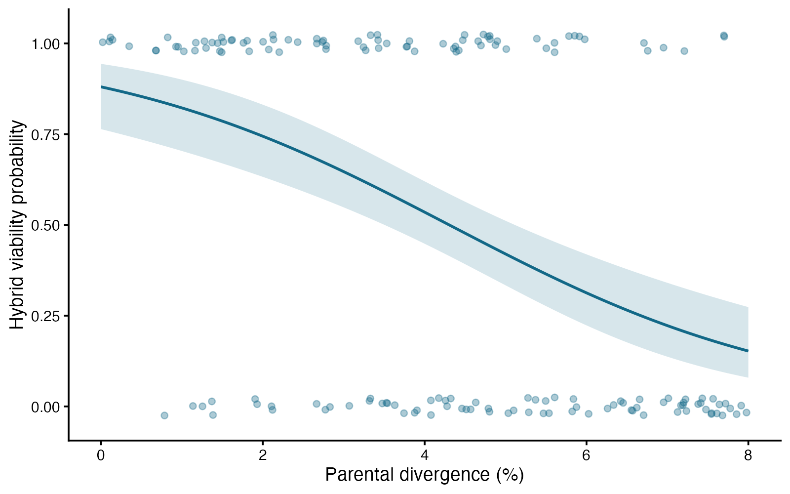

:::

::: {.column width="38%"}

**ggplot2 arguments**

**geom_jitter(height)** — Separate overlapping binary outcomes slightly.

**geom_ribbon** — Display a confidence band for the modeled probability.

**type = "link"** — Compute intervals on the logit scale, then transform.

**coord_cartesian** — Keep the probability display near 0–1.

:::

:::

::: notes

This figure is generated from the saved CSV by modules/logistic/analysis.R. A coefficient describes log odds; translate to odds ratios or plotted probabilities to answer the biological question.

:::


## Logistic regression: plot code {#logistic-plot-code}

::: columns

::: {.column width="62%"}

```r
p <- ggplot2::ggplot(d, ggplot2::aes(divergence, viable)) +
  ggplot2::geom_jitter(width = 0, height = .025, alpha = .35, color = "#126887") +
  ggplot2::geom_ribbon(data = grid, ggplot2::aes(x = divergence, ymin = lower,
    ymax = upper), inherit.aes = FALSE, fill = "#126887", alpha = .17) +
  ggplot2::geom_line(data = grid, ggplot2::aes(y = probability),
                    color = "#126887", linewidth = 1.2) +
  ggplot2::coord_cartesian(ylim = c(-.04, 1.04)) +
  ggplot2::labs(x = "Parental divergence (%)", y = "Hybrid viability probability") +
  ggplot2::theme_classic(base_size = 17)
print(p)
```


:::

::: {.column width="38%"}

**Arguments to change**

**geom_jitter(height)** — Separate overlapping binary outcomes slightly.

**geom_ribbon** — Display a confidence band for the modeled probability.

**type = "link"** — Compute intervals on the logit scale, then transform.

**coord_cartesian** — Keep the probability display near 0–1.

:::

:::

::: notes

This is an exact excerpt from analysis.R. Any preparation referenced by the excerpt appears in the complete companion script. The script opens a ragg PNG device before these lines and closes it afterward.

:::


## Logistic regression: question and null {#logistic-question}

::: columns

::: {.column width="62%"}

**Scientific question**

Does viability probability change with parental divergence?

**Null / estimation target**

The divergence coefficient is zero: modeled viability odds do not change with divergence.

:::

::: {.column width="38%"}

**Relevant options**

- family = binomial(link = "logit")

- A 1-unit coefficient is a log odds change, not a probability change.

- predict(..., type = "response") returns probabilities.

:::

:::

::: notes

Ask whether rejecting this null, or estimating this target, answers the biological question. A coefficient describes log odds; translate to odds ratios or plotted probabilities to answer the biological question.

:::


## Logistic regression: assumptions {#logistic-assumptions}

::: columns

::: {.column width="62%"}

**What matters here**

- Offspring are independent in this simulation.

- The specified predictor relationship is linear on the logit scale.

- Separation or sparse outcomes can destabilize estimates.

:::

::: {.column width="38%"}

**Parametric responses**

- Add a justified nonlinear term if the logit relationship bends.

- Use a mixed logistic model for several offspring per cross.

**Nonparametric responses**

- A suitable randomization test must preserve the assignment structure.

- There is no rank-test substitute that keeps this probability model and question.

:::

:::

::: notes

Begin with the design. A model change should address a specific issue and preserve the scientific target where possible. A rank or permutation alternative has its own assumptions and may change the null; do not choose it solely from a normality-test p-value.

:::


## Logistic regression: run and read {#logistic-analysis}

::: columns

::: {.column width="62%"}

```r
fit <- glm(viable ~ divergence, data = d, family = binomial)
test <- drop1(fit, test = "Chisq")
p_value <- test["divergence", "Pr(>Chi)"]
b <- coef(fit)["divergence"]
se <- sqrt(vcov(fit)["divergence", "divergence"])
odds_ratio <- exp(b)
ci <- exp(b + c(-1, 1) * 1.96 * se)
```


:::

::: {.column width="38%"}

**Generated results**

- Divergence coefficient: -0.464

- Odds ratio per percentage point: 0.629

- 95% Wald CI for odds ratio: 0.528 to 0.749

- Likelihood-ratio p = 6.573e-09

:::

:::

::: notes

Full executed model/test output:

```

Call:
glm(formula = viable ~ divergence, family = binomial, data = d)

Coefficients:
            Estimate Std. Error z value Pr(>|z|)    
(Intercept)  1.99600    0.41934   4.760 1.94e-06 ***
divergence  -0.46382    0.08915  -5.203 1.96e-07 ***
---
Signif. codes:  0 ‘***’ 0.001 ‘**’ 0.01 ‘*’ 0.05 ‘.’ 0.1 ‘ ’ 1

(Dispersion parameter for binomial family taken to be 1)

    Null deviance: 221.78  on 159  degrees of freedom
Residual deviance: 188.12  on 158  degrees of freedom
AIC: 192.12

Number of Fisher Scoring iterations: 4

```


:::


## Logistic regression: interpret {#logistic-interpret}

Each additional percentage point of divergence multiplied modeled viability odds by 0.63 (95% Wald CI 0.53–0.75; likelihood-ratio p = 6.57e-09). The curve translates odds into probabilities; this association alone does not establish causation.

**Discuss:** If several offspring came from each cross, what independent unit would the current analysis ignore?

::: notes

Teaching point: A coefficient describes log odds; translate to odds ratios or plotted probabilities to answer the biological question.

Instructor comparison with the simulated population: The true divergence coefficient is -0.5; viability odds are multiplied by exp(-0.5) ≈ 0.607 per divergence percentage point. The zero-slope null is false. The probability decline is nonlinear.

The reported estimate and p-value are calculated from this realized dataset; they need not exactly match the known population effect.

:::


## Multinomial regression: the data {#multinomial}

::: columns

::: {.column width="62%"}

Fish use of three unordered feeding microhabitats

- One unordered outcome with three categories

- Two independent food-availability groups

- Model all category probabilities jointly

:::

::: {.column width="38%"}

**Other data like these**

- Colony morphology classes

- Host species choice

- Unordered cell fates

:::

:::

::: notes

Multinomial logistic regression

Independent fish encounter either low or high food availability.

food: Low or High food availability (none)

choice: Open, Shelter, or Surface microhabitat (none)

:::


## Multinomial regression: simulate and save {#multinomial-simulate}

::: columns

::: {.column width="62%"}

```r
set.seed(3114)
d <- data.frame(food = rep(c("Low", "High"), each = 120))
d$choice <- c(sample(c("Open", "Shelter", "Surface"), 120, TRUE,
                      prob = c(.25, .50, .25)),
              sample(c("Open", "Shelter", "Surface"), 120, TRUE,
                      prob = c(.50, .30, .20)))
write.csv(d, file.path(out_dir, "data.csv"), row.names = FALSE)
```


:::

::: {.column width="38%"}

**First saved row**

```
food: Low
choice: Surface
```


:::

:::

::: notes

Seed: 3114

Generating model: Generate 120 independent fish choices under Low food with Open/Shelter/Surface probabilities 0.25/0.50/0.25 and 120 under High food with probabilities 0.50/0.30/0.20. Choices are unordered, mutually exclusive, and independent.

Population truth: The outcome distributions differ, so the joint no-food-effect null is false. Relative to Open, the food coefficients are log(0.30/0.50)-log(0.50/0.25) ≈ -1.204 for Shelter and log(0.20/0.50)-log(0.25/0.25) ≈ -0.916 for Surface.

The script writes data.csv before reading it for analysis. output_dir or out_dir is the folder supplied to the standalone script.

Original saved-data preview:

```
Low | Surface
Low | Shelter
Low | Shelter
Low | Shelter
Low | Surface
```


:::


## Multinomial regression: see the data {#multinomial-plot}

::: columns

::: {.column width="62%"}

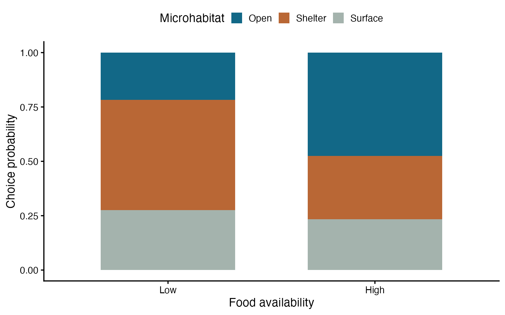

:::

::: {.column width="38%"}

**ggplot2 arguments**

**position = "fill"** — Compare distributions of choices.

**scale_fill_manual** — Use distinct, consistent category colors.

**labs(fill)** — Name the biological response in the legend.

**width** — Leave breathing room between bars.

:::

:::

::: notes

This figure is generated from the saved CSV by modules/multinomial/analysis.R. A categorical response with more than two levels requires a joint question across several coefficients.

:::


## Multinomial regression: plot code {#multinomial-plot-code}

::: columns

::: {.column width="62%"}

```r
p <- ggplot2::ggplot(d, ggplot2::aes(food, fill = choice)) +
  ggplot2::geom_bar(position = "fill", width = .65) +
  ggplot2::scale_fill_manual(values = c(Open = "#126887", Shelter = "#b96735",
                                       Surface = "#a4b3ad")) +
  ggplot2::labs(x = "Food availability", y = "Choice probability", fill = "Microhabitat") +
  ggplot2::theme_classic(base_size = 17) +
  ggplot2::theme(legend.position = "top")
print(p)
```


:::

::: {.column width="38%"}

**Arguments to change**

**position = "fill"** — Compare distributions of choices.

**scale_fill_manual** — Use distinct, consistent category colors.

**labs(fill)** — Name the biological response in the legend.

**width** — Leave breathing room between bars.

:::

:::

::: notes

This is an exact excerpt from analysis.R. Any preparation referenced by the excerpt appears in the complete companion script. The script opens a ragg PNG device before these lines and closes it afterward.

:::


## Multinomial regression: question and null {#multinomial-question}

::: columns

::: {.column width="62%"}

**Scientific question**

Does food availability change the distribution of feeding microhabitat choices?

**Null / estimation target**

All nonreference food coefficients are zero; microhabitat probabilities are the same under low and high food.

:::

::: {.column width="38%"}

**Relevant options**

- Choose the outcome reference category deliberately.

- Fit the same data for the full and null models.

- Use a joint likelihood-ratio test for the multi-coefficient predictor.

:::

:::

::: notes

Ask whether rejecting this null, or estimating this target, answers the biological question. A categorical response with more than two levels requires a joint question across several coefficients.

:::


## Multinomial regression: assumptions {#multinomial-assumptions}

::: columns

::: {.column width="62%"}

**What matters here**

- Fish contribute independent choices.

- Categories are mutually exclusive and sufficiently populated.

- The multinomial model’s relative-odds structure is appropriate.

:::

::: {.column width="38%"}

**Parametric responses**

- Use a richer multinomial model for additional predictors.

- Use a model for dependent choices when observations repeat.

**Nonparametric responses**

- A contingency-table test answers the same no-association question with one categorical predictor.

- A randomization test must follow the food-assignment design.

:::

:::

::: notes

Begin with the design. A model change should address a specific issue and preserve the scientific target where possible. A rank or permutation alternative has its own assumptions and may change the null; do not choose it solely from a normality-test p-value.

:::


## Multinomial regression: run and read {#multinomial-analysis}

::: columns

::: {.column width="62%"}

```r
d$food <- factor(d$food, levels = c("Low", "High"))
d$choice <- factor(d$choice, levels = c("Open", "Shelter", "Surface"))
fit <- nnet::multinom(choice ~ food, data = d, trace = FALSE)
fit0 <- nnet::multinom(choice ~ 1, data = d, trace = FALSE)
LR <- 2 * as.numeric(logLik(fit) - logLik(fit0))
df <- attr(logLik(fit), "df") - attr(logLik(fit0), "df")
p_value <- pchisq(LR, df, lower.tail = FALSE)
```


:::

::: {.column width="38%"}

**Generated results**

- Low-food probabilities: 0.217, 0.508, 0.275

- High-food probabilities: 0.475, 0.292, 0.233

- Likelihood ratio = 19.404; df = 2

- Joint p = 6.115e-05

:::

:::

::: notes

Full executed model/test output:

```
Call:
nnet::multinom(formula = choice ~ food, data = d, trace = FALSE)

Coefficients:
        (Intercept)   foodHigh
Shelter   0.8527665 -1.3404733
Surface   0.2384121 -0.9492706

Std. Errors:
        (Intercept)  foodHigh
Shelter   0.2342112 0.3177579
Surface   0.2622292 0.3493172

Residual Deviance: 499.8932 
AIC: 507.8932 
```


:::


## Multinomial regression: interpret {#multinomial-interpret}

Predicted probabilities for open/shelter/surface were 0.22/0.51/0.28 under low food and 0.48/0.29/0.23 under high food. The joint likelihood-ratio test gives chi-square(2) = 19.40, p = 6.11e-05; it tests the whole distribution of choices.

**Discuss:** Why does one food predictor require two coefficients when the response has three unordered categories?

::: notes

Teaching point: A categorical response with more than two levels requires a joint question across several coefficients.

Instructor comparison with the simulated population: The outcome distributions differ, so the joint no-food-effect null is false. Relative to Open, the food coefficients are log(0.30/0.50)-log(0.50/0.25) ≈ -1.204 for Shelter and log(0.20/0.50)-log(0.25/0.25) ≈ -0.916 for Surface.

The reported estimate and p-value are calculated from this realized dataset; they need not exactly match the known population effect.

:::


## Ordinal regression: the data {#ordinal_logistic}

::: columns

::: {.column width="62%"}

Coral bleaching severity along a temperature gradient

- Ordered categories: none, mild, moderate, severe

- Continuous temperature predictor

- Distances between score levels are not assumed equal

:::

::: {.column width="38%"}

**Other data like these**

- Ordered disease grades

- Behavioral response intensity classes

- Developmental stage ratings

:::

:::

::: notes

Ordinal logistic regression

Independent coral fragments are assigned a four-level ordered bleaching score.

fragment: Unique independent coral fragment identifier (none)

temperature: Experimental temperature (°C)

severity: Ordered bleaching level: None < Mild < Moderate < Severe (none)

:::


## Ordinal regression: simulate and save {#ordinal_logistic-simulate}

::: columns

::: {.column width="62%"}

```r
set.seed(3115)
d <- data.frame(fragment = 1:180, temperature = runif(180, 26, 32))
latent <- .8 * (d$temperature - 28) + rlogis(180)
d$severity <- cut(latent, c(-Inf, -1, .7, 2.2, Inf),
                  labels = c("None", "Mild", "Moderate", "Severe"))
write.csv(d, file.path(out_dir, "data.csv"), row.names = FALSE)
```


:::

::: {.column width="38%"}

**First saved row**

```
fragment: 1
temperature: 28.15
severity: Moderate
```


:::

:::

::: notes

Seed: 3115

Generating model: Generate 180 independent fragments with temperature Uniform(26,32) °C. Latent severity is 0.8 × (temperature - 28) plus a standard logistic error. Cut at -1, 0.7, and 2.2 to obtain None, Mild, Moderate, Severe. Do not treat category spacing as numeric distance.

Population truth: The common temperature coefficient is 0.8, so each °C multiplies odds of higher versus lower severity by exp(0.8) ≈ 2.226 at every cumulative threshold. The zero-effect null is false and proportional odds holds by construction.

The script writes data.csv before reading it for analysis. output_dir or out_dir is the folder supplied to the standalone script.

Original saved-data preview:

```
  1 | 28.15313 | Moderate
  2 | 28.30287 | None
  3 | 27.62607 | None
  4 | 27.56123 | Mild
  5 | 31.16458 | Moderate
```


:::


## Ordinal regression: see the data {#ordinal_logistic-plot}

::: columns

::: {.column width="62%"}

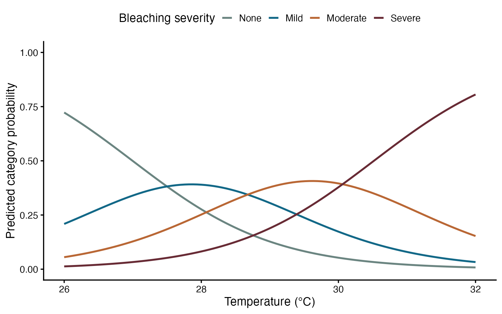

:::

::: {.column width="38%"}

**ggplot2 arguments**

**color = severity** — Track each ordered category’s probability.

**geom_line** — Show probabilities across the temperature gradient.

**scale_color_manual** — Use an ordered color progression.

**ylim(0, 1)** — Keep probabilities on their natural scale.

:::

:::

::: notes

This figure is generated from the saved CSV by modules/ordinal_logistic/analysis.R. Ordering carries information without assuming equal distances; the common effect across thresholds is the key model assumption.

:::


## Ordinal regression: plot code {#ordinal_logistic-plot-code}

::: columns

::: {.column width="62%"}

```r
p <- ggplot2::ggplot(plot_data, ggplot2::aes(temperature, probability,
                                            color = severity)) +
  ggplot2::geom_line(linewidth = 1.3) +
  ggplot2::scale_color_manual(values = c(None = "#6b8581", Mild = "#126887",
                                        Moderate = "#b96735", Severe = "#682b35")) +
  ggplot2::ylim(0, 1) +
  ggplot2::labs(x = "Temperature (°C)", y = "Predicted category probability",
                color = "Bleaching severity") +
  ggplot2::theme_classic(base_size = 17) +
  ggplot2::theme(legend.position = "top")
print(p)
```


:::

::: {.column width="38%"}

**Arguments to change**

**color = severity** — Track each ordered category’s probability.

**geom_line** — Show probabilities across the temperature gradient.

**scale_color_manual** — Use an ordered color progression.

**ylim(0, 1)** — Keep probabilities on their natural scale.

:::

:::

::: notes

This is an exact excerpt from analysis.R. Any preparation referenced by the excerpt appears in the complete companion script. The script opens a ragg PNG device before these lines and closes it afterward.

:::


## Ordinal regression: question and null {#ordinal_logistic-question}

::: columns

::: {.column width="62%"}

**Scientific question**

Does temperature shift bleaching severity toward higher ordered categories?

**Null / estimation target**

The common temperature coefficient is zero; the modeled severity distribution does not change with temperature.

:::

::: {.column width="38%"}

**Relevant options**

- Mark the response as ordered in the correct direction.

- link = "logit" fits cumulative proportional odds.

- exp(coefficient) compares odds of higher versus lower severity.

:::

:::

::: notes

Ask whether rejecting this null, or estimating this target, answers the biological question. Ordering carries information without assuming equal distances; the common effect across thresholds is the key model assumption.

:::


## Ordinal regression: assumptions {#ordinal_logistic-assumptions}

::: columns

::: {.column width="62%"}

**What matters here**

- Coral fragments are independent.

- A common temperature effect across cumulative thresholds is plausible.

- The predictor relationship on the logit scale is appropriate.

:::

::: {.column width="38%"}

**Parametric responses**

- Use partial proportional-odds or multinomial models if the common effect fails.

- Use an ordinal mixed model for clustered fragments.

**Nonparametric responses**

- Spearman association can address monotonic ordering with a different null.

- A design-based permutation test must preserve the treatment structure.

:::

:::

::: notes

Begin with the design. A model change should address a specific issue and preserve the scientific target where possible. A rank or permutation alternative has its own assumptions and may change the null; do not choose it solely from a normality-test p-value.

:::


## Ordinal regression: run and read {#ordinal_logistic-analysis}

::: columns

::: {.column width="62%"}

```r
d$severity <- ordered(d$severity, levels = c("None", "Mild", "Moderate", "Severe"))
fit <- ordinal::clm(severity ~ temperature, data = d, link = "logit")
fit0 <- ordinal::clm(severity ~ 1, data = d, link = "logit")
LR <- 2 * as.numeric(logLik(fit) - logLik(fit0))
p_value <- pchisq(LR, df = 1, lower.tail = FALSE)
b <- fit$beta["temperature"]
se <- sqrt(vcov(fit)["temperature", "temperature"])
odds_ratio <- exp(b)
ci <- exp(b + c(-1, 1) * 1.96 * se)
```


:::

::: {.column width="38%"}

**Generated results**

- Common odds ratio per 1°C: 2.613

- 95% Wald CI: 2.105 to 3.244

- Likelihood ratio = 97.836; df = 1

- p = 4.544e-23

:::

:::

::: notes

Full executed model/test output:

```
formula: severity ~ temperature
data:    d

 link  threshold nobs logLik  AIC    niter max.grad cond.H 
 logit flexible  180  -200.34 408.69 5(0)  2.85e-11 1.3e+06

Coefficients:
            Estimate Std. Error z value Pr(>|z|)    
temperature   0.9606     0.1103    8.71   <2e-16 ***
---
Signif. codes:  0 ‘***’ 0.001 ‘**’ 0.01 ‘*’ 0.05 ‘.’ 0.1 ‘ ’ 1

Threshold coefficients:
                Estimate Std. Error z value
None|Mild         25.935      3.098   8.373
Mild|Moderate     27.589      3.178   8.682
Moderate|Severe   29.316      3.273   8.957
```


:::


## Ordinal regression: interpret {#ordinal_logistic-interpret}

Each 1°C increase multiplied the modeled odds of higher rather than lower bleaching severity by 2.61 (95% Wald CI 2.11–3.24; likelihood-ratio p = 4.54e-23), assuming the same temperature effect across thresholds.

**Discuss:** Why would treating none/mild/moderate/severe as equally spaced numbers add an assumption?

::: notes

Teaching point: Ordering carries information without assuming equal distances; the common effect across thresholds is the key model assumption.

Instructor comparison with the simulated population: The common temperature coefficient is 0.8, so each °C multiplies odds of higher versus lower severity by exp(0.8) ≈ 2.226 at every cumulative threshold. The zero-effect null is false and proportional odds holds by construction.

The reported estimate and p-value are calculated from this realized dataset; they need not exactly match the known population effect.

:::


## Exact Poisson: the data {#poisson_exact}

::: columns

::: {.column width="62%"}

De novo mutations in sequenced microbial lineages

- Nonnegative mutation counts

- Known exposure: callable megabases

- Target: mutations per megabase, compared with a benchmark

:::

::: {.column width="38%"}

**Other data like these**

- Colonies per milliliter

- Rare events per observation hour

- Parasites per surveyed area

:::

:::

::: notes

Exact Poisson rate test

Independent lineages have different amounts of callable sequence.

lineage: Unique independent microbial lineage (none)

megabases: Callable sequence exposure (Mb)

mutations: Observed de novo mutations (count)

:::


## Exact Poisson: simulate and save {#poisson_exact-simulate}

::: columns

::: {.column width="62%"}

```r
set.seed(3109)
d <- data.frame(lineage = 1:60, megabases = runif(60, 8, 20))
d$mutations <- rpois(60, .40 * d$megabases)
write.csv(d, file.path(out_dir, "data.csv"), row.names = FALSE)
```


:::

::: {.column width="38%"}

**First saved row**

```
lineage: 1
megabases: 14.79
mutations: 7
```


:::

:::

::: notes

Seed: 3109

Generating model: Generate 60 independent lineages with callable sequence Uniform(8,20) megabases. Each count is Poisson with mean 0.40 × callable megabases. The population rate is constant across lineages and exposure is unrounded.

Population truth: The true rate is 0.40 mutations/Mb rather than the null rate 0.25/Mb. The population rate ratio to the null is 1.6.

The script writes data.csv before reading it for analysis. output_dir or out_dir is the folder supplied to the standalone script.

Original saved-data preview:

```
1 | 14.7936320584267 | 7
2 | 19.4386634835973 | 6
3 | 19.1721002459526 | 3
4 | 12.0031125238165 | 4
5 | 18.0816876189783 | 5
```


:::


## Exact Poisson: see the data {#poisson_exact-plot}

::: columns

::: {.column width="62%"}

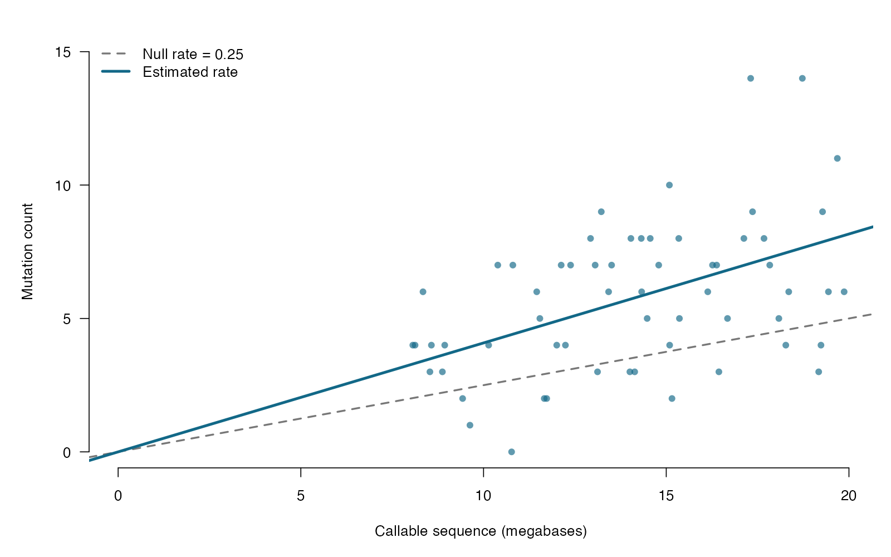

:::

::: {.column width="38%"}

**base R arguments**

**abline(a = 0, b = rate)** — A rate becomes a count-versus-exposure slope.

**pch / col** — Use readable points with modest transparency.

**legend** — Distinguish the null and estimated rates.

**xlab** — Show exposure units explicitly.

:::

:::

::: notes

This figure is generated from the saved CSV by modules/poisson_exact/analysis.R. A count becomes a rate only after the exposure and its units are supplied.

:::


## Exact Poisson: plot code {#poisson_exact-plot-code}

::: columns

::: {.column width="62%"}

```r
par(mar = c(5, 5, 2, 1), las = 1)
plot(d$megabases, d$mutations, pch = 16, col = "#126887AA", bty = "n",
     xlab = "Callable sequence (megabases)", ylab = "Mutation count",
     xlim = c(0, max(d$megabases)), ylim = c(0, max(d$mutations) + 1))
abline(a = 0, b = .25, lty = 2, col = "#777777", lwd = 2)
abline(a = 0, b = rate, col = "#126887", lwd = 3)
legend("topleft", c("Null rate = 0.25", "Estimated rate"),
       lty = c(2, 1), lwd = c(2, 3), col = c("#777777", "#126887"), bty = "n")
```


:::

::: {.column width="38%"}

**Arguments to change**

**abline(a = 0, b = rate)** — A rate becomes a count-versus-exposure slope.

**pch / col** — Use readable points with modest transparency.

**legend** — Distinguish the null and estimated rates.

**xlab** — Show exposure units explicitly.

:::

:::

::: notes

This is an exact excerpt from analysis.R. Any preparation referenced by the excerpt appears in the complete companion script. The script opens a ragg PNG device before these lines and closes it afterward.

:::


## Exact Poisson: question and null {#poisson_exact-question}

::: columns

::: {.column width="62%"}

**Scientific question**

Does the mutation rate differ from 0.25 mutations per callable megabase?

**Null / estimation target**

The common mutation rate is 0.25 per callable megabase.

:::

::: {.column width="38%"}

**Relevant options**

- x = total events; T = total exposure

- r = the null rate in the same exposure units

- alternative = "two.sided" compares either direction

:::

:::

::: notes

Ask whether rejecting this null, or estimating this target, answers the biological question. A count becomes a rate only after the exposure and its units are supplied.

:::


## Exact Poisson: assumptions {#poisson_exact-assumptions}

::: columns

::: {.column width="62%"}

**What matters here**

- Events follow a Poisson process at a common rate.

- Lineages contribute independent counts.

- Exposure is measured correctly; extra heterogeneity can inflate variance.

:::

::: {.column width="38%"}

**Parametric responses**

- Use a Poisson GLM with log-exposure offset for predictors.

- Use negative binomial or quasi-Poisson for extra variation.

**Nonparametric responses**

- A lineage-level bootstrap can estimate rate uncertainty with many lineages.

- A count rank test does not automatically compare rates when exposures differ.

:::

:::

::: notes

Begin with the design. A model change should address a specific issue and preserve the scientific target where possible. A rank or permutation alternative has its own assumptions and may change the null; do not choose it solely from a normality-test p-value.

:::


## Exact Poisson: run and read {#poisson_exact-analysis}

::: columns

::: {.column width="62%"}

```r
fit <- poisson.test(sum(d$mutations), T = sum(d$megabases),
                    r = .25, alternative = "two.sided")
rate <- sum(d$mutations) / sum(d$megabases)
ci <- fit$conf.int
```


:::

::: {.column width="38%"}

**Generated results**

- Events: 345; exposure: 845.0 Mb

- Rate: 0.408 mutations/Mb

- 95% exact CI: 0.366 to 0.454

- Exact p = 3.246e-17

:::

:::

::: notes

Full executed model/test output:

```

	Exact Poisson test

data:  sum(d$mutations) time base: sum(d$megabases)
number of events = 345, time base = 844.99, p-value < 2.2e-16
alternative hypothesis: true event rate is not equal to 0.25
95 percent confidence interval:
 0.3663373 0.4537273
sample estimates:
event rate 
 0.4082887 

```


:::


## Exact Poisson: interpret {#poisson_exact-interpret}

The mutation rate was 0.408 per callable Mb (95% exact CI 0.366–0.454; p = 3.25e-17 against 0.25/Mb). Pooling counts is justified here by the common-rate Poisson model.

**Discuss:** How would the estimated rate and its units change if exposure were entered in kilobases?

::: notes

Teaching point: A count becomes a rate only after the exposure and its units are supplied.

Instructor comparison with the simulated population: The true rate is 0.40 mutations/Mb rather than the null rate 0.25/Mb. The population rate ratio to the null is 1.6.

The reported estimate and p-value are calculated from this realized dataset; they need not exactly match the known population effect.

:::


## Poisson regression: the data {#poisson_glm}

::: columns

::: {.column width="62%"}

Coral recruit counts and live coral cover

- Nonnegative counts per transect

- Known area exposure in square meters

- Continuous predictor: live coral cover (%)

:::

::: {.column width="38%"}

**Other data like these**

- Mutations per callable base

- Colonies per volume of medium

- Encounters per hour of observation

:::

:::

::: notes

Poisson regression

Independent transects differ in surveyed area and live coral cover.

transect: Unique independent transect identifier (none)

cover: Live coral cover (percentage points)

area: Surveyed transect area (m²)

recruits: Observed coral recruits (count)

:::


## Poisson regression: simulate and save {#poisson_glm-simulate}

::: columns

::: {.column width="62%"}

```r
set.seed(3111)
d <- data.frame(transect = 1:120, cover = runif(120, 0, 80),
                area = runif(120, 2, 8))
d$recruits <- rpois(120, d$area * exp(-.5 + .016 * d$cover))
write.csv(d, file.path(out_dir, "data.csv"), row.names = FALSE)
```


:::

::: {.column width="38%"}

**First saved row**

```
transect: 1
cover: 56.65
area: 7.215
recruits: 15
```


:::

:::

::: notes

Seed: 3111

Generating model: Generate 120 independent transects. Cover is Uniform(0,80) percentage points and area is independently Uniform(2,8) square meters. Recruit counts are Poisson(area × exp(-0.5 + 0.016 × cover)). No clustering or rounding is introduced.

Population truth: The true cover coefficient is 0.016. A 10-point cover increase multiplies recruit density by exp(0.16) ≈ 1.174. The zero-slope null is false, and the exposure coefficient is fixed at one.

The script writes data.csv before reading it for analysis. output_dir or out_dir is the folder supplied to the standalone script.

Original saved-data preview:

```
1 | 56.6454520076513 | 7.21462797746062 | 15
2 | 58.0549041554332 | 6.60326516302302 | 9
3 | 23.0353081598878 | 7.21808331925422 | 5
4 | 9.47735395282507 | 4.16359867714345 | 3
5 | 75.7575953565538 | 6.12687354674563 | 12
```


:::


## Poisson regression: see the data {#poisson_glm-plot}

::: columns

::: {.column width="62%"}

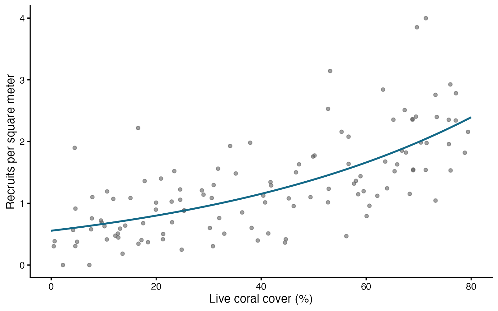

:::

::: {.column width="38%"}

**ggplot2 arguments**

**count / area** — Plot observed rates when exposures differ.

**geom_point(alpha)** — Reveal dense observations without hiding spread.

**geom_line** — Show the modeled rate at one unit of exposure.

**linewidth** — Make the fitted relationship easy to see.

:::

:::

::: notes

This figure is generated from the saved CSV by modules/poisson_glm/analysis.R. The exposure offset separates a biological density difference from simply looking over a larger area.

:::


## Poisson regression: plot code {#poisson_glm-plot-code}

::: columns

::: {.column width="62%"}

```r
p <- ggplot2::ggplot(d, ggplot2::aes(cover, recruits / area)) +
  ggplot2::geom_point(alpha = .55, size = 2, color = "#555555") +
  ggplot2::geom_line(data = grid, ggplot2::aes(y = rate),
                    color = "#126887", linewidth = 1.3) +
  ggplot2::labs(x = "Live coral cover (%)", y = "Recruits per square meter") +
  ggplot2::theme_classic(base_size = 17)
print(p)
```


:::

::: {.column width="38%"}

**Arguments to change**

**count / area** — Plot observed rates when exposures differ.

**geom_point(alpha)** — Reveal dense observations without hiding spread.

**geom_line** — Show the modeled rate at one unit of exposure.

**linewidth** — Make the fitted relationship easy to see.

:::

:::

::: notes

This is an exact excerpt from analysis.R. Any preparation referenced by the excerpt appears in the complete companion script. The script opens a ragg PNG device before these lines and closes it afterward.

:::


## Poisson regression: question and null {#poisson_glm-question}

::: columns

::: {.column width="62%"}

**Scientific question**

Does recruit density change with live coral cover after accounting for surveyed area?

**Null / estimation target**

The coral-cover coefficient is zero: recruit rate per square meter is unrelated to cover in this model.

:::

::: {.column width="38%"}

**Relevant options**

- family = poisson(link = "log")

- offset(log(area)) fixes the exposure coefficient at 1.

- exp(10 * coefficient) is the rate ratio per 10 cover percentage points.

:::

:::

::: notes

Ask whether rejecting this null, or estimating this target, answers the biological question. The exposure offset separates a biological density difference from simply looking over a larger area.

:::


## Poisson regression: assumptions {#poisson_glm-assumptions}

::: columns

::: {.column width="62%"}

**What matters here**

- Transect counts are independent.

- The mean rate has the specified log-linear relationship.

- Conditional count variance is approximately the conditional mean.

:::

::: {.column width="38%"}

**Parametric responses**

- Use negative binomial or quasi-Poisson for overdispersion.

- Add site effects or use a mixed count model for clustered transects.

**Nonparametric responses**

- A bootstrap should resample independent transects or sites.

- A rank test on raw counts does not adjust for unequal areas.

:::

:::

::: notes

Begin with the design. A model change should address a specific issue and preserve the scientific target where possible. A rank or permutation alternative has its own assumptions and may change the null; do not choose it solely from a normality-test p-value.

:::


## Poisson regression: run and read {#poisson_glm-analysis}

::: columns

::: {.column width="62%"}

```r
fit <- glm(recruits ~ cover + offset(log(area)), data = d,
           family = poisson)
p_value <- drop1(fit, test = "Chisq")["cover", "Pr(>Chi)"]
b <- coef(fit)["cover"]
se <- sqrt(vcov(fit)["cover", "cover"])
rate_ratio <- exp(10 * b)
ci <- exp(10 * (b + c(-1, 1) * 1.96 * se))
dispersion <- sum(residuals(fit, type = "pearson")^2) / df.residual(fit)
```


:::

::: {.column width="38%"}

**Generated results**

- Rate ratio per 10 cover points: 1.200

- 95% Wald CI: 1.162 to 1.240

- Likelihood-ratio p = 2.64e-30

- Pearson dispersion diagnostic: 1.111

:::

:::

::: notes

Full executed model/test output:

```

Call:
glm(formula = recruits ~ cover + offset(log(area)), family = poisson, 
    data = d)

Coefficients:
             Estimate Std. Error z value Pr(>|z|)    
(Intercept) -0.587917   0.092543  -6.353 2.11e-10 ***
cover        0.018256   0.001649  11.071  < 2e-16 ***
---
Signif. codes:  0 ‘***’ 0.001 ‘**’ 0.01 ‘*’ 0.05 ‘.’ 0.1 ‘ ’ 1

(Dispersion parameter for poisson family taken to be 1)

    Null deviance: 258.31  on 119  degrees of freedom
Residual deviance: 127.43  on 118  degrees of freedom
AIC: 541.72

Number of Fisher Scoring iterations: 4

```


:::


## Poisson regression: interpret {#poisson_glm-interpret}

A 10-percentage-point increase in coral cover multiplied modeled recruit density by 1.20 (95% Wald CI 1.16–1.24; p = 2.64e-30). Area is handled as exposure; the observational association is not a causal effect.

**Discuss:** Why should log(area) be an offset rather than an ordinary estimated slope when area is exposure?

::: notes

Teaching point: The exposure offset separates a biological density difference from simply looking over a larger area.

Instructor comparison with the simulated population: The true cover coefficient is 0.016. A 10-point cover increase multiplies recruit density by exp(0.16) ≈ 1.174. The zero-slope null is false, and the exposure coefficient is fixed at one.

The reported estimate and p-value are calculated from this realized dataset; they need not exactly match the known population effect.

:::


## Quasi-Poisson: the data {#quasipoisson}

::: columns

::: {.column width="62%"}

Bacterial colony counts with clumping

- Nonnegative colony counts with extra-Poisson spread

- Exposure: plated volume in milliliters

- Mean rate differs between low- and high-nutrient medium

:::

::: {.column width="38%"}

**Other data like these**

- Counts with unmodeled clumping

- Offspring counts with overdispersion

- Encounters with extra variability

:::

:::

::: notes

Quasi-Poisson regression

Independent plated samples vary in medium and plated volume.

medium: Low or High nutrient medium (none)

volume_ml: Plated volume exposure (ml)

colonies: Observed colony count after clumping (count)

:::


## Quasi-Poisson: simulate and save {#quasipoisson-simulate}

::: columns

::: {.column width="62%"}

```r
set.seed(3113)
d <- data.frame(medium = rep(c("Low", "High"), each = 60),
                volume_ml = runif(120, .7, 1.3))
mu <- d$volume_ml * exp(2.4 + .5 * (d$medium == "High"))
clumps <- rpois(120, mu / 3)
d$colonies <- rpois(120, 3 * clumps)
write.csv(d, file.path(out_dir, "data.csv"), row.names = FALSE)
```


:::

::: {.column width="38%"}

**First saved row**

```
medium: Low
volume_ml: 1.184
colonies: 7
```


:::

:::

::: notes

Seed: 3113

Generating model: Generate 60 low-medium and 60 high-medium independent plates, with volume Uniform(0.7,1.3) ml. Set mean count μ = volume × exp(2.4 + 0.5 × high). Generate clumps ~ Poisson(μ/3), then colonies ~ Poisson(3 × clumps). Marginal mean is μ and variance is 4μ.

Population truth: High medium multiplies mean colony density by exp(0.5) ≈ 1.649; the equal-rate null is false. The true dispersion multiplier is 4, so Poisson uncertainty would be too small.

The script writes data.csv before reading it for analysis. output_dir or out_dir is the folder supplied to the standalone script.

Original saved-data preview:

```
Low | 1.1841021 |  7
Low | 0.7388036 | 13
Low | 0.8322714 |  8
Low | 0.9698467 | 13
Low | 0.7744541 | 10
```


:::


## Quasi-Poisson: see the data {#quasipoisson-plot}

::: columns

::: {.column width="62%"}

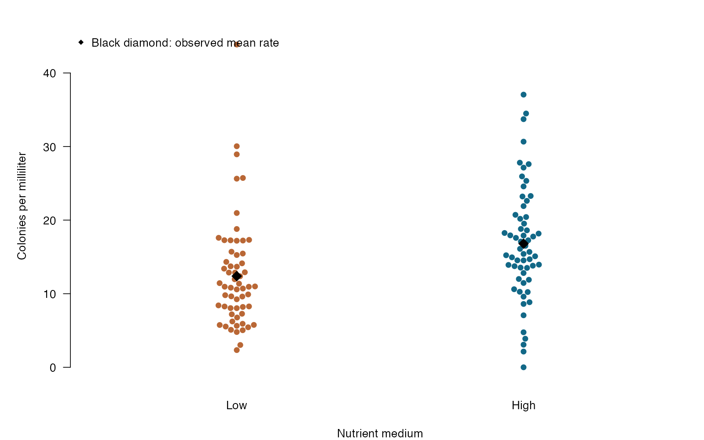

:::

::: {.column width="38%"}

**beeswarm arguments**

**pch** — Filled points keep individual plates visible.

**col** — Match medium colors to group labels.

**method = "swarm"** — Spread points to avoid overlap.

**cex** — Balance visibility with crowding.

:::

:::

::: notes

This figure is generated from the saved CSV by modules/quasipoisson/analysis.R. Quasi-Poisson retains the log-mean question while changing the uncertainty model; ordinary likelihood AIC is unavailable.

:::


## Quasi-Poisson: plot code {#quasipoisson-plot-code}

::: columns

::: {.column width="62%"}

```r
par(mar = c(4, 5, 2, 1), las = 1)
beeswarm::beeswarm(colonies / volume_ml ~ medium, data = d,
  method = "swarm", pch = 16, cex = 1.1, col = c("#b96735", "#126887"),
  xlab = "Nutrient medium", ylab = "Colonies per milliliter", bty = "n")
group_means <- tapply(d$colonies / d$volume_ml, d$medium, mean)
points(1:2, group_means, pch = 18, cex = 2)
legend("topleft", "Black diamond: observed mean rate", pch = 18, bty = "n")
```


:::

::: {.column width="38%"}

**Arguments to change**

**pch** — Filled points keep individual plates visible.

**col** — Match medium colors to group labels.

**method = "swarm"** — Spread points to avoid overlap.

**cex** — Balance visibility with crowding.

:::

:::

::: notes

This is an exact excerpt from analysis.R. Any preparation referenced by the excerpt appears in the complete companion script. The script opens a ragg PNG device before these lines and closes it afterward.

:::


## Quasi-Poisson: question and null {#quasipoisson-question}

::: columns

::: {.column width="62%"}

**Scientific question**

Does mean colony density differ between media after accounting for plated volume?

**Null / estimation target**

The high-medium coefficient is zero: mean colony rates are equal between media.

:::

::: {.column width="38%"}

**Relevant options**

- family = quasipoisson estimates a dispersion multiplier.

- Use t/F-based inference for the fitted dispersion.

- Quasi-likelihood does not provide ordinary likelihood AIC.

:::

:::

::: notes

Ask whether rejecting this null, or estimating this target, answers the biological question. Quasi-Poisson retains the log-mean question while changing the uncertainty model; ordinary likelihood AIC is unavailable.

:::


## Quasi-Poisson: assumptions {#quasipoisson-assumptions}

::: columns

::: {.column width="62%"}

**What matters here**

- Plated samples are independent.

- The specified log-mean model is appropriate.

- Variance is approximately a common multiple of the mean.

:::

::: {.column width="38%"}

**Parametric responses**

- Negative binomial regression supplies an alternative variance relationship.

- Use a mixed model when plates share biological cultures.

**Nonparametric responses**

- A cluster-aware bootstrap can assess uncertainty.

- A rank-sum test on rates would target a different distributional question.

:::

:::

::: notes

Begin with the design. A model change should address a specific issue and preserve the scientific target where possible. A rank or permutation alternative has its own assumptions and may change the null; do not choose it solely from a normality-test p-value.

:::


## Quasi-Poisson: run and read {#quasipoisson-analysis}

::: columns

::: {.column width="62%"}

```r
d$medium <- factor(d$medium, levels = c("Low", "High"))
fit <- glm(colonies ~ medium + offset(log(volume_ml)),
           data = d, family = quasipoisson)
b <- coef(fit)["mediumHigh"]
se <- sqrt(vcov(fit)["mediumHigh", "mediumHigh"])
critical <- qt(.975, df.residual(fit))
rate_ratio <- exp(b)
ci <- exp(b + c(-1, 1) * critical * se)
p_value <- summary(fit)$coefficients["mediumHigh", "Pr(>|t|)"]
```


:::

::: {.column width="38%"}

**Generated results**

- High / low mean rate ratio: 1.351

- 95% t-based CI: 1.117 to 1.633

- Dispersion multiplier: 3.953

- Quasi-Poisson t-test p = 0.002166

:::

:::

::: notes

Full executed model/test output:

```

Call:
glm(formula = colonies ~ medium + offset(log(volume_ml)), family = quasipoisson, 
    data = d)

Coefficients:
            Estimate Std. Error t value Pr(>|t|)    
(Intercept)  2.52196    0.07284  34.622  < 2e-16 ***
mediumHigh   0.30075    0.09592   3.135  0.00217 ** 
---
Signif. codes:  0 ‘***’ 0.001 ‘**’ 0.01 ‘*’ 0.05 ‘.’ 0.1 ‘ ’ 1

(Dispersion parameter for quasipoisson family taken to be 3.953259)

    Null deviance: 489.45  on 119  degrees of freedom
Residual deviance: 450.13  on 118  degrees of freedom
AIC: NA

Number of Fisher Scoring iterations: 4

```


:::


## Quasi-Poisson: interpret {#quasipoisson-interpret}

High-nutrient medium had 1.35 times the modeled colony rate of low-nutrient medium (95% t-based CI 1.12–1.63; p = 0.00217). Estimated dispersion 3.95 adjusts uncertainty for extra-Poisson variation.

**Discuss:** Why should a Poisson likelihood-ratio test or ordinary AIC not be copied directly into this quasi-Poisson analysis?

::: notes

Teaching point: Quasi-Poisson retains the log-mean question while changing the uncertainty model; ordinary likelihood AIC is unavailable.

Instructor comparison with the simulated population: High medium multiplies mean colony density by exp(0.5) ≈ 1.649; the equal-rate null is false. The true dispersion multiplier is 4, so Poisson uncertainty would be too small.

The reported estimate and p-value are calculated from this realized dataset; they need not exactly match the known population effect.

:::


## Negative binomial: the data {#negbin_glm}

::: columns

::: {.column width="62%"}

Parasite abundance and fish body length

- Nonnegative parasite counts

- Continuous length predictor in centimeters

- Conditional variance can exceed the conditional mean

:::

::: {.column width="38%"}

**Other data like these**

- Overdispersed offspring counts

- RNA-seq counts with suitable normalization

- Microbial colony counts with heterogeneous rates

:::

:::

::: notes

Negative binomial regression

Independent fish vary in body length; parasite burdens are highly variable.

fish: Unique independent fish identifier (none)

length_cm: Fish body length (cm)

parasites: Observed parasite burden (count)

:::


## Negative binomial: simulate and save {#negbin_glm-simulate}

::: columns

::: {.column width="62%"}

```r
set.seed(3112)
d <- data.frame(fish = 1:130, length_cm = runif(130, 18, 42))
mu <- exp(-.2 + .085 * d$length_cm)
d$parasites <- rnbinom(130, mu = mu, size = 2)
write.csv(d, file.path(out_dir, "data.csv"), row.names = FALSE)
```


:::

::: {.column width="38%"}

**First saved row**

```
fish: 1
length_cm: 27.86
parasites: 7
```


:::

:::

::: notes

Seed: 3112

Generating model: Generate 130 independent fish with length Uniform(18,42) cm. Parasite count follows a negative binomial with mean exp(-0.2 + 0.085 × length) and size/theta 2. Conditional variance is mean + mean²/2.

Population truth: The length coefficient is 0.085, so 5 cm multiplies expected parasite abundance by exp(0.425) ≈ 1.530. The slope-zero null is false; the Poisson variance assumption is intentionally violated.

The script writes data.csv before reading it for analysis. output_dir or out_dir is the folder supplied to the standalone script.

Original saved-data preview:

```
1 | 27.863254705444 | 7
2 | 27.5214403253049 | 1
3 | 29.7717737685889 | 4
4 | 20.5594320036471 | 2
5 | 21.0298875980079 | 2
```


:::


## Negative binomial: see the data {#negbin_glm-plot}

::: columns

::: {.column width="62%"}

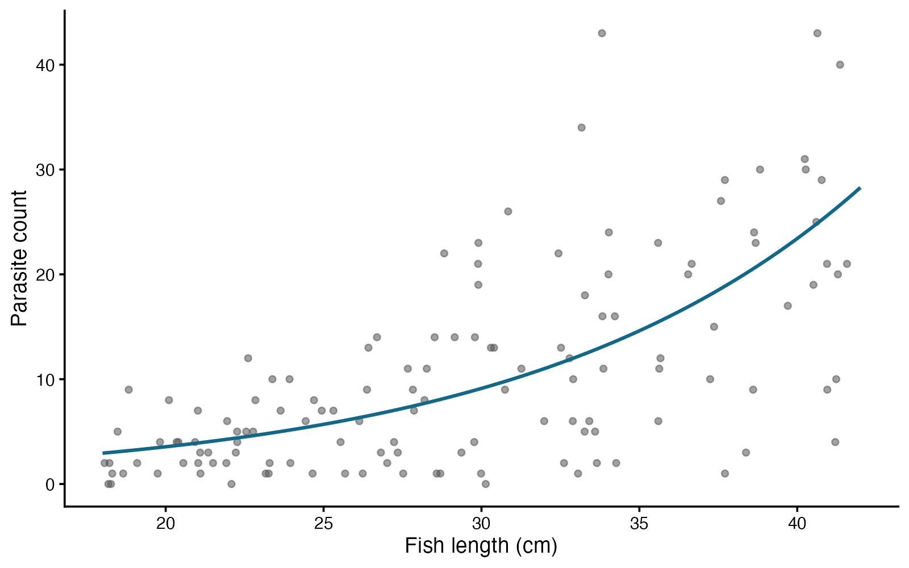

:::

::: {.column width="38%"}

**ggplot2 arguments**

**geom_point(alpha)** — Keep high variability visible.

**geom_line** — Show the conditional mean, not an individual prediction.

**scale_y_continuous** — Keep the count scale interpretable.

**labs** — Include length units in the axis.

:::

:::

::: notes

This figure is generated from the saved CSV by modules/negbin_glm/analysis.R. Overdispersion can be addressed with a parametric count model; it does not automatically require replacing the scientific question with a rank test.

:::


## Negative binomial: plot code {#negbin_glm-plot-code}

::: columns

::: {.column width="62%"}

```r
p <- ggplot2::ggplot(d, ggplot2::aes(length_cm, parasites)) +
  ggplot2::geom_point(alpha = .55, size = 2, color = "#555555") +
  ggplot2::geom_line(data = grid, ggplot2::aes(y = mean_count),
                    color = "#126887", linewidth = 1.3) +
  ggplot2::labs(x = "Fish length (cm)", y = "Parasite count") +
  ggplot2::theme_classic(base_size = 17)
print(p)
```


:::

::: {.column width="38%"}

**Arguments to change**

**geom_point(alpha)** — Keep high variability visible.

**geom_line** — Show the conditional mean, not an individual prediction.

**scale_y_continuous** — Keep the count scale interpretable.

**labs** — Include length units in the axis.

:::

:::

::: notes

This is an exact excerpt from analysis.R. Any preparation referenced by the excerpt appears in the complete companion script. The script opens a ragg PNG device before these lines and closes it afterward.

:::


## Negative binomial: question and null {#negbin_glm-question}

::: columns

::: {.column width="62%"}

**Scientific question**

Does expected parasite burden change with fish length?

**Null / estimation target**

The length coefficient is zero: expected parasite abundance does not change with length in this model.

:::

::: {.column width="38%"}

**Relevant options**

- MASS::glm.nb estimates extra-Poisson variation.

- The default link is log.

- Exponentiate a scaled coefficient to report a meaningful rate ratio.

:::

:::

::: notes

Ask whether rejecting this null, or estimating this target, answers the biological question. Overdispersion can be addressed with a parametric count model; it does not automatically require replacing the scientific question with a rank test.

:::


## Negative binomial: assumptions {#negbin_glm-assumptions}

::: columns

::: {.column width="62%"}

**What matters here**

- Fish are independent.

- The log mean is modeled appropriately.

- A negative binomial mean–variance pattern is plausible.

:::

::: {.column width="38%"}

**Parametric responses**

- Compare residual patterns with Poisson and quasi-Poisson alternatives.

- Use a mixed negative binomial model for fish clustered by site.

**Nonparametric responses**

- Bootstrap independent fish or sites for uncertainty.

- A rank-based association test asks a different question from a count-model slope.

:::

:::

::: notes

Begin with the design. A model change should address a specific issue and preserve the scientific target where possible. A rank or permutation alternative has its own assumptions and may change the null; do not choose it solely from a normality-test p-value.

:::


## Negative binomial: run and read {#negbin_glm-analysis}

::: columns

::: {.column width="62%"}

```r
fit <- MASS::glm.nb(parasites ~ length_cm, data = d)
b <- coef(fit)["length_cm"]
se <- sqrt(vcov(fit)["length_cm", "length_cm"])
p_value <- summary(fit)$coefficients["length_cm", "Pr(>|z|)"]
rate_ratio <- exp(5 * b)
ci <- exp(5 * (b + c(-1, 1) * 1.96 * se))
```


:::

::: {.column width="38%"}

**Generated results**

- Mean count ratio per 5 cm: 1.602

- 95% Wald CI: 1.458 to 1.761

- Wald p = 1.634e-22

- Estimated negative-binomial theta: 2.292

:::

:::

::: notes

Full executed model/test output:

```

Call:
MASS::glm.nb(formula = parasites ~ length_cm, data = d, init.theta = 2.292042228, 
    link = log)

Coefficients:
             Estimate Std. Error z value Pr(>|z|)    
(Intercept) -0.617706   0.299553  -2.062   0.0392 *  
length_cm    0.094281   0.009658   9.762   <2e-16 ***
---
Signif. codes:  0 ‘***’ 0.001 ‘**’ 0.01 ‘*’ 0.05 ‘.’ 0.1 ‘ ’ 1

(Dispersion parameter for Negative Binomial(2.292) family taken to be 1)

    Null deviance: 234.38  on 129  degrees of freedom
Residual deviance: 140.90  on 128  degrees of freedom
AIC: 814.62

Number of Fisher Scoring iterations: 1

              Theta:  2.292 
          Std. Err.:  0.374 

 2 x log-likelihood:  -808.615 
```


:::


## Negative binomial: interpret {#negbin_glm-interpret}

A 5-cm increase in fish length multiplied expected parasite count by 1.60 (95% Wald CI 1.46–1.76; Wald p = 1.63e-22). Negative binomial variation allows more spread than a Poisson model.

**Discuss:** If variance still increases faster than the fitted model predicts, what should you inspect before interpreting its p-value?

::: notes

Teaching point: Overdispersion can be addressed with a parametric count model; it does not automatically require replacing the scientific question with a rank test.

Instructor comparison with the simulated population: The length coefficient is 0.085, so 5 cm multiplies expected parasite abundance by exp(0.425) ≈ 1.530. The slope-zero null is false; the Poisson variance assumption is intentionally violated.

The reported estimate and p-value are calculated from this realized dataset; they need not exactly match the known population effect.

:::


## Linear mixed model: the data {#linear_mixed}

::: columns

::: {.column width="62%"}

Evolutionary biologists follow larval growth under two diets.

- Continuous repeated response

- Larva IDs define dependence

- Individual starting masses and slopes

:::

::: {.column width="38%"}

**Other data like these**

- Repeated plant growth

- Hormone trajectories within animals

- Fitness measurements within populations

:::

:::

::: notes

Linear mixed model

36 larvae measured at weeks 0–3; diet assigned to larvae.

week: Time since baseline (week)

larva: Repeated biological individual (ID)

treatment: Control or enriched diet (category)

mass: Larval mass (mg)

:::


## Linear mixed model: simulate and save {#linear_mixed-simulate}

::: columns

::: {.column width="62%"}

```r
set.seed(2106)
d <- expand.grid(week = 0:3, larva = 1:36)
d$treatment <- rep(rep(c("Control", "Enriched"), each = 18), each = 4)
intercepts <- rnorm(36, 0, 2.3); slopes <- rnorm(36, 0, .7)
d$mass <- 12 + 2 * d$week + .8 * (d$treatment == "Enriched") +
  .9 * d$week * (d$treatment == "Enriched") + intercepts[d$larva] +
  slopes[d$larva] * d$week + rnorm(nrow(d), 0, 1.1)
write.csv(d, file.path(output_dir, "data.csv"), row.names = FALSE)
```


:::

::: {.column width="38%"}

**First saved row**

```
week: 0
larva: 1
treatment: Control
mass: 11.1
```


:::

:::

::: notes

Seed: 2106

Generating model: 36 larvae (18 per diet) are measured at weeks 0–3. Mass = 12 + 2 × week + 0.8 if enriched + 0.9 × week if enriched + a larval Normal(0, 2.3²) intercept + a larval Normal(0, 0.7²) slope × week + independent Normal(0, 1.1²) error. Simulated intercepts and slopes are independent. Repeated values share both effects; no rounding.

Population truth: The control slope is 2 mg/week; enrichment adds 0.9 mg/week. The diet-by-week null is false. Simulated random-intercept and slope SDs are 2.3 mg and 0.7 mg/week.

The script writes data.csv before reading it for analysis. output_dir or out_dir is the folder supplied to the standalone script.

Original saved-data preview:

```
 week larva treatment     mass
    0     1   Control 11.10276
    1     1   Control 11.94295
    2     1   Control 15.19498
    3     1   Control 16.07766
```


:::


## Linear mixed model: see the data {#linear_mixed-plot}

::: columns

::: {.column width="62%"}

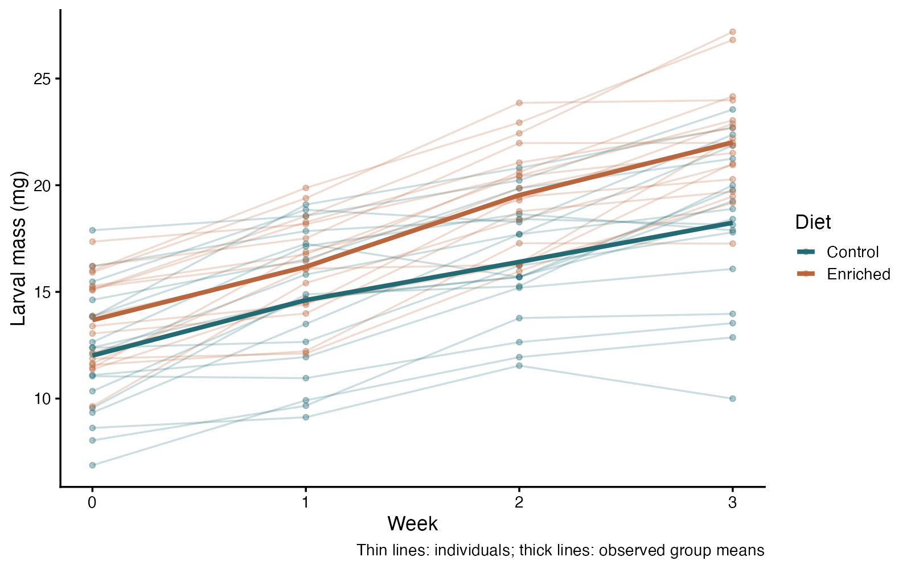

:::

::: {.column width="38%"}

**ggplot2 arguments**

**group = larva** — Preserve individual trajectories

**alpha** — Keep repeated lines unobtrusive

**stat_summary** — Show observed diet means

**linewidth** — Separate summary from individual lines

:::

:::

::: notes

This figure is generated from the saved CSV by modules/linear_mixed/analysis.R. Random intercepts describe starting differences; random slopes describe trajectory differences.

:::


## Linear mixed model: plot code {#linear_mixed-plot-code}

::: columns

::: {.column width="62%"}

```r
p <- ggplot(d, aes(week, mass, color = treatment)) +
  geom_line(aes(group = larva), alpha = .23) +
  geom_point(alpha = .35, size = 1.6) +
  stat_summary(fun = mean, geom = "line", linewidth = 1.7) +
  scale_color_manual(values = c("#246A73", "#B7663E")) +
  scale_x_continuous(breaks = 0:3) +
  labs(x = "Week", y = "Larval mass (mg)", color = "Diet",
       caption = "Thin lines: individuals; thick lines: observed group means") +
  theme_classic(base_size = 16)
print(p)
```


:::

::: {.column width="38%"}

**Arguments to change**

**group = larva** — Preserve individual trajectories

**alpha** — Keep repeated lines unobtrusive

**stat_summary** — Show observed diet means

**linewidth** — Separate summary from individual lines

:::

:::

::: notes

This is an exact excerpt from analysis.R. Any preparation referenced by the excerpt appears in the complete companion script. The script opens a ragg PNG device before these lines and closes it afterward.

:::


## Linear mixed model: question and null {#linear_mixed-question}

::: columns

::: {.column width="62%"}

**Scientific question**

Does diet change the mean growth slope?

**Null / estimation target**

The population growth-slope difference between diets is zero.

:::

::: {.column width="38%"}

**Relevant options**

- (week | larva) fits larval intercepts and slopes

- treatment * week tests different diet trajectories

- lmerTest uses Satterthwaite degrees of freedom here

:::

:::

::: notes

Ask whether rejecting this null, or estimating this target, answers the biological question. Random intercepts describe starting differences; random slopes describe trajectory differences.

:::


## Linear mixed model: assumptions {#linear_mixed-assumptions}

::: columns

::: {.column width="62%"}

**What matters here**

- Independent larvae

- Suitable random-effect and residual structure

- Enough subjects; inspect convergence and singular fits

:::

::: {.column width="38%"}

**Parametric responses**

- Model residual variance or time correlation when needed

- Use ML for likelihood comparisons of different fixed-effect models

**Nonparametric responses**

- A cluster bootstrap resamples whole larvae

- Friedman would answer a simpler complete-block rank question

:::

:::

::: notes

Begin with the design. A model change should address a specific issue and preserve the scientific target where possible. A rank or permutation alternative has its own assumptions and may change the null; do not choose it solely from a normality-test p-value.

:::


## Linear mixed model: run and read {#linear_mixed-analysis}

::: columns

::: {.column width="62%"}

```r
fit <- lmerTest::lmer(mass ~ treatment * week + (week | larva), data = d)
summary(fit, ddf = "Satterthwaite")
trend_ci <- confint(fit, parm = "treatmentEnriched:week", method = "Wald")
```


:::

::: {.column width="38%"}

**Generated results**

- Growth-slope difference = 0.79 mg/week

- Approximate 95% Wald CI 0.31 to 1.27

- Satterthwaite df = 34.0; t = 3.20; p = 0.002966

- 36 larvae; 144 rows; singular fit: FALSE

:::

:::

::: notes

Full executed model/test output:

```
Linear mixed model fit by REML. t-tests use Satterthwaite's method [
lmerModLmerTest]
Formula: mass ~ treatment * week + (week | larva)
   Data: d

REML criterion at convergence: 570

Scaled residuals: 
     Min       1Q   Median       3Q      Max 
-1.64582 -0.56247  0.05774  0.54128  1.60492 

Random effects:
 Groups   Name        Variance Std.Dev. Corr  
 larva    (Intercept) 5.7165   2.3909         
          week        0.3129   0.5594   -0.01 
 Residual             1.1701   1.0817         
Number of obs: 144, groups:  larva, 36

Fixed effects:
                       Estimate Std. Error      df t value Pr(>|t|)    
(Intercept)             12.2501     0.6026 33.9995  20.330  < 2e-16 ***
treatmentEnriched        1.3465     0.8522 33.9995   1.580  0.12335    
week                     2.0463     0.1743 34.0002  11.740 1.65e-13 ***
treatmentEnriched:week   0.7891     0.2465 34.0002   3.201  0.00297 ** 
---
Signif. codes:  0 ‘***’ 0.001 ‘**’ 0.01 ‘*’ 0.05 ‘.’ 0.1 ‘ ’ 1

Correlation of Fixed Effects:
            (Intr) trtmnE week  
trtmntEnrch -0.707              
week        -0.193  0.137       
trtmntEnrc:  0.137 -0.193 -0.707
```


:::


## Linear mixed model: interpret {#linear_mixed-interpret}

Enrichment increased the fitted growth slope by 0.79 mg/week (approximate 95% Wald CI 0.31 to 1.27; Satterthwaite t with 34.0 df, p = 0.002966). Individual intercepts and slopes model repeated larvae; 144 rows do not represent 144 independent animals.

**Discuss:** What does the random slope add beyond a random intercept?

::: notes

Teaching point: Random intercepts describe starting differences; random slopes describe trajectory differences.

Instructor comparison with the simulated population: The control slope is 2 mg/week; enrichment adds 0.9 mg/week. The diet-by-week null is false. Simulated random-intercept and slope SDs are 2.3 mg and 0.7 mg/week.

The reported estimate and p-value are calculated from this realized dataset; they need not exactly match the known population effect.

:::


## Binary mixed model: the data {#binary_glmm}

::: columns

::: {.column width="62%"}

Immunologists record repeated infection outcomes in vaccinated and control hosts.

- Binary outcome

- Treatment plus time

- Repeated host ID

:::

::: {.column width="38%"}

**Other data like these**

- Repeated mating success

- Seed germination within trays

- Infection among individuals in populations

:::

:::

::: notes

Binary mixed model

72 hosts with four weekly binary responses.

week: Scheduled visit relative to baseline (week)

host: Repeated host identifier (ID)

treatment: Control or vaccine assignment (category)

infected: Infection outcome: 1 infected, 0 not infected (binary)

:::


## Binary mixed model: simulate and save {#binary_glmm-simulate}

::: columns

::: {.column width="62%"}

```r
set.seed(2107)
d <- expand.grid(week = 0:3, host = 1:72)
d$treatment <- rep(rep(c("Control", "Vaccine"), each = 36), each = 4)
individual <- rnorm(72, 0, .8)
d$probability <- plogis(-.4 + .25 * d$week -
  1.0 * (d$treatment == "Vaccine") + individual[d$host])
d$infected <- rbinom(nrow(d), 1, d$probability)
d$probability <- NULL
write.csv(d, file.path(output_dir, "data.csv"), row.names = FALSE)
```


:::

::: {.column width="38%"}

**First saved row**

```
week: 0
host: 1
treatment: Control
infected: 1
```


:::

:::

::: notes

Seed: 2107

Generating model: 72 hosts (36 per group) are scored at weeks 0–3. Host intercepts are Normal(0, 0.8²). The infection log odds equal −0.4 + 0.25 × week − 1.0 if vaccinated + host intercept. Independent Bernoulli outcomes are sampled conditional on those probabilities. Host intercepts create dependence across visits; latent probabilities are removed from the saved student dataset.

Population truth: The conditional vaccine odds ratio is exp(−1) ≈ 0.368; the week odds ratio is exp(0.25) ≈ 1.284. The vaccine null is false. These are conditional effects, not population-average odds ratios.

The script writes data.csv before reading it for analysis. output_dir or out_dir is the folder supplied to the standalone script.

Original saved-data preview:

```
 week host treatment infected
    0    1   Control        1
    1    1   Control        1
    2    1   Control        1
    3    1   Control        1
```


:::


## Binary mixed model: see the data {#binary_glmm-plot}

::: columns

::: {.column width="62%"}

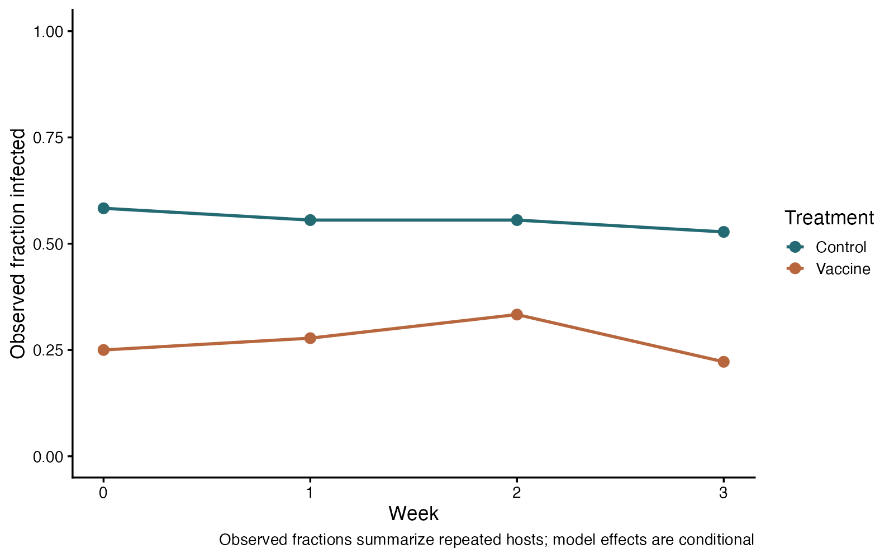

:::

::: {.column width="38%"}

**ggplot2 arguments**

**stat_summary(fun = mean)** — The mean of 0/1 data is a proportion

**color** — Separate treatments

**limits = c(0,1)** — Use the full probability scale

**breaks** — Show scheduled visits

:::

:::

::: notes

This figure is generated from the saved CSV by modules/binary_glmm/analysis.R. Repeated binary outcomes need both a response distribution and a dependence model.

:::


## Binary mixed model: plot code {#binary_glmm-plot-code}

::: columns

::: {.column width="62%"}

```r
p <- ggplot(d, aes(week, infected, color = treatment)) +
  stat_summary(fun = mean, geom = "line", linewidth = 1.2) +
  stat_summary(fun = mean, geom = "point", size = 3.5) +
  scale_color_manual(values = c("#246A73", "#B7663E")) +
  scale_x_continuous(breaks = 0:3) +
  scale_y_continuous(limits = c(0, 1), breaks = seq(0, 1, .25)) +
  labs(x = "Week", y = "Observed fraction infected", color = "Treatment",
       caption = "Observed fractions summarize repeated hosts; model effects are conditional") +
  theme_classic(base_size = 16)
print(p)
```


:::

::: {.column width="38%"}

**Arguments to change**

**stat_summary(fun = mean)** — The mean of 0/1 data is a proportion

**color** — Separate treatments

**limits = c(0,1)** — Use the full probability scale

**breaks** — Show scheduled visits

:::

:::

::: notes

This is an exact excerpt from analysis.R. Any preparation referenced by the excerpt appears in the complete companion script. The script opens a ragg PNG device before these lines and closes it afterward.

:::


## Binary mixed model: question and null {#binary_glmm-question}

::: columns

::: {.column width="62%"}

**Scientific question**

Does vaccination affect infection odds while accounting for repeated hosts?

**Null / estimation target**

The vaccination coefficient is zero: its conditional odds ratio is one.

:::

::: {.column width="38%"}

**Relevant options**

- family = binomial specifies a binary response

- (1 | host) models shared host tendency

- Wald intervals and z tests are approximate

:::

:::

::: notes

Ask whether rejecting this null, or estimating this target, answers the biological question. Repeated binary outcomes need both a response distribution and a dependence model.

:::


## Binary mixed model: assumptions {#binary_glmm-assumptions}

::: columns

::: {.column width="62%"}

**What matters here**

- Independent hosts; dependence modeled within host

- Suitable log-odds and random-effect model

- Check convergence, separation, and remaining dependence

:::

::: {.column width="38%"}

**Parametric responses**

- Add justified time effects or random slopes

- GEE targets population-average effects instead

**Nonparametric responses**

- McNemar suits two paired binary measurements

- Cochran’s Q suits simpler complete repeated conditions

:::

:::

::: notes

Begin with the design. A model change should address a specific issue and preserve the scientific target where possible. A rank or permutation alternative has its own assumptions and may change the null; do not choose it solely from a normality-test p-value.

:::


## Binary mixed model: run and read {#binary_glmm-analysis}

::: columns

::: {.column width="62%"}

```r
fit <- lme4::glmer(infected ~ treatment + week + (1 | host),
                   family = binomial, data = d,
                   control = lme4::glmerControl(optimizer = "bobyqa"))
summary(fit)
log_or_ci <- confint(fit, parm = "treatmentVaccine", method = "Wald")
```


:::

::: {.column width="38%"}

**Generated results**

- Conditional vaccine odds ratio = 0.24

- Approximate 95% CI 0.12 to 0.48

- Wald z = -3.99; p = 6.63e-05

- 72 independent hosts; four repeated observations each

:::

:::

::: notes

Full executed model/test output:

```
Generalized linear mixed model fit by maximum likelihood (Laplace
  Approximation) [glmerMod]
 Family: binomial  ( logit )
Formula: infected ~ treatment + week + (1 | host)
   Data: d
Control: lme4::glmerControl(optimizer = "bobyqa")

      AIC       BIC    logLik -2*log(L)  df.resid 
    366.0     380.7    -179.0     358.0       284 

Scaled residuals: 
    Min      1Q  Median      3Q     Max 
-1.4049 -0.6888 -0.4268  0.7494  1.8362 

Random effects:
 Groups Name        Variance Std.Dev.
 host   (Intercept) 0.8177   0.9043  
Number of obs: 288, groups:  host, 72

Fixed effects:
                 Estimate Std. Error z value Pr(>|z|)    
(Intercept)       0.34030    0.29953   1.136    0.256    
treatmentVaccine -1.42502    0.35722  -3.989 6.63e-05 ***
week             -0.05141    0.12047  -0.427    0.670    
---
Signif. codes:  0 ‘***’ 0.001 ‘**’ 0.01 ‘*’ 0.05 ‘.’ 0.1 ‘ ’ 1

Correlation of Fixed Effects:
            (Intr) trtmnV
tretmntVccn -0.550       
week        -0.607  0.016
```


:::


## Binary mixed model: interpret {#binary_glmm-interpret}

At the same week and host random effect, vaccination multiplied infection odds by 0.24 (approximate 95% Wald CI 0.12 to 0.48; p = 6.63e-05). This is a conditional odds ratio, not a probability ratio or the population-average odds ratio estimated by a GEE.

**Discuss:** Why is exp(coefficient) an odds ratio rather than a probability difference?

::: notes

Teaching point: Repeated binary outcomes need both a response distribution and a dependence model.

Instructor comparison with the simulated population: The conditional vaccine odds ratio is exp(−1) ≈ 0.368; the week odds ratio is exp(0.25) ≈ 1.284. The vaccine null is false. These are conditional effects, not population-average odds ratios.

The reported estimate and p-value are calculated from this realized dataset; they need not exactly match the known population effect.

:::


## Binary GEE: the data {#binary_gee}

::: columns

::: {.column width="62%"}

Repeated infection screening after vaccination

- Binary outcome measured repeatedly

- Rows within an animal are correlated

- Target: population-average vaccination association, adjusted for week

:::

::: {.column width="38%"}

**Other data like these**

- Repeated diagnostic positivity

- Longitudinal presence/absence

- Repeated binary behavior scores

:::

:::

::: notes

Binary generalized estimating equations

80 independent animals are screened at four scheduled visits.

animal: Independent animal and clustering identifier (none)

week: Scheduled visit time (weeks)

vaccine: Control or Vaccinated group (none)

infected: 1 = infection detected; 0 = not detected (binary)

:::


## Binary GEE: simulate and save {#binary_gee-simulate}

::: columns

::: {.column width="62%"}

```r
set.seed(3116)
shared <- rep(rnorm(80), each = 4)
d <- data.frame(animal = rep(1:80, each = 4),
  week = rep(0:3, 80), vaccine = rep(rep(c("Control", "Vaccinated"), each = 40), each = 4))
z <- sqrt(.3) * shared + sqrt(.7) * rnorm(320)
p <- plogis(-.6 + .35 * d$week - .9 * (d$vaccine == "Vaccinated"))
d$infected <- as.integer(pnorm(z) < p)
write.csv(d, file.path(out_dir, "data.csv"), row.names = FALSE)
```


:::

::: {.column width="38%"}

**First saved row**

```
animal: 1
week: 0
vaccine: Control
infected: 0
```


:::

:::

::: notes

Seed: 3116

Generating model: Generate 80 independent animals, 40 per vaccination group, measured at weeks 0,1,2,3. Set the marginal infection probability to plogis(-0.6 + 0.35 × week - 0.9 × vaccinated). For each row, z = sqrt(0.3) × shared animal Normal(0,1) + sqrt(0.7) × independent Normal(0,1). Because each z is standard normal, pnorm(z) is marginally uniform. Infection is 1 when pnorm(z) is below the specified probability. The shared component creates dependence while preserving the exact marginal probabilities.

Population truth: The true population-average vaccination coefficient is -0.9 and odds ratio exp(-0.9) ≈ 0.407, adjusted for week. The no-group-effect null is false. The true marginal week coefficient is 0.35. A working exchangeable correlation is an approximation, while the marginal mean model is exact.

The script writes data.csv before reading it for analysis. output_dir or out_dir is the folder supplied to the standalone script.

Original saved-data preview:

```
 1 | 0 | Control | 0
 1 | 1 | Control | 0
 1 | 2 | Control | 0
 1 | 3 | Control | 1
 2 | 0 | Control | 0
```


:::


## Binary GEE: see the data {#binary_gee-plot}

::: columns

::: {.column width="62%"}

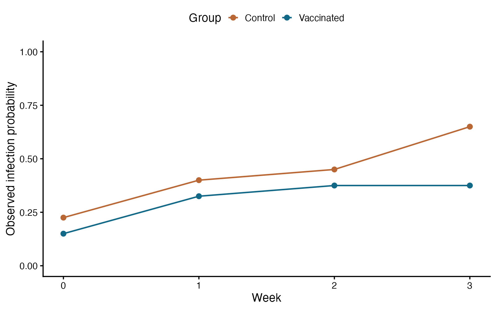

:::

::: {.column width="38%"}

**ggplot2 arguments**

**group = vaccine** — Connect the visits within each treatment group.

**geom_point** — Show observed visit-specific proportions.

**geom_line** — Show the population pattern across visits.

**scale_y_continuous** — Keep the full probability scale.

:::

:::

::: notes

This figure is generated from the saved CSV by modules/binary_gee/analysis.R. Choose between a population-average question and an individual-conditional question; repeated rows are not independent animals.

:::


## Binary GEE: plot code {#binary_gee-plot-code}

::: columns

::: {.column width="62%"}

```r
p <- ggplot2::ggplot(observed, ggplot2::aes(week, infected,
  color = vaccine, group = vaccine)) +
  ggplot2::geom_line(linewidth = 1) + ggplot2::geom_point(size = 3) +
  ggplot2::scale_color_manual(values = c(Control = "#b96735", Vaccinated = "#126887")) +
  ggplot2::scale_y_continuous(limits = c(0, 1)) +
  ggplot2::scale_x_continuous(breaks = 0:3) +
  ggplot2::labs(x = "Week", y = "Observed infection probability", color = "Group") +
  ggplot2::theme_classic(base_size = 17) +
  ggplot2::theme(legend.position = "top")
print(p)
```


:::

::: {.column width="38%"}

**Arguments to change**

**group = vaccine** — Connect the visits within each treatment group.

**geom_point** — Show observed visit-specific proportions.

**geom_line** — Show the population pattern across visits.

**scale_y_continuous** — Keep the full probability scale.

:::

:::

::: notes

This is an exact excerpt from analysis.R. Any preparation referenced by the excerpt appears in the complete companion script. The script opens a ragg PNG device before these lines and closes it afterward.

:::


## Binary GEE: question and null {#binary_gee-question}

::: columns

::: {.column width="62%"}

**Scientific question**

Does population-average infection probability differ by vaccination after accounting for week?

**Null / estimation target**

The population-average vaccination coefficient is zero, adjusting for week.

:::

::: {.column width="38%"}

**Relevant options**

- id identifies the independent animal; sort rows by animal.

- corstr = "exchangeable" specifies a working within-animal correlation.

- Use robust sandwich uncertainty from the GEE fit.

:::

:::

::: notes

Ask whether rejecting this null, or estimating this target, answers the biological question. Choose between a population-average question and an individual-conditional question; repeated rows are not independent animals.

:::


## Binary GEE: assumptions {#binary_gee-assumptions}

::: columns

::: {.column width="62%"}

**What matters here**

- Animals are independent of one another.

- The marginal mean model and observation process are appropriate.

- Enough independent animals are available for robust inference.

:::

::: {.column width="38%"}

**Parametric responses**

- A mixed logistic model estimates a conditional effect instead.

- Revise the time trend or working correlation if the design suggests it.

**Nonparametric responses**

- A cluster bootstrap must resample whole animals.

- Use a simple paired binary test only when its design and question match.

:::

:::

::: notes

Begin with the design. A model change should address a specific issue and preserve the scientific target where possible. A rank or permutation alternative has its own assumptions and may change the null; do not choose it solely from a normality-test p-value.

:::


## Binary GEE: run and read {#binary_gee-analysis}

::: columns

::: {.column width="62%"}

```r
d$vaccine <- factor(d$vaccine, levels = c("Control", "Vaccinated"))
d <- d[order(d$animal, d$week), ]
fit <- geepack::geeglm(infected ~ vaccine + week, id = animal,
  data = d, family = binomial, corstr = "exchangeable")
b <- coef(fit)["vaccineVaccinated"]
se <- sqrt(vcov(fit)["vaccineVaccinated", "vaccineVaccinated"])
odds_ratio <- exp(b)
ci <- exp(b + c(-1, 1) * 1.96 * se)
p_value <- 2 * pnorm(abs(b / se), lower.tail = FALSE)
```


:::

::: {.column width="38%"}

**Generated results**

- Independent animals: 80; observations: 320

- Marginal vaccination odds ratio: 0.555

- 95% robust CI: 0.294 to 1.046

- Robust Wald p = 0.06864

- Working correlation estimate: 0.265

:::

:::

::: notes

Full executed model/test output:

```

Call:
geepack::geeglm(formula = infected ~ vaccine + week, family = binomial, 
    data = d, id = animal, corstr = "exchangeable")

 Coefficients:
                  Estimate  Std.err   Wald Pr(>|W|)    
(Intercept)       -0.98785  0.25570 14.926 0.000112 ***
vaccineVaccinated -0.58896  0.32346  3.315 0.068637 .  
week               0.46535  0.08719 28.486 9.44e-08 ***
---
Signif. codes:  0 ‘***’ 0.001 ‘**’ 0.01 ‘*’ 0.05 ‘.’ 0.1 ‘ ’ 1

Correlation structure = exchangeable 
Estimated Scale Parameters:

            Estimate Std.err
(Intercept)        1 0.08157
  Link = identity 

Estimated Correlation Parameters:
      Estimate Std.err
alpha   0.2655  0.0796
Number of clusters:   80  Maximum cluster size: 4 
```


:::


## Binary GEE: interpret {#binary_gee-interpret}

The estimated population-average infection odds ratio for vaccination was 0.55 (95% robust CI 0.29–1.05; Wald p = 0.0686), adjusted for week. The model treats 80 animals, rather than 320 rows, as independent units.

**Discuss:** Would a mixed logistic model necessarily report the same vaccination odds ratio as this population-average model?

::: notes

Teaching point: Choose between a population-average question and an individual-conditional question; repeated rows are not independent animals.

Instructor comparison with the simulated population: The true population-average vaccination coefficient is -0.9 and odds ratio exp(-0.9) ≈ 0.407, adjusted for week. The no-group-effect null is false. The true marginal week coefficient is 0.35. A working exchangeable correlation is an approximation, while the marginal mean model is exact.

The reported estimate and p-value are calculated from this realized dataset; they need not exactly match the known population effect.

:::


## Count GEE: the data {#count_gee}

::: columns

::: {.column width="62%"}

Microbial ecologists count bacterial colonies in repeated water samples from experimental pond mesocosms.

- A count response with measured exposure

- Repeated samples within independent mesocosms

- A population-average mean-rate comparison

:::

::: {.column width="38%"}

**Other data like these**

- Repeated parasite egg counts per gram of feces

- Mutation counts per callable base across clustered samples

- Repeated insect captures per trap-hour within sites

:::

:::

::: notes

Count and rate GEE

Ninety independent mesocosms, 45 per temperature treatment, are sampled at weeks 0–3. Each sample has a known plated volume.

mesocosm: Independent experimental mesocosm and repeated-sample cluster (ID)

week: Sampling time since experiment began (week)

treatment: Assigned ambient or warmed temperature (category)

volume_ml: Sampled/plated water volume: the count exposure (mL)

colonies: Observed colony count in the plated sample (count)

:::


## Count GEE: simulate and save {#count_gee-simulate}

::: columns

::: {.column width="62%"}

```r
set.seed(1401)
mesocosm <- rep(1:90, each = 4)
week <- rep(0:3, 90)
treatment <- rep(rep(c("Ambient", "Warm"), each = 45), each = 4)
volume_ml <- runif(360, .5, 1.5)
shared_rate <- rgamma(90, shape = 2, rate = 2)
mu <- volume_ml * exp(2.2 + .45 * (treatment == "Warm") + .1 * week)
colonies <- rpois(360, mu * shared_rate[mesocosm])
d <- data.frame(mesocosm, week, treatment, volume_ml, colonies)
write.csv(d, file.path(output_dir, "data.csv"), row.names = FALSE)
```


:::

::: {.column width="38%"}

**First saved row**

```
mesocosm: 1
week: 0
treatment: Ambient
volume_ml: 1.28
colonies: 9
```


:::

:::

::: notes

Seed: 1401

Generating model: Ninety independent mesocosms (45 Ambient, 45 Warm) are sampled at weeks 0, 1, 2, and 3. Each volume is Uniform(0.5, 1.5) mL. The marginal expected count is mu = volume × exp(2.2 + 0.45 × Warm + 0.1 × week). Each mesocosm has one independent Gamma(shape 2, rate 2) multiplier, with mean 1 and variance 0.5. Conditional counts are independent Poisson(mu × multiplier), so repeated observations share the multiplier. No rounding or censoring is added.

Population truth: The exact population-average Warm / Ambient rate ratio is exp(0.45), approximately 1.568; the equal-rate null is false. Each week multiplies the marginal rate by exp(0.1), approximately 1.105. Marginal count variance is mu + 0.5 × mu squared. The working exchangeable correlation is approximate, while the specified marginal mean is exact.

The script writes data.csv before reading it for analysis. output_dir or out_dir is the folder supplied to the standalone script.

Original saved-data preview:

```
 mesocosm week treatment volume_ml colonies
        1    0   Ambient 1.2803623        9
        1    1   Ambient 0.9959790        8
        1    2   Ambient 1.1585612       21
        1    3   Ambient 0.5922451        5
```


:::


## Count GEE: see the data {#count_gee-plot}

::: columns

::: {.column width="62%"}

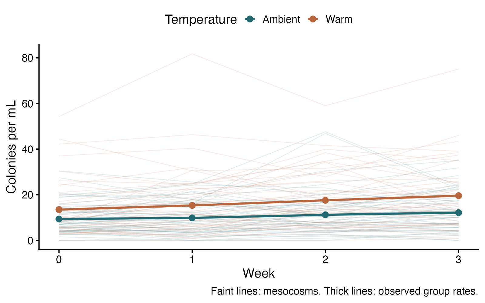

:::

::: {.column width="38%"}

**ggplot2 arguments**

**aes(group = mesocosm)** — Connect repeated samples from the same mesocosm

**alpha / linewidth** — Keep individual trajectories faint behind group trends

**data = observed** — Overlay observed group rates from total counts / total volume

**scale_color_manual** — Use stable colors for ambient and warmed conditions

:::

:::

::: notes

This figure is generated from the saved CSV by modules/count_gee/analysis.R. GEE estimates a population-average rate ratio and uses mesocosms as independent units. The offset accounts for exposure; robust uncertainty accommodates the extra variation and repeated observations.

:::


## Count GEE: plot code {#count_gee-plot-code}

::: columns

::: {.column width="62%"}

```r
observed <- aggregate(cbind(colonies, volume_ml) ~ treatment + week, d, sum)
observed$rate <- observed$colonies / observed$volume_ml
p <- ggplot(d, aes(week, colonies / volume_ml, color = treatment)) +
  geom_line(aes(group = mesocosm), alpha = .12, linewidth = .5) +
  geom_line(data = observed, aes(y = rate, group = treatment), linewidth = 1.4) +
  geom_point(data = observed, aes(y = rate), size = 3.4) +
  scale_color_manual(values = c(Ambient = "#246A73", Warm = "#B7663E")) +
  scale_x_continuous(breaks = 0:3) +
  labs(x = "Week", y = "Colonies per mL", color = "Temperature",
       caption = "Faint lines: mesocosms. Thick lines: observed group rates.") +
  theme_classic(base_size = 18) + theme(legend.position = "top")
print(p)
```


:::

::: {.column width="38%"}

**Arguments to change**

**aes(group = mesocosm)** — Connect repeated samples from the same mesocosm

**alpha / linewidth** — Keep individual trajectories faint behind group trends

**data = observed** — Overlay observed group rates from total counts / total volume

**scale_color_manual** — Use stable colors for ambient and warmed conditions

:::

:::

::: notes

This is an exact excerpt from analysis.R. Any preparation referenced by the excerpt appears in the complete companion script. The script opens a ragg PNG device before these lines and closes it afterward.

:::


## Count GEE: question and null {#count_gee-question}

::: columns

::: {.column width="62%"}

**Scientific question**

Does warming change the population-average colony rate after accounting for week and sampled volume?

**Null / estimation target**

The warming coefficient is zero: population-average colony rates are equal at the same week and exposure.

:::

::: {.column width="38%"}

**Relevant options**

- id identifies mesocosms; keep their rows together

- offset(log(volume_ml)) converts a count model to a rate comparison

- Choose corstr; std.err = "san.se" uses robust sandwich uncertainty

:::

:::

::: notes

Ask whether rejecting this null, or estimating this target, answers the biological question. GEE estimates a population-average rate ratio and uses mesocosms as independent units. The offset accounts for exposure; robust uncertainty accommodates the extra variation and repeated observations.

:::


## Count GEE: assumptions {#count_gee-assumptions}

::: columns

::: {.column width="62%"}

**What matters here**

- Mesocosms are independent; repeated samples are dependent

- The marginal log-mean model and exposure are appropriate

- Robust inference needs enough independent mesocosms

:::

::: {.column width="38%"}

**Parametric responses**

- Change the time trend or working correlation to fit the design

- A count GLMM models rates conditional on a cluster random effect

**Nonparametric responses**

- A cluster bootstrap resamples whole mesocosms

- Rank methods answer a different ordering question; they do not replace this adjusted mean-rate model

:::

:::

::: notes

Begin with the design. A model change should address a specific issue and preserve the scientific target where possible. A rank or permutation alternative has its own assumptions and may change the null; do not choose it solely from a normality-test p-value.

:::


## Count GEE: run and read {#count_gee-analysis}

::: columns

::: {.column width="62%"}

```r
d$treatment <- factor(d$treatment, levels = c("Ambient", "Warm"))
d <- d[order(d$mesocosm, d$week), ]
fit <- geepack::geeglm(colonies ~ treatment + week + offset(log(volume_ml)),
  id = mesocosm, data = d, family = poisson(link = "log"),
  corstr = "exchangeable", std.err = "san.se")
b <- coef(fit)["treatmentWarm"]
se <- sqrt(vcov(fit)["treatmentWarm", "treatmentWarm"])
rate_ratio <- exp(b)
ci <- exp(b + c(-1, 1) * 1.96 * se)
p_value <- 2 * pnorm(abs(b / se), lower.tail = FALSE)
```


:::

::: {.column width="38%"}

**Generated results**

- Independent mesocosms: 90; observations: 360

- Population-average Warm / Ambient rate ratio = 1.580

- 95% robust CI: 1.175 to 2.123

- Robust Wald p = 0.00243

- Working correlation estimate = 0.816

:::

:::

::: notes

Full executed model/test output:

```

Call:
geepack::geeglm(formula = colonies ~ treatment + week + offset(log(volume_ml)), 
    family = poisson(link = "log"), data = d, id = mesocosm, 
    corstr = "exchangeable", std.err = "san.se")

 Coefficients:
              Estimate Std.err    Wald Pr(>|W|)    
(Intercept)    2.20660 0.10491 442.355  < 2e-16 ***
treatmentWarm  0.45715 0.15078   9.193  0.00243 ** 
week           0.10817 0.01322  66.937 3.33e-16 ***
---
Signif. codes:  0 ‘***’ 0.001 ‘**’ 0.01 ‘*’ 0.05 ‘.’ 0.1 ‘ ’ 1

Correlation structure = exchangeable 
Estimated Scale Parameters:

            Estimate Std.err
(Intercept)    7.602    1.51
  Link = identity 

Estimated Correlation Parameters:
      Estimate Std.err
alpha   0.8161 0.04783
Number of clusters:   90  Maximum cluster size: 4 
```


:::


## Count GEE: interpret {#count_gee-interpret}

The population-average colony rate in warmed mesocosms was 1.58 times the ambient rate (95% robust CI 1.18 to 2.12; Wald p = 0.00243), adjusting for week and sampled volume. The 90 mesocosms are the independent units; the model accounts for their repeated samples.

**Discuss:** If sampled volume differs among visits, why should the model include an exposure offset instead of comparing raw counts?

::: notes

Teaching point: GEE estimates a population-average rate ratio and uses mesocosms as independent units. The offset accounts for exposure; robust uncertainty accommodates the extra variation and repeated observations.

Instructor comparison with the simulated population: The exact population-average Warm / Ambient rate ratio is exp(0.45), approximately 1.568; the equal-rate null is false. Each week multiplies the marginal rate by exp(0.1), approximately 1.105. Marginal count variance is mu + 0.5 × mu squared. The working exchangeable correlation is approximate, while the specified marginal mean is exact.

The reported estimate and p-value are calculated from this realized dataset; they need not exactly match the known population effect.

:::


## Count mixed model: the data {#count_glmm}

::: columns

::: {.column width="62%"}

Pollinator visits are repeatedly counted on plants in two habitats.

- Nonnegative event counts

- Exposure in minutes

- Repeated plant IDs

:::

::: {.column width="38%"}

**Other data like these**

- Parasites counted repeatedly in hosts

- Mutations across repeated cell lines

- Calls recorded repeatedly from territories

:::

:::

::: notes

Count mixed model: Poisson and negative binomial

48 plants observed on four days with unequal observation durations.

day: Observation day (day)

plant: Repeated plant identifier (ID)

habitat: Open or sheltered habitat (category)

minutes: Observation exposure (minute)

visits: Number of pollinator visits (count)

:::


## Count mixed model: simulate and save {#count_glmm-simulate}

::: columns

::: {.column width="62%"}

```r
set.seed(2114)
d <- expand.grid(day = 1:4, plant = 1:48)
d$habitat <- rep(rep(c("Open", "Sheltered"), each = 24), each = 4)
d$minutes <- sample(20:60, nrow(d), replace = TRUE)
individual <- rnorm(48, 0, .45)
rate <- exp(-2.0 + .55 * (d$habitat == "Sheltered") +
              .06 * d$day + individual[d$plant])
d$visits <- rnbinom(nrow(d), mu = d$minutes * rate, size = 5)
write.csv(d, file.path(output_dir, "data.csv"), row.names = FALSE)
```


:::

::: {.column width="38%"}

**First saved row**

```
day: 1
plant: 1
habitat: Open
minutes: 32
visits: 22
```


:::

:::

::: notes

Seed: 2114

Generating model: 48 plants (24 per habitat) are observed on days 1–4. Observation duration is sampled uniformly from the integers 20–60 minutes. Plant intercepts are Normal(0, 0.45²). Log rate = −2 + 0.55 if sheltered + 0.06 × day + plant intercept. Counts are negative binomial with mean = minutes × rate and size = 5; conditional variance is mean + mean²/5. Repeated plants share the intercept.

Population truth: The conditional sheltered/open rate ratio is exp(0.55) ≈ 1.733; the habitat null is false. The generating distribution has extra variation beyond Poisson even after conditioning on the plant intercept.

The script writes data.csv before reading it for analysis. output_dir or out_dir is the folder supplied to the standalone script.

Original saved-data preview:

```
 day plant habitat minutes visits
   1     1    Open      32     22
   2     1    Open      58     10
   3     1    Open      25      9
   4     1    Open      48     23
```


:::


## Count mixed model: see the data {#count_glmm-plot}

::: columns

::: {.column width="62%"}

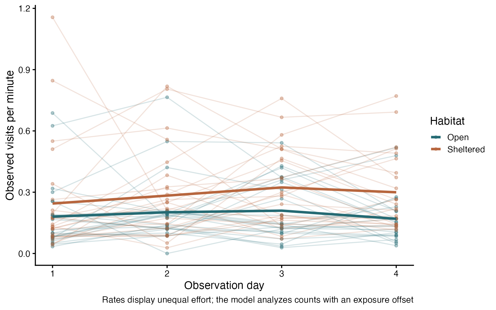

:::

::: {.column width="38%"}

**ggplot2 arguments**

**visits / minutes** — Plot rates for unequal effort

**group = plant** — Preserve repeated units

**alpha** — Reduce overlap

**stat_summary** — Show observed habitat means

:::

:::

::: notes

This figure is generated from the saved CSV by modules/count_glmm/analysis.R. Offsets retain count information while accounting for exposure; negative binomial and random effects address different variation sources.

:::


## Count mixed model: plot code {#count_glmm-plot-code}

::: columns

::: {.column width="62%"}

```r
p <- ggplot(d, aes(day, visits / minutes, color = habitat)) +
  geom_line(aes(group = plant), alpha = .18) +
  geom_point(alpha = .35, size = 1.6) +
  stat_summary(fun = mean, geom = "line", linewidth = 1.7) +
  scale_color_manual(values = c("#246A73", "#B7663E")) +
  scale_x_continuous(breaks = 1:4) +
  labs(x = "Observation day", y = "Observed visits per minute", color = "Habitat",
       caption = "Rates display unequal effort; the model analyzes counts with an exposure offset") +
  theme_classic(base_size = 16)
print(p)
```


:::

::: {.column width="38%"}

**Arguments to change**

**visits / minutes** — Plot rates for unequal effort

**group = plant** — Preserve repeated units

**alpha** — Reduce overlap

**stat_summary** — Show observed habitat means

:::

:::

::: notes

This is an exact excerpt from analysis.R. Any preparation referenced by the excerpt appears in the complete companion script. The script opens a ragg PNG device before these lines and closes it afterward.

:::


## Count mixed model: question and null {#count_glmm-question}

::: columns

::: {.column width="62%"}

**Scientific question**

Does habitat change visit rate while accounting for repeated plants?

**Null / estimation target**

The habitat coefficient is zero: its conditional visit-rate ratio is one.

:::

::: {.column width="38%"}

**Relevant options**

- offset(log(minutes)) accounts for exposure

- (1 | plant) models shared plant tendency

- glmer.nb adds negative-binomial conditional variation

:::

:::

::: notes

Ask whether rejecting this null, or estimating this target, answers the biological question. Offsets retain count information while accounting for exposure; negative binomial and random effects address different variation sources.

:::


## Count mixed model: assumptions {#count_glmm-assumptions}

::: columns

::: {.column width="62%"}

**What matters here**

- Independent plants

- Suitable conditional count and random-effect model

- Exposure is measured and mean count scales with it

:::

::: {.column width="38%"}

**Parametric responses**

- Check Poisson versus negative-binomial conditional variation

- Add justified dependence or a biologically supported zero process

**Nonparametric responses**

- A valid cluster permutation keeps repeated plants together

- Ranks discard the modeled mean-rate question

:::

:::

::: notes

Begin with the design. A model change should address a specific issue and preserve the scientific target where possible. A rank or permutation alternative has its own assumptions and may change the null; do not choose it solely from a normality-test p-value.

:::


## Count mixed model: run and read {#count_glmm-analysis}

::: columns

::: {.column width="62%"}

```r
poisson_fit <- lme4::glmer(visits ~ habitat + day +
  offset(log(minutes)) + (1 | plant), family = poisson, data = d,
  control = lme4::glmerControl(optimizer = "bobyqa"))
fit <- lme4::glmer.nb(visits ~ habitat + day +
  offset(log(minutes)) + (1 | plant), data = d,
  control = lme4::glmerControl(optimizer = "bobyqa"))
summary(fit)
log_ratio_ci <- confint(fit, parm = "habitatSheltered", method = "Wald")
```


:::

::: {.column width="38%"}

**Generated results**

- Conditional sheltered/open rate ratio = 1.50

- Approximate 95% CI 1.11 to 2.02

- Wald z = 2.62; p = 0.008759

- Poisson AIC 1281.6; negative-binomial AIC 1165.5

:::

:::

::: notes

Full executed model/test output:

```
Generalized linear mixed model fit by maximum likelihood (Laplace
  Approximation) [glmerMod]
 Family: Negative Binomial(5.8365)  ( log )
Formula: visits ~ habitat + day + offset(log(minutes)) + (1 | plant)
   Data: d
Control: lme4::glmerControl(optimizer = "bobyqa")

      AIC       BIC    logLik -2*log(L)  df.resid 
   1165.5    1181.8    -577.8    1155.5       187 

Scaled residuals: 
    Min      1Q  Median      3Q     Max 
-1.6584 -0.6798 -0.1409  0.4246  3.2452 

Random effects:
 Groups Name        Variance Std.Dev.
 plant  (Intercept) 0.2057   0.4536  
Number of obs: 192, groups:  plant, 48

Fixed effects:
                 Estimate Std. Error z value Pr(>|z|)    
(Intercept)      -1.90884    0.14304 -13.345  < 2e-16 ***
habitatSheltered  0.40249    0.15355   2.621  0.00876 ** 
day               0.05234    0.03605   1.452  0.14658    
---
Signif. codes:  0 ‘***’ 0.001 ‘**’ 0.01 ‘*’ 0.05 ‘.’ 0.1 ‘ ’ 1

Correlation of Fixed Effects:
            (Intr) hbttSh
habttShltrd -0.547       
day         -0.638 -0.005
Generalized linear mixed model fit by maximum likelihood (Laplace
  Approximation) [glmerMod]
 Family: poisson  ( log )
Formula: visits ~ habitat + day + offset(log(minutes)) + (1 | plant)
   Data: d
Control: lme4::glmerControl(optimizer = "bobyqa")

      AIC       BIC    logLik -2*log(L)  df.resid 
   1281.6    1294.7    -636.8    1273.6       188 

Scaled residuals: 
    Min      1Q  Median      3Q     Max 
-3.0928 -0.9462 -0.1606  0.6940  5.4685 

Random effects:
 Groups Name        Variance Std.Dev.
 plant  (Intercept) 0.2447   0.4947  
Number of obs: 192, groups:  plant, 48

Fixed effects:
                 Estimate Std. Error z value Pr(>|z|)    
(Intercept)      -1.90548    0.12177 -15.649   <2e-16 ***
habitatSheltered  0.40022    0.15209   2.631   0.0085 ** 
day               0.04840    0.02086   2.321   0.0203 *  
---
Signif. codes:  0 ‘***’ 0.001 ‘**’ 0.01 ‘*’ 0.05 ‘.’ 0.1 ‘ ’ 1

Correlation of Fixed Effects:
            (Intr) hbttSh
habttShltrd -0.644       
day         -0.447  0.011
```


:::


## Count mixed model: interpret {#count_glmm-interpret}

In the negative-binomial mixed model, sheltered plants had 1.50 times the visit rate of open plants at the same day and random effect (approximate 95% Wald CI 1.11 to 2.02; p = 0.008759). Minutes are an exposure offset; plant intercepts model repeated observations. Extra conditional variation motivates checking the negative-binomial variant, not automatically selecting it from a single cutoff.

**Discuss:** Why do we model counts with an offset instead of fitting a Poisson model to rates?

::: notes

Teaching point: Offsets retain count information while accounting for exposure; negative binomial and random effects address different variation sources.

Instructor comparison with the simulated population: The conditional sheltered/open rate ratio is exp(0.55) ≈ 1.733; the habitat null is false. The generating distribution has extra variation beyond Poisson even after conditioning on the plant intercept.

The reported estimate and p-value are calculated from this realized dataset; they need not exactly match the known population effect.

:::


## Ordinal mixed model: the data {#ordinal_mixed}

::: columns

::: {.column width="62%"}

Fish behavior is scored repeatedly using ordered stress categories.

- Ordered categories

- Repeated fish IDs

- Treatment plus visit

:::

::: {.column width="38%"}

**Other data like these**

- Repeated disease severity

- Damage scores within plant lines

- Behavior scores within individuals

:::

:::

::: notes

Ordinal mixed model

70 fish measured at three visits; treatment assigned between fish.

visit: Scheduled repeated assessment (visit)

fish: Repeated fish identifier (ID)

treatment: Control or stress assignment (category)

score: Ordered behavior severity (ordered category)

:::


## Ordinal mixed model: simulate and save {#ordinal_mixed-simulate}

::: columns

::: {.column width="62%"}

```r
set.seed(2109)
d <- expand.grid(visit = 1:3, fish = 1:70)
d$treatment <- rep(rep(c("Control", "Stress"), each = 35), each = 3)
individual <- rnorm(70, 0, .8)
latent <- .8 * (d$treatment == "Stress") + .15 * d$visit +
  individual[d$fish] + rlogis(nrow(d))
d$score <- cut(latent, c(-Inf, -.8, .3, 1.3, Inf),
               labels = c("None", "Mild", "Moderate", "High"))
write.csv(d, file.path(output_dir, "data.csv"), row.names = FALSE)
```


:::

::: {.column width="38%"}

**First saved row**

```
visit: 1
fish: 1
treatment: Control
score: Mild
```


:::

:::

::: notes

Seed: 2109

Generating model: 70 fish (35 per treatment) are scored at visits 1–3. Fish intercepts are Normal(0, 0.8²). Latent severity = 0.8 if stressed + 0.15 × visit + fish intercept + standard logistic error. Thresholds −0.8, 0.3 and 1.3 produce None, Mild, Moderate and High. The latent score is not saved; repeated scores share the fish intercept.

Population truth: The conditional common odds ratio for a higher score under stress is exp(0.8) ≈ 2.226. The treatment null is false. The simulated thresholds obey proportional odds.

The script writes data.csv before reading it for analysis. output_dir or out_dir is the folder supplied to the standalone script.

Original saved-data preview:

```
 visit fish treatment score
     1    1   Control  Mild
     2    1   Control  Mild
     3    1   Control  High
     1    2   Control  None
```


:::


## Ordinal mixed model: see the data {#ordinal_mixed-plot}

::: columns

::: {.column width="62%"}

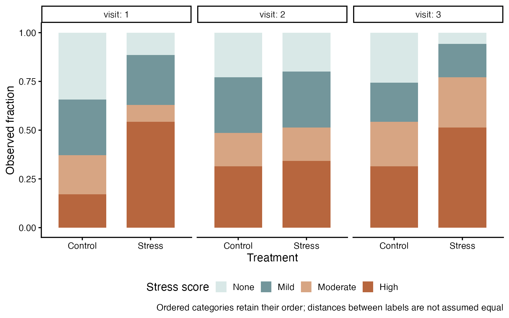

:::

::: {.column width="38%"}

**ggplot2 arguments**

**position = "fill"** — Show proportions within each group

**facet_wrap** — Separate visits

**scale_fill_manual** — Keep category colors consistent

**ordered factor** — Keep severity in biological order

:::

:::

::: notes

This figure is generated from the saved CSV by modules/ordinal_mixed/analysis.R. Use ordered category probabilities; arbitrary numerical category spacings are unnecessary.

:::


## Ordinal mixed model: plot code {#ordinal_mixed-plot-code}

::: columns

::: {.column width="62%"}

```r
p <- ggplot(d, aes(treatment, fill = score)) +
  geom_bar(position = "fill", width = .7) +
  facet_wrap(~ visit, labeller = label_both) +
  scale_fill_manual(values = c("#D9E8E7", "#73969B", "#D7A583", "#B7663E"),
                    drop = FALSE) +
  labs(x = "Treatment", y = "Observed fraction", fill = "Stress score",
       caption = "Ordered categories retain their order; distances between labels are not assumed equal") +
  theme_classic(base_size = 16) + theme(legend.position = "bottom")
print(p)
```


:::

::: {.column width="38%"}

**Arguments to change**

**position = "fill"** — Show proportions within each group

**facet_wrap** — Separate visits

**scale_fill_manual** — Keep category colors consistent

**ordered factor** — Keep severity in biological order

:::

:::

::: notes

This is an exact excerpt from analysis.R. Any preparation referenced by the excerpt appears in the complete companion script. The script opens a ragg PNG device before these lines and closes it afterward.

:::


## Ordinal mixed model: question and null {#ordinal_mixed-question}

::: columns

::: {.column width="62%"}

**Scientific question**

Does treatment shift repeated scores toward higher categories?

**Null / estimation target**

The treatment coefficient is zero: its conditional cumulative odds ratio is one.

:::

::: {.column width="38%"}

**Relevant options**

- ordered() defines the category sequence

- link = "logit" gives proportional odds

- (1 | fish) accounts for repeated fish

:::

:::

::: notes

Ask whether rejecting this null, or estimating this target, answers the biological question. Use ordered category probabilities; arbitrary numerical category spacings are unnecessary.

:::


## Ordinal mixed model: assumptions {#ordinal_mixed-assumptions}

::: columns

::: {.column width="62%"}

**What matters here**

- Independent fish

- A common treatment odds effect across thresholds

- Suitable random effects and converged estimation

:::

::: {.column width="38%"}

**Parametric responses**

- Use a more flexible ordinal model if threshold effects differ

- Retain the response order when scientifically meaningful

**Nonparametric responses**

- Friedman suits complete within-fish condition comparisons

- A sign test asks only about paired change direction

:::

:::

::: notes

Begin with the design. A model change should address a specific issue and preserve the scientific target where possible. A rank or permutation alternative has its own assumptions and may change the null; do not choose it solely from a normality-test p-value.

:::


## Ordinal mixed model: run and read {#ordinal_mixed-analysis}

::: columns

::: {.column width="62%"}

```r
fit <- ordinal::clmm(score ~ treatment + visit + (1 | fish),
                     data = d, link = "logit", Hess = TRUE)
summary(fit)
b <- coef(summary(fit))["treatmentStress", ]
log_or_ci <- b[1] + c(-1, 1) * qnorm(.975) * b[2]
```


:::

::: {.column width="38%"}

**Generated results**

- Conditional higher-score odds ratio = 2.51

- Approximate 95% CI 1.31 to 4.82

- Wald z = 2.78; p = 0.005491

- 70 fish; three repeated ordinal scores each

:::

:::

::: notes

Full executed model/test output:

```
Cumulative Link Mixed Model fitted with the Laplace approximation

formula: score ~ treatment + visit + (1 | fish)
data:    d

 link  threshold nobs logLik  AIC    niter    max.grad cond.H 
 logit flexible  210  -274.11 560.22 240(723) 5.81e-05 1.0e+02

Random effects:
 Groups Name        Variance Std.Dev.
 fish   (Intercept) 0.6701   0.8186  
Number of groups:  fish 70 

Coefficients:
                Estimate Std. Error z value Pr(>|z|)   
treatmentStress   0.9221     0.3321   2.777  0.00549 **
visit             0.2399     0.1608   1.492  0.13578   
---
Signif. codes:  0 ‘***’ 0.001 ‘**’ 0.01 ‘*’ 0.05 ‘.’ 0.1 ‘ ’ 1

Threshold coefficients:
              Estimate Std. Error z value
None|Mild      -0.6966     0.4029  -1.729
Mild|Moderate   0.6908     0.4025   1.716
Moderate|High   1.5974     0.4207   3.797
```


:::


## Ordinal mixed model: interpret {#ordinal_mixed-interpret}

At the same visit and fish random effect, stress treatment multiplied the odds of being above any score threshold by 2.51 (approximate 95% Wald CI 1.31 to 4.82; p = 0.005491). The proportional-odds model uses a common effect across thresholds; category labels are ordered, not equally spaced measurements.

**Discuss:** Why is subtracting the category codes not the same as measuring a change?

::: notes

Teaching point: Use ordered category probabilities; arbitrary numerical category spacings are unnecessary.

Instructor comparison with the simulated population: The conditional common odds ratio for a higher score under stress is exp(0.8) ≈ 2.226. The treatment null is false. The simulated thresholds obey proportional odds.

The reported estimate and p-value are calculated from this realized dataset; they need not exactly match the known population effect.

:::


## Kaplan–Meier: the data {#kaplan_meier}

::: columns

::: {.column width="62%"}

Ecologists follow seedling survival until death or final observation.

- Event time in days

- event = 1 death; 0 right-censored

- Independent individuals

:::

::: {.column width="38%"}

**Other data like these**

- Time to germination

- Time to infection

- Time to pupation

:::

:::

::: notes

Kaplan–Meier survival estimation

120 independent seedlings; follow-up ends at different times.

seedling: Independent seedling identifier (ID)

days: Observed event or censoring time (day)

event: 1 death; 0 right-censored (binary)

:::


## Kaplan–Meier: simulate and save {#kaplan_meier-simulate}

::: columns

::: {.column width="62%"}

```r
set.seed(2110)
d <- data.frame(seedling = 1:120)
event_time <- rexp(120, rate = .018)
follow_up <- runif(120, 35, 100)
d$days <- pmin(event_time, follow_up)
d$event <- as.integer(event_time <= follow_up)
write.csv(d, file.path(output_dir, "data.csv"), row.names = FALSE)
```


:::

::: {.column width="38%"}

**First saved row**

```
seedling: 1
days: 48.03
event: 1
```


:::

:::

::: notes

Seed: 2110

Generating model: 120 independent event times are drawn from an exponential distribution with death rate 0.018/day. Each independent final follow-up time is Uniform(35, 100) days. Observed days = minimum(event time, follow-up); event = 1 when the event occurs by follow-up and 0 otherwise. Times remain unrounded. Censoring is independent by construction.

Population truth: The population survival function is exp(−0.018 × days); true day-40 survival is exp(−0.72) ≈ 0.487. This is an estimation target, not a null hypothesis.

The script writes data.csv before reading it for analysis. output_dir or out_dir is the folder supplied to the standalone script.

Original saved-data preview:

```
 seedling     days event
        1 48.03005     1
        2 77.73765     0
        3 12.86731     1
        4 43.82996     0
```


:::


## Kaplan–Meier: see the data {#kaplan_meier-plot}

::: columns

::: {.column width="62%"}

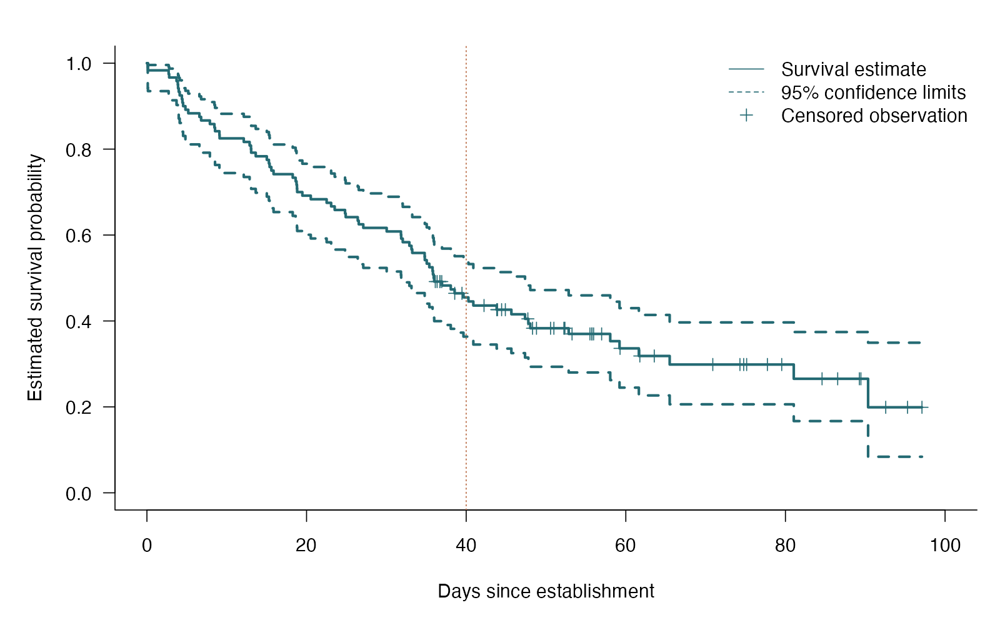

:::

::: {.column width="38%"}

**base R arguments**

**mark.time** — Mark censored observations

**conf.int** — Draw uncertainty limits

**xlim** — Show the follow-up period

**abline(v=40)** — Highlight the requested time

:::

:::

::: notes

This figure is generated from the saved CSV by modules/kaplan_meier/analysis.R. Censored observations contribute until follow-up ends; no invented p-value is needed for estimation.

:::


## Kaplan–Meier: plot code {#kaplan_meier-plot-code}

::: columns

::: {.column width="62%"}

```r
par(mar = c(5, 5, 2, 1), las = 1, bty = "l", cex = 1.15)
plot(fit, col = "#246A73", lwd = 2.5, conf.int = TRUE,
     mark.time = TRUE, xlab = "Days since establishment",
     ylab = "Estimated survival probability", xlim = c(0, 100))
abline(v = 40, lty = 3, col = "#B7663E")
legend("topright", c("Survival estimate", "95% confidence limits", "Censored observation"),
       col = c("#246A73", "#246A73", "#246A73"),
       lty = c(1, 2, NA), pch = c(NA, NA, 3), bty = "n")
```


:::

::: {.column width="38%"}

**Arguments to change**

**mark.time** — Mark censored observations

**conf.int** — Draw uncertainty limits

**xlim** — Show the follow-up period

**abline(v=40)** — Highlight the requested time

:::

:::

::: notes

This is an exact excerpt from analysis.R. Any preparation referenced by the excerpt appears in the complete companion script. The script opens a ragg PNG device before these lines and closes it afterward.

:::


## Kaplan–Meier: question and null {#kaplan_meier-question}

::: columns

::: {.column width="62%"}

**Scientific question**

What fraction of seedlings remain alive at day 40?

**Null / estimation target**

No null hypothesis: the target is the survival probability over time.

:::

::: {.column width="38%"}

**Relevant options**

- Surv(days, event) retains censoring

- conf.type = "log-log" constructs bounded intervals

- times = 40 requests a biologically meaningful time

:::

:::

::: notes

Ask whether rejecting this null, or estimating this target, answers the biological question. Censored observations contribute until follow-up ends; no invented p-value is needed for estimation.

:::


## Kaplan–Meier: assumptions {#kaplan_meier-assumptions}

::: columns

::: {.column width="62%"}

**What matters here**

- Independent seedlings

- Censoring is unrelated to future survival within the population

- Correct event and follow-up recording

:::

::: {.column width="38%"}

**Parametric responses**

- A parametric survival model estimates a smooth curve if its distribution fits

**Nonparametric responses**

- Kaplan–Meier is already nonparametric

- Log-rank adds a group-comparison question

:::

:::

::: notes

Begin with the design. A model change should address a specific issue and preserve the scientific target where possible. A rank or permutation alternative has its own assumptions and may change the null; do not choose it solely from a normality-test p-value.

:::


## Kaplan–Meier: run and read {#kaplan_meier-analysis}

::: columns

::: {.column width="62%"}

```r
fit <- survival::survfit(survival::Surv(days, event) ~ 1,
                         data = d, conf.type = "log-log")
at_day40 <- summary(fit, times = 40)
print(at_day40)
```


:::

::: {.column width="38%"}

**Generated results**

- 120 seedlings; 79 events; 41 censored

- Estimated survival at day 40 = 0.455

- 95% CI 0.364 to 0.542

- Still at risk at day 40: 48

:::

:::

::: notes

Full executed model/test output:

```
Call: survfit(formula = survival::Surv(days, event) ~ 1, data = d, 
    conf.type = "log-log")

   time n.risk n.event survival std.err lower 95% CI upper 95% CI
  0.106    120       1    0.992  0.0083        0.942        0.999
  0.126    119       1    0.983  0.0117        0.935        0.996
  2.720    118       1    0.975  0.0143        0.925        0.992
  2.786    117       1    0.967  0.0164        0.914        0.987
  3.710    116       1    0.958  0.0182        0.903        0.982
  3.869    115       1    0.950  0.0199        0.892        0.977
  3.900    114       1    0.942  0.0214        0.882        0.972
  3.983    113       1    0.933  0.0228        0.871        0.966
  4.104    112       1    0.925  0.0240        0.861        0.960
  4.377    111       1    0.917  0.0252        0.851        0.954
  4.446    110       1    0.908  0.0263        0.841        0.948
  4.531    109       1    0.900  0.0274        0.831        0.942
  4.822    108       1    0.892  0.0284        0.821        0.936
  5.181    107       1    0.883  0.0293        0.811        0.929
  6.574    106       1    0.875  0.0302        0.801        0.923
  6.788    105       1    0.867  0.0310        0.792        0.916
  7.888    104       1    0.858  0.0318        0.782        0.909
  8.457    103       1    0.850  0.0326        0.773        0.903
  8.532    102       1    0.842  0.0333        0.763        0.896
  9.082    101       1    0.833  0.0340        0.754        0.889
  9.103    100       1    0.825  0.0347        0.744        0.882
 12.133     99       1    0.817  0.0353        0.735        0.875
 12.867     98       1    0.808  0.0359        0.726        0.868
 13.038     97       1    0.800  0.0365        0.717        0.861
 13.059     96       1    0.792  0.0371        0.707        0.854
 13.633     95       1    0.783  0.0376        0.698        0.847
 15.020     94       1    0.775  0.0381        0.689        0.840
 15.281     93       1    0.767  0.0386        0.680        0.833
 15.370     92       1    0.758  0.0391        0.671        0.825
 15.590     91       1    0.750  0.0395        0.662        0.818
 15.865     90       1    0.742  0.0400        0.653        0.811
 18.267     89       1    0.733  0.0404        0.645        0.803
 18.634     88       1    0.725  0.0408        0.636        0.796
 18.744     87       1    0.717  0.0411        0.627        0.788
 18.800     86       1    0.708  0.0415        0.618        0.781
 18.822     85       1    0.700  0.0418        0.609        0.773
 19.473     84       1    0.692  0.0422        0.601        0.766
 20.529     83       1    0.683  0.0425        0.592        0.758
 22.516     82       1    0.675  0.0428        0.583        0.751
 23.080     81       1    0.667  0.0430        0.575        0.743
 23.526     80       1    0.658  0.0433        0.566        0.736
 24.822     79       1    0.650  0.0435        0.558        0.728
 24.903     78       1    0.642  0.0438        0.549        0.720
 26.414     77       1    0.633  0.0440        0.540        0.712
 26.537     76       1    0.625  0.0442        0.532        0.705
 27.108     75       1    0.617  0.0444        0.523        0.697
 30.038     74       1    0.608  0.0446        0.515        0.689
 31.827     73       1    0.600  0.0447        0.507        0.681
 31.855     72       1    0.592  0.0449        0.498        0.673
 32.051     71       1    0.583  0.0450        0.490        0.666
 32.881     70       1    0.575  0.0451        0.482        0.658
 33.146     69       1    0.567  0.0452        0.473        0.650
 33.241     68       1    0.558  0.0453        0.465        0.642
 34.796     67       1    0.550  0.0454        0.457        0.634
 34.815     66       1    0.542  0.0455        0.448        0.626
 35.056     65       1    0.533  0.0455        0.440        0.618
 35.379     64       1    0.525  0.0456        0.432        0.610
 35.787     63       1    0.517  0.0456        0.424        0.602
 35.834     62       1    0.508  0.0456        0.416        0.594
 35.927     61       1    0.500  0.0456        0.408        0.585
 35.995     60       1    0.492  0.0456        0.400        0.577
 36.970     54       1    0.483  0.0457        0.391        0.568
 38.069     53       1    0.473  0.0457        0.382        0.560
 38.550     52       1    0.464  0.0457        0.373        0.551
 39.659     49       1    0.455  0.0458        0.364        0.542
 40.280     48       1    0.445  0.0458        0.354        0.532
 40.896     47       1    0.436  0.0458        0.345        0.523
 43.820     45       1    0.426  0.0458        0.336        0.514
 45.663     40       1    0.416  0.0459        0.325        0.503
 47.372     39       1    0.405  0.0459        0.315        0.493
 47.792     37       1    0.394  0.0460        0.304        0.483
 48.030     36       1    0.383  0.0460        0.293        0.472
 52.841     29       1    0.370  0.0462        0.280        0.460
 58.048     22       1    0.353  0.0471        0.262        0.445
 59.211     21       1    0.336  0.0478        0.245        0.430
 61.635     19       1    0.319  0.0484        0.227        0.414
 65.496     16       1    0.299  0.0493        0.206        0.397
 81.042      9       1    0.265  0.0538        0.167        0.374
 90.357      4       1    0.199  0.0702        0.084        0.349
```


:::


## Kaplan–Meier: interpret {#kaplan_meier-interpret}

Estimated day-40 survival was 45.5% (95% CI 36.4% to 54.2%), with 48 seedlings still at risk. Kaplan–Meier estimates survival rather than testing a null. Censored seedlings contribute information until their final follow-up; they are not assumed to survive forever.

**Discuss:** What information does a censored seedling contribute?

::: notes

Teaching point: Censored observations contribute until follow-up ends; no invented p-value is needed for estimation.

Instructor comparison with the simulated population: The population survival function is exp(−0.018 × days); true day-40 survival is exp(−0.72) ≈ 0.487. This is an estimation target, not a null hypothesis.

The reported estimate and p-value are calculated from this realized dataset; they need not exactly match the known population effect.

:::


## Log-rank: the data {#log_rank}

::: columns

::: {.column width="62%"}

Plant pathologists compare time to infection under three protective treatments.

- Time plus event indicator

- Two or more independent groups

- Right-censored observations retained

:::

::: {.column width="38%"}

**Other data like these**

- Longevity across diets

- Germination timing across treatments

- Time to metamorphosis across environments

:::

:::

::: notes

Log-rank survival comparison

50 independent plants per treatment; some plants remain uninfected at final follow-up.

plant: Independent plant identifier (ID)

treatment: Protective treatment level (category)

days: Time to infection or last follow-up (day)

event: 1 infection; 0 right-censored (binary)

:::


## Log-rank: simulate and save {#log_rank-simulate}

::: columns

::: {.column width="62%"}

```r
set.seed(2111)
d <- data.frame(plant = 1:150,
                treatment = rep(c("Control", "Low", "High"), each = 50))
event_time <- rexp(150, rate = rep(c(.045, .03, .018), each = 50))
follow_up <- runif(150, 40, 80)
d$days <- pmin(event_time, follow_up)
d$event <- as.integer(event_time <= follow_up)
write.csv(d, file.path(output_dir, "data.csv"), row.names = FALSE)
```


:::

::: {.column width="38%"}

**First saved row**

```
plant: 1
treatment: Control
days: 33.27
event: 1
```


:::

:::

::: notes

Seed: 2111

Generating model: 50 independent plants per group have exponential infection times with rates 0.045, 0.030 and 0.018/day in Control, Low and High treatment. Independent follow-up is Uniform(40, 80) days. Save the minimum time and an event indicator; no rounding. The construction gives proportional hazards and noninformative censoring.

Population truth: Equal survival is false: day-30 infection-free probabilities are exp(−1.35) ≈ 0.259, exp(−0.9) ≈ 0.407 and exp(−0.54) ≈ 0.583. The high/control hazard ratio is 0.4, though the log-rank test itself does not estimate it.

The script writes data.csv before reading it for analysis. output_dir or out_dir is the folder supplied to the standalone script.

Original saved-data preview:

```
 plant treatment      days event
     1   Control 33.273930     1
     2   Control 15.453446     1
     3   Control  9.159049     1
     4   Control 65.398373     0
```


:::


## Log-rank: see the data {#log_rank-plot}

::: columns

::: {.column width="62%"}

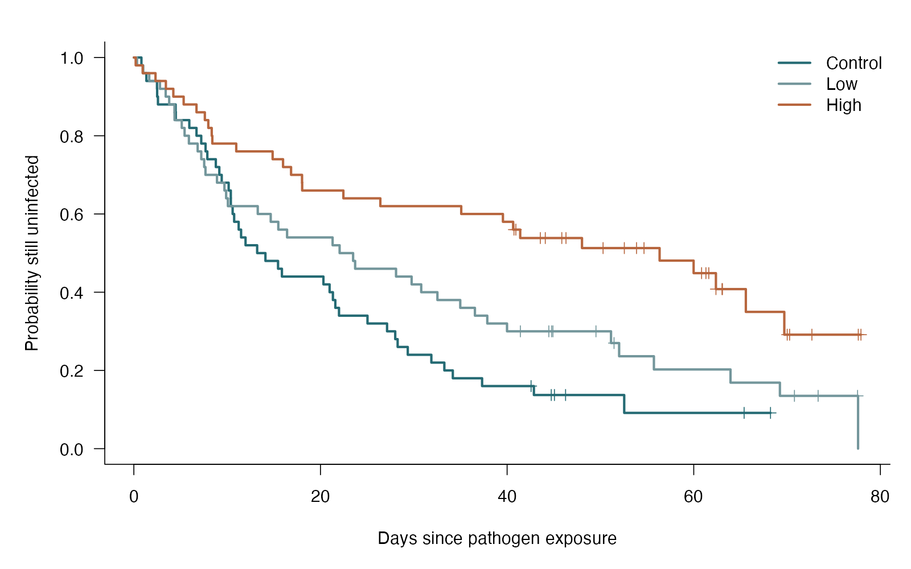

:::

::: {.column width="38%"}

**base R arguments**

**mark.time** — Show censored observations

**conf.int = FALSE** — Keep three curves readable

**col** — Match group colors and legend

**lwd** — Make step curves visible

:::

:::

::: notes

This figure is generated from the saved CSV by modules/log_rank/analysis.R. An omnibus survival comparison is not a pairwise effect estimate.

:::


## Log-rank: plot code {#log_rank-plot-code}

::: columns

::: {.column width="62%"}

```r
par(mar = c(5, 5, 2, 1), las = 1, bty = "l", cex = 1.15)
plot(fit, col = c("#246A73", "#73969B", "#B7663E"), lwd = 2.5,
     mark.time = TRUE, conf.int = FALSE,
     xlab = "Days since pathogen exposure", ylab = "Probability still uninfected")
legend("topright", levels(d$treatment), lty = 1, lwd = 2.5,
       col = c("#246A73", "#73969B", "#B7663E"), bty = "n")
```


:::

::: {.column width="38%"}

**Arguments to change**

**mark.time** — Show censored observations

**conf.int = FALSE** — Keep three curves readable

**col** — Match group colors and legend

**lwd** — Make step curves visible

:::

:::

::: notes

This is an exact excerpt from analysis.R. Any preparation referenced by the excerpt appears in the complete companion script. The script opens a ragg PNG device before these lines and closes it afterward.

:::


## Log-rank: question and null {#log_rank-question}

::: columns

::: {.column width="62%"}

**Scientific question**

Are the infection-free survival curves equal across treatments?

**Null / estimation target**

The groups have the same survival function over follow-up.

:::

::: {.column width="38%"}

**Relevant options**

- rho = 0 requests the ordinary log-rank test

- The same function handles two or more groups

- Use a justified contrast procedure for specific follow-ups

:::

:::

::: notes

Ask whether rejecting this null, or estimating this target, answers the biological question. An omnibus survival comparison is not a pairwise effect estimate.

:::


## Log-rank: assumptions {#log_rank-assumptions}

::: columns

::: {.column width="62%"}

**What matters here**

- Independent plants

- Noninformative censoring within each group

- Crossing curves may make this comparison insensitive

:::

::: {.column width="38%"}

**Parametric responses**

- Cox regression adds predictors

- Time-varying effects or an AFT model may fit a different scientific target

**Nonparametric responses**

- Log-rank is already a nonparametric comparison

- A fixed-time or restricted-mean comparison can ask a different prespecified question

:::

:::

::: notes

Begin with the design. A model change should address a specific issue and preserve the scientific target where possible. A rank or permutation alternative has its own assumptions and may change the null; do not choose it solely from a normality-test p-value.

:::


## Log-rank: run and read {#log_rank-analysis}

::: columns

::: {.column width="62%"}

```r
test <- survival::survdiff(survival::Surv(days, event) ~ treatment,
                           data = d, rho = 0)
fit <- survival::survfit(survival::Surv(days, event) ~ treatment, data = d)
p_value <- pchisq(test$chisq, df = length(test$n) - 1, lower.tail = FALSE)
```


:::

::: {.column width="38%"}

**Generated results**

- Log-rank chi-square(2) = 17.18

- Omnibus p = 0.0001863

- Control day-30 survival 0.24 (95% CI 0.15–0.39)

- High day-30 survival 0.62 (95% CI 0.50–0.77)

:::

:::

::: notes

Full executed model/test output:

```
Call: survfit(formula = survival::Surv(days, event) ~ treatment, data = d)

                treatment=Control 
   time n.risk n.event survival std.err lower 95% CI upper 95% CI
  0.813     50       1   0.9800  0.0198       0.9420        1.000
  0.992     49       1   0.9600  0.0277       0.9072        1.000
  1.344     48       1   0.9400  0.0336       0.8764        1.000
  2.481     47       1   0.9200  0.0384       0.8478        0.998
  2.498     46       1   0.9000  0.0424       0.8206        0.987
  2.584     45       1   0.8800  0.0460       0.7944        0.975
  4.478     44       1   0.8600  0.0491       0.7690        0.962
  4.495     43       1   0.8400  0.0518       0.7443        0.948
  5.943     42       1   0.8200  0.0543       0.7201        0.934
  6.715     41       1   0.8000  0.0566       0.6965        0.919
  7.222     40       1   0.7800  0.0586       0.6732        0.904
  7.687     39       1   0.7600  0.0604       0.6504        0.888
  7.875     38       1   0.7400  0.0620       0.6279        0.872
  8.784     37       1   0.7200  0.0635       0.6057        0.856
  9.159     36       1   0.7000  0.0648       0.5838        0.839
  9.416     35       1   0.6800  0.0660       0.5623        0.822
 10.160     34       1   0.6600  0.0670       0.5409        0.805
 10.390     33       1   0.6400  0.0679       0.5199        0.788
 10.392     32       1   0.6200  0.0686       0.4991        0.770
 10.587     31       1   0.6000  0.0693       0.4785        0.752
 10.749     30       1   0.5800  0.0698       0.4581        0.734
 11.233     29       1   0.5600  0.0702       0.4380        0.716
 11.492     28       1   0.5400  0.0705       0.4181        0.697
 11.969     27       1   0.5200  0.0707       0.3984        0.679
 13.215     26       1   0.5000  0.0707       0.3790        0.660
 14.101     25       1   0.4800  0.0707       0.3597        0.641
 15.453     24       1   0.4600  0.0705       0.3407        0.621
 15.867     23       1   0.4400  0.0702       0.3218        0.602
 20.316     22       1   0.4200  0.0698       0.3032        0.582
 20.978     21       1   0.4000  0.0693       0.2849        0.562
 21.332     20       1   0.3800  0.0686       0.2667        0.541
 21.591     19       1   0.3600  0.0679       0.2488        0.521
 21.986     18       1   0.3400  0.0670       0.2311        0.500
 25.038     17       1   0.3200  0.0660       0.2136        0.479
 27.135     16       1   0.3000  0.0648       0.1964        0.458
 28.011     15       1   0.2800  0.0635       0.1795        0.437
 28.269     14       1   0.2600  0.0620       0.1629        0.415
 29.354     13       1   0.2400  0.0604       0.1466        0.393
 31.881     12       1   0.2200  0.0586       0.1305        0.371
 33.274     11       1   0.2000  0.0566       0.1149        0.348
 34.181     10       1   0.1800  0.0543       0.0996        0.325
 37.319      9       1   0.1600  0.0518       0.0848        0.302
 42.870      7       1   0.1371  0.0492       0.0679        0.277
 52.549      3       1   0.0914  0.0497       0.0315        0.265

                treatment=Low 
   time n.risk n.event survival std.err lower 95% CI upper 95% CI
  0.336     50       1    0.980  0.0198       0.9420        1.000
  0.962     49       1    0.960  0.0277       0.9072        1.000
  1.650     48       1    0.940  0.0336       0.8764        1.000
  2.796     47       1    0.920  0.0384       0.8478        0.998
  3.411     46       1    0.900  0.0424       0.8206        0.987
  3.787     45       1    0.880  0.0460       0.7944        0.975
  4.355     44       1    0.860  0.0491       0.7690        0.962
  4.363     43       1    0.840  0.0518       0.7443        0.948
  5.133     42       1    0.820  0.0543       0.7201        0.934
  5.437     41       1    0.800  0.0566       0.6965        0.919
  5.899     40       1    0.780  0.0586       0.6732        0.904
  6.838     39       1    0.760  0.0604       0.6504        0.888
  7.224     38       1    0.740  0.0620       0.6279        0.872
  7.538     37       1    0.720  0.0635       0.6057        0.856
  7.675     36       1    0.700  0.0648       0.5838        0.839
  8.909     35       1    0.680  0.0660       0.5623        0.822
  9.707     34       1    0.660  0.0670       0.5409        0.805
  9.890     33       1    0.640  0.0679       0.5199        0.788
 10.080     32       1    0.620  0.0686       0.4991        0.770
 13.278     31       1    0.600  0.0693       0.4785        0.752
 14.667     30       1    0.580  0.0698       0.4581        0.734
 15.481     29       1    0.560  0.0702       0.4380        0.716
 16.421     28       1    0.540  0.0705       0.4181        0.697
 21.299     27       1    0.520  0.0707       0.3984        0.679
 22.051     26       1    0.500  0.0707       0.3790        0.660
 23.496     25       1    0.480  0.0707       0.3597        0.641
 23.714     24       1    0.460  0.0705       0.3407        0.621
 28.097     23       1    0.440  0.0702       0.3218        0.602
 29.766     22       1    0.420  0.0698       0.3032        0.582
 30.795     21       1    0.400  0.0693       0.2849        0.562
 32.531     20       1    0.380  0.0686       0.2667        0.541
 34.979     19       1    0.360  0.0679       0.2488        0.521
 36.550     18       1    0.340  0.0670       0.2311        0.500
 37.875     17       1    0.320  0.0660       0.2136        0.479
 39.991     16       1    0.300  0.0648       0.1964        0.458
 51.134     10       1    0.270  0.0649       0.1686        0.432
 52.005      8       1    0.236  0.0650       0.1378        0.405
 55.730      7       1    0.202  0.0639       0.1091        0.376
 63.940      6       1    0.169  0.0615       0.0826        0.345
 69.234      5       1    0.135  0.0577       0.0584        0.312
 77.609      1       1    0.000     NaN           NA           NA

                treatment=High 
   time n.risk n.event survival std.err lower 95% CI upper 95% CI
  0.198     50       1    0.980  0.0198        0.942        1.000
  0.954     49       1    0.960  0.0277        0.907        1.000
  2.322     48       1    0.940  0.0336        0.876        1.000
  3.432     47       1    0.920  0.0384        0.848        0.998
  4.231     46       1    0.900  0.0424        0.821        0.987
  5.337     45       1    0.880  0.0460        0.794        0.975
  6.714     44       1    0.860  0.0491        0.769        0.962
  7.608     43       1    0.840  0.0518        0.744        0.948
  7.978     42       1    0.820  0.0543        0.720        0.934
  8.346     41       1    0.800  0.0566        0.696        0.919
  8.408     40       1    0.780  0.0586        0.673        0.904
 10.973     39       1    0.760  0.0604        0.650        0.888
 14.870     38       1    0.740  0.0620        0.628        0.872
 15.989     37       1    0.720  0.0635        0.606        0.856
 16.848     36       1    0.700  0.0648        0.584        0.839
 18.024     35       1    0.680  0.0660        0.562        0.822
 18.038     34       1    0.660  0.0670        0.541        0.805
 22.455     33       1    0.640  0.0679        0.520        0.788
 26.415     32       1    0.620  0.0686        0.499        0.770
 35.083     31       1    0.600  0.0693        0.478        0.752
 39.551     30       1    0.580  0.0698        0.458        0.734
 40.646     29       1    0.560  0.0702        0.438        0.716
 41.403     26       1    0.538  0.0707        0.416        0.697
 48.025     21       1    0.513  0.0719        0.390        0.675
 56.342     16       1    0.481  0.0742        0.355        0.651
 59.986     15       1    0.449  0.0758        0.322        0.625
 62.376     11       1    0.408  0.0792        0.279        0.597
 65.583      7       1    0.350  0.0867        0.215        0.568
 69.705      6       1    0.291  0.0897        0.159        0.533

Call:
survival::survdiff(formula = survival::Surv(days, event) ~ treatment, 
    data = d, rho = 0)

                   N Observed Expected (O-E)^2/E (O-E)^2/V
treatment=Control 50       44     28.8     8.000     11.16
treatment=Low     50       41     36.7     0.515      0.76
treatment=High    50       29     48.5     7.857     14.15

 Chisq= 17.2  on 2 degrees of freedom, p= 2e-04 
```


:::


## Log-rank: interpret {#log_rank-interpret}

The three infection-free survival curves differed (log-rank chi-square(2) = 17.18, p = 0.0001863). Estimated day-30 infection-free fractions were 0.24 in control and 0.62 in high treatment. The omnibus test does not identify each differing pair and does not estimate a hazard ratio.

**Discuss:** Why does a significant omnibus result not tell us every pair differs?

::: notes

Teaching point: An omnibus survival comparison is not a pairwise effect estimate.

Instructor comparison with the simulated population: Equal survival is false: day-30 infection-free probabilities are exp(−1.35) ≈ 0.259, exp(−0.9) ≈ 0.407 and exp(−0.54) ≈ 0.583. The high/control hazard ratio is 0.4, though the log-rank test itself does not estimate it.

The reported estimate and p-value are calculated from this realized dataset; they need not exactly match the known population effect.

:::


## Stratified log-rank: the data {#stratified_logrank}

::: columns

::: {.column width="62%"}

Larval survival under stress is compared within 12 rearing blocks.

- Time plus event indicator

- Two treatments in every block

- Compare treatments within blocks

:::

::: {.column width="38%"}

**Other data like these**

- Germination by collection site

- Infection by matched host cohort

- Survival by experimental batch

:::

:::

::: notes

Stratified log-rank test

Independent larvae within known rearing blocks; administrative censoring at day 30.

stratum: Rearing block (ID)

treatment: Assigned condition (category)

time: Observed event or censoring time (days)

event: Event observed by day 30 (TRUE/FALSE)

:::


## Stratified log-rank: simulate and save {#stratified_logrank-simulate}

::: columns

::: {.column width="62%"}

```r
set.seed(240501)
stratum <- rep(1:12, each=10)
treatment <- rep(rep(c("Control", "Stress"), each=5), 12)
rate <- rep(seq(.025, .08, length.out=12), each=10)
event_time <- rexp(120, rate * ifelse(treatment=="Stress", 1.6, 1))
d <- data.frame(stratum, treatment, time=pmin(event_time, 30), event=event_time<=30)
write.csv(d, file.path(out_dir, "data.csv"), row.names = FALSE)
```


:::

::: {.column width="38%"}

**First saved row**

```
stratum: 1
treatment: Control
time: 30
event: FALSE
```


:::

:::

::: notes

Seed: 240501

Generating model: 120 independent exponential event times conditional on 12 fixed block rates evenly spaced from 0.025 to 0.08 per day. Stress multiplies every block rate by 1.6. Follow-up stops at 30 days.

Population truth: Stress has a true hazard ratio of 1.6 within each block; the within-block equality null is false.

The script writes data.csv before reading it for analysis. output_dir or out_dir is the folder supplied to the standalone script.

Original saved-data preview:

```
 stratum treatment      time event
       1   Control 30.000000 FALSE
       1   Control 27.462231  TRUE
       1   Control 30.000000 FALSE
       1   Control  3.618851  TRUE
```


:::


## Stratified log-rank: see the data {#stratified_logrank-plot}

::: columns

::: {.column width="62%"}

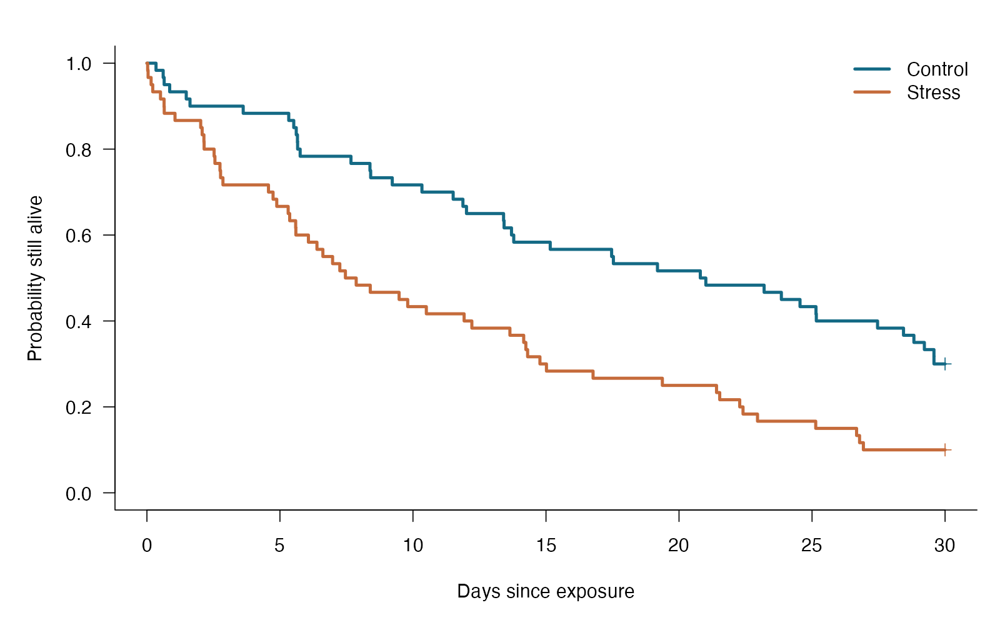

:::

::: {.column width="38%"}

**base R arguments**

**mark.time=TRUE** — Marks censoring times

**conf.int=FALSE** — Keeps this teaching plot uncluttered

**col / lwd** — Matches treatment colors and line widths

:::

:::

::: notes

This figure is generated from the saved CSV by modules/stratified_logrank/analysis.R. Stratification permits different baseline survival across known blocks.

:::


## Stratified log-rank: plot code {#stratified_logrank-plot-code}

::: columns

::: {.column width="62%"}

```r
fit <- survival::survfit(survival::Surv(time, event) ~ treatment, data=d)
plot(fit, col=c("#146A85", "#C56B3B"), lwd=3, conf.int=FALSE,
     xlab="Days since exposure", ylab="Probability still alive", mark.time=TRUE)
legend("topright", c("Control", "Stress"), col=c("#146A85", "#C56B3B"), lwd=3, bty="n")
```


:::

::: {.column width="38%"}

**Arguments to change**

**mark.time=TRUE** — Marks censoring times

**conf.int=FALSE** — Keeps this teaching plot uncluttered

**col / lwd** — Matches treatment colors and line widths

:::

:::

::: notes

This is an exact excerpt from analysis.R. Any preparation referenced by the excerpt appears in the complete companion script. The script opens a ragg PNG device before these lines and closes it afterward.

:::


## Stratified log-rank: question and null {#stratified_logrank-question}

::: columns

::: {.column width="62%"}

**Scientific question**

Do matched groups differ in survival after accounting for the matching strata?

**Null / estimation target**

Within the specified strata, groups have the same survival function.

:::

::: {.column width="38%"}

**Relevant options**

- survival::survdiff(Surv(time, event) ~ group + strata(match), data = d, rho = 0)

:::

:::

::: notes

Ask whether rejecting this null, or estimating this target, answers the biological question. Stratification permits different baseline survival across known blocks.

:::


## Stratified log-rank: assumptions {#stratified_logrank-assumptions}

::: columns

::: {.column width="62%"}

**What matters here**

- Matching/strata are defined by design; meaningful group comparisons occur within strata.

- Appropriate censoring and independence between matched sets.

:::

::: {.column width="38%"}

**Parametric responses**

- Stratified Cox allows additional predictors and separate baseline hazards for strata.

**Nonparametric responses**

- Already a stratified nonparametric comparison; a permutation must honor matching and the event/censoring design.

:::

:::

::: notes

Begin with the design. A model change should address a specific issue and preserve the scientific target where possible. A rank or permutation alternative has its own assumptions and may change the null; do not choose it solely from a normality-test p-value.

:::


## Stratified log-rank: run and read {#stratified_logrank-analysis}

::: columns

::: {.column width="62%"}

```r
result <- survival::survdiff(survival::Surv(time, event) ~ treatment + strata(stratum), data=d)
p_value <- pchisq(result$chisq, df=1, lower.tail=FALSE)
```


:::

::: {.column width="38%"}

**Generated results**

- Stratified chi-square = 13.433

- p = 0.0002472

- 12 rearing blocks; 120 larvae

:::

:::

::: notes

Full executed model/test output:

```
Call:
survival::survdiff(formula = survival::Surv(time, event) ~ treatment + 
    strata(stratum), data = d)

                   N Observed Expected (O-E)^2/E (O-E)^2/V
treatment=Control 60       42     58.5      4.64      13.4
treatment=Stress  60       54     37.5      7.23      13.4

 Chisq= 13.4  on 1 degrees of freedom, p= 2e-04 
```


:::


## Stratified log-rank: interpret {#stratified_logrank-interpret}

After comparison within rearing blocks, chi-square = 13.43 (1 df), p = 0.000247. The test compares survival; estimate the direction and magnitude with survival curves or a suitable model.

**Discuss:** What biological variation does stratification account for here?

::: notes

Teaching point: Stratification permits different baseline survival across known blocks.

Instructor comparison with the simulated population: Stress has a true hazard ratio of 1.6 within each block; the within-block equality null is false.

The reported estimate and p-value are calculated from this realized dataset; they need not exactly match the known population effect.

:::


## Cox regression: the data {#cox_ph}

::: columns

::: {.column width="62%"}

Seedling death times are related to protective dose and temperature.

- Event time plus censor indicator

- Quantitative dose and temperature

- Conditional hazard comparison

:::

::: {.column width="38%"}

**Other data like these**

- Dose effects on time to infection

- Body size effects on longevity

- Habitat effects on germination hazard

:::

:::

::: notes

Cox proportional-hazards regression

180 independent seedlings with right-censoring.

seedling: Independent seedling identifier (ID)

dose: Protective dose (dose unit)

temperature: Rearing temperature (°C)

days: Observed death or censoring time (day)

event: 1 death; 0 right-censored (binary)

:::


## Cox regression: simulate and save {#cox_ph-simulate}

::: columns

::: {.column width="62%"}

```r
set.seed(2112)
d <- data.frame(seedling = 1:180, dose = runif(180, 0, 3),
                temperature = rnorm(180, 25, 2))
rate <- exp(log(.035) - .45 * d$dose + .12 * (d$temperature - 25))
event_time <- rexp(180, rate = rate)
follow_up <- runif(180, 45, 100)
d$days <- pmin(event_time, follow_up)
d$event <- as.integer(event_time <= follow_up)
write.csv(d, file.path(output_dir, "data.csv"), row.names = FALSE)
```


:::

::: {.column width="38%"}

**First saved row**

```
seedling: 1
dose: 2.467
temperature: 23.63
days: 86.63
event: 0
```


:::

:::

::: notes

Seed: 2112

Generating model: 180 seedlings have dose Uniform(0, 3) and temperature Normal(25, 2²)°C. Conditional event times are exponential with rate exp(log(0.035) − 0.45 × dose + 0.12 × (temperature − 25)). Independent censoring times are Uniform(45, 100) days. Save the minimum time and event indicator without rounding.

Population truth: The adjusted hazard ratio per dose unit is exp(−0.45) ≈ 0.638; per °C it is exp(0.12) ≈ 1.127. The dose null is false and proportional hazards holds in the generating model.

The script writes data.csv before reading it for analysis. output_dir or out_dir is the folder supplied to the standalone script.

Original saved-data preview:

```
 seedling      dose temperature     days event
        1 2.4670338    23.63476 86.62669     0
        2 1.4318536    27.56345 33.04450     1
        3 1.1376910    24.91264 62.69940     0
        4 0.7997489    22.42051 15.39509     1
```


:::


## Cox regression: see the data {#cox_ph-plot}

::: columns

::: {.column width="62%"}

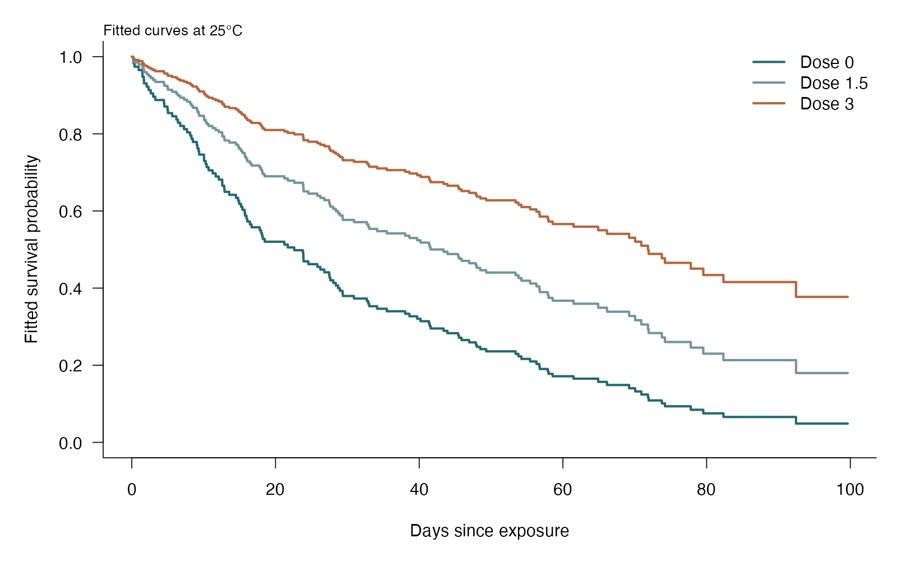

:::

::: {.column width="38%"}

**base R arguments**

**newdata** — Hold temperature fixed while varying dose

**conf.int** — Choose whether uncertainty bands are drawn

**col** — Distinguish predictor scenarios

**mtext** — State what is held constant

:::

:::

::: notes

This figure is generated from the saved CSV by modules/cox_ph/analysis.R. A hazard ratio compares instantaneous event risk among individuals still at risk.

:::


## Cox regression: plot code {#cox_ph-plot-code}

::: columns

::: {.column width="62%"}

```r
par(mar = c(5, 5, 2, 1), las = 1, bty = "l", cex = 1.15)
plot(curves, col = c("#246A73", "#73969B", "#B7663E"), lwd = 2.5,
     conf.int = FALSE, xlab = "Days since exposure",
     ylab = "Fitted survival probability")
legend("topright", c("Dose 0", "Dose 1.5", "Dose 3"), lty = 1, lwd = 2.5,
       col = c("#246A73", "#73969B", "#B7663E"), bty = "n")
mtext("Fitted curves at 25°C", side = 3, line = .1, adj = 0)
```


:::

::: {.column width="38%"}

**Arguments to change**

**newdata** — Hold temperature fixed while varying dose

**conf.int** — Choose whether uncertainty bands are drawn

**col** — Distinguish predictor scenarios

**mtext** — State what is held constant

:::

:::

::: notes

This is an exact excerpt from analysis.R. Any preparation referenced by the excerpt appears in the complete companion script. The script opens a ragg PNG device before these lines and closes it afterward.

:::


## Cox regression: question and null {#cox_ph-question}

::: columns

::: {.column width="62%"}

**Scientific question**

Does dose alter death hazard after accounting for temperature?

**Null / estimation target**

The dose coefficient is zero: the adjusted hazard ratio per dose unit is one.

:::

::: {.column width="38%"}

**Relevant options**

- Surv(days, event) preserves censoring

- dose + temperature adjusts for temperature

- cox.zph examines the proportional-hazards structure

:::

:::

::: notes

Ask whether rejecting this null, or estimating this target, answers the biological question. A hazard ratio compares instantaneous event risk among individuals still at risk.

:::


## Cox regression: assumptions {#cox_ph-assumptions}

::: columns

::: {.column width="62%"}

**What matters here**

- Suitable covariate effects and censoring mechanism

- A constant hazard ratio for ordinary coefficients

- Independent seedlings; model dependence if present

:::

::: {.column width="38%"}

**Parametric responses**

- Allow time-varying effects or justified strata

- An AFT model targets a survival-time ratio

**Nonparametric responses**

- Cox leaves the baseline hazard unspecified

- Log-rank supports a simpler group comparison

:::

:::

::: notes

Begin with the design. A model change should address a specific issue and preserve the scientific target where possible. A rank or permutation alternative has its own assumptions and may change the null; do not choose it solely from a normality-test p-value.

:::


## Cox regression: run and read {#cox_ph-analysis}

::: columns

::: {.column width="62%"}

```r
fit <- survival::coxph(survival::Surv(days, event) ~ dose + temperature,
                       data = d, x = TRUE)
summary(fit)
ph_check <- survival::cox.zph(fit)
hazard_ci <- exp(confint(fit)["dose", ])
```


:::

::: {.column width="38%"}

**Generated results**

- Dose hazard ratio per unit = 0.69

- 95% CI 0.56 to 0.84

- Wald z = -3.72; p = 0.0001969

- PH diagnostic global p = 0.01934

:::

:::

::: notes

Full executed model/test output:

```
Call:
survival::coxph(formula = survival::Surv(days, event) ~ dose + 
    temperature, data = d, x = TRUE)

  n= 180, number of events= 126 

                coef exp(coef) se(coef)      z Pr(>|z|)    
dose        -0.37705   0.68588  0.10128 -3.723 0.000197 ***
temperature  0.16013   1.17367  0.04852  3.300 0.000966 ***
---
Signif. codes:  0 ‘***’ 0.001 ‘**’ 0.01 ‘*’ 0.05 ‘.’ 0.1 ‘ ’ 1

            exp(coef) exp(-coef) lower .95 upper .95
dose           0.6859      1.458    0.5624    0.8365
temperature    1.1737      0.852    1.0672    1.2908

Concordance= 0.628  (se = 0.027 )
Likelihood ratio test= 21.6  on 2 df,   p=2e-05
Wald test            = 21.43  on 2 df,   p=2e-05
Score (logrank) test = 21.27  on 2 df,   p=2e-05

            chisq df      p
dose        7.726  1 0.0054
temperature 0.942  1 0.3317
GLOBAL      7.891  2 0.0193
```


:::


## Cox regression: interpret {#cox_ph-interpret}

Each dose unit multiplied the death hazard by 0.69 at the same temperature (95% CI 0.56 to 0.84; Wald p = 0.0001969). This is an instantaneous-risk comparison among seedlings still alive, not a survival probability ratio. The fitted constant hazard ratio must be checked over time.

**Discuss:** Explain why a hazard ratio of 0.6 does not mean 60% as many seedlings survive.

::: notes

Teaching point: A hazard ratio compares instantaneous event risk among individuals still at risk.

Instructor comparison with the simulated population: The adjusted hazard ratio per dose unit is exp(−0.45) ≈ 0.638; per °C it is exp(0.12) ≈ 1.127. The dose null is false and proportional hazards holds in the generating model.

The reported estimate and p-value are calculated from this realized dataset; they need not exactly match the known population effect.

:::


## Parametric survival: the data {#parametric_survival}

::: columns

::: {.column width="62%"}

Botanists compare germination timing after control or cold treatment.

- Positive event time

- Right-censoring

- A time-ratio scientific target

:::

::: {.column width="38%"}

**Other data like these**

- Developmental time under temperature

- Time to infection under treatment

- Longevity under different diets

:::

:::

::: notes

Parametric survival: accelerated failure time

140 independent seeds; some remain ungerminated at final follow-up.

seed: Independent seed identifier (ID)

treatment: Control or cold pretreatment (category)

days: Observed germination or censoring time (day)

event: 1 germinated; 0 right-censored (binary)

:::


## Parametric survival: simulate and save {#parametric_survival-simulate}

::: columns

::: {.column width="62%"}

```r
set.seed(2113)
d <- data.frame(seed = 1:140,
                treatment = rep(c("Control", "Cold"), each = 70))
log_scale <- log(20) + .4 * (d$treatment == "Cold")
event_time <- rweibull(140, shape = 1.8, scale = exp(log_scale))
follow_up <- runif(140, 22, 50)
d$days <- pmin(event_time, follow_up)
d$event <- as.integer(event_time <= follow_up)
write.csv(d, file.path(output_dir, "data.csv"), row.names = FALSE)
```


:::

::: {.column width="38%"}

**First saved row**

```
seed: 1
treatment: Control
days: 11.06
event: 1
```


:::

:::

::: notes

Seed: 2113

Generating model: 140 independent seeds (70 per group) have Weibull germination times with shape 1.8 and scale exp(log(20) + 0.4 if Cold). Thus control scale is 20 days and cold scale is about 29.84 days. Independent censoring times are Uniform(22, 50) days. Save minimum time and event indicator without rounding.

Population truth: The population cold/control time ratio is exp(0.4) ≈ 1.492, so the equal-time null is false. The generating Weibull distribution matches the fitted AFT family.

The script writes data.csv before reading it for analysis. output_dir or out_dir is the folder supplied to the standalone script.

Original saved-data preview:

```
 seed treatment      days event
    1   Control 11.058162     1
    2   Control 26.148082     1
    3   Control  5.194153     1
    4   Control 22.392917     0
```


:::


## Parametric survival: see the data {#parametric_survival-plot}

::: columns

::: {.column width="62%"}

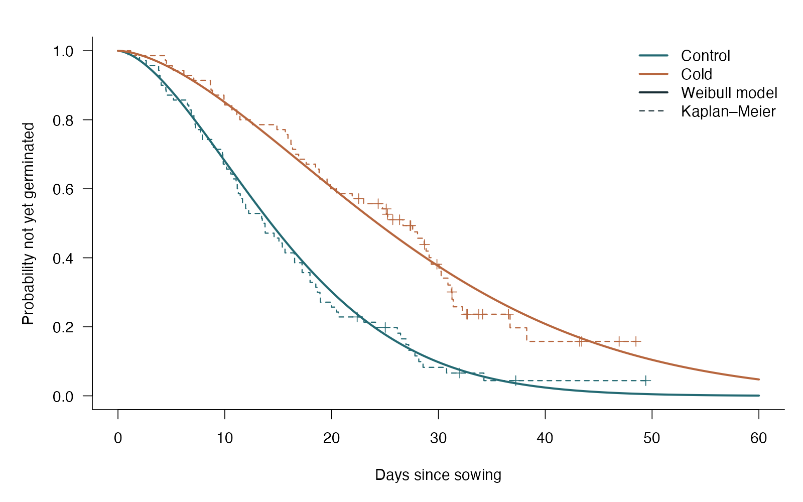

:::

::: {.column width="38%"}

**base R arguments**

**lty** — Separate empirical steps from model curves

**lines** — Overlay fitted survival curves

**mark.time** — Keep censoring visible

**legend** — Name both groups and line meanings

:::

:::

::: notes

This figure is generated from the saved CSV by modules/parametric_survival/analysis.R. An AFT coefficient becomes a time ratio; it is not interpreted as a Cox hazard ratio.

:::


## Parametric survival: plot code {#parametric_survival-plot-code}

::: columns

::: {.column width="62%"}

```r
par(mar = c(5, 5, 2, 1), las = 1, bty = "l", cex = 1.15)
plot(km, col = c("#246A73", "#B7663E"), lty = 2, lwd = 1.4,
     conf.int = FALSE, mark.time = TRUE, xlim = c(0, 60),
     xlab = "Days since sowing", ylab = "Probability not yet germinated")
lines(time_grid, survival_control, col = "#246A73", lwd = 2.5)
lines(time_grid, survival_cold, col = "#B7663E", lwd = 2.5)
legend("topright", c("Control", "Cold", "Weibull model", "Kaplan–Meier"),
       col = c("#246A73", "#B7663E", "#172D34", "#172D34"),
       lty = c(1, 1, 1, 2), lwd = c(2.5, 2.5, 2.5, 1.4), bty = "n")
```


:::

::: {.column width="38%"}

**Arguments to change**

**lty** — Separate empirical steps from model curves

**lines** — Overlay fitted survival curves

**mark.time** — Keep censoring visible

**legend** — Name both groups and line meanings

:::

:::

::: notes

This is an exact excerpt from analysis.R. Any preparation referenced by the excerpt appears in the complete companion script. The script opens a ragg PNG device before these lines and closes it afterward.

:::


## Parametric survival: question and null {#parametric_survival-question}

::: columns

::: {.column width="62%"}

**Scientific question**

Does cold treatment stretch the germination-time distribution?

**Null / estimation target**

The treatment coefficient is zero: the cold/control time ratio is one.

:::

::: {.column width="38%"}

**Relevant options**

- dist = "weibull" chooses the event-time family

- exp(coefficient) gives the AFT time ratio

- Surv retains seeds that are right-censored

:::

:::

::: notes

Ask whether rejecting this null, or estimating this target, answers the biological question. An AFT coefficient becomes a time ratio; it is not interpreted as a Cox hazard ratio.

:::


## Parametric survival: assumptions {#parametric_survival-assumptions}

::: columns

::: {.column width="62%"}

**What matters here**

- Independent seeds and appropriate censoring

- A suitable Weibull time distribution

- A common acceleration factor for treatment

:::

::: {.column width="38%"}

**Parametric responses**

- Check other justified parametric time distributions

- Cox changes the effect scale to a hazard ratio

**Nonparametric responses**

- Kaplan–Meier estimates survival without a time distribution

- Log-rank tests equal survival curves

:::

:::

::: notes

Begin with the design. A model change should address a specific issue and preserve the scientific target where possible. A rank or permutation alternative has its own assumptions and may change the null; do not choose it solely from a normality-test p-value.

:::


## Parametric survival: run and read {#parametric_survival-analysis}

::: columns

::: {.column width="62%"}

```r
fit <- survival::survreg(survival::Surv(days, event) ~ treatment,
                         data = d, dist = "weibull")
summary(fit)
time_ci <- exp(confint(fit)["treatmentCold", ])
```


:::

::: {.column width="38%"}

**Generated results**

- Cold/control time ratio = 1.70

- 95% CI 1.35 to 2.13

- Wald z = 4.54; p = 5.745e-06

- Fitted Weibull shape = 1.64

:::

:::

::: notes

Full executed model/test output:

```

Call:
survival::survreg(formula = survival::Surv(days, event) ~ treatment, 
    data = d, dist = "weibull")
                Value Std. Error     z       p
(Intercept)    2.8854     0.0773 37.32 < 2e-16
treatmentCold  0.5288     0.1166  4.54 5.7e-06
Log(scale)    -0.4935     0.0759 -6.50 8.1e-11

Scale= 0.61 

Weibull distribution
Loglik(model)= -454.6   Loglik(intercept only)= -465
	Chisq= 20.72 on 1 degrees of freedom, p= 5.3e-06 
Number of Newton-Raphson Iterations: 5 
n= 140 

```


:::


## Parametric survival: interpret {#parametric_survival-interpret}

Under the Weibull accelerated-failure-time model, cold-treated seeds had 1.70 times the germination time of controls (95% CI 1.35 to 2.13; p = 5.745e-06). This is a time ratio, not a Cox hazard ratio. The distributional fit and censoring assumptions remain part of the interpretation.

**Discuss:** Would an AFT time ratio above one speed up or delay germination?

::: notes

Teaching point: An AFT coefficient becomes a time ratio; it is not interpreted as a Cox hazard ratio.

Instructor comparison with the simulated population: The population cold/control time ratio is exp(0.4) ≈ 1.492, so the equal-time null is false. The generating Weibull distribution matches the fitted AFT family.

The reported estimate and p-value are calculated from this realized dataset; they need not exactly match the known population effect.

:::


## Shared frailty: the data {#shared_frailty}

::: columns

::: {.column width="62%"}

Larvae from 24 populations experience a control or stress condition.

- Cluster ID retained

- Time and censor indicator

- Conditional treatment effect

:::

::: {.column width="38%"}

**Other data like these**

- Animals within colonies

- Plants within populations

- Patients within centers

:::

:::

::: notes

Shared-frailty survival model

Larvae share an unobserved population risk; time-to-death is censored at day 35.

population: Shared risk group (ID)

stress: Control=0, stress=1 (indicator)

time: Observed follow-up (days)

event: Death observed (TRUE/FALSE)

:::


## Shared frailty: simulate and save {#shared_frailty-simulate}

::: columns

::: {.column width="62%"}

```r
set.seed(240502)
population <- rep(1:24, each=10)
stress <- rep(rep(0:1, each=5), 24)
frailty <- rgamma(24, shape=2, rate=2)
event_time <- rexp(240, .04 * frailty[population] * exp(.5*stress))
d <- data.frame(population, stress, time=pmin(event_time, 35), event=event_time<=35)
write.csv(d, file.path(out_dir, "data.csv"), row.names = FALSE)
```


:::

::: {.column width="38%"}

**First saved row**

```
population: 1
stress: 0
time: 35
event: FALSE
```


:::

:::

::: notes

Seed: 240502

Generating model: 24 population frailties follow Gamma(shape=2, rate=2), mean 1. Conditional event times are exponential with rate 0.04 × frailty × exp(0.5 × stress). Ten larvae per population; censoring at 35 days.

Population truth: The conditional stress hazard ratio is exp(0.5) ≈ 1.65; shared population variance is 0.5.

The script writes data.csv before reading it for analysis. output_dir or out_dir is the folder supplied to the standalone script.

Original saved-data preview:

```
 population stress     time event
          1      0 35.00000 FALSE
          1      0 35.00000 FALSE
          1      0 35.00000 FALSE
          1      0 33.92861  TRUE
```


:::


## Shared frailty: see the data {#shared_frailty-plot}

::: columns

::: {.column width="62%"}

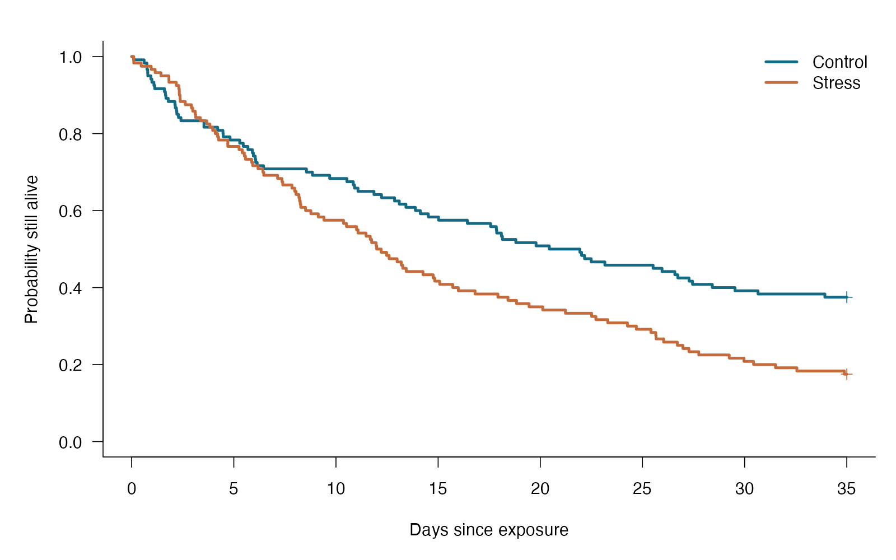

:::

::: {.column width="38%"}

**base R arguments**

**Surv(time,event)** — Uses follow-up and event status together

**mark.time** — Shows right-censored observations

**conf.int** — Controls interval display

:::

:::

::: notes

This figure is generated from the saved CSV by modules/shared_frailty/analysis.R. Frailty accounts for shared latent risk; it is different from giving each stratum its own baseline curve.

:::


## Shared frailty: plot code {#shared_frailty-plot-code}

::: columns

::: {.column width="62%"}

```r
fit <- survival::survfit(survival::Surv(time, event) ~ stress, data=d)
plot(fit, col=c("#146A85", "#C56B3B"), lwd=3, conf.int=FALSE,
     xlab="Days since exposure", ylab="Probability still alive", mark.time=TRUE)
legend("topright", c("Control", "Stress"), col=c("#146A85", "#C56B3B"), lwd=3, bty="n")
```


:::

::: {.column width="38%"}

**Arguments to change**

**Surv(time,event)** — Uses follow-up and event status together

**mark.time** — Shows right-censored observations

**conf.int** — Controls interval display

:::

:::

::: notes

This is an exact excerpt from analysis.R. Any preparation referenced by the excerpt appears in the complete companion script. The script opens a ragg PNG device before these lines and closes it afterward.

:::


## Shared frailty: question and null {#shared_frailty-question}

::: columns

::: {.column width="62%"}

**Scientific question**

Does stress change larval death hazard after accounting for shared population conditions?

**Null / estimation target**

The stress coefficient is zero: the hazard ratio conditional on population frailty is one.

:::

::: {.column width="38%"}

**Relevant options**

- survival::coxph(Surv(time, event) ~ x + frailty(cluster_id), data = d)

- Specify a plausible frailty distribution; inspect convergence and the cluster structure.

:::

:::

::: notes

Ask whether rejecting this null, or estimating this target, answers the biological question. Frailty accounts for shared latent risk; it is different from giving each stratum its own baseline curve.

:::


## Shared frailty: assumptions {#shared_frailty-assumptions}

::: columns

::: {.column width="62%"}

**What matters here**

- Independent clusters; a suitable shared-frailty structure and conditional proportional hazards.

- Appropriate censoring; enough independent clusters.

:::

::: {.column width="38%"}

**Parametric responses**

- Stratified Cox allows separate baseline hazards; cluster-robust uncertainty adjusts precision without fitting a frailty distribution.

**Nonparametric responses**

- Cluster-level resampling may assess uncertainty; simple rank tests discard the survival and clustering structure.

:::

:::

::: notes

Begin with the design. A model change should address a specific issue and preserve the scientific target where possible. A rank or permutation alternative has its own assumptions and may change the null; do not choose it solely from a normality-test p-value.

:::


## Shared frailty: run and read {#shared_frailty-analysis}

::: columns

::: {.column width="62%"}

```r
result <- survival::coxph(survival::Surv(time, event) ~ stress + frailty(population), data=d)
b <- coef(result)["stress"]
se <- sqrt(vcov(result)["stress", "stress"])
hr <- exp(b); ci <- exp(b+c(-1,1)*1.96*se)
p_value <- 2*pnorm(-abs(b/se))
```


:::

::: {.column width="38%"}

**Generated results**

- Conditional hazard ratio = 1.61

- Wald 95% CI 1.18 to 2.18

- Wald p = 0.002373

:::

:::

::: notes

Full executed model/test output:

```
Call:
survival::coxph(formula = survival::Surv(time, event) ~ stress + 
    frailty(population), data = d)

                      coef se(coef)    se2  Chisq   DF       p
stress               0.475    0.156  0.155  9.236  1.0  0.0024
frailty(population)                        55.288 17.2 6.8e-06

Iterations: 8 outer, 31 Newton-Raphson
     Variance of random effect= 0.337   I-likelihood = -848 
Degrees of freedom for terms=  1.0 17.2 
Likelihood ratio test=82.8  on 18.1 df, p=3e-10
n= 240, number of events= 174 
```


:::


## Shared frailty: interpret {#shared_frailty-interpret}

Stress has an estimated hazard ratio of 1.61 conditional on population frailty (95% Wald CI 1.18 to 2.18; p = 0.00237). Population frailty represents shared differences in baseline risk.

**Discuss:** Why do 240 larvae not provide 240 independent population replicates?

::: notes

Teaching point: Frailty accounts for shared latent risk; it is different from giving each stratum its own baseline curve.

Instructor comparison with the simulated population: The conditional stress hazard ratio is exp(0.5) ≈ 1.65; shared population variance is 0.5.

The reported estimate and p-value are calculated from this realized dataset; they need not exactly match the known population effect.

:::


## P-Values {#xkcd-1478}

{height=6in}

[Randall Munroe / xkcd · https://xkcd.com/1478](https://xkcd.com/1478/) · [CC BY-NC 2.5](https://creativecommons.org/licenses/by-nc/2.5/)

::: notes

Choose the hypothesis family and reporting rule before looking at the results; a threshold is not a reason to shop for another analysis.

Comic: P-Values. https://xkcd.com/1478/

Original course source: lectures__exp1.pptx, slide 1. Artwork reproduced unchanged. Randall Munroe / xkcd; Creative Commons Attribution-NonCommercial 2.5.

Accessible description: A satirical p-value interpretation table shifts the analysis and language to chase statistical significance.

:::


## Bonferroni: the data {#bonferroni}

::: columns

::: {.column width="62%"}

Compare gene expression between two conditions across 40 genes.

- Many related hypotheses

- One prespecified family of 40 tests

- Effect sizes remain interpretable per gene

:::

::: {.column width="38%"}

**Other data like these**

- Multiple candidate traits

- Several planned endpoints

- Many microbial taxa

:::

:::

::: notes

Bonferroni correction

Each gene comparison uses 12 independent samples per condition; simulation uses independent genes.

gene: Gene comparison (ID)

treated: Control=0, treated=1 (indicator)

expression: Expression measurement (log2 units)

:::


## Bonferroni: simulate and save {#bonferroni-simulate}

::: columns

::: {.column width="62%"}

```r
set.seed(240508)
gene <- rep(1:40, each=24)
treated <- rep(rep(0:1, each=12), 40)
effect <- rep(c(rep(1.1,8), rep(0,32)), each=24)
d <- data.frame(gene, treated, expression=rnorm(960, 6+effect*treated, 1))
write.csv(d, file.path(out_dir, "data.csv"), row.names = FALSE)
```


:::

::: {.column width="38%"}

**First saved row**

```
gene: 1
treated: 0
expression: 9.308
```


:::

:::

::: notes

Seed: 240508

Generating model: 40 genes, each with 12 control and 12 treated independent Normal observations, SD=1 log2 unit. Controls have mean 6; the first 8 genes have treatment shift 1.1; the other 32 have shift 0. Genes are independent in this simulation.

Population truth: The first eight genes have true mean effects of 1.1 log2 units; the other 32 nulls are true.

The script writes data.csv before reading it for analysis. output_dir or out_dir is the folder supplied to the standalone script.

Original saved-data preview:

```
 gene treated expression
    1       0   9.307887
    1       0   5.031719
    1       0   4.517621
    1       0   4.356985
```


:::


## Bonferroni: see the data {#bonferroni-plot}

::: columns

::: {.column width="62%"}

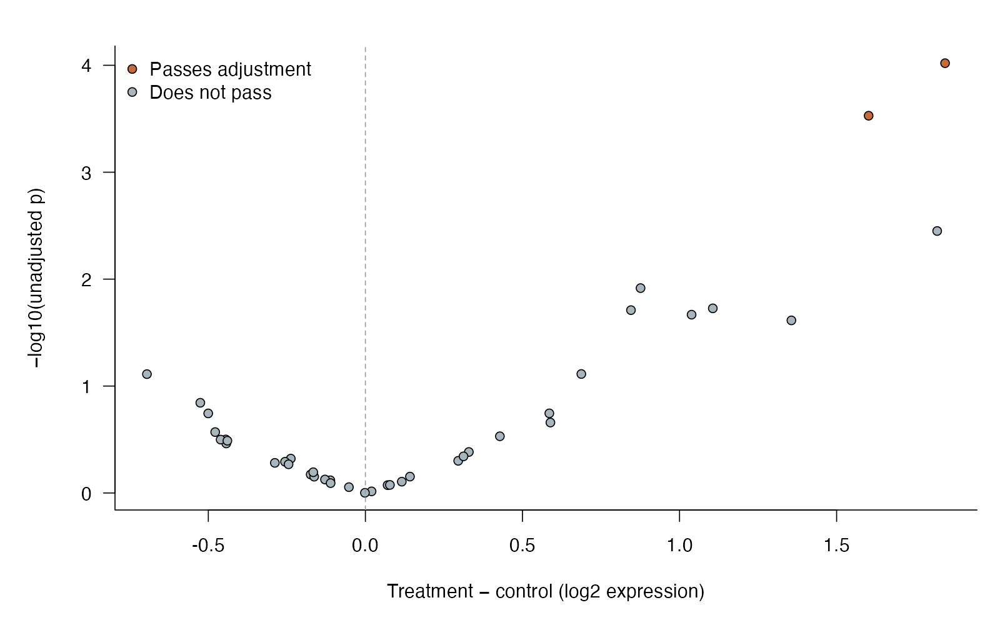

:::

::: {.column width="38%"}

**base R arguments**

**-log10(p_value)** — Makes smaller p-values appear higher

**bg=ifelse(...)** — Colors by the adjusted decision

**abline(v=0)** — Marks zero expression difference

:::

:::

::: notes

This figure is generated from the saved CSV by modules/bonferroni/analysis.R. Bonferroni controls the chance of at least one false positive in the declared family; retain the gene effect sizes when interpreting discoveries.

:::


## Bonferroni: plot code {#bonferroni-plot-code}

::: columns

::: {.column width="62%"}

```r
plot(difference, -log10(p_value), pch=21,
     bg=ifelse(adjusted<.05, "#C56B3B", "#A7B6BD"),
     xlab="Treatment − control (log2 expression)", ylab="−log10(unadjusted p)")
abline(v=0, lty=2, col="gray60")
legend("topleft", c("Passes adjustment", "Does not pass"),
       pch=21, pt.bg=c("#C56B3B", "#A7B6BD"), bty="n")
```


:::

::: {.column width="38%"}

**Arguments to change**

**-log10(p_value)** — Makes smaller p-values appear higher

**bg=ifelse(...)** — Colors by the adjusted decision

**abline(v=0)** — Marks zero expression difference

:::

:::

::: notes

This is an exact excerpt from analysis.R. Any preparation referenced by the excerpt appears in the complete companion script. The script opens a ragg PNG device before these lines and closes it afterward.

:::


## Bonferroni: question and null {#bonferroni-question}

::: columns

::: {.column width="62%"}

**Scientific question**

Which gene differences are supported while controlling the chance of any false positive across the 40 comparisons?

**Null / estimation target**

For each gene, the treatment and control population means are equal. The adjustment changes the error criterion, not those individual nulls.

:::

::: {.column width="38%"}

**Relevant options**

- p.adjust(p_value, method="bonferroni")

- Define the family before viewing results

- At adjusted p < .05, control familywise error at 5%

:::

:::

::: notes

Ask whether rejecting this null, or estimating this target, answers the biological question. Bonferroni controls the chance of at least one false positive in the declared family; retain the gene effect sizes when interpreting discoveries.

:::


## Bonferroni: assumptions {#bonferroni-assumptions}

::: columns

::: {.column width="62%"}

**What matters here**

- Each input p-value is valid for its own null.

- The family and error criterion match the scientific aim.

:::

::: {.column width="38%"}

**Parametric responses**

- Adjust valid p-values from the selected parametric tests.

**Nonparametric responses**

- The same adjustment can be applied to valid rank-test or permutation p-values.

:::

:::

::: notes

Begin with the design. A model change should address a specific issue and preserve the scientific target where possible. A rank or permutation alternative has its own assumptions and may change the null; do not choose it solely from a normality-test p-value.

:::


## Bonferroni: run and read {#bonferroni-analysis}

::: columns

::: {.column width="62%"}

```r
p_value <- difference <- numeric(40)
for (i in 1:40) {
  x <- d$expression[d$gene==i & d$treated==1]
  y <- d$expression[d$gene==i & d$treated==0]
  p_value[i] <- t.test(x,y)$p.value
  difference[i] <- mean(x)-mean(y)
}
adjusted <- p.adjust(p_value, method="bonferroni")
result <- data.frame(gene=1:40, difference, p_value, adjusted)
```


:::

::: {.column width="38%"}

**Generated results**

- Unadjusted p<.05: 8 genes

- Adjusted p<.05: 2 genes

- One declared family of 40 gene comparisons

:::

:::

::: notes

Full executed model/test output:

```
   gene   difference      p_value    adjusted
1     1  1.356069983 2.431656e-02 0.972662302
2     2  1.820104702 3.547859e-03 0.141914361
3     3  0.845346076 1.950008e-02 0.780003216
4     4  1.601922131 2.962924e-04 0.011851697
5     5  0.875891097 1.213253e-02 0.485301058
6     6  0.687357661 7.714434e-02 1.000000000
7     7  1.845249234 9.557971e-05 0.003823188
8     8  1.105882290 1.875913e-02 0.750365364
9     9  0.141888955 7.029532e-01 1.000000000
10   10 -0.525492608 1.433129e-01 1.000000000
11   11 -0.111584860 7.609645e-01 1.000000000
12   12 -0.500318535 1.802215e-01 1.000000000
13   13 -0.174194669 6.714101e-01 1.000000000
14   14 -0.442811468 3.442297e-01 1.000000000
15   15 -0.237449722 4.772690e-01 1.000000000
16   16  0.070743474 8.445295e-01 1.000000000
17   17  1.038355354 2.150182e-02 0.860072962
18   18 -0.478127932 2.694789e-01 1.000000000
19   19 -0.695425512 7.735015e-02 1.000000000
20   20  0.295473084 5.001759e-01 1.000000000
21   21 -0.255778461 5.105560e-01 1.000000000
22   22 -0.052458354 8.819974e-01 1.000000000
23   23  0.019658817 9.659932e-01 1.000000000
24   24  0.428118427 2.948827e-01 1.000000000
25   25  0.078072139 8.409584e-01 1.000000000
26   26  0.329322315 4.137296e-01 1.000000000
27   27  0.115868310 7.837690e-01 1.000000000
28   28 -0.128556430 7.479098e-01 1.000000000
29   29 -0.244565960 5.393038e-01 1.000000000
30   30 -0.444446000 3.158609e-01 1.000000000
31   31 -0.110704620 8.086996e-01 1.000000000
32   32 -0.163111825 7.039041e-01 1.000000000
33   33 -0.460802842 3.168194e-01 1.000000000
34   34 -0.288218696 5.228287e-01 1.000000000
35   35  0.312361668 4.543604e-01 1.000000000
36   36 -0.439299699 3.246300e-01 1.000000000
37   37 -0.001465637 9.964233e-01 1.000000000
38   38  0.588926287 2.193949e-01 1.000000000
39   39 -0.165987262 6.396148e-01 1.000000000
40   40  0.585516005 1.799847e-01 1.000000000
```


:::


## Bonferroni: interpret {#bonferroni-interpret}

Of 40 gene comparisons, 2 have Bonferroni-adjusted p-values below 0.05. With valid input tests, this rule controls the probability of at least one false positive in the family at 5%. Interpret the gene effect sizes alongside the adjusted evidence.

**Discuss:** Does a gene with a small adjusted p-value necessarily have a biologically large effect?

::: notes

Teaching point: Bonferroni controls the chance of at least one false positive in the declared family; retain the gene effect sizes when interpreting discoveries.

Instructor comparison with the simulated population: The first eight genes have true mean effects of 1.1 log2 units; the other 32 nulls are true.

The reported estimate and p-value are calculated from this realized dataset; they need not exactly match the known population effect.

:::


## Benjamini–Hochberg FDR: the data {#fdr}

::: columns

::: {.column width="62%"}

Compare gene expression between two conditions across 40 genes.

- Many related hypotheses

- One prespecified family of 40 tests

- Effect sizes remain interpretable per gene

:::

::: {.column width="38%"}

**Other data like these**

- Multiple candidate traits

- Several planned endpoints

- Many microbial taxa

:::

:::

::: notes

Benjamini–Hochberg FDR

Each gene comparison uses 12 independent samples per condition; simulation uses independent genes.

gene: Gene comparison (ID)

treated: Control=0, treated=1 (indicator)

expression: Expression measurement (log2 units)

:::


## Benjamini–Hochberg FDR: simulate and save {#fdr-simulate}

::: columns

::: {.column width="62%"}

```r
set.seed(240509)
gene <- rep(1:40, each=24)
treated <- rep(rep(0:1, each=12), 40)
effect <- rep(c(rep(1.1,8), rep(0,32)), each=24)
d <- data.frame(gene, treated, expression=rnorm(960, 6+effect*treated, 1))
write.csv(d, file.path(out_dir, "data.csv"), row.names = FALSE)
```


:::

::: {.column width="38%"}

**First saved row**

```
gene: 1
treated: 0
expression: 5.778
```


:::

:::

::: notes

Seed: 240509

Generating model: 40 genes, each with 12 control and 12 treated independent Normal observations, SD=1 log2 unit. Controls have mean 6; the first 8 genes have treatment shift 1.1; the other 32 have shift 0. Genes are independent in this simulation.

Population truth: The first eight genes have true mean effects of 1.1 log2 units; the other 32 nulls are true.

The script writes data.csv before reading it for analysis. output_dir or out_dir is the folder supplied to the standalone script.

Original saved-data preview:

```
 gene treated expression
    1       0   5.777521
    1       0   6.305479
    1       0   5.978374
    1       0   5.551299
```


:::


## Benjamini–Hochberg FDR: see the data {#fdr-plot}

::: columns

::: {.column width="62%"}

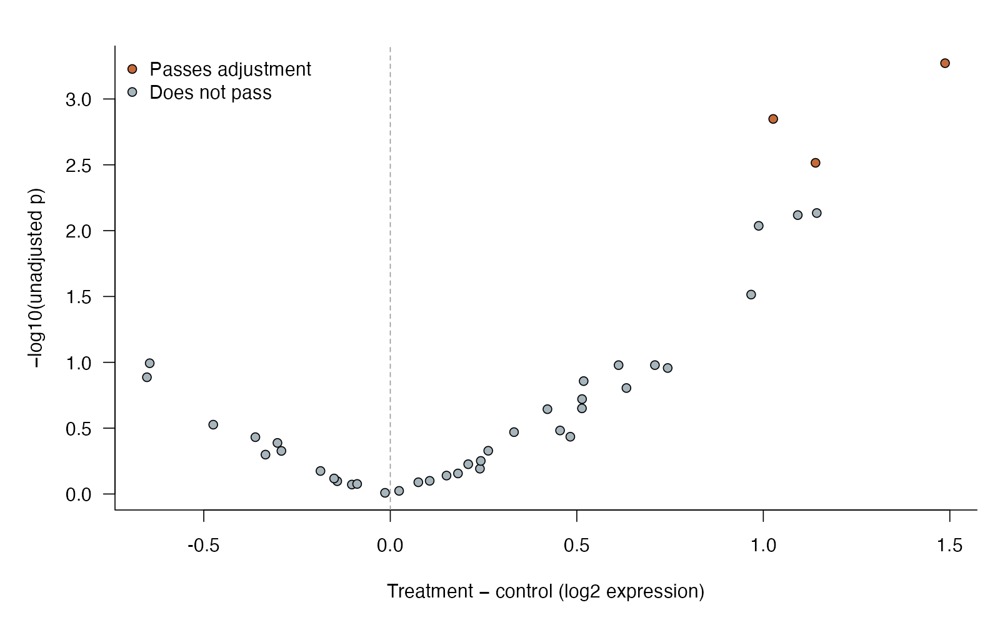

:::

::: {.column width="38%"}

**base R arguments**

**-log10(p_value)** — Makes smaller p-values appear higher

**bg=ifelse(...)** — Colors by the adjusted decision

**abline(v=0)** — Marks zero expression difference

:::

:::

::: notes

This figure is generated from the saved CSV by modules/fdr/analysis.R. BH controls the expected false-discovery proportion among selected genes under its assumptions; the fraction in one particular selected set can differ.

:::


## Benjamini–Hochberg FDR: plot code {#fdr-plot-code}

::: columns

::: {.column width="62%"}

```r
plot(difference, -log10(p_value), pch=21,
     bg=ifelse(adjusted<.05, "#C56B3B", "#A7B6BD"),
     xlab="Treatment − control (log2 expression)", ylab="−log10(unadjusted p)")
abline(v=0, lty=2, col="gray60")
legend("topleft", c("Passes adjustment", "Does not pass"),
       pch=21, pt.bg=c("#C56B3B", "#A7B6BD"), bty="n")
```


:::

::: {.column width="38%"}

**Arguments to change**

**-log10(p_value)** — Makes smaller p-values appear higher

**bg=ifelse(...)** — Colors by the adjusted decision

**abline(v=0)** — Marks zero expression difference

:::

:::

::: notes

This is an exact excerpt from analysis.R. Any preparation referenced by the excerpt appears in the complete companion script. The script opens a ragg PNG device before these lines and closes it afterward.

:::


## Benjamini–Hochberg FDR: question and null {#fdr-question}

::: columns

::: {.column width="62%"}

**Scientific question**

Which gene differences are supported while controlling the expected fraction of false discoveries among selected genes?

**Null / estimation target**

For each gene, the treatment and control population means are equal. The adjustment changes the error criterion, not those individual nulls.

:::

::: {.column width="38%"}

**Relevant options**

- p.adjust(p_value, method="BH")

- Define the family before viewing results

- At adjusted p < .05, target a 5% false-discovery rate

:::

:::

::: notes

Ask whether rejecting this null, or estimating this target, answers the biological question. BH controls the expected false-discovery proportion among selected genes under its assumptions; the fraction in one particular selected set can differ.

:::


## Benjamini–Hochberg FDR: assumptions {#fdr-assumptions}

::: columns

::: {.column width="62%"}

**What matters here**

- Each input p-value is valid for its own null.

- The family and error criterion match the scientific aim.

- BH needs independence or suitable positive dependence for its usual guarantee.

:::

::: {.column width="38%"}

**Parametric responses**

- Adjust valid p-values from the selected parametric tests.

**Nonparametric responses**

- The same adjustment can be applied to valid rank-test or permutation p-values.

:::

:::

::: notes

Begin with the design. A model change should address a specific issue and preserve the scientific target where possible. A rank or permutation alternative has its own assumptions and may change the null; do not choose it solely from a normality-test p-value.

:::


## Benjamini–Hochberg FDR: run and read {#fdr-analysis}

::: columns

::: {.column width="62%"}

```r
p_value <- difference <- numeric(40)
for (i in 1:40) {
  x <- d$expression[d$gene==i & d$treated==1]
  y <- d$expression[d$gene==i & d$treated==0]
  p_value[i] <- t.test(x,y)$p.value
  difference[i] <- mean(x)-mean(y)
}
adjusted <- p.adjust(p_value, method="BH")
result <- data.frame(gene=1:40, difference, p_value, adjusted)
```


:::

::: {.column width="38%"}

**Generated results**

- Unadjusted p<.05: 7 genes

- Adjusted p<.05: 3 genes

- One declared family of 40 gene comparisons

:::

:::

::: notes

Full executed model/test output:

```
   gene  difference      p_value   adjusted
1     1  0.74361874 0.1104543621 0.40165223
2     2  1.13993835 0.0030532767 0.04071036
3     3  0.63303366 0.1567432146 0.44783776
4     4  1.14326813 0.0073476739 0.06095345
5     5  0.96736406 0.0305870454 0.17478312
6     6  1.09236913 0.0076191816 0.06095345
7     7  1.48722039 0.0005346944 0.02138778
8     8  0.98760270 0.0091921923 0.06128128
9     9  0.51837432 0.1388609646 0.42726451
10   10 -0.14223887 0.7992511250 0.89242739
11   11  0.51406450 0.1902207102 0.50725523
12   12  0.70940140 0.1049898188 0.40165223
13   13 -0.30250964 0.4092528380 0.71174407
14   14  0.42126908 0.2268777905 0.53383010
15   15  0.61198019 0.1050522464 0.40165223
16   16  0.20888941 0.5939132343 0.84844748
17   17 -0.65242027 0.1298588176 0.42726451
18   18 -0.01411687 0.9796145857 0.97961459
19   19  0.24030316 0.6422998740 0.88593086
20   20 -0.64493323 0.1016113193 0.40165223
21   21  0.07513899 0.8145615887 0.89242739
22   22 -0.47464912 0.2974303246 0.66095628
23   23  0.02363298 0.9466910092 0.97096514
24   24  1.02654327 0.0014177568 0.02835514
25   25 -0.29191394 0.4709077705 0.75345243
26   26 -0.10301348 0.8478060177 0.89242739
27   27  0.18143797 0.6983414710 0.89242739
28   28 -0.18717039 0.6687974584 0.89172994
29   29  0.33171934 0.3389648607 0.67310147
30   30  0.15073943 0.7246670673 0.89242739
31   31  0.51380224 0.2236912675 0.53383010
32   32 -0.08888316 0.8389536027 0.89242739
33   33  0.26256464 0.4695329863 0.75345243
34   34 -0.15063432 0.7623551098 0.89242739
35   35 -0.36171374 0.3702058103 0.67310147
36   36  0.45507254 0.3293200199 0.67310147
37   37 -0.33460383 0.5022342610 0.77266809
38   38  0.24260469 0.5607670894 0.83076606
39   39  0.48258110 0.3672953546 0.67310147
40   40  0.10560952 0.7943725893 0.89242739
```


:::


## Benjamini–Hochberg FDR: interpret {#fdr-interpret}

Of 40 gene comparisons, 3 have BH-adjusted p-values below 0.05. Under its assumptions, this rule controls the expected false-discovery proportion among selected genes at 5%. Interpret the gene effect sizes alongside the adjusted evidence.

**Discuss:** Does a gene with a small adjusted p-value necessarily have a biologically large effect?

::: notes

Teaching point: BH controls the expected false-discovery proportion among selected genes under its assumptions; the fraction in one particular selected set can differ.

Instructor comparison with the simulated population: The first eight genes have true mean effects of 1.1 log2 units; the other 32 nulls are true.

The reported estimate and p-value are calculated from this realized dataset; they need not exactly match the known population effect.

:::


## Replication Crisis {#xkcd-3117}

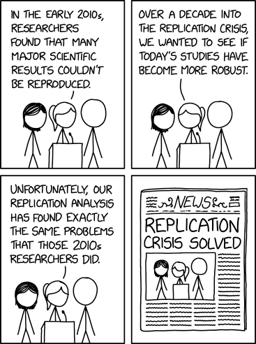{height=6in}

[Randall Munroe / xkcd · https://xkcd.com/3117](https://xkcd.com/3117/) · [CC BY-NC 2.5](https://creativecommons.org/licenses/by-nc/2.5/)

::: notes

Repeated simulated experiments let us check how an analysis behaves when the generating truth is known.

Comic: Replication Crisis. https://xkcd.com/3117/

Original course source: lectures__exp-1.pptx, slide 50. Artwork reproduced unchanged. Randall Munroe / xkcd; Creative Commons Attribution-NonCommercial 2.5.

Accessible description: Researchers mistake repeated evidence of replication problems for a solved replication crisis.

:::


## Monte Carlo test: the data {#monte_carlo}

::: columns

::: {.column width="62%"}

Test whether candidate sex-determination genes are unusually concentrated on the X chromosome.

- One binary chromosome class per gene

- Explicit null opportunity: 20%

- Test statistic: deviation in number on X

:::

::: {.column width="38%"}

**Other data like these**

- Mutations in genomic compartments

- Colonization among equal-access patches

- Offspring under a specified segregation model

:::

:::

::: notes

Monte Carlo null-model test

A teaching null assigns independent genes to X with probability equal to its opportunity share.

gene: Candidate gene (ID)

on_X: X chromosome=1, other=0 (indicator)

:::


## Monte Carlo test: simulate and save {#monte_carlo-simulate}

::: columns

::: {.column width="62%"}

```r
set.seed(240505)
d <- data.frame(gene=1:80, on_X=rbinom(80, 1, .32))
write.csv(d, file.path(out_dir, "data.csv"), row.names = FALSE)
```


:::

::: {.column width="38%"}

**First saved row**

```
gene: 1
on_X: 0
```


:::

:::

::: notes

Seed: 240505

Generating model: 80 independent Bernoulli indicators with true X probability 0.32. The tested null probability is 0.20; null simulation uses 9999 binomial draws.

Population truth: The true occupancy probability is 0.32, so the tested 0.20 null is false.

The script writes data.csv before reading it for analysis. output_dir or out_dir is the folder supplied to the standalone script.

Original saved-data preview:

```
 gene on_X
    1    0
    2    0
    3    1
    4    0
```


:::


## Monte Carlo test: see the data {#monte_carlo-plot}

::: columns

::: {.column width="62%"}

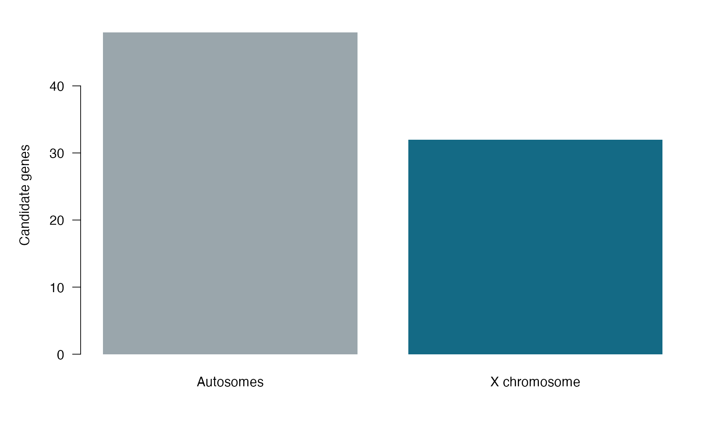

:::

::: {.column width="38%"}

**base R arguments**

**names.arg** — Names chromosome categories

**col** — Highlights X against autosomes

**border=NA** — Removes unnecessary bar outlines

:::

:::

::: notes

This figure is generated from the saved CSV by modules/monte_carlo/analysis.R. A simulation test is only as useful as its biological null model.

:::


## Monte Carlo test: plot code {#monte_carlo-plot-code}

::: columns

::: {.column width="62%"}

```r
barplot(c(sum(d$on_X==0),sum(d$on_X==1)), names.arg=c("Autosomes", "X chromosome"),
        col=c("#9AA6AC","#146A85"), border=NA, ylab="Candidate genes")
```


:::

::: {.column width="38%"}

**Arguments to change**

**names.arg** — Names chromosome categories

**col** — Highlights X against autosomes

**border=NA** — Removes unnecessary bar outlines

:::

:::

::: notes

This is an exact excerpt from analysis.R. Any preparation referenced by the excerpt appears in the complete companion script. The script opens a ragg PNG device before these lines and closes it afterward.

:::


## Monte Carlo test: question and null {#monte_carlo-question}

::: columns

::: {.column width="62%"}

**Scientific question**

Is chromosome occupancy inconsistent with the specified opportunity model?

**Null / estimation target**

Each independent candidate gene has probability 0.20 of being on X.

:::

::: {.column width="38%"}

**Relevant options**

- Specify the biological null model before simulation.

- Choose the statistic and one- or two-sided extremeness rule.

- Increase B for finer Monte Carlo precision.

:::

:::

::: notes

Ask whether rejecting this null, or estimating this target, answers the biological question. A simulation test is only as useful as its biological null model.

:::


## Monte Carlo test: assumptions {#monte_carlo-assumptions}

::: columns

::: {.column width="62%"}

**What matters here**

- The null opportunity model is biologically appropriate.

- The simulation captures dependence; this simple example assumes independent genes.

:::

::: {.column width="38%"}

**Parametric responses**

- For independent binary assignments, compare with an exact binomial test.

**Nonparametric responses**

- Randomize gene labels across eligible genomic positions when that matches the null.

:::

:::

::: notes

Begin with the design. A model change should address a specific issue and preserve the scientific target where possible. A rank or permutation alternative has its own assumptions and may change the null; do not choose it solely from a normality-test p-value.

:::


## Monte Carlo test: run and read {#monte_carlo-analysis}

::: columns

::: {.column width="62%"}

```r
observed <- sum(d$on_X)
p0 <- .20; n <- nrow(d); B <- 9999
null <- rbinom(B, size=n, prob=p0)
p_value <- (1+sum(abs(null-n*p0)>=abs(observed-n*p0)))/(B+1)
result <- data.frame(observed_X=observed, expected_X=n*p0, monte_carlo_p=p_value)
```


:::

::: {.column width="38%"}

**Generated results**

- Observed on X: 32 of 80

- Expected under null: 16.0

- Two-sided Monte Carlo p = 0.0002

:::

:::

::: notes

Full executed model/test output:

```
  observed_X expected_X monte_carlo_p
1         32         16         2e-04
```


:::


## Monte Carlo test: interpret {#monte_carlo-interpret}

32 of 80 genes were on X, compared with null expectation 16.0. The absolute count-deviation Monte Carlo test gives p = 0.0002. Here the null assigns each independent gene probability 0.20 of being on X.

**Discuss:** How would linked genes change the null simulation?

::: notes

Teaching point: A simulation test is only as useful as its biological null model.

Instructor comparison with the simulated population: The true occupancy probability is 0.32, so the tested 0.20 null is false.

The reported estimate and p-value are calculated from this realized dataset; they need not exactly match the known population effect.

:::


## Bootstrap interval: the data {#bootstrap}

::: columns

::: {.column width="62%"}

Estimate average biomass from independent bacterial colonies with a right-skewed distribution.

- Positive continuous measurements

- Independent sampling units

- Mean is the scientific target

:::

::: {.column width="38%"}

**Other data like these**

- Fruit mass

- Enzyme activity

- Parasite biomass

:::

:::

::: notes

Bootstrap confidence interval

One biomass measurement per independent colony.

colony: Independent colony (ID)

biomass_mg: Measured biomass (mg)

:::


## Bootstrap interval: simulate and save {#bootstrap-simulate}

::: columns

::: {.column width="62%"}

```r
set.seed(240507)
d <- data.frame(colony=1:40, biomass_mg=rlnorm(40, log(12), .45))
write.csv(d, file.path(out_dir, "data.csv"), row.names = FALSE)
```


:::

::: {.column width="38%"}

**First saved row**

```
colony: 1
biomass_mg: 5.622
```


:::

:::

::: notes

Seed: 240507

Generating model: 40 independent Lognormal(meanlog=log(12), sdlog=0.45) colony biomasses. The generating arithmetic mean is exp(log(12)+0.45^2/2), approximately 13.28 mg.

Population truth: The population arithmetic mean is approximately 13.28 mg; the interval may or may not cover it in one sample.

The script writes data.csv before reading it for analysis. output_dir or out_dir is the folder supplied to the standalone script.

Original saved-data preview:

```
 colony biomass_mg
      1   5.622015
      2  12.481955
      3  11.103281
      4  10.549377
```


:::


## Bootstrap interval: see the data {#bootstrap-plot}

::: columns

::: {.column width="62%"}

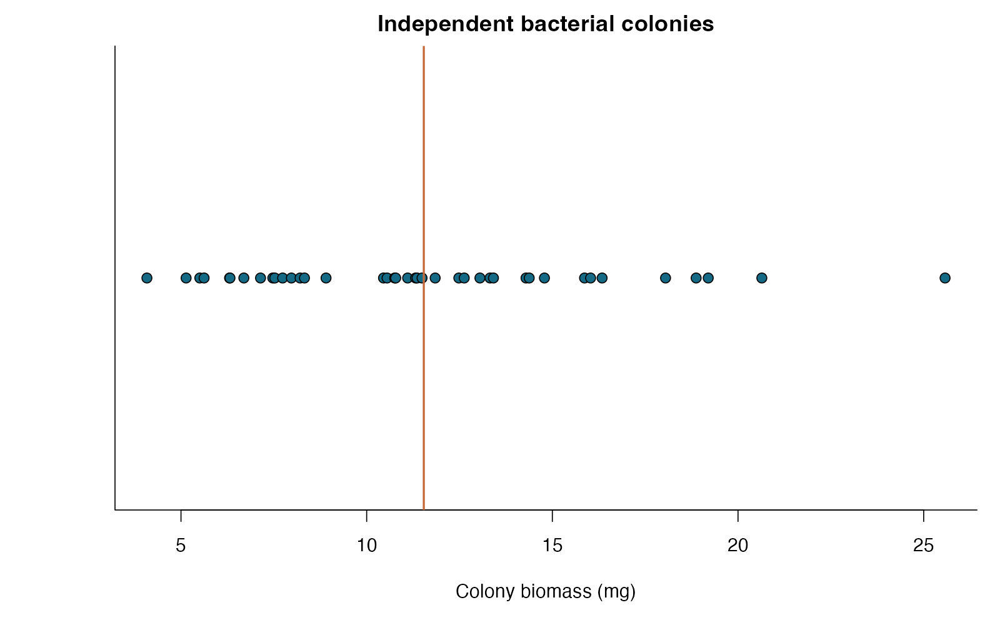

:::

::: {.column width="38%"}

**base R arguments**

**method="stack"** — Stacks nearby observations without hiding them

**pch=21 / bg** — Outlined filled symbols

**abline(v=mean(...))** — Marks the arithmetic mean

:::

:::

::: notes

This figure is generated from the saved CSV by modules/bootstrap/analysis.R. Resampling changes the computational procedure, not what counts as an independent replicate.

:::


## Bootstrap interval: plot code {#bootstrap-plot-code}

::: columns

::: {.column width="62%"}

```r
stripchart(d$biomass_mg, method="stack", pch=21, bg="#146A85",
           xlab="Colony biomass (mg)", main="Independent bacterial colonies")
abline(v=mean(d$biomass_mg), col="#C56B3B", lwd=2)
```


:::

::: {.column width="38%"}

**Arguments to change**

**method="stack"** — Stacks nearby observations without hiding them

**pch=21 / bg** — Outlined filled symbols

**abline(v=mean(...))** — Marks the arithmetic mean

:::

:::

::: notes

This is an exact excerpt from analysis.R. Any preparation referenced by the excerpt appears in the complete companion script. The script opens a ragg PNG device before these lines and closes it afterward.

:::


## Bootstrap interval: question and null {#bootstrap-question}

::: columns

::: {.column width="62%"}

**Scientific question**

How uncertain is the estimated mean biomass?

**Null / estimation target**

No null is required for this confidence interval; the target is the population mean.

:::

::: {.column width="38%"}

**Relevant options**

- Resample entire independent units with replacement.

- Choose statistic, B and interval method explicitly.

- Percentile is illustrated; it is not universally the best bootstrap interval.

:::

:::

::: notes

Ask whether rejecting this null, or estimating this target, answers the biological question. Resampling changes the computational procedure, not what counts as an independent replicate.

:::


## Bootstrap interval: assumptions {#bootstrap-assumptions}

::: columns

::: {.column width="62%"}

**What matters here**

- The sample represents the population of interest.

- Rows are independent units; cluster resampling is needed for clustered data.

- Small or unrepresentative samples limit bootstrap performance.

:::

::: {.column width="38%"}

**Parametric responses**

- Use a suitable response model or a t interval when appropriate.

**Nonparametric responses**

- Resample independent colonies; resample clusters or pairs intact when needed.

:::

:::

::: notes

Begin with the design. A model change should address a specific issue and preserve the scientific target where possible. A rank or permutation alternative has its own assumptions and may change the null; do not choose it solely from a normality-test p-value.

:::


## Bootstrap interval: run and read {#bootstrap-analysis}

::: columns

::: {.column width="62%"}

```r
B <- 4999
boot_mean <- numeric(B)
for (i in 1:B) boot_mean[i] <- mean(sample(d$biomass_mg, replace=TRUE))
ci <- quantile(boot_mean, c(.025,.975))
result <- data.frame(mean=mean(d$biomass_mg), lower=ci[1], upper=ci[2])
```


:::

::: {.column width="38%"}

**Generated results**

- Sample mean = 11.54 mg

- Percentile 95% CI = 10.15 to 13.07 mg

- 4999 resamples of independent colonies

:::

:::

::: notes

Full executed model/test output:

```
         mean    lower    upper
2.5% 11.53829 10.14616 13.06527
```


:::


## Bootstrap interval: interpret {#bootstrap-interpret}

Mean colony biomass is 11.54 mg, with a percentile bootstrap 95% interval of 10.15 to 13.07 mg. The interval estimates uncertainty in the mean, not the spread of individual colonies.

**Discuss:** Would resampling individual cells be appropriate if biomass was measured on whole colonies?

::: notes

Teaching point: Resampling changes the computational procedure, not what counts as an independent replicate.

Instructor comparison with the simulated population: The population arithmetic mean is approximately 13.28 mg; the interval may or may not cover it in one sample.

The reported estimate and p-value are calculated from this realized dataset; they need not exactly match the known population effect.

:::


## Sampling and CI coverage: the data {#sampling_coverage}

::: columns

::: {.column width="62%"}

Independent cell cultures differ in the waiting time to a developmental transition.

- Positive, right-skewed waiting times

- 25 independent observations per experiment

- Simulation replicates are repeated experiments

:::

::: {.column width="38%"}

**Other data like these**

- Waiting time to colonization

- Cell-cycle transition timing

- Latency to a behavior

:::

:::

::: notes

Sampling variation and CI coverage

Repeat a 25-cell sampling experiment 1000 times from a known population.

experiment: Repeated simulated sample (ID)

waiting_days: Time to transition (days)

:::


## Sampling and CI coverage: simulate and save {#sampling_coverage-simulate}

::: columns

::: {.column width="62%"}

```r
set.seed(240506)
d <- data.frame(experiment=rep(1:1000, each=25),
                waiting_days=rexp(25000, rate=.2))
write.csv(d, file.path(out_dir, "data.csv"), row.names = FALSE)
```


:::

::: {.column width="38%"}

**First saved row**

```
experiment: 1
waiting_days: 8.527
```


:::

:::

::: notes

Seed: 240506

Generating model: 1000 samples of 25 independent Exponential(rate=0.2/day) observations. Every sample uses a conventional two-sided 95% t interval for its mean.

Population truth: The population mean is exactly 5 days; nominal 95% coverage is a procedure property to evaluate, not an imposed simulation result.

The script writes data.csv before reading it for analysis. output_dir or out_dir is the folder supplied to the standalone script.

Original saved-data preview:

```
 experiment waiting_days
          1     8.526990
          1     3.750089
          1     6.877382
          1     8.813151
```


:::


## Sampling and CI coverage: see the data {#sampling_coverage-plot}

::: columns

::: {.column width="62%"}

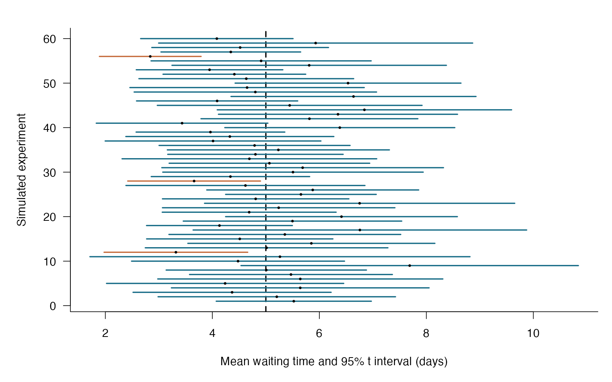

:::

::: {.column width="38%"}

**base R arguments**

**segments** — Draws each confidence interval

**abline(v=5)** — Marks the known population mean

**ifelse(covered,...)** — Colors intervals by whether they contain the truth

:::

:::

::: notes

This figure is generated from the saved CSV by modules/sampling_coverage/analysis.R. Larger B stabilizes the estimated coverage; larger n changes the experiment.

:::


## Sampling and CI coverage: plot code {#sampling_coverage-plot-code}

::: columns

::: {.column width="62%"}

```r
plot(NA, xlim=range(c(low[1:60], high[1:60])), ylim=c(1,60),
     xlab="Mean waiting time and 95% t interval (days)", ylab="Simulated experiment")
abline(v=5, lty=2, lwd=2)
segments(low[1:60], 1:60, high[1:60], 1:60,
         col=ifelse(covered[1:60], "#146A85", "#C56B3B"), lwd=2)
points(estimate[1:60], 1:60, pch=16, cex=.5)
```


:::

::: {.column width="38%"}

**Arguments to change**

**segments** — Draws each confidence interval

**abline(v=5)** — Marks the known population mean

**ifelse(covered,...)** — Colors intervals by whether they contain the truth

:::

:::

::: notes

This is an exact excerpt from analysis.R. Any preparation referenced by the excerpt appears in the complete companion script. The script opens a ragg PNG device before these lines and closes it afterward.

:::


## Sampling and CI coverage: question and null {#sampling_coverage-question}

::: columns

::: {.column width="62%"}

**Scientific question**

How often does a stated interval procedure cover the true population mean?

**Null / estimation target**

This is a performance simulation, not a single hypothesis test. The known population mean is 5 days.

:::

::: {.column width="38%"}

**Relevant options**

- Choose sample size n independently of simulation count B.

- Evaluate the same interval procedure in every experiment.

- Check coverage against the fixed generating parameter.

:::

:::

::: notes

Ask whether rejecting this null, or estimating this target, answers the biological question. Larger B stabilizes the estimated coverage; larger n changes the experiment.

:::


## Sampling and CI coverage: assumptions {#sampling_coverage-assumptions}

::: columns

::: {.column width="62%"}

**What matters here**

- The simulated population reflects the scenario of interest.

- Results describe this population, design and sample size.

:::

::: {.column width="38%"}

**Parametric responses**

- Change n or the population distribution to examine the t interval.

**Nonparametric responses**

- Compare a bootstrap interval by repeating the entire sampling experiment.

:::

:::

::: notes

Begin with the design. A model change should address a specific issue and preserve the scientific target where possible. A rank or permutation alternative has its own assumptions and may change the null; do not choose it solely from a normality-test p-value.

:::


## Sampling and CI coverage: run and read {#sampling_coverage-analysis}

::: columns

::: {.column width="62%"}

```r
low <- high <- estimate <- numeric(1000)
for (i in 1:1000) {
  x <- d$waiting_days[d$experiment==i]
  estimate[i] <- mean(x)
  margin <- qt(.975, length(x)-1)*sd(x)/sqrt(length(x))
  low[i] <- mean(x)-margin; high[i] <- mean(x)+margin
}
covered <- low<=5 & high>=5
result <- data.frame(experiment=1:1000, estimate, low, high, covered)
```


:::

::: {.column width="38%"}

**Generated results**

- Mean estimated waiting time: 5.03 days

- Observed 95% t-interval coverage: 92.6%

- True population mean: 5 days

:::

:::

::: notes

Full executed model/test output:

```
     experiment estimate      low      high covered
1             1 5.522029 4.072284  6.971773    TRUE
2             2 5.204283 2.985148  7.423418    TRUE
3             3 4.368782 2.517560  6.220003    TRUE
4             4 5.642785 3.234415  8.051154    TRUE
5             5 4.238518 2.021749  6.455288    TRUE
6             6 5.643793 2.979302  8.308284    TRUE
7             7 5.469335 3.573552  7.365119    TRUE
8             8 5.008316 3.136312  6.880320    TRUE
9             9 7.688537 4.535211 10.841862    TRUE
10           10 4.479982 2.489549  6.470416    TRUE
11           11 5.263651 1.711425  8.815877    TRUE
12           12 3.318445 1.975755  4.661135   FALSE
13           13 5.013864 2.746185  7.281543    TRUE
14           14 5.850578 3.541759  8.159396    TRUE
15           15 4.512140 2.771186  6.253094    TRUE
16           16 5.354784 3.188556  7.521012    TRUE
17           17 6.757512 3.640167  9.874857    TRUE
18           18 4.132858 2.769656  5.496059    TRUE
19           19 5.497705 3.455908  7.539502    TRUE
20           20 6.413697 4.247548  8.579845    TRUE
21           21 4.688334 3.063164  6.313503    TRUE
22           22 5.239921 3.067297  7.412546    TRUE
23           23 6.752626 3.853531  9.651721    TRUE
24           24 4.809608 3.067157  6.552059    TRUE
25           25 5.655483 4.247544  7.063422    TRUE
26           26 5.876048 3.895268  7.856828    TRUE
27           27 4.618555 2.384767  6.852343    TRUE
28           28 3.658729 2.417663  4.899794   FALSE
29           29 4.338001 2.857263  5.818739    TRUE
30           30 5.506953 3.072848  7.941058    TRUE
31           31 5.687501 3.054839  8.320163    TRUE
32           32 5.066542 3.191820  6.941265    TRUE
33           33 4.692163 2.311953  7.072373    TRUE
34           34 4.805327 3.165974  6.444680    TRUE
35           35 5.233745 3.158254  7.309237    TRUE
36           36 4.789032 3.003878  6.574186    TRUE
37           37 4.012812 1.996415  6.029208    TRUE
38           38 4.326758 2.382734  6.270782    TRUE
39           39 3.964481 2.574601  5.354360    TRUE
40           40 6.382165 4.232534  8.531796    TRUE
41           41 3.434084 1.829988  5.038180    TRUE
42           42 5.814381 3.787407  7.841355    TRUE
43           43 6.348211 4.113734  8.582688    TRUE
44           44 6.842268 4.091238  9.593298    TRUE
45           45 5.445202 2.970798  7.919606    TRUE
46           46 4.089058 2.582495  5.595621    TRUE
47           47 6.638345 4.348471  8.928219    TRUE
48           48 4.803594 2.537863  7.069326    TRUE
49           49 4.649075 2.458765  6.839386    TRUE
50           50 6.536089 4.425454  8.646724    TRUE
51           51 4.634365 2.627069  6.641661    TRUE
52           52 4.411398 3.077791  5.745006    TRUE
53           53 3.947442 2.577601  5.317284    TRUE
54           54 5.809957 3.245246  8.374669    TRUE
55           55 4.911161 2.853966  6.968356    TRUE
56           56 2.839206 1.888804  3.789608   FALSE
57           57 4.344700 3.039214  5.650185    TRUE
58           58 4.519626 2.867844  6.171408    TRUE
59           59 5.930605 2.995504  8.865706    TRUE
60           60 4.083792 2.659315  5.508269    TRUE
61           61 4.400565 2.899233  5.901897    TRUE
62           62 4.608569 3.206468  6.010671    TRUE
63           63 6.122087 3.529017  8.715158    TRUE
64           64 4.017382 2.632192  5.402571    TRUE
65           65 3.818379 2.364116  5.272641    TRUE
66           66 3.765858 2.317919  5.213796    TRUE
67           67 4.754093 2.844543  6.663642    TRUE
68           68 6.341148 3.941493  8.740803    TRUE
69           69 4.799054 2.697553  6.900555    TRUE
70           70 3.796780 2.443970  5.149590    TRUE
71           71 4.136329 2.731771  5.540887    TRUE
72           72 4.030844 2.327800  5.733889    TRUE
73           73 6.796037 4.119067  9.473006    TRUE
74           74 5.556472 2.973111  8.139833    TRUE
75           75 6.207926 3.910795  8.505058    TRUE
76           76 4.107061 2.152500  6.061622    TRUE
77           77 4.753323 3.124626  6.382020    TRUE
78           78 2.794476 1.369826  4.219126   FALSE
79           79 4.566371 2.837708  6.295035    TRUE
80           80 5.894649 3.659524  8.129775    TRUE
81           81 4.690335 2.896712  6.483958    TRUE
82           82 4.491655 2.640704  6.342605    TRUE
83           83 5.663687 3.229420  8.097953    TRUE
84           84 4.115975 2.707549  5.524400    TRUE
85           85 5.732207 3.571358  7.893057    TRUE
86           86 4.876916 2.965229  6.788603    TRUE
87           87 5.618509 4.067509  7.169509    TRUE
88           88 4.811652 3.344971  6.278334    TRUE
89           89 3.998192 2.273287  5.723097    TRUE
90           90 4.719024 2.958358  6.479690    TRUE
91           91 3.695699 2.389634  5.001764    TRUE
92           92 5.504377 3.267597  7.741157    TRUE
93           93 4.458405 2.330069  6.586741    TRUE
94           94 3.596332 2.582829  4.609835   FALSE
95           95 3.905252 2.464322  5.346181    TRUE
96           96 4.234980 2.561521  5.908438    TRUE
97           97 5.397633 3.101522  7.693744    TRUE
98           98 3.804190 2.235648  5.372732    TRUE
99           99 4.555470 2.447108  6.663832    TRUE
100         100 3.965643 1.957545  5.973742    TRUE
101         101 3.936298 2.425014  5.447583    TRUE
102         102 4.434617 2.475259  6.393976    TRUE
103         103 5.100318 3.290936  6.909700    TRUE
104         104 4.067811 2.542494  5.593129    TRUE
105         105 3.317712 1.908598  4.726826   FALSE
106         106 6.516611 4.021650  9.011571    TRUE
107         107 4.493778 3.003852  5.983703    TRUE
108         108 3.950111 2.552436  5.347785    TRUE
109         109 5.101214 3.126121  7.076308    TRUE
110         110 5.391561 3.582766  7.200356    TRUE
111         111 5.672264 2.436146  8.908382    TRUE
112         112 5.308363 3.405103  7.211624    TRUE
113         113 4.648292 3.070992  6.225592    TRUE
114         114 4.833650 2.986126  6.681173    TRUE
115         115 6.413949 3.788569  9.039328    TRUE
116         116 3.755544 2.547431  4.963657   FALSE
117         117 5.953093 4.095236  7.810951    TRUE
118         118 5.423245 2.814981  8.031510    TRUE
119         119 8.026679 5.101515 10.951842   FALSE
120         120 4.622307 2.434032  6.810582    TRUE
121         121 4.080753 2.700272  5.461233    TRUE
122         122 4.235137 2.645343  5.824930    TRUE
123         123 5.288931 2.278319  8.299543    TRUE
124         124 5.873955 3.016026  8.731884    TRUE
125         125 5.171276 3.380162  6.962391    TRUE
126         126 3.250377 1.489852  5.010902    TRUE
127         127 4.191097 2.668626  5.713568    TRUE
128         128 6.754089 3.601342  9.906836    TRUE
129         129 4.793879 3.097612  6.490145    TRUE
130         130 6.746923 3.533661  9.960186    TRUE
131         131 6.187196 3.894694  8.479698    TRUE
132         132 4.224100 2.524231  5.923970    TRUE
133         133 3.434999 2.221782  4.648216   FALSE
134         134 6.834802 4.139378  9.530226    TRUE
135         135 4.191357 2.319007  6.063707    TRUE
136         136 3.151103 2.060237  4.241968   FALSE
137         137 5.026459 3.169689  6.883229    TRUE
138         138 3.577657 2.528884  4.626430   FALSE
139         139 3.687805 1.994784  5.380827    TRUE
140         140 5.351641 3.422936  7.280347    TRUE
141         141 3.879084 2.304154  5.454013    TRUE
142         142 5.286025 3.516029  7.056022    TRUE
143         143 4.693587 3.300891  6.086283    TRUE
144         144 5.109116 2.401925  7.816308    TRUE
145         145 5.089690 3.333748  6.845632    TRUE
146         146 5.430569 3.870811  6.990327    TRUE
147         147 6.782960 4.339468  9.226452    TRUE
148         148 5.823611 3.331024  8.316199    TRUE
149         149 4.366575 2.390465  6.342684    TRUE
150         150 4.184145 2.110662  6.257627    TRUE
151         151 7.730201 4.354545 11.105856    TRUE
152         152 6.140021 3.348536  8.931505    TRUE
153         153 4.117216 2.409964  5.824468    TRUE
154         154 4.398973 1.430581  7.367365    TRUE
155         155 4.508656 2.892396  6.124916    TRUE
156         156 4.142960 2.664366  5.621555    TRUE
157         157 5.245062 3.098888  7.391237    TRUE
158         158 5.040628 3.008546  7.072711    TRUE
159         159 4.218798 2.480088  5.957507    TRUE
160         160 5.347144 3.433166  7.261123    TRUE
161         161 6.686552 3.977025  9.396078    TRUE
162         162 4.142875 3.147446  5.138305    TRUE
163         163 3.269228 1.170891  5.367566    TRUE
164         164 4.955636 2.996825  6.914446    TRUE
165         165 4.556690 2.991951  6.121429    TRUE
166         166 5.400123 2.910192  7.890054    TRUE
167         167 4.277913 2.393319  6.162508    TRUE
168         168 3.254105 2.029229  4.478981   FALSE
169         169 4.566055 3.025270  6.106840    TRUE
170         170 5.348849 3.080346  7.617352    TRUE
171         171 2.395981 1.556685  3.235278   FALSE
172         172 4.640689 2.748807  6.532571    TRUE
173         173 3.508499 2.009903  5.007095    TRUE
174         174 5.225143 2.841299  7.608988    TRUE
175         175 4.983477 2.784035  7.182919    TRUE
176         176 3.795989 1.917545  5.674432    TRUE
177         177 5.690686 3.581406  7.799967    TRUE
178         178 4.848927 2.914100  6.783754    TRUE
179         179 5.374085 2.260090  8.488080    TRUE
180         180 6.475772 3.811408  9.140136    TRUE
181         181 4.741831 2.402756  7.080906    TRUE
182         182 5.321358 3.240530  7.402186    TRUE
183         183 5.191675 1.921541  8.461809    TRUE
184         184 4.658280 2.766932  6.549628    TRUE
185         185 5.753889 4.188246  7.319532    TRUE
186         186 6.257938 3.073481  9.442395    TRUE
187         187 5.566719 3.929474  7.203964    TRUE
188         188 2.465539 1.547398  3.383681   FALSE
189         189 4.206448 2.561935  5.850961    TRUE
190         190 3.479337 1.933332  5.025342    TRUE
191         191 3.463501 2.085828  4.841174   FALSE
192         192 3.727588 2.093795  5.361380    TRUE
193         193 6.847350 3.846342  9.848358    TRUE
194         194 5.713059 3.598224  7.827895    TRUE
195         195 3.507900 2.070407  4.945393   FALSE
196         196 6.905772 3.535558 10.275986    TRUE
197         197 7.418474 4.791591 10.045357    TRUE
198         198 5.314492 3.311919  7.317065    TRUE
199         199 5.561324 3.223291  7.899358    TRUE
200         200 5.457266 3.586288  7.328244    TRUE
201         201 5.989511 3.791370  8.187652    TRUE
202         202 3.913985 2.508346  5.319624    TRUE
203         203 5.290439 3.427504  7.153373    TRUE
204         204 4.686989 2.752241  6.621737    TRUE
205         205 4.463568 2.682710  6.244426    TRUE
206         206 5.165704 3.407387  6.924021    TRUE
207         207 5.076360 2.702550  7.450170    TRUE
208         208 6.213807 2.760825  9.666789    TRUE
209         209 4.867417 3.309513  6.425321    TRUE
210         210 3.577422 1.434624  5.720220    TRUE
211         211 5.894050 3.514567  8.273532    TRUE
212         212 4.338063 2.560657  6.115469    TRUE
213         213 6.143999 3.323829  8.964169    TRUE
214         214 5.598588 3.768305  7.428870    TRUE
215         215 6.272771 3.983205  8.562336    TRUE
216         216 7.138216 4.579673  9.696759    TRUE
217         217 6.026648 4.078599  7.974697    TRUE
218         218 3.850279 2.341270  5.359289    TRUE
219         219 4.487893 2.978306  5.997479    TRUE
220         220 5.245262 3.003950  7.486574    TRUE
221         221 4.822648 2.948739  6.696558    TRUE
222         222 8.021933 4.637147 11.406719    TRUE
223         223 5.935316 3.847466  8.023167    TRUE
224         224 4.980738 2.542093  7.419382    TRUE
225         225 4.281605 2.961476  5.601734    TRUE
226         226 5.418768 2.691508  8.146029    TRUE
227         227 4.427298 2.528119  6.326477    TRUE
228         228 6.569612 4.002026  9.137198    TRUE
229         229 5.126956 3.152984  7.100928    TRUE
230         230 3.853325 2.401367  5.305283    TRUE
231         231 4.502664 2.540948  6.464380    TRUE
232         232 3.975073 2.580084  5.370062    TRUE
233         233 3.434649 2.342173  4.527125   FALSE
234         234 5.400147 2.760415  8.039879    TRUE
235         235 4.140376 2.134298  6.146454    TRUE
236         236 5.589214 4.041403  7.137025    TRUE
237         237 3.532313 2.393871  4.670754   FALSE
238         238 4.704814 2.780582  6.629047    TRUE
239         239 6.548639 3.403325  9.693952    TRUE
240         240 6.697136 4.277313  9.116959    TRUE
241         241 6.611054 3.033616 10.188492    TRUE
242         242 3.994481 2.210885  5.778078    TRUE
243         243 4.509383 3.090736  5.928030    TRUE
244         244 5.026530 3.017718  7.035342    TRUE
245         245 4.815224 3.105586  6.524861    TRUE
246         246 5.571338 2.475466  8.667209    TRUE
247         247 3.350048 2.078539  4.621557   FALSE
248         248 4.217988 2.648283  5.787692    TRUE
249         249 4.310275 2.014899  6.605652    TRUE
250         250 4.440112 2.616232  6.263992    TRUE
251         251 3.553821 2.381495  4.726146   FALSE
252         252 5.472761 3.405546  7.539975    TRUE
253         253 4.248571 2.281546  6.215597    TRUE
254         254 5.081565 3.002994  7.160135    TRUE
255         255 7.247705 3.855316 10.640094    TRUE
256         256 6.569047 4.377447  8.760647    TRUE
257         257 7.361497 5.158275  9.564720   FALSE
258         258 4.632382 2.402952  6.861812    TRUE
259         259 4.290517 2.594137  5.986896    TRUE
260         260 6.130597 3.595685  8.665509    TRUE
261         261 6.192151 4.400440  7.983862    TRUE
262         262 3.833823 2.241736  5.425911    TRUE
263         263 5.779415 3.498400  8.060429    TRUE
264         264 4.294562 2.340403  6.248721    TRUE
265         265 5.183574 1.892786  8.474362    TRUE
266         266 4.889187 2.752254  7.026119    TRUE
267         267 5.756816 2.918858  8.594774    TRUE
268         268 6.884198 4.169422  9.598975    TRUE
269         269 4.989537 2.320946  7.658129    TRUE
270         270 5.013138 2.522201  7.504074    TRUE
271         271 6.021809 3.395412  8.648207    TRUE
272         272 5.107057 2.865401  7.348712    TRUE
273         273 4.792391 3.209370  6.375412    TRUE
274         274 4.249709 2.221006  6.278412    TRUE
275         275 5.170267 3.380168  6.960365    TRUE
276         276 5.768764 3.080663  8.456865    TRUE
277         277 6.234953 3.083420  9.386486    TRUE
278         278 5.028424 2.781633  7.275215    TRUE
279         279 5.616455 3.487074  7.745837    TRUE
280         280 6.236102 3.960979  8.511224    TRUE
281         281 4.983969 2.177201  7.790738    TRUE
282         282 4.940238 2.891489  6.988987    TRUE
283         283 5.390487 3.274993  7.505981    TRUE
284         284 3.381895 2.098824  4.664966   FALSE
285         285 5.791524 2.618764  8.964283    TRUE
286         286 4.716518 3.311282  6.121754    TRUE
287         287 4.849553 2.268082  7.431024    TRUE
288         288 6.041211 3.583686  8.498735    TRUE
289         289 5.229720 3.264473  7.194968    TRUE
290         290 7.439641 4.404122 10.475160    TRUE
291         291 6.378421 3.828685  8.928157    TRUE
292         292 4.015060 2.681271  5.348850    TRUE
293         293 4.837685 2.984054  6.691316    TRUE
294         294 4.038949 2.735889  5.342009    TRUE
295         295 5.393227 2.732074  8.054380    TRUE
296         296 3.603210 1.905268  5.301151    TRUE
297         297 4.987438 2.865588  7.109287    TRUE
298         298 3.485912 2.313194  4.658630   FALSE
299         299 5.140612 2.954029  7.327194    TRUE
300         300 3.477965 2.236296  4.719633   FALSE
301         301 4.838179 2.666346  7.010013    TRUE
302         302 4.378519 2.904589  5.852448    TRUE
303         303 6.498538 4.652734  8.344341    TRUE
304         304 7.888626 4.962471 10.814781    TRUE
305         305 5.866072 2.703398  9.028746    TRUE
306         306 4.548210 2.879283  6.217138    TRUE
307         307 5.812011 3.232438  8.391584    TRUE
308         308 4.729734 1.924979  7.534489    TRUE
309         309 4.724547 3.012132  6.436962    TRUE
310         310 5.509638 3.535638  7.483638    TRUE
311         311 4.860572 3.116204  6.604940    TRUE
312         312 6.229047 3.491158  8.966936    TRUE
313         313 7.803910 4.373291 11.234530    TRUE
314         314 4.172664 2.392126  5.953202    TRUE
315         315 5.385459 2.042203  8.728715    TRUE
316         316 7.443384 5.117284  9.769484   FALSE
317         317 3.497343 2.049574  4.945112   FALSE
318         318 4.548129 2.747034  6.349224    TRUE
319         319 3.575881 2.061335  5.090426    TRUE
320         320 4.249734 2.824205  5.675263    TRUE
321         321 5.766841 2.901673  8.632008    TRUE
322         322 4.483690 2.292183  6.675196    TRUE
323         323 3.693372 2.348145  5.038599    TRUE
324         324 5.790088 3.547823  8.032353    TRUE
325         325 4.373371 2.672825  6.073916    TRUE
326         326 5.636814 3.126611  8.147018    TRUE
327         327 5.688598 3.445629  7.931566    TRUE
328         328 5.319054 3.285915  7.352192    TRUE
329         329 5.880438 3.824059  7.936816    TRUE
330         330 6.465134 4.247065  8.683202    TRUE
331         331 4.969131 3.396605  6.541658    TRUE
332         332 4.901981 2.672084  7.131878    TRUE
333         333 6.226111 3.711165  8.741058    TRUE
334         334 5.408684 3.786308  7.031060    TRUE
335         335 5.770414 3.100292  8.440535    TRUE
336         336 5.913838 3.614729  8.212947    TRUE
337         337 6.188054 3.866605  8.509502    TRUE
338         338 6.786741 3.736639  9.836843    TRUE
339         339 4.129207 2.361370  5.897044    TRUE
340         340 3.032454 1.717065  4.347843   FALSE
341         341 6.702018 4.001909  9.402128    TRUE
342         342 3.289385 2.287299  4.291471   FALSE
343         343 5.397701 3.036290  7.759112    TRUE
344         344 4.690581 3.338412  6.042750    TRUE
345         345 4.252300 2.408449  6.096151    TRUE
346         346 5.537847 3.517280  7.558414    TRUE
347         347 3.990287 2.845479  5.135095    TRUE
348         348 4.802474 3.107818  6.497130    TRUE
349         349 6.350321 3.977693  8.722949    TRUE
350         350 6.287531 4.145984  8.429079    TRUE
351         351 4.684363 3.022354  6.346373    TRUE
352         352 5.005328 2.055718  7.954937    TRUE
353         353 3.922937 2.744968  5.100905    TRUE
354         354 4.216767 2.555903  5.877632    TRUE
355         355 4.126480 2.520638  5.732323    TRUE
356         356 5.396866 2.614256  8.179475    TRUE
357         357 4.115359 2.418793  5.811926    TRUE
358         358 5.467963 2.648544  8.287381    TRUE
359         359 5.545995 3.918816  7.173173    TRUE
360         360 6.629963 4.361714  8.898212    TRUE
361         361 7.464774 5.190105  9.739443   FALSE
362         362 3.893538 2.313191  5.473885    TRUE
363         363 5.586150 3.581217  7.591083    TRUE
364         364 4.350802 2.798264  5.903340    TRUE
365         365 5.533744 3.580420  7.487067    TRUE
366         366 6.533713 4.433862  8.633563    TRUE
367         367 4.034656 2.408537  5.660776    TRUE
368         368 5.677861 3.199031  8.156691    TRUE
369         369 3.745753 2.345502  5.146004    TRUE
370         370 3.867365 2.604430  5.130300    TRUE
371         371 5.009786 2.314848  7.704724    TRUE
372         372 4.201901 2.228387  6.175415    TRUE
373         373 3.932006 2.575756  5.288256    TRUE
374         374 3.104887 1.706235  4.503538   FALSE
375         375 4.994901 2.689743  7.300058    TRUE
376         376 5.675704 3.555901  7.795507    TRUE
377         377 4.893366 2.777931  7.008801    TRUE
378         378 5.703625 2.303286  9.103965    TRUE
379         379 5.642371 3.428647  7.856096    TRUE
380         380 7.575066 5.039821 10.110312   FALSE
381         381 3.417589 2.028577  4.806602   FALSE
382         382 5.147397 3.561781  6.733013    TRUE
383         383 4.267169 2.690513  5.843826    TRUE
384         384 5.132687 2.856936  7.408438    TRUE
385         385 5.545660 3.562714  7.528607    TRUE
386         386 3.425808 2.099023  4.752593   FALSE
387         387 5.174324 3.301461  7.047187    TRUE
388         388 5.020330 3.321982  6.718679    TRUE
389         389 4.562946 2.850898  6.274993    TRUE
390         390 3.781244 2.000282  5.562206    TRUE
391         391 3.662179 2.277420  5.046939    TRUE
392         392 5.832291 4.107676  7.556906    TRUE
393         393 5.176855 3.283717  7.069992    TRUE
394         394 7.517398 4.950500 10.084297    TRUE
395         395 5.804012 2.897819  8.710204    TRUE
396         396 3.914535 2.172928  5.656142    TRUE
397         397 5.414024 3.584665  7.243382    TRUE
398         398 3.202148 2.113354  4.290942   FALSE
399         399 4.430965 2.894375  5.967554    TRUE
400         400 3.133685 1.751089  4.516282   FALSE
401         401 3.731211 2.333027  5.129395    TRUE
402         402 5.155056 3.787554  6.522558    TRUE
403         403 3.895069 2.278757  5.511381    TRUE
404         404 4.308242 2.671849  5.944635    TRUE
405         405 5.545011 3.640552  7.449471    TRUE
406         406 3.800447 2.172081  5.428814    TRUE
407         407 3.895227 2.253468  5.536986    TRUE
408         408 5.532700 3.108258  7.957141    TRUE
409         409 5.482474 3.738025  7.226924    TRUE
410         410 5.629247 3.284370  7.974123    TRUE
411         411 4.820694 3.525997  6.115392    TRUE
412         412 5.405898 3.392313  7.419482    TRUE
413         413 5.924852 3.558685  8.291019    TRUE
414         414 5.066681 2.698632  7.434731    TRUE
415         415 4.915435 2.597853  7.233018    TRUE
416         416 6.138261 4.025465  8.251057    TRUE
417         417 4.877111 3.117194  6.637028    TRUE
418         418 5.834988 2.396679  9.273298    TRUE
419         419 7.812349 4.063134 11.561563    TRUE
420         420 6.486590 4.386750  8.586430    TRUE
421         421 6.325887 3.357138  9.294636    TRUE
422         422 5.206549 2.964874  7.448224    TRUE
423         423 4.811876 3.037972  6.585780    TRUE
424         424 5.355761 2.933215  7.778307    TRUE
425         425 6.081486 3.339819  8.823154    TRUE
426         426 6.265863 2.865016  9.666710    TRUE
427         427 4.625853 2.737395  6.514311    TRUE
428         428 5.197927 3.146977  7.248877    TRUE
429         429 4.732570 3.269087  6.196053    TRUE
430         430 6.153467 4.165308  8.141627    TRUE
431         431 4.545992 2.966141  6.125843    TRUE
432         432 3.845872 1.825047  5.866698    TRUE
433         433 4.784515 1.561578  8.007452    TRUE
434         434 5.243350 3.809553  6.677147    TRUE
435         435 5.335282 3.136412  7.534152    TRUE
436         436 4.855157 2.751246  6.959068    TRUE
437         437 5.913499 4.139509  7.687488    TRUE
438         438 6.951797 4.302247  9.601348    TRUE
439         439 5.709046 3.266752  8.151339    TRUE
440         440 4.525120 2.870263  6.179977    TRUE
441         441 4.098103 2.578728  5.617479    TRUE
442         442 5.239271 3.167073  7.311469    TRUE
443         443 5.141058 3.113897  7.168219    TRUE
444         444 4.434291 3.173190  5.695392    TRUE
445         445 4.125902 2.820920  5.430885    TRUE
446         446 5.357395 3.573233  7.141557    TRUE
447         447 5.593451 3.763647  7.423255    TRUE
448         448 3.817898 2.268593  5.367203    TRUE
449         449 4.815512 2.684623  6.946401    TRUE
450         450 5.075280 3.195076  6.955485    TRUE
451         451 4.465869 2.509297  6.422441    TRUE
452         452 5.133483 3.387658  6.879308    TRUE
453         453 5.250172 3.365547  7.134797    TRUE
454         454 4.551341 2.794505  6.308177    TRUE
455         455 3.788567 2.101412  5.475722    TRUE
456         456 5.771946 3.838096  7.705795    TRUE
457         457 5.513785 2.757240  8.270329    TRUE
458         458 5.634396 3.680767  7.588025    TRUE
459         459 4.098808 2.385325  5.812291    TRUE
460         460 5.369949 3.464645  7.275253    TRUE
461         461 4.972874 2.843550  7.102199    TRUE
462         462 5.224391 3.741785  6.706997    TRUE
463         463 3.838537 2.873653  4.803420   FALSE
464         464 4.712739 2.809141  6.616336    TRUE
465         465 6.831285 4.291093  9.371476    TRUE
466         466 5.033021 3.556764  6.509277    TRUE
467         467 4.002367 2.515297  5.489437    TRUE
468         468 4.851197 3.666983  6.035412    TRUE
469         469 4.094786 2.827846  5.361726    TRUE
470         470 4.879996 2.572024  7.187969    TRUE
471         471 6.921330 4.548232  9.294428    TRUE
472         472 6.766903 4.540315  8.993491    TRUE
473         473 4.724773 3.070959  6.378586    TRUE
474         474 4.481435 3.368199  5.594671    TRUE
475         475 5.230887 3.399876  7.061898    TRUE
476         476 6.801320 2.780041 10.822598    TRUE
477         477 4.671635 3.068472  6.274797    TRUE
478         478 5.167384 3.358241  6.976527    TRUE
479         479 3.805892 2.357575  5.254210    TRUE
480         480 5.981513 3.344232  8.618795    TRUE
481         481 3.366190 1.806807  4.925573   FALSE
482         482 3.128616 1.971421  4.285810   FALSE
483         483 4.399658 2.702270  6.097047    TRUE
484         484 6.140888 4.227038  8.054739    TRUE
485         485 6.727461 3.094195 10.360727    TRUE
486         486 6.193597 3.172880  9.214314    TRUE
487         487 6.151937 3.274387  9.029488    TRUE
488         488 5.466977 3.527447  7.406507    TRUE
489         489 4.694192 2.815471  6.572913    TRUE
490         490 5.873051 3.451248  8.294855    TRUE
491         491 5.908998 3.965276  7.852719    TRUE
492         492 4.837721 2.613303  7.062138    TRUE
493         493 4.003946 2.581327  5.426564    TRUE
494         494 5.644872 2.630181  8.659564    TRUE
495         495 5.516786 3.692707  7.340864    TRUE
496         496 6.565423 2.813723 10.317122    TRUE
497         497 5.232838 2.903357  7.562318    TRUE
498         498 5.182276 3.119214  7.245338    TRUE
499         499 4.730740 2.797385  6.664095    TRUE
500         500 6.125210 3.327403  8.923016    TRUE
501         501 5.296794 3.353180  7.240408    TRUE
502         502 5.212718 3.182777  7.242658    TRUE
503         503 5.858924 3.543789  8.174060    TRUE
504         504 7.430133 3.953359 10.906907    TRUE
505         505 4.339081 2.530808  6.147353    TRUE
506         506 5.639081 3.791919  7.486242    TRUE
507         507 4.461407 3.297367  5.625447    TRUE
508         508 4.455286 2.598152  6.312419    TRUE
509         509 4.540664 3.197714  5.883614    TRUE
510         510 3.765878 2.107360  5.424395    TRUE
511         511 4.565119 2.932153  6.198085    TRUE
512         512 5.009326 3.243633  6.775019    TRUE
513         513 5.062506 3.405402  6.719610    TRUE
514         514 3.794507 2.226344  5.362670    TRUE
515         515 5.201223 3.131053  7.271392    TRUE
516         516 4.519861 2.985177  6.054545    TRUE
517         517 3.943825 2.759921  5.127730    TRUE
518         518 4.120684 2.659027  5.582341    TRUE
519         519 4.741021 3.122028  6.360014    TRUE
520         520 5.153431 3.205458  7.101404    TRUE
521         521 4.483928 2.592569  6.375287    TRUE
522         522 4.834770 2.971241  6.698299    TRUE
523         523 5.621305 3.600492  7.642119    TRUE
524         524 5.162748 3.525299  6.800197    TRUE
525         525 4.626029 3.090010  6.162048    TRUE
526         526 4.881417 2.752002  7.010831    TRUE
527         527 7.183870 4.845098  9.522642    TRUE
528         528 6.023974 3.736834  8.311115    TRUE
529         529 5.231664 3.392156  7.071173    TRUE
530         530 5.968391 3.353934  8.582847    TRUE
531         531 5.251931 3.107945  7.395916    TRUE
532         532 4.558820 2.607283  6.510358    TRUE
533         533 3.626828 2.339777  4.913879   FALSE
534         534 4.789747 3.267055  6.312440    TRUE
535         535 5.442687 2.925027  7.960348    TRUE
536         536 4.642890 2.618750  6.667029    TRUE
537         537 3.892448 2.495351  5.289545    TRUE
538         538 4.395484 2.095739  6.695229    TRUE
539         539 6.297636 3.923211  8.672062    TRUE
540         540 3.933338 2.241742  5.624934    TRUE
541         541 4.433064 2.035389  6.830740    TRUE
542         542 6.900332 3.714216 10.086448    TRUE
543         543 4.928259 2.540913  7.315605    TRUE
544         544 7.116895 4.652474  9.581316    TRUE
545         545 4.682426 3.045381  6.319471    TRUE
546         546 5.042526 3.450488  6.634565    TRUE
547         547 3.322409 2.187334  4.457483   FALSE
548         548 4.419000 2.878159  5.959840    TRUE
549         549 4.735999 2.732477  6.739520    TRUE
550         550 3.770235 2.569520  4.970950   FALSE
551         551 4.449977 2.332116  6.567837    TRUE
552         552 5.364129 2.517983  8.210275    TRUE
553         553 5.784248 3.054308  8.514188    TRUE
554         554 3.905277 2.604360  5.206193    TRUE
555         555 4.015880 2.675371  5.356389    TRUE
556         556 5.254450 3.536556  6.972344    TRUE
557         557 5.077611 2.934500  7.220722    TRUE
558         558 5.560871 3.617405  7.504336    TRUE
559         559 5.520867 3.433108  7.608627    TRUE
560         560 7.118458 3.988488 10.248428    TRUE
561         561 5.027113 3.362989  6.691236    TRUE
562         562 4.927540 2.580129  7.274952    TRUE
563         563 3.376468 1.704337  5.048599    TRUE
564         564 7.146564 4.949120  9.344007    TRUE
565         565 5.597253 2.713778  8.480729    TRUE
566         566 4.358790 2.997476  5.720103    TRUE
567         567 6.158183 3.117841  9.198524    TRUE
568         568 6.361814 4.589695  8.133932    TRUE
569         569 5.238995 3.380084  7.097906    TRUE
570         570 5.318172 3.252804  7.383539    TRUE
571         571 5.420861 3.185164  7.656559    TRUE
572         572 5.640545 3.908785  7.372304    TRUE
573         573 5.018300 2.858205  7.178396    TRUE
574         574 4.855283 3.159766  6.550800    TRUE
575         575 5.523746 2.999026  8.048465    TRUE
576         576 3.614069 2.456335  4.771803   FALSE
577         577 5.382685 3.717046  7.048323    TRUE
578         578 5.286303 2.850322  7.722283    TRUE
579         579 5.850556 3.601187  8.099924    TRUE
580         580 3.901438 2.261854  5.541021    TRUE
581         581 4.710187 2.913014  6.507359    TRUE
582         582 3.404412 1.809784  4.999041   FALSE
583         583 4.707936 2.493442  6.922431    TRUE
584         584 7.724015 4.300094 11.147936    TRUE
585         585 6.617400 3.081913 10.152887    TRUE
586         586 4.290836 2.727766  5.853906    TRUE
587         587 4.077177 2.768886  5.385468    TRUE
588         588 4.726618 2.763738  6.689497    TRUE
589         589 4.186182 2.746722  5.625642    TRUE
590         590 3.764223 1.265970  6.262477    TRUE
591         591 4.141476 2.246423  6.036530    TRUE
592         592 4.713677 3.131934  6.295419    TRUE
593         593 8.315554 5.266436 11.364672   FALSE
594         594 4.769037 2.725478  6.812597    TRUE
595         595 4.665730 3.411253  5.920207    TRUE
596         596 5.104662 2.562745  7.646579    TRUE
597         597 4.618102 2.898966  6.337239    TRUE
598         598 3.363085 2.113797  4.612373   FALSE
599         599 4.409113 3.290124  5.528101    TRUE
600         600 5.507062 3.328157  7.685966    TRUE
601         601 4.047800 3.045832  5.049769    TRUE
602         602 4.680106 2.362362  6.997850    TRUE
603         603 5.829014 3.915152  7.742876    TRUE
604         604 5.047798 3.264911  6.830686    TRUE
605         605 4.821044 2.985016  6.657072    TRUE
606         606 6.232595 4.174096  8.291093    TRUE
607         607 6.603795 3.185208 10.022382    TRUE
608         608 4.222902 1.919405  6.526399    TRUE
609         609 4.840775 3.090607  6.590943    TRUE
610         610 4.559219 3.161071  5.957368    TRUE
611         611 4.914736 3.171554  6.657917    TRUE
612         612 7.178296 4.213571 10.143022    TRUE
613         613 4.119775 2.165562  6.073988    TRUE
614         614 5.617246 3.262465  7.972028    TRUE
615         615 3.982396 2.455665  5.509128    TRUE
616         616 5.410101 2.720863  8.099339    TRUE
617         617 3.580421 2.339151  4.821691   FALSE
618         618 5.648987 3.857257  7.440718    TRUE
619         619 6.567629 3.555800  9.579459    TRUE
620         620 4.825538 3.300359  6.350717    TRUE
621         621 6.407025 4.085413  8.728636    TRUE
622         622 5.260382 3.354144  7.166620    TRUE
623         623 4.324717 2.893232  5.756201    TRUE
624         624 4.330775 2.603968  6.057582    TRUE
625         625 4.482748 2.831404  6.134091    TRUE
626         626 4.911338 3.151228  6.671448    TRUE
627         627 6.717525 3.848416  9.586635    TRUE
628         628 3.795103 2.106430  5.483776    TRUE
629         629 5.037149 2.979511  7.094788    TRUE
630         630 4.617378 1.986142  7.248613    TRUE
631         631 4.890553 2.441352  7.339753    TRUE
632         632 6.865302 4.336777  9.393828    TRUE
633         633 4.195107 2.824754  5.565460    TRUE
634         634 4.985863 2.949944  7.021782    TRUE
635         635 6.013759 3.508814  8.518705    TRUE
636         636 5.039251 3.242784  6.835718    TRUE
637         637 4.890446 2.636844  7.144048    TRUE
638         638 5.820160 3.179330  8.460991    TRUE
639         639 5.720414 3.566226  7.874602    TRUE
640         640 4.134422 2.285240  5.983603    TRUE
641         641 4.846078 3.208933  6.483223    TRUE
642         642 4.748944 3.312102  6.185786    TRUE
643         643 7.253654 4.830611  9.676698    TRUE
644         644 5.580492 3.365478  7.795506    TRUE
645         645 4.972327 3.213344  6.731311    TRUE
646         646 4.201401 2.614518  5.788283    TRUE
647         647 3.668279 1.898330  5.438228    TRUE
648         648 3.772814 2.210868  5.334760    TRUE
649         649 4.220621 2.673001  5.768242    TRUE
650         650 5.133508 2.960103  7.306914    TRUE
651         651 4.210159 2.541548  5.878769    TRUE
652         652 4.145103 2.543053  5.747154    TRUE
653         653 5.131459 2.875607  7.387311    TRUE
654         654 5.537918 3.799652  7.276183    TRUE
655         655 4.413059 2.570227  6.255891    TRUE
656         656 5.142701 3.046226  7.239175    TRUE
657         657 4.762951 2.968477  6.557426    TRUE
658         658 5.244548 3.512986  6.976109    TRUE
659         659 4.351468 2.301470  6.401466    TRUE
660         660 3.399293 1.526015  5.272571    TRUE
661         661 4.648068 2.839789  6.456347    TRUE
662         662 3.656324 2.316670  4.995979   FALSE
663         663 3.639481 2.131687  5.147275    TRUE
664         664 3.619674 1.697044  5.542305    TRUE
665         665 7.902260 4.892733 10.911786    TRUE
666         666 5.749114 3.412851  8.085378    TRUE
667         667 5.802268 3.256608  8.347928    TRUE
668         668 3.768605 2.249720  5.287490    TRUE
669         669 3.289854 2.132925  4.446784   FALSE
670         670 5.027536 3.286523  6.768548    TRUE
671         671 7.091174 4.357877  9.824471    TRUE
672         672 6.284777 4.023185  8.546369    TRUE
673         673 4.770851 2.469841  7.071861    TRUE
674         674 5.206206 3.297008  7.115404    TRUE
675         675 6.360203 4.503567  8.216838    TRUE
676         676 4.008653 2.405287  5.612020    TRUE
677         677 6.516809 2.474882 10.558736    TRUE
678         678 5.183937 3.107967  7.259906    TRUE
679         679 5.218020 3.179566  7.256474    TRUE
680         680 5.219067 2.677387  7.760747    TRUE
681         681 5.414683 3.369254  7.460112    TRUE
682         682 5.144505 2.901081  7.387930    TRUE
683         683 4.670895 2.430325  6.911464    TRUE
684         684 4.455078 2.713660  6.196496    TRUE
685         685 4.392574 3.216750  5.568398    TRUE
686         686 7.168245 4.367240  9.969249    TRUE
687         687 5.007352 2.420989  7.593715    TRUE
688         688 5.439679 3.534588  7.344769    TRUE
689         689 4.565341 2.383238  6.747444    TRUE
690         690 5.210984 3.140538  7.281430    TRUE
691         691 6.369395 3.714549  9.024242    TRUE
692         692 4.796377 2.911562  6.681192    TRUE
693         693 7.166511 3.473505 10.859517    TRUE
694         694 3.737361 2.370923  5.103799    TRUE
695         695 4.946349 2.374817  7.517881    TRUE
696         696 5.439459 3.581471  7.297447    TRUE
697         697 5.315822 3.447856  7.183788    TRUE
698         698 3.741409 2.290181  5.192637    TRUE
699         699 4.774971 3.073936  6.476006    TRUE
700         700 3.402316 2.136310  4.668323   FALSE
701         701 6.020801 3.099626  8.941975    TRUE
702         702 4.449331 1.966136  6.932527    TRUE
703         703 5.102650 2.891447  7.313854    TRUE
704         704 6.881138 2.040926 11.721351    TRUE
705         705 3.850459 2.259788  5.441130    TRUE
706         706 4.413014 2.002804  6.823224    TRUE
707         707 6.850892 4.650988  9.050796    TRUE
708         708 4.725583 3.138983  6.312183    TRUE
709         709 4.881814 3.193956  6.569672    TRUE
710         710 3.611745 2.037187  5.186303    TRUE
711         711 3.327933 1.994595  4.661271   FALSE
712         712 6.106955 3.311340  8.902570    TRUE
713         713 3.416288 2.020751  4.811825   FALSE
714         714 4.884710 2.936531  6.832889    TRUE
715         715 5.180604 2.607237  7.753971    TRUE
716         716 5.281995 2.733991  7.830000    TRUE
717         717 4.175568 2.081826  6.269309    TRUE
718         718 5.017237 2.621908  7.412565    TRUE
719         719 5.467241 3.864656  7.069826    TRUE
720         720 3.153686 1.932826  4.374546   FALSE
721         721 7.155385 4.427355  9.883415    TRUE
722         722 4.341135 2.774704  5.907567    TRUE
723         723 3.037412 1.669276  4.405547   FALSE
724         724 5.474374 3.772444  7.176304    TRUE
725         725 6.450400 3.799504  9.101295    TRUE
726         726 6.750764 3.514467  9.987061    TRUE
727         727 6.845386 4.481699  9.209074    TRUE
728         728 4.667582 2.473775  6.861389    TRUE
729         729 3.362999 1.530116  5.195882    TRUE
730         730 5.378504 3.487381  7.269627    TRUE
731         731 5.766296 3.740023  7.792570    TRUE
732         732 4.098024 2.725293  5.470754    TRUE
733         733 4.005968 2.481660  5.530277    TRUE
734         734 5.245817 2.606822  7.884813    TRUE
735         735 4.533103 2.987374  6.078832    TRUE
736         736 5.538313 3.563316  7.513309    TRUE
737         737 4.860992 3.043456  6.678529    TRUE
738         738 6.143755 3.583157  8.704353    TRUE
739         739 4.551941 2.655501  6.448382    TRUE
740         740 4.473198 2.789070  6.157327    TRUE
741         741 5.453317 2.970865  7.935769    TRUE
742         742 4.773511 3.273516  6.273505    TRUE
743         743 4.269461 2.958314  5.580608    TRUE
744         744 3.756605 2.266408  5.246802    TRUE
745         745 5.240357 3.412053  7.068661    TRUE
746         746 5.540027 3.514813  7.565241    TRUE
747         747 6.274828 2.552602  9.997053    TRUE
748         748 5.829695 3.977654  7.681736    TRUE
749         749 6.163465 3.715670  8.611259    TRUE
750         750 6.687634 4.175748  9.199520    TRUE
751         751 5.688588 3.342611  8.034566    TRUE
752         752 5.748188 4.057759  7.438617    TRUE
753         753 5.199793 3.391007  7.008579    TRUE
754         754 4.378812 2.994439  5.763185    TRUE
755         755 3.754616 2.704143  4.805090   FALSE
756         756 4.932217 2.380414  7.484020    TRUE
757         757 4.050452 2.442749  5.658155    TRUE
758         758 6.332122 3.545771  9.118473    TRUE
759         759 4.303519 2.527341  6.079696    TRUE
760         760 2.960447 2.094130  3.826763   FALSE
761         761 5.997577 3.645953  8.349201    TRUE
762         762 3.706199 1.912164  5.500233    TRUE
763         763 4.375903 2.424948  6.326859    TRUE
764         764 5.380407 2.557484  8.203330    TRUE
765         765 4.623833 2.975591  6.272076    TRUE
766         766 5.731270 3.832596  7.629945    TRUE
767         767 3.936541 1.520358  6.352724    TRUE
768         768 5.630331 3.625201  7.635460    TRUE
769         769 4.858964 3.136736  6.581192    TRUE
770         770 4.676496 3.058747  6.294244    TRUE
771         771 4.408279 2.590964  6.225594    TRUE
772         772 4.756400 2.692028  6.820773    TRUE
773         773 6.340416 4.269570  8.411262    TRUE
774         774 4.193975 2.424266  5.963684    TRUE
775         775 3.795168 2.251851  5.338484    TRUE
776         776 5.300706 3.510871  7.090542    TRUE
777         777 4.364782 3.042306  5.687257    TRUE
778         778 6.294204 3.516965  9.071443    TRUE
779         779 5.999043 3.449786  8.548300    TRUE
780         780 6.136780 3.655391  8.618169    TRUE
781         781 7.005303 4.334360  9.676245    TRUE
782         782 3.163227 1.703438  4.623016   FALSE
783         783 4.364169 2.640040  6.088298    TRUE
784         784 4.599123 3.042723  6.155522    TRUE
785         785 3.837009 2.050359  5.623659    TRUE
786         786 5.653517 3.040694  8.266340    TRUE
787         787 6.824836 4.443580  9.206093    TRUE
788         788 5.531718 3.731936  7.331501    TRUE
789         789 3.376157 2.149207  4.603107   FALSE
790         790 5.154140 3.051966  7.256315    TRUE
791         791 3.730045 2.337028  5.123063    TRUE
792         792 5.159005 2.997285  7.320726    TRUE
793         793 6.109767 3.730349  8.489185    TRUE
794         794 5.310507 1.937030  8.683984    TRUE
795         795 3.821305 2.450911  5.191699    TRUE
796         796 4.503406 2.751958  6.254855    TRUE
797         797 6.215615 3.772428  8.658803    TRUE
798         798 5.963003 4.186761  7.739245    TRUE
799         799 4.547936 2.966518  6.129353    TRUE
800         800 5.935948 3.831795  8.040100    TRUE
801         801 4.580775 3.262942  5.898609    TRUE
802         802 5.288510 3.293573  7.283447    TRUE
803         803 4.003014 2.249933  5.756094    TRUE
804         804 4.578937 2.767465  6.390409    TRUE
805         805 5.208572 2.679992  7.737152    TRUE
806         806 4.510099 2.834455  6.185742    TRUE
807         807 5.541238 3.028892  8.053584    TRUE
808         808 5.587650 3.922296  7.253003    TRUE
809         809 5.868813 3.030253  8.707373    TRUE
810         810 6.811166 3.956606  9.665726    TRUE
811         811 4.709316 2.678808  6.739824    TRUE
812         812 4.609925 2.372038  6.847812    TRUE
813         813 4.616457 2.873843  6.359071    TRUE
814         814 6.079642 3.810205  8.349078    TRUE
815         815 4.919606 3.317186  6.522027    TRUE
816         816 4.729133 2.687433  6.770834    TRUE
817         817 4.503897 2.746692  6.261102    TRUE
818         818 4.966847 2.799646  7.134048    TRUE
819         819 4.129039 2.239144  6.018934    TRUE
820         820 6.426912 3.939504  8.914320    TRUE
821         821 4.147807 2.227563  6.068051    TRUE
822         822 4.291451 2.683235  5.899667    TRUE
823         823 4.312255 2.782270  5.842240    TRUE
824         824 5.449740 3.637872  7.261609    TRUE
825         825 5.059137 3.375397  6.742877    TRUE
826         826 5.734931 2.777250  8.692611    TRUE
827         827 3.832671 1.863564  5.801779    TRUE
828         828 5.752577 3.043486  8.461667    TRUE
829         829 4.141864 2.360535  5.923192    TRUE
830         830 7.076177 4.395425  9.756928    TRUE
831         831 3.144744 2.211525  4.077963   FALSE
832         832 5.077636 3.190094  6.965177    TRUE
833         833 3.399460 2.176792  4.622129   FALSE
834         834 3.481387 2.116464  4.846311   FALSE
835         835 4.274422 2.708855  5.839988    TRUE
836         836 4.662463 3.128964  6.195962    TRUE
837         837 3.014837 1.529162  4.500511   FALSE
838         838 4.790803 2.854306  6.727300    TRUE
839         839 4.339132 2.613838  6.064426    TRUE
840         840 3.702371 2.466085  4.938657   FALSE
841         841 4.896887 2.952496  6.841277    TRUE
842         842 6.039827 3.678936  8.400717    TRUE
843         843 3.734504 1.991932  5.477075    TRUE
844         844 4.153317 1.642083  6.664552    TRUE
845         845 4.611843 2.374738  6.848947    TRUE
846         846 4.794271 3.111052  6.477490    TRUE
847         847 7.798794 3.923451 11.674137    TRUE
848         848 6.130638 3.656101  8.605176    TRUE
849         849 4.226358 2.782900  5.669816    TRUE
850         850 4.228714 3.036633  5.420794    TRUE
851         851 4.464075 3.111874  5.816277    TRUE
852         852 4.676103 2.719248  6.632958    TRUE
853         853 4.480655 2.820526  6.140784    TRUE
854         854 4.470416 2.921734  6.019097    TRUE
855         855 3.911622 2.537023  5.286222    TRUE
856         856 3.940003 2.787154  5.092851    TRUE
857         857 6.795089 3.883985  9.706194    TRUE
858         858 4.961688 3.646689  6.276688    TRUE
859         859 5.467941 3.495495  7.440387    TRUE
860         860 5.532097 2.580928  8.483267    TRUE
861         861 4.301249 3.162170  5.440327    TRUE
862         862 4.519407 2.838443  6.200371    TRUE
863         863 4.562370 3.423932  5.700807    TRUE
864         864 7.015168 5.088167  8.942168   FALSE
865         865 4.450826 3.122603  5.779050    TRUE
866         866 5.715641 3.350611  8.080670    TRUE
867         867 4.443041 2.631183  6.254898    TRUE
868         868 4.290362 2.808323  5.772401    TRUE
869         869 7.454553 4.734805 10.174301    TRUE
870         870 4.640577 2.597255  6.683899    TRUE
871         871 5.670020 3.387079  7.952961    TRUE
872         872 5.482412 3.268457  7.696367    TRUE
873         873 5.342856 3.574643  7.111070    TRUE
874         874 4.285617 2.414433  6.156801    TRUE
875         875 5.142422 3.373784  6.911060    TRUE
876         876 4.420942 2.992030  5.849854    TRUE
877         877 3.598424 2.205445  4.991404   FALSE
878         878 4.806463 3.012270  6.600656    TRUE
879         879 4.783824 2.845521  6.722126    TRUE
880         880 5.191992 2.880083  7.503901    TRUE
881         881 3.418037 2.118500  4.717574   FALSE
882         882 4.897953 2.848338  6.947568    TRUE
883         883 3.398464 1.997536  4.799392   FALSE
884         884 3.386818 2.177829  4.595807   FALSE
885         885 4.340401 2.150313  6.530490    TRUE
886         886 4.118217 2.760658  5.475777    TRUE
887         887 5.153575 2.984333  7.322817    TRUE
888         888 5.510811 3.769060  7.252561    TRUE
889         889 4.602609 2.855847  6.349372    TRUE
890         890 3.905941 2.291495  5.520388    TRUE
891         891 6.774256 4.306045  9.242467    TRUE
892         892 4.317355 2.024624  6.610086    TRUE
893         893 4.723483 2.979927  6.467039    TRUE
894         894 4.097961 2.764166  5.431756    TRUE
895         895 3.331095 2.104561  4.557629   FALSE
896         896 3.764747 2.597417  4.932077   FALSE
897         897 5.044357 2.025798  8.062916    TRUE
898         898 5.104493 2.976858  7.232128    TRUE
899         899 3.882643 2.367587  5.397699    TRUE
900         900 4.726397 3.083887  6.368907    TRUE
901         901 5.481720 2.834072  8.129368    TRUE
902         902 4.482242 2.335264  6.629221    TRUE
903         903 4.535109 1.822728  7.247490    TRUE
904         904 5.196180 2.692429  7.699932    TRUE
905         905 4.492009 2.163685  6.820334    TRUE
906         906 6.678821 3.784831  9.572811    TRUE
907         907 5.884205 3.473011  8.295398    TRUE
908         908 5.687094 2.991138  8.383051    TRUE
909         909 7.412439 4.708236 10.116642    TRUE
910         910 4.303710 2.809604  5.797816    TRUE
911         911 4.964240 2.453755  7.474724    TRUE
912         912 5.801719 3.462369  8.141068    TRUE
913         913 4.950980 3.050451  6.851509    TRUE
914         914 6.001761 3.774318  8.229205    TRUE
915         915 6.528805 3.491221  9.566389    TRUE
916         916 4.288220 2.089472  6.486969    TRUE
917         917 4.956680 3.180271  6.733090    TRUE
918         918 7.170421 3.982702 10.358140    TRUE
919         919 5.185765 3.480158  6.891373    TRUE
920         920 6.595852 3.893265  9.298440    TRUE
921         921 7.114845 4.448619  9.781071    TRUE
922         922 3.623587 1.952435  5.294738    TRUE
923         923 4.543857 2.465439  6.622275    TRUE
924         924 3.258461 1.851580  4.665342   FALSE
925         925 4.014023 2.668096  5.359949    TRUE
926         926 4.276813 2.510167  6.043460    TRUE
927         927 6.814491 3.751824  9.877159    TRUE
928         928 5.772787 3.231194  8.314380    TRUE
929         929 5.447037 2.751048  8.143025    TRUE
930         930 5.931869 2.980780  8.882958    TRUE
931         931 4.041626 1.958424  6.124829    TRUE
932         932 5.316973 3.323518  7.310427    TRUE
933         933 4.688817 2.673399  6.704235    TRUE
934         934 7.467652 4.695951 10.239353    TRUE
935         935 5.564227 2.907007  8.221446    TRUE
936         936 3.423039 2.226523  4.619555   FALSE
937         937 5.734565 3.254354  8.214775    TRUE
938         938 5.020510 2.869966  7.171054    TRUE
939         939 5.100959 3.294427  6.907491    TRUE
940         940 5.657519 3.319490  7.995548    TRUE
941         941 5.606712 2.617362  8.596062    TRUE
942         942 5.931564 3.878500  7.984629    TRUE
943         943 7.327035 4.398522 10.255548    TRUE
944         944 5.762697 3.368771  8.156623    TRUE
945         945 4.435359 2.549444  6.321275    TRUE
946         946 3.444544 2.051309  4.837780   FALSE
947         947 4.634854 2.194194  7.075514    TRUE
948         948 5.300417 3.013622  7.587212    TRUE
949         949 3.831749 2.413875  5.249622    TRUE
950         950 7.433438 4.760416 10.106460    TRUE
951         951 4.202738 2.386948  6.018529    TRUE
952         952 5.257739 3.429020  7.086458    TRUE
953         953 4.035664 2.651484  5.419843    TRUE
954         954 4.220258 2.506679  5.933838    TRUE
955         955 4.543337 3.332731  5.753943    TRUE
956         956 6.475770 4.153527  8.798013    TRUE
957         957 4.484203 2.645032  6.323374    TRUE
958         958 4.818013 2.538188  7.097838    TRUE
959         959 5.850119 3.954613  7.745626    TRUE
960         960 5.065497 3.364905  6.766089    TRUE
961         961 5.269891 2.878345  7.661437    TRUE
962         962 4.138069 2.639614  5.636524    TRUE
963         963 4.647331 2.865612  6.429050    TRUE
964         964 4.934531 3.012154  6.856908    TRUE
965         965 4.033897 2.014314  6.053480    TRUE
966         966 4.862676 2.955659  6.769694    TRUE
967         967 4.686686 2.578652  6.794719    TRUE
968         968 5.974572 3.574119  8.375025    TRUE
969         969 5.134402 2.720357  7.548448    TRUE
970         970 5.522797 4.113178  6.932417    TRUE
971         971 3.967790 2.119553  5.816027    TRUE
972         972 4.745528 3.035956  6.455101    TRUE
973         973 3.799563 2.304391  5.294735    TRUE
974         974 5.458321 3.464534  7.452109    TRUE
975         975 3.848773 2.257088  5.440459    TRUE
976         976 5.323922 3.794530  6.853314    TRUE
977         977 3.833001 1.957141  5.708861    TRUE
978         978 7.722533 5.198700 10.246366   FALSE
979         979 4.958634 2.905588  7.011681    TRUE
980         980 5.787319 3.474365  8.100274    TRUE
981         981 4.950609 2.944975  6.956242    TRUE
982         982 4.231221 2.701450  5.760993    TRUE
983         983 5.810367 3.869281  7.751453    TRUE
984         984 6.648866 4.359803  8.937930    TRUE
985         985 4.933492 3.061508  6.805477    TRUE
986         986 4.763034 2.993199  6.532870    TRUE
987         987 3.640684 1.930856  5.350513    TRUE
988         988 5.302980 2.535678  8.070281    TRUE
989         989 6.424658 3.746124  9.103192    TRUE
990         990 7.601018 4.182932 11.019104    TRUE
991         991 5.223517 3.281845  7.165188    TRUE
992         992 4.524292 1.641465  7.407119    TRUE
993         993 5.903551 3.418944  8.388158    TRUE
994         994 4.888675 3.278416  6.498933    TRUE
995         995 5.960770 3.397590  8.523951    TRUE
996         996 5.388928 2.862317  7.915540    TRUE
997         997 5.236746 2.872016  7.601476    TRUE
998         998 6.589959 4.307956  8.871962    TRUE
999         999 3.836842 1.914978  5.758706    TRUE
1000       1000 2.881929 1.601653  4.162206   FALSE
```


:::


## Sampling and CI coverage: interpret {#sampling_coverage-interpret}

Across 1000 experiments of 25 cells, 92.6% of nominal 95% t intervals contain the true mean of 5 days. Coverage is evaluated against that truth, not each interval’s own sample mean.

**Discuss:** Would increasing the number of simulations give an individual experiment more biological replication?

::: notes

Teaching point: Larger B stabilizes the estimated coverage; larger n changes the experiment.

Instructor comparison with the simulated population: The population mean is exactly 5 days; nominal 95% coverage is a procedure property to evaluate, not an imposed simulation result.

The reported estimate and p-value are calculated from this realized dataset; they need not exactly match the known population effect.

:::


## Fruit axes {#xkcd-388}

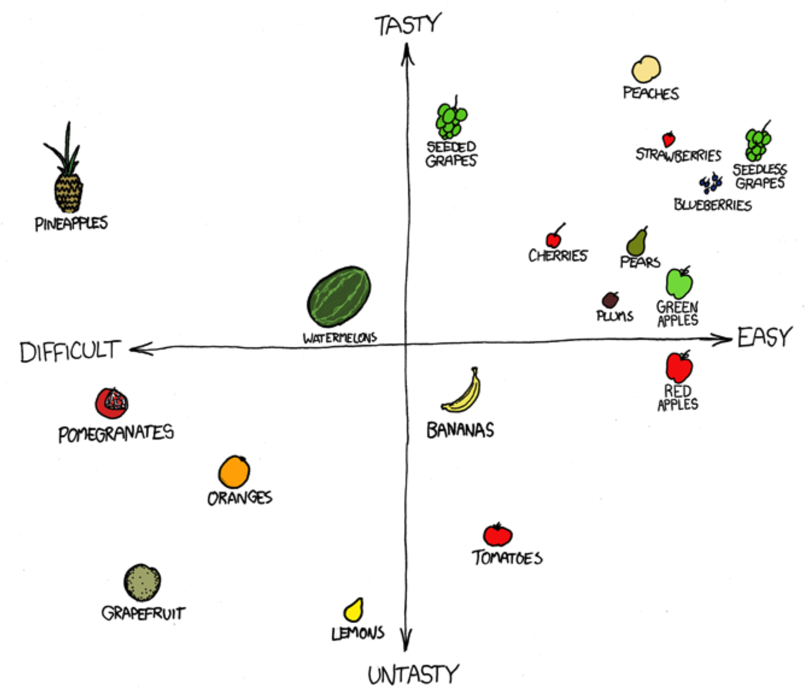{height=6in}

[Randall Munroe / xkcd · https://xkcd.com/388](https://xkcd.com/388/) · [CC BY-NC 2.5](https://creativecommons.org/licenses/by-nc/2.5/)

::: notes

Start with what the axes mean; multivariate methods replace many measured axes with a smaller set of summaries.

Comic: Fuck Grapefruit. https://xkcd.com/388/

Original course source: lectures__exp-7.pptx, slide 1. Artwork reproduced unchanged. Randall Munroe / xkcd; Creative Commons Attribution-NonCommercial 2.5.

Accessible description: Fruit is arranged on two axes representing tastiness and ease of eating.

:::


## PCA: the data {#pca}

::: columns

::: {.column width="62%"}

Four correlated morphological traits are measured in beetles from three ecotypes.

- Several quantitative variables per individual

- Correlated traits with different scales

- Ecotype labels are known

:::

::: {.column width="38%"}

**Other data like these**

- Plant functional traits

- Metabolite profiles

- Multivariate physiology

:::

:::

::: notes

Principal component analysis

25 independent beetles per ecotype; four traits on each individual.

ecotype: Known source habitat (category)

body_mm: body (mm)

wing_mm: wing (mm)

femur_mm: femur (mm)

antenna_mm: antenna (mm)

:::


## PCA: simulate and save {#pca-simulate}

::: columns

::: {.column width="62%"}

```r
set.seed(240510)
ecotype <- rep(c("Forest", "Grassland", "Dune"), each=25)
size <- rnorm(75, rep(c(12,14,13),each=25), 1.2)
d <- data.frame(ecotype, body_mm=size,
  wing_mm=1.3*size+rnorm(75,0,1), femur_mm=.45*size+rnorm(75,0,.4),
  antenna_mm=.7*size+rep(c(0,1,-1),each=25)+rnorm(75,0,.5))
write.csv(d, file.path(out_dir, "data.csv"), row.names = FALSE)
```


:::

::: {.column width="38%"}

**First saved row**

```
ecotype: Forest
body_mm: 11.26
wing_mm: 15.47
femur_mm: 6.018
antenna_mm: 7.573
```


:::

:::

::: notes

Seed: 240510

Generating model: 75 beetles: 25 per ecotype. Body size is Normal(mean 12,14,13 mm by Forest,Grassland,Dune; SD 1.2). Wing=1.3×size+Normal(0,1); femur=0.45×size+Normal(0,0.4); antenna=0.7×size+ecotype shift(0,1,−1)+Normal(0,0.5). All errors independent.

Population truth: Groups differ in body-size means and antenna shifts; all traits share a common body-size component.

The script writes data.csv before reading it for analysis. output_dir or out_dir is the folder supplied to the standalone script.

Original saved-data preview:

```
 ecotype  body_mm  wing_mm femur_mm antenna_mm
  Forest 11.26475 15.47408 6.017827   7.573212
  Forest 12.29596 13.71508 6.000100   8.864468
  Forest 10.58483 13.48461 5.152304   7.897169
  Forest 12.05559 17.34693 5.790201   8.476954
```


:::


## PCA: see the data {#pca-plot}

::: columns

::: {.column width="62%"}

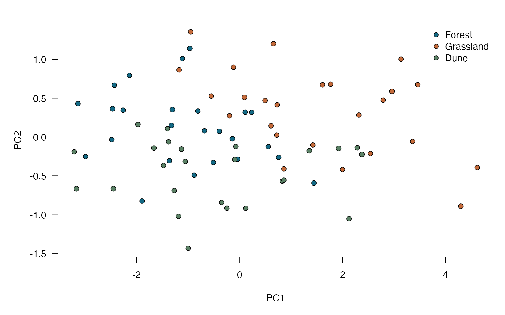

:::

::: {.column width="38%"}

**base R arguments**

**pch=21 / bg** — Shows known ecotypes with outlined colors

**xlab / ylab** — Names the coordinates actually plotted

**legend** — Keeps ecotype labels explicit

:::

:::

::: notes

This figure is generated from the saved CSV by modules/pca/analysis.R. PCA uses the measurements, not class labels, to construct the axes.

:::


## PCA: plot code {#pca-plot-code}

::: columns

::: {.column width="62%"}

```r
coordinates <- result$x[,1:2]
colours <- c("#146A85", "#C56B3B", "#5B8266")[match(d$ecotype,c("Forest","Grassland","Dune"))]
plot(coordinates, pch=21, bg=colours, cex=1.1,
     xlab="PC1", ylab="PC2")
legend("topright", c("Forest","Grassland","Dune"), pch=21,
       pt.bg=c("#146A85", "#C56B3B", "#5B8266"), bty="n")
```


:::

::: {.column width="38%"}

**Arguments to change**

**pch=21 / bg** — Shows known ecotypes with outlined colors

**xlab / ylab** — Names the coordinates actually plotted

**legend** — Keeps ecotype labels explicit

:::

:::

::: notes

This is an exact excerpt from analysis.R. Any preparation referenced by the excerpt appears in the complete companion script. The script opens a ragg PNG device before these lines and closes it afterward.

:::


## PCA: question and null {#pca-question}

::: columns

::: {.column width="62%"}

**Scientific question**

Which combinations of traits summarize the most variation?

**Null / estimation target**

The target is a set of linear trait combinations that explain the most variance; PCA itself does not test a null hypothesis.

:::

::: {.column width="38%"}

**Relevant options**

- prcomp(..., center=TRUE, scale.=TRUE)

- Scaling gives traits comparable weight.

- Inspect scores, loadings and variance explained.

:::

:::

::: notes

Ask whether rejecting this null, or estimating this target, answers the biological question. PCA uses the measurements, not class labels, to construct the axes.

:::


## PCA: assumptions {#pca-assumptions}

::: columns

::: {.column width="62%"}

**What matters here**

- Rows are comparable observations.

- Scaling and linear combinations suit the question.

:::

::: {.column width="38%"}

**Parametric responses**

- Use a model that directly tests the biological group contrast if inference is the aim.

**Nonparametric responses**

- Consider rank- or distance-based approaches when their target matches the question.

:::

:::

::: notes

Begin with the design. A model change should address a specific issue and preserve the scientific target where possible. A rank or permutation alternative has its own assumptions and may change the null; do not choose it solely from a normality-test p-value.

:::


## PCA: run and read {#pca-analysis}

::: columns

::: {.column width="62%"}

```r
z <- d[c("body_mm","wing_mm","femur_mm","antenna_mm")]
result <- prcomp(z, center=TRUE, scale.=TRUE)
variance <- result$sdev^2/sum(result$sdev^2)
```


:::

::: {.column width="38%"}

**Generated results**

- PC1 accounts for 84.3% of variance

- PC2 accounts for 8.6%

- Variables centered and scaled

:::

:::

::: notes

Full executed model/test output:

```
Standard deviations (1, .., p=4):
[1] 1.8360217 0.5857306 0.4563007 0.2788073

Rotation (n x k) = (4 x 4):
                 PC1         PC2         PC3        PC4
body_mm    0.5283830 -0.09689995  0.05098935 -0.8419156
wing_mm    0.4805746 -0.77094271 -0.17456589  0.3797659
femur_mm   0.5007526  0.30369527  0.74286006  0.3243069
antenna_mm 0.4889849  0.55138637 -0.64427150  0.2044041
```


:::


## PCA: interpret {#pca-interpret}

The first two principal components account for 92.9% of the standardized trait variance. Separation is descriptive; PCA does not test a population difference.

**Discuss:** What biological claim would this plot alone fail to establish?

::: notes

Teaching point: PCA uses the measurements, not class labels, to construct the axes.

Instructor comparison with the simulated population: Groups differ in body-size means and antenna shifts; all traits share a common body-size component.

The reported estimate and p-value are calculated from this realized dataset; they need not exactly match the known population effect.

:::


## MDS: the data {#mds}

::: columns

::: {.column width="62%"}

Four correlated morphological traits are measured in beetles from three ecotypes.

- Several quantitative variables per individual

- Correlated traits with different scales

- Ecotype labels are known

:::

::: {.column width="38%"}

**Other data like these**

- Plant functional traits

- Metabolite profiles

- Multivariate physiology

:::

:::

::: notes

Classical multidimensional scaling

25 independent beetles per ecotype; four traits on each individual.

ecotype: Known source habitat (category)

body_mm: body (mm)

wing_mm: wing (mm)

femur_mm: femur (mm)

antenna_mm: antenna (mm)

:::


## MDS: simulate and save {#mds-simulate}

::: columns

::: {.column width="62%"}

```r
set.seed(240511)
ecotype <- rep(c("Forest", "Grassland", "Dune"), each=25)
size <- rnorm(75, rep(c(12,14,13),each=25), 1.2)
d <- data.frame(ecotype, body_mm=size,
  wing_mm=1.3*size+rnorm(75,0,1), femur_mm=.45*size+rnorm(75,0,.4),
  antenna_mm=.7*size+rep(c(0,1,-1),each=25)+rnorm(75,0,.5))
write.csv(d, file.path(out_dir, "data.csv"), row.names = FALSE)
```


:::

::: {.column width="38%"}

**First saved row**

```
ecotype: Forest
body_mm: 13.79
wing_mm: 17.49
femur_mm: 6.58
antenna_mm: 9.902
```


:::

:::

::: notes

Seed: 240511

Generating model: 75 beetles: 25 per ecotype. Body size is Normal(mean 12,14,13 mm by Forest,Grassland,Dune; SD 1.2). Wing=1.3×size+Normal(0,1); femur=0.45×size+Normal(0,0.4); antenna=0.7×size+ecotype shift(0,1,−1)+Normal(0,0.5). All errors independent.

Population truth: Groups differ in body-size means and antenna shifts; all traits share a common body-size component.

The script writes data.csv before reading it for analysis. output_dir or out_dir is the folder supplied to the standalone script.

Original saved-data preview:

```
 ecotype   body_mm  wing_mm femur_mm antenna_mm
  Forest 13.793539 17.49224 6.579655   9.902124
  Forest  9.759031 11.67429 4.754731   5.610025
  Forest 11.629775 16.06503 5.934906   7.928403
  Forest 11.563274 15.86861 4.898189   8.768995
```


:::


## MDS: see the data {#mds-plot}

::: columns

::: {.column width="62%"}

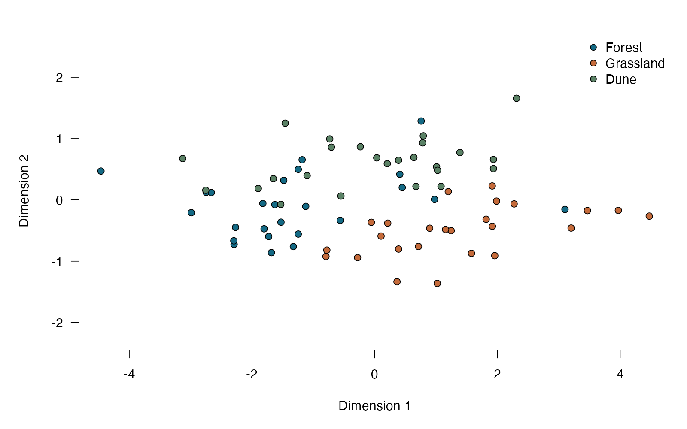

:::

::: {.column width="38%"}

**base R arguments**

**pch=21 / bg** — Shows known ecotypes with outlined colors

**xlab / ylab** — Names the coordinates actually plotted

**legend** — Keeps ecotype labels explicit

**asp=1** — Keeps one coordinate unit the same size on both axes

:::

:::

::: notes

This figure is generated from the saved CSV by modules/mds/analysis.R. Distance choice defines what counts as similar.

:::


## MDS: plot code {#mds-plot-code}

::: columns

::: {.column width="62%"}

```r
coordinates <- result$points
colours <- c("#146A85", "#C56B3B", "#5B8266")[match(d$ecotype,c("Forest","Grassland","Dune"))]
plot(coordinates, pch=21, bg=colours, cex=1.1, asp=1,
     xlab="Dimension 1", ylab="Dimension 2")
legend("topright", c("Forest","Grassland","Dune"), pch=21,
       pt.bg=c("#146A85", "#C56B3B", "#5B8266"), bty="n")
```


:::

::: {.column width="38%"}

**Arguments to change**

**pch=21 / bg** — Shows known ecotypes with outlined colors

**xlab / ylab** — Names the coordinates actually plotted

**legend** — Keeps ecotype labels explicit

**asp=1** — Keeps one coordinate unit the same size on both axes

:::

:::

::: notes

This is an exact excerpt from analysis.R. Any preparation referenced by the excerpt appears in the complete companion script. The script opens a ragg PNG device before these lines and closes it afterward.

:::


## MDS: question and null {#mds-question}

::: columns

::: {.column width="62%"}

**Scientific question**

Can a low-dimensional map preserve the chosen between-individual distances?

**Null / estimation target**

The target is a low-dimensional configuration that preserves the chosen distances; this map is not itself a hypothesis test.

:::

::: {.column width="38%"}

**Relevant options**

- Choose and justify the distance measure.

- cmdscale(distance, k=2, eig=TRUE)

- Inspect representation quality, not just separation.

:::

:::

::: notes

Ask whether rejecting this null, or estimating this target, answers the biological question. Distance choice defines what counts as similar.

:::


## MDS: assumptions {#mds-assumptions}

::: columns

::: {.column width="62%"}

**What matters here**

- The chosen distance represents biological similarity.

- A 2D view may distort higher-dimensional distances.

:::

::: {.column width="38%"}

**Parametric responses**

- Use a model that directly tests the biological group contrast if inference is the aim.

**Nonparametric responses**

- Consider rank- or distance-based approaches when their target matches the question.

:::

:::

::: notes

Begin with the design. A model change should address a specific issue and preserve the scientific target where possible. A rank or permutation alternative has its own assumptions and may change the null; do not choose it solely from a normality-test p-value.

:::


## MDS: run and read {#mds-analysis}

::: columns

::: {.column width="62%"}

```r
z <- scale(d[c("body_mm","wing_mm","femur_mm","antenna_mm")])
distance <- dist(z)
result <- cmdscale(distance, k=2, eig=TRUE)
```


:::

::: {.column width="38%"}

**Generated results**

- Two-dimensional goodness of fit: 0.920

- Euclidean distances between standardized traits

- Closer points have more similar trait combinations

:::

:::

::: notes

Full executed model/test output:

```
$points
             [,1]         [,2]
 [1,]  0.97540338  0.007130556
 [2,] -4.46130829  0.469609156
 [3,] -1.24571197  0.497452164
 [4,] -1.72828046 -0.597133304
 [5,] -2.74594570  0.122395278
 [6,] -2.26815563 -0.447789896
 [7,] -1.12397958 -0.107186606
 [8,] -2.29155329 -0.726311080
 [9,] -1.80227000 -0.471975030
[10,] -0.56171783 -0.334092884
[11,] -1.18275802  0.653631090
[12,] -1.48299577  0.317510437
[13,] -1.62765057 -0.078355363
[14,] -2.98896933 -0.208697033
[15,] -1.52757541 -0.363367937
[16,] -1.24637429 -0.557080003
[17,] -1.68366709 -0.860288254
[18,]  0.75666938  1.285941982
[19,] -2.29549992 -0.667152081
[20,] -2.66289688  0.118922324
[21,]  3.10082130 -0.156332459
[22,] -1.82282364 -0.059656139
[23,]  0.40921175  0.416657106
[24,] -1.32552072 -0.761149165
[25,]  0.44845870  0.200823791
[26,]  0.10324130 -0.589977555
[27,]  1.19923123  0.134419369
[28,]  3.96984785 -0.172448876
[29,]  2.27126118 -0.066311361
[30,]  1.91711754 -0.430709984
[31,]  0.89544237 -0.462383205
[32,] -0.78009775 -0.819192745
[33,]  1.95641125 -0.909672844
[34,] -0.79468191 -0.922655152
[35,] -0.05522046 -0.365612822
[36,]  1.91428844  0.226624485
[37,]  3.20090994 -0.459201925
[38,]  0.21205988 -0.380048608
[39,]  1.02003356 -1.362147284
[40,]  1.24568281 -0.502301932
[41,]  1.57679589 -0.872085050
[42,]  1.81592643 -0.316351601
[43,] -0.27934197 -0.941706918
[44,]  0.71348105 -0.759967619
[45,]  0.38942396 -0.801572292
[46,]  4.47393929 -0.264713577
[47,]  1.98517161 -0.021157208
[48,]  0.36349297 -1.335409653
[49,]  1.15444022 -0.482976416
[50,]  3.46599888 -0.175119031
[51,] -1.53157106 -0.074276676
[52,]  0.78199752  0.930207230
[53,]  1.93515071  0.509660813
[54,] -0.70579706  0.859092352
[55,]  1.93518403  0.658875892
[56,]  0.67278208  0.218760206
[57,]  2.31127845  1.656886824
[58,]  1.38891081  0.771957279
[59,] -3.12887039  0.673693604
[60,]  0.20500793  0.590338474
[61,]  1.08079324  0.219675988
[62,] -1.65195396  0.345045343
[63,] -0.23402694  0.866576022
[64,]  0.63783338  0.691868939
[65,]  0.03377474  0.685551771
[66,] -0.73276347  0.993763279
[67,]  0.38852270  0.645752563
[68,]  1.00849774  0.539426058
[69,] -1.10164072  0.394921013
[70,] -2.75230520  0.157078109
[71,] -1.89821525  0.185367845
[72,]  1.02526505  0.481524596
[73,] -0.55076836  0.062510038
[74,]  0.79132930  1.044617787
[75,] -1.45818095  1.250297811

$eig
 [1]  2.415403e+02  3.065253e+01  1.922729e+01  4.579862e+00  9.815933e-15
 [6]  7.269084e-15  6.521041e-15  6.457920e-15  5.351543e-15  5.024629e-15
[11]  3.536685e-15  3.224538e-15  3.067886e-15  2.784960e-15  2.781320e-15
[16]  2.715877e-15  2.455016e-15  2.311272e-15  2.161329e-15  1.958721e-15
[21]  1.911807e-15  1.878351e-15  1.848735e-15  1.841280e-15  1.815672e-15
[26]  1.404475e-15  1.240902e-15  1.143682e-15  8.747429e-16  6.569501e-16
[31]  5.432930e-16  5.345057e-16  3.332429e-16  2.448202e-16  2.198298e-16
[36]  1.350057e-16  1.320982e-16  7.297038e-17  6.174247e-18 -1.292171e-16
[41] -2.390654e-16 -3.186937e-16 -3.438659e-16 -3.717135e-16 -4.448662e-16
[46] -4.953244e-16 -5.242173e-16 -5.484482e-16 -5.981108e-16 -6.448906e-16
[51] -6.998647e-16 -7.125050e-16 -7.285133e-16 -8.590374e-16 -9.645182e-16
[56] -9.755598e-16 -1.171510e-15 -1.301264e-15 -1.519557e-15 -1.560846e-15
[61] -2.906036e-15 -3.566509e-15 -3.793373e-15 -4.033947e-15 -4.147306e-15
[66] -4.299794e-15 -6.382293e-15 -6.885932e-15 -6.931247e-15 -7.223042e-15
[71] -7.241831e-15 -1.007704e-14 -1.271357e-14 -1.335275e-14 -5.515095e-14

$x
NULL

$ac
[1] 0

$GOF
[1] 0.9195704 0.9195704

```


:::


## MDS: interpret {#mds-interpret}

The two-dimensional configuration has a goodness-of-fit measure of 0.920 for the supplied distances. Its axes summarize distances; their signs and orientation have no fixed biological meaning.

**Discuss:** What biological claim would this plot alone fail to establish?

::: notes

Teaching point: Distance choice defines what counts as similar.

Instructor comparison with the simulated population: Groups differ in body-size means and antenna shifts; all traits share a common body-size component.

The reported estimate and p-value are calculated from this realized dataset; they need not exactly match the known population effect.

:::


## Discriminant analysis: the data {#lda}

::: columns

::: {.column width="62%"}

Four correlated morphological traits are measured in beetles from three ecotypes.

- Several quantitative variables per individual

- Correlated traits with different scales

- Ecotype labels are known

:::

::: {.column width="38%"}

**Other data like these**

- Plant functional traits

- Metabolite profiles

- Multivariate physiology

:::

:::

::: notes

Linear discriminant analysis

25 independent beetles per ecotype; four traits on each individual.

ecotype: Known source habitat (category)

body_mm: body (mm)

wing_mm: wing (mm)

femur_mm: femur (mm)

antenna_mm: antenna (mm)

:::


## Discriminant analysis: simulate and save {#lda-simulate}

::: columns

::: {.column width="62%"}

```r
set.seed(240512)
ecotype <- rep(c("Forest", "Grassland", "Dune"), each=25)
size <- rnorm(75, rep(c(12,14,13),each=25), 1.2)
d <- data.frame(ecotype, body_mm=size,
  wing_mm=1.3*size+rnorm(75,0,1), femur_mm=.45*size+rnorm(75,0,.4),
  antenna_mm=.7*size+rep(c(0,1,-1),each=25)+rnorm(75,0,.5))
write.csv(d, file.path(out_dir, "data.csv"), row.names = FALSE)
```


:::

::: {.column width="38%"}

**First saved row**

```
ecotype: Forest
body_mm: 11.35
wing_mm: 13.06
femur_mm: 5.641
antenna_mm: 7.476
```


:::

:::

::: notes

Seed: 240512

Generating model: 75 beetles: 25 per ecotype. Body size is Normal(mean 12,14,13 mm by Forest,Grassland,Dune; SD 1.2). Wing=1.3×size+Normal(0,1); femur=0.45×size+Normal(0,0.4); antenna=0.7×size+ecotype shift(0,1,−1)+Normal(0,0.5). All errors independent.

Population truth: Groups differ in body-size means and antenna shifts; all traits share a common body-size component.

The script writes data.csv before reading it for analysis. output_dir or out_dir is the folder supplied to the standalone script.

Original saved-data preview:

```
 ecotype   body_mm  wing_mm femur_mm antenna_mm
  Forest 11.346715 13.06098 5.640757   7.475622
  Forest  9.949277 14.98767 4.180859   7.395974
  Forest 13.155070 19.23823 5.574966   9.558507
  Forest 12.155492 15.55765 5.688317   8.910027
```


:::


## Discriminant analysis: see the data {#lda-plot}

::: columns

::: {.column width="62%"}

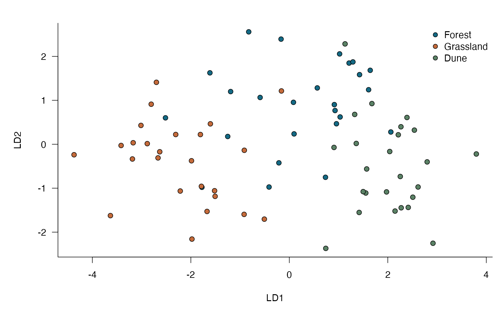

:::

::: {.column width="38%"}

**base R arguments**

**pch=21 / bg** — Shows known ecotypes with outlined colors

**xlab / ylab** — Names the coordinates actually plotted

**legend** — Keeps ecotype labels explicit

:::

:::

::: notes

This figure is generated from the saved CSV by modules/lda/analysis.R. LDA uses the labels to find discrimination; separation on training data is not validation.

:::


## Discriminant analysis: plot code {#lda-plot-code}

::: columns

::: {.column width="62%"}

```r
coordinates <- predict(result)$x[,1:2]
colours <- c("#146A85", "#C56B3B", "#5B8266")[match(d$ecotype,c("Forest","Grassland","Dune"))]
plot(coordinates, pch=21, bg=colours, cex=1.1,
     xlab="LD1", ylab="LD2")
legend("topright", c("Forest","Grassland","Dune"), pch=21,
       pt.bg=c("#146A85", "#C56B3B", "#5B8266"), bty="n")
```


:::

::: {.column width="38%"}

**Arguments to change**

**pch=21 / bg** — Shows known ecotypes with outlined colors

**xlab / ylab** — Names the coordinates actually plotted

**legend** — Keeps ecotype labels explicit

:::

:::

::: notes

This is an exact excerpt from analysis.R. Any preparation referenced by the excerpt appears in the complete companion script. The script opens a ragg PNG device before these lines and closes it afterward.

:::


## Discriminant analysis: question and null {#lda-question}

::: columns

::: {.column width="62%"}

**Scientific question**

How well can measured traits predict known group membership?

**Null / estimation target**

The target is predictive classification of known ecotypes; this example estimates validation accuracy rather than testing a null hypothesis.

:::

::: {.column width="38%"}

**Relevant options**

- Specify the class label and predictors.

- Use validation such as CV=TRUE.

- Class priors affect classification.

:::

:::

::: notes

Ask whether rejecting this null, or estimating this target, answers the biological question. LDA uses the labels to find discrimination; separation on training data is not validation.

:::


## Discriminant analysis: assumptions {#lda-assumptions}

::: columns

::: {.column width="62%"}

**What matters here**

- Classes have approximately multivariate-normal predictors and a common covariance for the classical model.

- Validation samples must be independent of model fitting.

:::

::: {.column width="38%"}

**Parametric responses**

- Use a model that directly tests the biological group contrast if inference is the aim.

**Nonparametric responses**

- Consider rank- or distance-based approaches when their target matches the question.

:::

:::

::: notes

Begin with the design. A model change should address a specific issue and preserve the scientific target where possible. A rank or permutation alternative has its own assumptions and may change the null; do not choose it solely from a normality-test p-value.

:::


## Discriminant analysis: run and read {#lda-analysis}

::: columns

::: {.column width="62%"}

```r
result <- MASS::lda(ecotype ~ body_mm + wing_mm + femur_mm + antenna_mm, data=d)
cv <- MASS::lda(ecotype ~ body_mm + wing_mm + femur_mm + antenna_mm, data=d, CV=TRUE)
accuracy <- mean(cv$class==d$ecotype)
```


:::

::: {.column width="38%"}

**Generated results**

- Leave-one-out classification accuracy: 82.7%

- Three known ecotype labels used during training

- Equal group sizes in this example

:::

:::

::: notes

Full executed model/test output:

```
Call:
lda(ecotype ~ body_mm + wing_mm + femur_mm + antenna_mm, data = d)

Prior probabilities of groups:
     Dune    Forest Grassland 
0.3333333 0.3333333 0.3333333 

Group means:
           body_mm  wing_mm femur_mm antenna_mm
Dune      12.70929 17.02713 5.706581   7.915556
Forest    11.99869 15.71095 5.328634   8.397726
Grassland 13.90283 17.92353 6.288135  10.870551

Coefficients of linear discriminants:
                   LD1         LD2
body_mm     1.01499407 -0.78013116
wing_mm     0.10976514 -0.43360845
femur_mm    0.09092525 -0.08365976
antenna_mm -1.89182813  0.50613401

Proportion of trace:
   LD1    LD2 
0.8823 0.1177 
```


:::


## Discriminant analysis: interpret {#lda-interpret}

Leave-one-out classification accuracy is 82.7% for these three ecotypes. This is a prediction exercise using known class labels, not an unsupervised discovery or a significance test.

**Discuss:** What biological claim would this plot alone fail to establish?

::: notes

Teaching point: LDA uses the labels to find discrimination; separation on training data is not validation.

Instructor comparison with the simulated population: Groups differ in body-size means and antenna shifts; all traits share a common body-size component.

The reported estimate and p-value are calculated from this realized dataset; they need not exactly match the known population effect.

:::

## Midterm plan {#midterm-plan}
