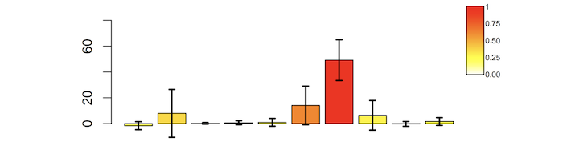
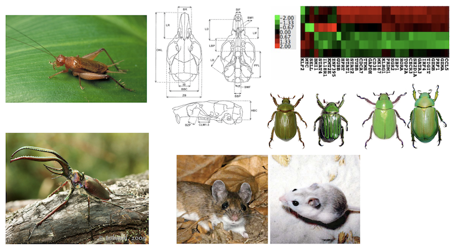

```{r setup, include=FALSE}
knitr::opts_chunk$set(echo = FALSE)
```

## Last Week

- What are some causes of the reproducibility crisis?  
- What makes R awesome?  


## Today

- Terminology  
- Summarizing Data  
- Central Limit Theorem  
- Covariance and Correlation  


## Populations and Samples

- **Populations**  
- Some sort of group of something - could be anything  

		- Undergraduates at Texas A&M   
		
		- Jewel beetles in Arizona   
		
		- Strain of flies in the lab   

- **Samples**  
- A subset of individuals drawn from a population 


## What is the population?

*We wanted to examine any association between the severity of injuries, and the height from which cats fall in high-rise buildings.*  

*In the period between January 1, 1998 and December 12, 2001 at the Clinic of Surgery, Orthopaedics and Ophthalmology of the Veterinary Faculty, 119 cats were treated after a fall or jump from a balcony or window, where the owners saw the fall, or where there was a reasonable suspicion that a fall had occurred. Only those cats that fell from the second or higher stories were included. The owners brought the cats for treatment within varying periods of time after the fall (from 30 min to over a month).*

<font size="4"> Vnuk, et al. "Feline high-rise syndrome: 119 cases (1998–2001). *Journal of Feline Medicine & Surgery* 6.5 (2004): 305-312.</font> 


## Sampling Considerations

- **Target population**
- Need to sample a representative population  
- A sample of people from College Station, for instance, would probably not be representative of New Yorkers 

- **Sampling Error** 
- Chance alone will cause your sample to depart from the population


## Parameter, estimates, sampling considerations

- **Parameter**  
- Population-level variables we are trying to estimate   

- **Estimate or Statistic**   
- The value of the parameter inferred from the sample   

- **Bias**  
- If something about the sampling procedure causes the sample to systematically misrepresent the population 

- **Precision**  
- How tightly grouped are the estimates? 


## Accuracy vs Precision

```{r echo=FALSE}
library(png)
library(grid)
img <- readPNG("images/acc.prec.png")
grid.raster(img)
```

- Precision is a measure of spread  
- Accuracy is a measure of bias  


## Random Sampling

- Every unit in a population should have an equal chance of being sampled  
- The selection of units must be independent   


## Your big idea should be a hypothesis

- A statistical hypothesis is a specific claim about a 	population parameter 
- *Caloric restriction increases the lifespan of Drosophila melanogaster*  
- *Pesticide exposure causes feminization of amphibian males*


## Data

- **Variables**  
- The characteristics that differ among individuals 

- **Data**   
- The measurements of variables taken for a sample of individuals 

- **Categorical Variables**  
- Individuals are in qualitative categories 


## Data

- **Numerical Variables** 
- Individuals vary on a quantitative scale
 
- **Ordinal** 
- The categories can be ordered 

- **Nominal** 
- The categories have no inherent order


## Continuous vs Discrete

- **Continuous variables**  
- a variable that has an infinite number of possible values  

- **Discrete variables**  
- a variable that has a finite number of possible values  


## Explanatory and Response Variables
```{r}
set.seed(1)
x <- rnorm(100)
y <- rnorm(100, mean=x)
plot(y ~ x, 
     xlab = "Explanatory variable", 
     ylab = "Response variable", 
     pch = 16, 
     col = rgb(1, 0, 0, .75))
text(x=-2, y=2,pos=4, "y=mx+b\ny is response variable\nx is explanatory variable")
```


## Experimental vs observational studies

- Does caloric restriction increase lifespan in mice? 
- Is global warming caused by human activities? 
- Does smoking cause lung cancer in humans? 
- Does parasite infection reduce mating success of beetles? 
- Does oxytocin affect sexual attraction in humans? 
- Do sex chromosomes increase the rate of speciation? 


## Summarizing data is necessary and prefered

- Many datasets are simply too big to look at all values and form an impression? 
- Our impressions of small datasets are often misled by our tendency to look for patterns.


## Typical summary statistics

- **Mean:** Sum of the observations divided by the number of observations 

- **Median:** The middle observation in a set of data 

- **Variance:** The average squared deviation from the mean 

- **Standard Deviation:** The square root of the variance 

## Mean and variance
```{r}
x <-          rnorm(10000, mean = 1, sd = 1)
x.inc.mean <- rnorm(10000, mean=1.5, sd = 1)
x.inc.var <-  rnorm(10000, mean=1, sd = 1.5)
x.inc.both <- rnorm(10000, mean=1.5, sd = 1.5)

par(mfcol=c(2,2))
plot(density(x),main="increase in mean")
lines(density(x.inc.mean), col="red")

plot(density(x),main="increase in variance")
lines(density(x.inc.var), col="red")

plot(density(x),main="increase in both")
lines(density(x.inc.both), col="red")
```


## Box Plot
```{r echo=FALSE}
library(png)
library(grid)
img <- readPNG("images/boxplot.png")
grid.raster(img)
```

## Estimating with uncertainty

**Samples versus Populations**

- The mean or standard deviation statistic you calculate from your sample is an estimate of the population parameter 

- Parameter Symbols: 
- μ : population mean 
- σ : population standard deviation 

- Statistic Symbols: 
- $\overline{Y}$ : sample mean 
- s : samples standard deviation 


## For a sample of a population

The mean is $$\overline{Y}=\frac{\sum_{i=1}^{n}Y_i}{n}$$


The standard deviation is $$s=\sqrt{s^2}$$ where $$s^2=\frac{\sum_{i=1}^{n}\left ( Y_i-\bar{Y} \right )^2}{n-1}$$


## Central limit theorem

- Imagine that we sample from the same population many times, so we have a bunch of different, independent samples 

- Each sample will have a mean, but the means will be different due to chance 
In principle, we could draw a histogram of these means 

- In general, you only have one sample from a given population, however, so what can you infer about the distribution of the means from your sample? 

- The Central Limit Theorem states that regardless of the underlying population distribution of the variable of interest, the distribution of the population of means will be roughly normal 


## Central limit theorem

- Your estimate of the sample mean is an estimate of the mean of this distribution of means (that is, it’s your best estimate of the population mean)
 
- The hypothetical distribution of sample means has a standard deviation equal to s divided by the square root of n   

- $$SE_{\bar{Y}} = \frac{s}{\sqrt{n}}$$

- We call this standard deviation the standard error of the mean 


## Central limit theorem

```{r echo=FALSE}
library(png)
library(grid)
img <- readPNG("images/CI.png")
grid.raster(img)
```


## Your turn

Lets demonstrate samples from an exponential distribution have means that are normally distributed.  

You will need:  
`rexp()`  
`mean()`  
`sample()`  
`hist()`  


## Error bars



- Error bars can be a useful way to show uncertainty when it’s not possible to show the actual data points.  

- Usually, they represent 1 SE or the 95% CI, but not always.   

- **THE FIGURE LEGEND SHOULD INDICATE WHAT THE ERROR BARS REPRESENT!**</font>


## Covariance and Correlation

```{R}
z <- 200
x1 <- rnorm(z)
ystrong.pos <- rnorm(z, mean = x1, sd = .5)
x2 <- rnorm(z)
ystrong.neg <- rnorm(z, mean = -x2, sd = .5)
x3 <- rnorm(z)
yweak <- rnorm(z, mean = x3, sd = 2)
x4 <- rnorm(z)
ynone <- rnorm(z)

par(mfcol=c(2,2))
plot(ynone~x4,pch=16, cex=.75,col=rgb(1,0,0,.5)
     ,xlab="X",ylab="Y",main="no correlation")
plot(yweak~x3,pch=16, cex=.75,col=rgb(1,0,0,.5)
     ,xlab="X",ylab="Y",main="weak positive correlation")
plot(ystrong.pos~x1,pch=16, cex=.75,col=rgb(1,0,0,.5)
     ,xlab="X",ylab="Y",main="strong positive correlation")
plot(ystrong.neg~x2,pch=16, cex=.75,col=rgb(1,0,0,.5)
     ,xlab="X",ylab="Y",main="strong negative correlation")
```


## Covariance and Correlation

- The covariance shows the extent to which the two variables are not statistically independent  
- $$cov(X,Y)=\frac{\sum_{n}^{i=1}(X_i-\overline{X})(Y_i-\overline{Y})}{n-1}$$

- The correlation is the covariance, standardized to fall between -1 and 1.  
- $$r(X,Y)=\frac{cov(X,Y)}{s_x s_y}$$


## Types of correlation



## For Thursday

Read chapters 1 and 2 of WS

Install R and Rstudio on a laptop  
-	Come and see me before class on   
-	Thursday if you run into problems  

Bring laptop to class!

Heath Blackmon  
BSBW 309  
coleoguy@gmail.com  
@coleoguy  


