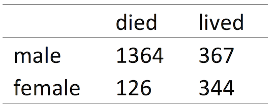

```{r setup, include=FALSE}
knitr::opts_chunk$set(echo = FALSE)
```

## Last Week

- What is the differnce in a population and a sample?  
- What is the differnce in a parameter and a statistic?  
- How does the central limit theorem help us?


## Today

- Probability  
- Intro to Bayes


## mutually exclusive events

- addition rule: if two events are mutually exlusive then the probability that either will occur is just the sum of the individual probabilities

- $$Pr(A\ or\ B) = Pr(A) + Pr(B)$$

- probability of rolling a 1 or 2 on a die

- $$Pr(1\ or\ 2) = 33\% = \frac{1}{6} + \frac{1}{6}$$


## independent events

- multiplication rule: if two events are independent of one another then the probability of both occuring is just the product of the individual probabilities

- $$Pr(A\ then\ B) = Pr(A) * Pr(B)$$

- probability of rolling a 1 and then a 2 on a pair of dice is:

- $$Pr(1\ then\ 2) = 3\% = \frac{1}{6} \times \frac{1}{6}$$

## non-independent events

- conditional probability: is the probability of an event given that another event has already occured.

- For instance, the probability of surviving the sinking of the Titanic was very different than the probability of surviving if you were a female.

- 

## conditional probability

- $$Pr(survive) = 32\% = \frac{711\ survived}{2201\ passengers}$$
- $$Pr(survive | female) = 73\% = \frac{344\ survived}{470\ females}$$


## Bayesian approach is natural

(https://imgs.xkcd.com/comics/frequentists_vs_bayesians.png)

## bayes theorem

- $$Pr(A\ |\ B)=\frac{Pr(B\ |\ A)Pr(A)}{Pr(B)}$$

- $$Pr(inf\ |\ pos.test)=\frac{Pr(pos.test\ |\ inf)Pr(inf)}{Pr(pos.test)}$$


## False positives

Imagine a genetic mutation present in 1 person per 100,000. If you take a test that correctly returns a positive result 99.9% of the time when someone is infected but has a false positive rate of 0.5%. How likely are you to have the disease? Should you be concerned?

Bayes theorem provides a natrual way to think about this.

## False positives

$$Pr(inf\ |\ pos.test)=\frac{Pr(pos.test\ |\ inf)Pr(inf)}{Pr(pos.test)}$$

- $$Pr(inf\ |\ pos.test)=\frac{0.999\times0.00001}{0.00501}$$

- Which means that you have only a 0.1% chance of having the disease even if you test positve.  What if your doctor noticed a symptom that made them give you this test what changes?

## Priors

## The rise of Bayesian approaches

Since the 1990s bayesian approaches have come to the forefront in phylogenetics, population genetics, genomics, ecology, and other fields.  This largely becuase we now have the computational power to use MCMCs to sample posterior distributions...

## Posterior distributions


## 


## For Thursday

Read chapter WS 5 and [McElreath 2](http:/www) 
Bring laptop to class!

Heath Blackmon  
BSBW 309  
coleoguy@gmail.com  
@coleoguy  


