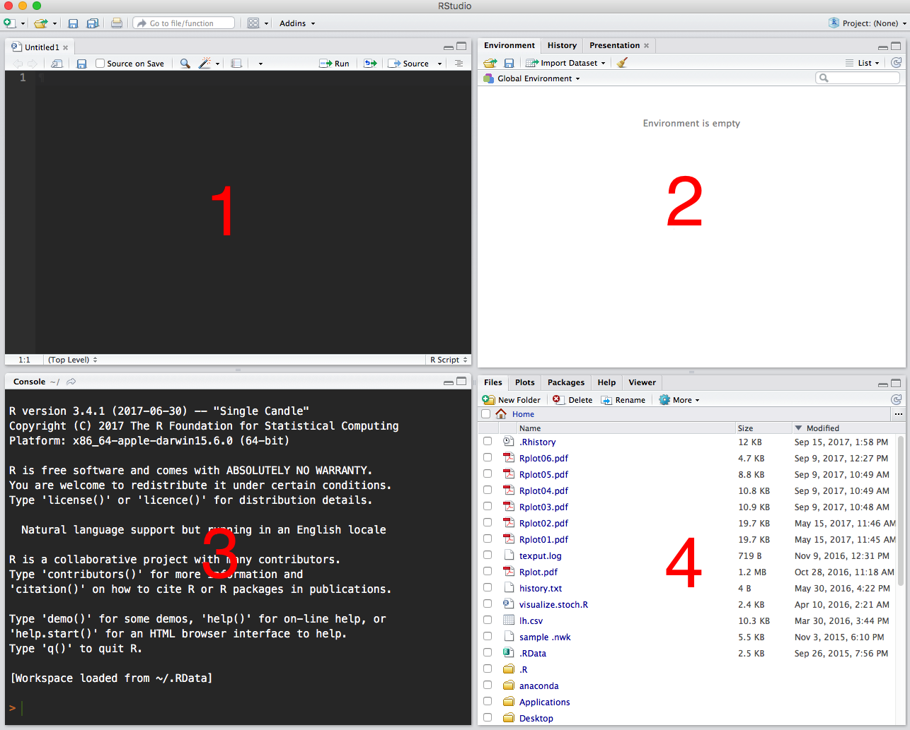
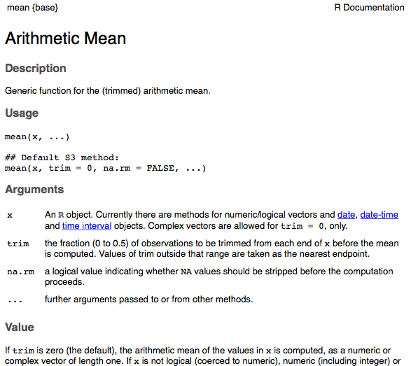

```{r setup, include=FALSE}
knitr::opts_chunk$set(echo = TRUE)
```

## R 

More than just a programming language R has become an environment that gives you access to many of the latest most powerful types of data analysis in and open and free framework.  It has particular strengths in statistics and plotting.  It is widely used in STEM fields with many active user communities.  The [CRAN Task Views](https://cran.r-project.org/web/views/) is a good place to see some of the more active communities. 

## Pros and Cons of success

The success of R has been made possible in part because it is an open source software.  This means that you can see how any function works and more than that you can borrow pieces of that code and build your own solutions for your own unique challenges.  This is normally done through a system of "packages".  A package is just a collection of functions that someone has built.  Ideally the functions in a package have been carefully checked and well documented.  For better or worse there are now over 10,000 R packages.  As you might guess that means that many have not been well vetted.

## RStudio
We will use RStudio in our work.  RStudio is just an IDE that makes it even easier to use and learn R.  To get started:

* open RStudio
* click on: File > New File > R Script

Your window should now have 4 panes like this screenshot:




1. This is the R script.  This is where we will usually write our code and we can save this so that we can work on it again or use it in the future.

2. This is a status panel.  This panel has three tabs however, we will almost always leave it on the Environment tab.  This lets us see what variables and functions we have defined.

3. This is the console.  This is where we see the code that we actually send to R and the output that is returned from R.  If you are familiar with a terminal or command line interface, that is basically what this area is.

4. This multi-use panel can show us the file system on our computer, information about packages we have installed, help files, or views of the plots that we make.

## Help in R

Perhaps the easiest way to get help in R is simply to type

```{r}
help(mean)
```

For almost any function that we will use this will open a help file in the bottom right pane of RStudio where you can read about the function.



## letter case and conventions

R is case sensitive: `Mean` and `mean` are not the same. Comments can written in your code by inserting a pound or hash symbol `#`.  You do not need to end your lines with a ; or other punctuation you can just hit return.

## Basic Math

At the most basic level you could use R simply as a calculator:
```{r}
2 + 2
```

```{r}
3 * 7
```

```{r}
sqrt(81)
```

```{r}
4 ^ 2
```

```{r}
4 + 1 ^ 2
```

```{r}
exp(1)
```

```{r}
log(100, base=10)
```

R includes all the mathematical operators that you are familiar with and probably some you aren't.

Operator| Description
--------|----------------------------------
`+`        |adds two vectors
`-`        |subtracts second vector from first
`*`        |multiplies two vectors
`/`        |divides the first vector by the second
`%%`       |remainder of the first vector after division by the second
`%/%`      |quotient from division of first vector by second
`^`        |raises the first vector to the exponent of the second vector
`>`        |checks if each element of the first vector is larger than the corresponding element of the second
`<`        |checks if each element of the first vector is less than the corresponding element of the second
`==`       |checks if each element of the first vector is equal to the corresponding element of the second
`<=`       |checks if each element of the first vector is smaller than or equal to the corresponding element of the second
`>=`       |checks if each element of the first vector is larger than or equal to the corresponding element of the second
`!=`       |checks if each element of the first vector is not equal to the corresponding element of the second
`&`        |combine corresponding values of two vector, if both are TRUE returns TRUE otherwise returns false
`|`        |combine corresponding values of two vector, if either are TRUE returns TRUE otherwise returns false
`!`        |negates the logical values in the vector
`:`        |provides a sequence of numbers across the range indicated
`%in%`     |checks to see if the item  to the left is an element in the item to the right.


## Data types

When we program we use variables to store information.  Often we will store many different kinds of information: integers, logical, character, floating point. When we store a piece of information in a variable we are creating an object of that data type.  The most common type of objects are:

* vector
* list
* matrix
* data frame

## Vectors

To create a vector we can use the `c()` command.
```{r}
my.vector <- c(2,4,8,16,32,64)
my.vector
class(my.vector) # show us the data type of my.vector
```

We could also make a character vector:
```{r}
my.vector <- c("Abbi", "Leslie", "Adair")
my.vector
class(my.vector) # show us the data type of my.vector
```

Or we could make a logical vector:
```{r}
my.vector <- c(T,F,T,FALSE)
my.vector
class(my.vector) # show us the data type of my.vector
```
Notice that for true and false R will accept either the full term or an abbreviation.  

A vector can only contain one type of data if you mix them R will do its best to pick a data type that can work for all of the data:
```{r}
my.vector <- c("Abbi", T, 59.1154)
my.vector
class(my.vector) # show us the data type of my.vector
```

A vector has elements where each piece of data is stored these elements are numbered starting with 1.
```{r}
my.vector <- c("Abbi", "Leslie", "Adair")
my.vector[2]
```

## Lists

Lists are similar to vectors but with lists each element can hold another object for instance you can have a list of vectors.
```{r}
my.list <- list(c(1,2,3),c("one", "two","three"))
my.list
```
When we were using a vector we accessed the elements with brackets.  With lists we will use double brackets.
```{r}
my.list[[2]]
```

we can even add a second set of brackets to access a specific element of the vector inside of the list:
```{r}
my.list[[2]][1]
```

## Matrix

A matrix is a rectangular data set made up of columns and rows.  All of the data in a matrix must be of one type.  We can use the `matrix()` function to create a matrix:
```{r}
# This will make an empty matrix with 3 rows
# and 4 columns
my.matrix <- matrix(,3,4)
my.matrix
```
Now we can add items to the matrix by specifying the row and column that we want to store a value in.  For instance if we want to store `"abbi"` in row 2 and column 3 then we would write:
```{r}
my.matrix[2,3] <- "abbi"
my.matrix
```

## Data frames

A data frame is similar to a matrix except each column can contain a different type of data for instance.

```{r}
my.df <- 	data.frame(
   gender = c("Female", "Male","Female"), 
   score = c(99,93, 92),
   exp = c(T,T,F)
)
my.df
```

## Variable names

We have already been creating variables above.  The main thing to remember about variable names is that special characters (`@#$%^&*(){}+`) are not allowed. As a general rule make your variable names describe what you store in them:

```{r}
age.mean <- mean(c(22,34,19,21,22,29,27))
```

To assign a value to a variable we will use `<-` which is called the assignment operator.  Although you can use the `=` equal sign as well the assignment operator is nice because it explicitly indicates what direction the information is going where as `a=b` could be confused to say we are setting the value of a to the value of b or vice versa.


## Objects orientation

R is an object oriented programming language because the way that function behave depend on the type of object they are given.  For a simple example of this we can look at the behavior of the function plot.

```{r}
my.df <- 	data.frame(
   gender = c("Female","Female", "Male","Female","Female",
              "Male","Female", "Male","Female", "Male",
              "Male","Female","Female"), 
   score = c(99, 93, 92, 93, 89, 
             54, 89, 95, 95, 88,
             87, 97, 91))
plot(my.df$gender)
plot(my.df$score)
```

So in this case R was able to determine that gender was a factor and gave us a barplot which makes sense for a factor.  Likewise when it attempted to plot scores it realized this was continuous variable and so gave a simple XY plot


## Practice

Today we will work with a dataset that contains some measurements of 3 species of irises.  Download this [file](http://coleoguy.github.io/vets/iris.csv) and save it to your desktop.

Now we can use the bottom right pane in RStudio to browse our disk and go to the desktop folder.  Once there we can press on the more button at the top of this pane.  Select `Set As Working Directory`. When you do this if you look in the console window (pane 3) you should see that RStudio has used the `setwd` command to tell R what directory we will be using.

Our first step is to read the iris data into R.  To do this we use a function that is designed to understand the layout of a CSV file.

```{r}
iris <- read.csv("iris.csv")
```

To get a feel for this data we can use the head command to look at the first few lines of the file

```{r}
head(iris)
```

We can take a very broad look at the data in this table by using the `plot` function.

```{r}
plot(iris)
```

When we use this command on a data table like this R gives us XY scatter plots where each of the columns is plotted against each of the other columns.  We can see a few interesting things in this plot.  First we can notice that the first four columns of the data appear to be continuous values while the last is discrete.  In fact, that last column is actually the species names for the three species of iris represented in the table.  R has assigned these as factors with levels 1, 2, and 3.  Lets make a couple of observations:

* Some of our traits appear to be strongly correlated. For instance look at the plot of petal length and petal width.
* Looking at that same plot we can see that some traits look like different species have very different values.

Let explore this a bit by doing a regression of petal length on petal width.

```{r}
L <- iris$Petal.Length
W <- iris$Petal.Width
mod1 <- lm(L ~ W)
summary(mod1)
```
This shows us that we do indeed have a significant relationship between petal width and petal length.  When we find something like this we might want a figure to highlight this relationship.  Lets use R to build a nice plot of this data:

```{r}
plot(L ~ W)
```

Lets first add some axis and main labels to the plot:
```{r}
plot(L ~ W, ylab = "Petal length",
     xlab = "Petal width", main = "Irises")
```

Now lets add a color to it. Since we are at A&M we should probably use maroon.  Unfortunately R uses a very odd color for maroon so we will need to specify the exact Aggie maroon with an RGB code (80,0,0)

```{r}
plot(L ~ W, ylab = "Petal length",
     xlab = "Petal width", col = rgb(.314,0,0), main = "Irises")
```

Those circles would probably look better as filled circles.  We can change the plotted symbols using the command `pch`


```{r}
plot(L ~ W, ylab = "Petal length",
     xlab = "Petal width", pch = 16,
     col = rgb(.314,0,0), main = "Irises")
```

Now lets draw a divider between the first species setosa and the others using the command `abline`.  We can also use this same command to add a line representing our regression.

```{r}
plot(L ~ W, ylab = "Petal length",
     xlab = "Petal width", pch = 16,
     col = rgb(.314,0,0), main = "Irises")
abline(mod1, lty = 2)
abline(v = .75, col = "red", lwd = 3)
```

Now lets add a little text in our plot to show which species are which:

```{r}
plot(L ~ W, xlab = "Petal length",
     ylab = "Petal width", pch = 16,
     col = rgb(.314,0,0), main = "Irises")
abline(mod1, lty = 2)
abline(v = .75, col = "red", lwd = 3)
text(x=.38,y=3,"setosa")
text(x=1.75,y=3,"other species")
```

If we really wanted to just focus on the fact that setosa is smaller another way to do it would be to plot the distribution of petal length in each species.  We can do this by combining the functions `density` and `plot`.

```{r}
# first we subset the data by species
setosa <- iris$Petal.Length[iris$Species=="setosa"]
virginica <- iris$Petal.Length[iris$Species=="virginica"]
versicolor <- iris$Petal.Length[iris$Species=="versicolor"]

# now we plot the data for each species
plot(density(setosa), xlim=c(0,8))
lines(density(virginica),col="blue")
lines(density(versicolor),col="green")

```

Lets use some of the tricks we learned above to make this graph a little more visually appealing.

```{r}
# first set up an empty frame
plot(0, xlim = c(0, 8), ylim = c(0, 2.75), xlab = "Petal Length", 
     ylab = "Density", col = "white", main = "Iris Petal Sizes")

# now we use the polygon command to plot our distributions
polygon(density(setosa), col = rgb(0, 0, 1, .4))
# that last number in the rgb function allows us to set transparency so we can
# see something sensible where our distributions are overlapping.
polygon(density(virginica),col = rgb(1, 0, 0, .4))
polygon(density(versicolor),col = rgb(0, 1, 0, .4))

# lets add a little text to our plot
text(x = 1.42, y = 2.7, "setosa", col = rgb(0, 0, 1))
text(x = 4.1, y = 1, "versicolor", col = rgb(0, 1, 0))
text(x = 5.5, y = 1, "virginica", col = rgb(1, 0, 0))
```

Join us next week for another exciting lesson in R!


